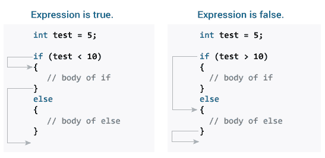

# C `if...else`语句

> 原文： [https://www.programiz.com/c-programming/c-if-else-statement](https://www.programiz.com/c-programming/c-if-else-statement)

#### 在本教程中，您将在示例的帮助下了解 C 编程中的`if`语句（包括`if...else`和嵌套的`if..else`）。

## C `if`语句

C 编程中`if`语句的语法为：

```c
if (test expression) 
{
   // statements to be executed if the test expression is true
}
```

* * *

### 语句如何工作？

`if`语句求值括号`()`内的测试表达式。

*   如果测试表达式的计算结果为`true`，则将执行`if`主体内部的语句。
*   如果测试表达式的计算结果为`false`，则不会执行`if`主体内部的语句。


要了解有关何时将测试表达式求值为`true`（非零值）和`false`（0）的更多信息，请检查[关系](/c-programming/c-operators#relational "C Relational operators")和[逻辑运算符](/c-programming/c-operators#logical "C logical operators")。

* * *

### 示例 1：`if`语句

```c
// Program to display a number if it is negative

#include <stdio.h>
int main() {
    int number;

    printf("Enter an integer: ");
    scanf("%d", &number);

    // true if number is less than 0
    if (number < 0) {
        printf("You entered %d.\n", number);
    }

    printf("The if statement is easy.");

    return 0;
}
```

**输出 1**

```c
Enter an integer: -2
You entered -2.
The if statement is easy.
```

当用户输入 -2 时，测试表达式`number<0`被求值为`true`。 因此，屏幕上显示您输入的 -2 。

**输出 2**

```c
Enter an integer: 5
The if statement is easy.
```

当用户输入 5 时，测试表达式`number<0`的计算结果为`false`，并且`if`主体内的语句未执行

* * *

## C `if...else`语句

`if`语句可以具有可选的`else`块。`if..else`语句的语法为：

```c
if (test expression) {
    // statements to be executed if the test expression is true
}
else {
    // statements to be executed if the test expression is false
}
```

* * *

### `if...else`语句如何工作？

如果测试表达式的计算结果为`true`，

*   `if`主体内部的语句将被执行。
*   `else`主体内部的语句从执行中跳过。

如果测试表达式的值为假，

*   执行`else`主体内的语句
*   `if`主体内部的语句从执行中跳过。



* * *

### 示例 2：`if...else`语句

```c
// Check whether an integer is odd or even

#include <stdio.h>
int main() {
    int number;
    printf("Enter an integer: ");
    scanf("%d", &number);

    // True if the remainder is 0
    if  (number%2 == 0) {
        printf("%d is an even integer.",number);
    }
    else {
        printf("%d is an odd integer.",number);
    }

    return 0;
}
```

**输出**

```c
Enter an integer: 7
7 is an odd integer.
```

当用户输入 7 时，测试表达式`number%2==0`被求值为`false`。 因此，将执行`else`主体内部的语句。

* * *

## C `if...else`阶梯

`if...else`语句根据测试表达式是`true`还是`false`来执行两个不同的代码。 有时，必须从两种以上的可能性中进行选择。

`if...else`阶梯允许您在多个测试表达式之间进行检查并执行不同的语句。

* * *

### `if...else`阶梯的语法

```c
if (test expression1) {
   // statement(s)
}
else if(test expression2) {
   // statement(s)
}
else if (test expression3) {
   // statement(s)
}
.
.
else {
   // statement(s)
}
```

* * *

### 示例 3：C `if...else`阶梯

```c
// Program to relate two integers using =, > or < symbol

#include <stdio.h>
int main() {
    int number1, number2;
    printf("Enter two integers: ");
    scanf("%d %d", &number1, &number2);

    //checks if the two integers are equal.
    if(number1 == number2) {
        printf("Result: %d = %d",number1,number2);
    }

    //checks if number1 is greater than number2.
    else if (number1 > number2) {
        printf("Result: %d > %d", number1, number2);
    }

    //checks if both test expressions are false
    else {
        printf("Result: %d < %d",number1, number2);
    }

    return 0;
}
```

**输出**

```c
Enter two integers: 12
23
Result: 12 < 23
```

* * *

## 如果...则嵌套

可以在另一个`if...else`语句的主体内包含`if...else`语句。

* * *

### 示例 4：`if...else`嵌套

下面给出的程序使用`<`，`>`和`=`来关联两个整数，类似于`if...else`阶梯的示例。 但是，我们将使用嵌套的`if...else`语句来解决此问题。

```c
#include <stdio.h>
int main() {
    int number1, number2;
    printf("Enter two integers: ");
    scanf("%d %d", &number1, &number2);

    if (number1 >= number2) {
      if (number1 == number2) {
        printf("Result: %d = %d",number1,number2);
      }
      else {
        printf("Result: %d > %d", number1, number2);
      }
    }
    else {
        printf("Result: %d < %d",number1, number2);
    }

    return 0;
}
```

* * *

如果`if...else`语句的主体只有一个语句，则不需要使用方括号``{}``。

例如，此代码

```c
if (a > b) {
    print("Hello");
}
print("Hi");
```

相当于

```c
if (a > b)
    print("Hello");
print("Hi");

```