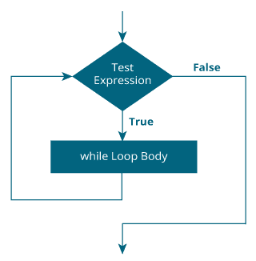
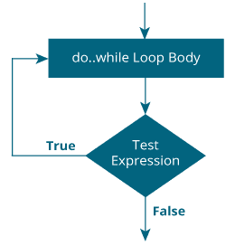

# C while 和 do ... while 循环

> 原文： [https://www.programiz.com/c-programming/c-do-while-loops](https://www.programiz.com/c-programming/c-do-while-loops)

#### 在本教程中，您将在示例的帮助下学习在 C 编程中创建 while 和 do ... while 循环。

在编程中，循环用于重复代码块，直到满足指定条件为止。

C 编程具有三种类型的循环。

1.  for 循环
2.  while 循环
3.  做... while 循环

在上一个教程中，我们了解了`for`循环。 在本教程中，我们将学习`while`和`do..while`循环。

* * *

## while 循环

`while`循环的语法为：

```c
while (testExpression) 
{
    // statements inside the body of the loop 
}
```

* * *

### while 循环如何工作？

*   `while`循环评估括号`()`内的测试表达式。
*   如果测试表达式为 true，则执行`while`循环体内的语句。 然后，再次评估测试表达式。
*   该过程一直进行到测试表达式被评估为 false 为止。
*   如果测试表达式为假，则循环终止（结束）。

要了解有关测试表达式的更多信息（将测试表达式评估为真和假时），请查看[关系式](/c-programming/c-operators#relational "C Relational operators")和[逻辑运算符](/c-programming/c-operators#logical "C logical operators")。

* * *

### While 循环流程图



* * *

### 示例 1：while 循环

```c
// Print numbers from 1 to 5

#include <stdio.h>
int main()
{
    int i = 1;

    while (i <= 5)
    {
        printf("%d\n", i);
        ++i;
    }

    return 0;
}
```

**输出**

```c
1
2
3
4
5

```

在这里，我们已经将 `i` 初始化为 1。

1.  当 `i` 为 1 时，测试表达式`i <= 5`为 true。 因此，执行`while`循环的主体。 在屏幕上打印 1，并且 `i` 的值增加到 2。
2.  现在， `i` 为 2，则测试表达式`i <= 5`再次为真。 再次执行`while`循环的主体。 在屏幕上打印 2，`i`的值增加到 3。
3.  该过程一直进行到 `i` 变为 6 为止。当 `i` 为 6 时，测试表达式`i <= 5`为假，循环终止。

* * *

## 做... while 循环

`do..while`循环类似于`while`循环，但有一个重要区别。 `do...while`循环的主体至少执行一次。 只有这样，才对测试表达式求值。

`do...while`循环的语法为：

```c
do
{
   // statements inside the body of the loop
}
while (testExpression);
```

* * *

### ... while 循环如何工作？

*   do ... while 循环的主体执行一次。 只有这样，才对测试表达式求值。
*   如果测试表达式为 true，则再次执行循环主体并评估测试表达式。
*   这个过程一直进行到测试表达式变为假。
*   如果测试表达式为假，则循环结束。

* * *

### do ... while 循环流程图



* * *

### 示例 2：do ... while 循环

```c
// Program to add numbers until the user enters zero

#include <stdio.h>
int main()
{
    double number, sum = 0;

    // the body of the loop is executed at least once
    do
    {
        printf("Enter a number: ");
        scanf("%lf", &number);
        sum += number;
    }
    while(number != 0.0);

    printf("Sum = %.2lf",sum);

    return 0;
}
```

**Output**

```c
Enter a number: 1.5
Enter a number: 2.4
Enter a number: -3.4
Enter a number: 4.2
Enter a number: 0
Sum = 4.70

```