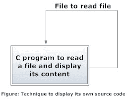

# C 程序：显示自己的源代码作为输出

> 原文： [https://www.programiz.com/c-programming/examples/source-code-output](https://www.programiz.com/c-programming/examples/source-code-output)

#### 在此示例中，您将学习使用`__FILE__`宏显示程序的源代码。

要理解此示例，您应该了解以下 [C 编程](/c-programming "C tutorial")主题：

*   [C 预处理器和宏](/c-programming/c-preprocessor-macros)
*   [C 文件处理](/c-programming/c-file-input-output)

* * *

尽管这个问题看起来很复杂，但是该程序的概念很简单。 显示与编写源代码相同的文件中的内容。



在 C 编程中，有一个名为`__FILE__`的预定义宏，该宏给出了当前输入文件的名称。

```c
#include <stdio.h>
int main() {

   // location the current input file.
   printf("%s",__FILE__);
}

```

* * *

### 显示自己的源代码的程序

```c
#include <stdio.h>
int main() {
    FILE *fp;
    int c;

    // open the current input file
    fp = fopen(__FILE__,"r");

    do {
         c = getc(fp);   // read character 
         putchar(c);     // display character
    }
    while(c != EOF);  // loop until the end of file is reached

    fclose(fp);
    return 0;
}

```