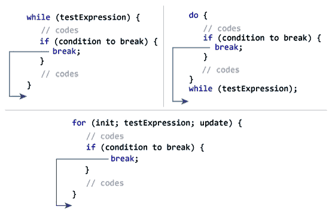
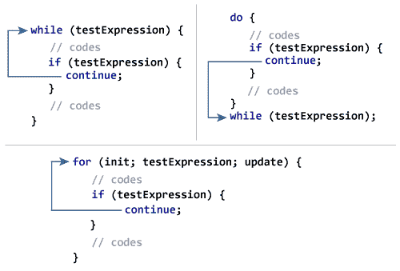

# C `break`和`continue`

> 原文： [https://www.programiz.com/c-programming/c-break-continue-statement](https://www.programiz.com/c-programming/c-break-continue-statement)

#### 我们在之前的教程中了解了循环。 在本教程中，我们将在示例的帮助下学习使用`break`和`continue`语句。

## C `break`

`break`语句在遇到循环时将立即结束循环。 其语法为：

```c
break;
```

`break`语句几乎总是与循环内的`if...else`语句一起使用。

* * *

### `break`语句如何工作？



* * *

### 示例 1：`break`语句

```c
// Program to calculate the sum of a maximum of 10 numbers
// If a negative number is entered, the loop terminates

# include <stdio.h>
int main()
{
    int i;
    double number, sum = 0.0;

    for(i=1; i <= 10; ++i)
    {
        printf("Enter a n%d: ",i);
        scanf("%lf",&number);

        // If the user enters a negative number, the loop ends
        if(number < 0.0)
        {
            break;
        }

        sum += number; // sum = sum + number;
    }

    printf("Sum = %.2lf",sum);

    return 0;
}
```

**输出**

```c
Enter a n1: 2.4
Enter a n2: 4.5
Enter a n3: 3.4
Enter a n4: -3
Sum = 10.30
```

该程序计算最多 10 个数字的总和。 为什么最多 10 个数字？ 这是因为如果用户输入一个负数，则将执行`break`语句。 这将结束`for`循环，并显示`sum`。

在 C 中，`break`也与`switch`语句一起使用。 这将在下一个教程中讨论。

* * *

## C `continue`

`continue`语句跳过循环的当前迭代，并继续下一个迭代。 其语法为：

```c
continue;
```

`continue`语句几乎总是与`if...else`语句一起使用。

* * *

### 连续语句如何工作？



* * *

### 示例 2：`continue`语句

```c
// Program to calculate the sum of a maximum of 10 numbers
// Negative numbers are skipped from the calculation

# include <stdio.h>
int main()
{
    int i;
    double number, sum = 0.0;

    for(i=1; i <= 10; ++i)
    {
        printf("Enter a n%d: ",i);
        scanf("%lf",&number);

        if(number < 0.0)
        {
            continue;
        }

        sum += number; // sum = sum + number;
    }

    printf("Sum = %.2lf",sum);

    return 0;
}
```

**Output**

```c
Enter a n1: 1.1
Enter a n2: 2.2
Enter a n3: 5.5
Enter a n4: 4.4
Enter a n5: -3.4
Enter a n6: -45.5
Enter a n7: 34.5
Enter a n8: -4.2
Enter a n9: -1000
Enter a n10: 12
Sum = 59.70
```

在此程序中，当用户输入正数时，将使用`sum += number;`语句计算总和。

当用户输入一个负数时，将执行`continue`语句，并从计算中跳过该负数。