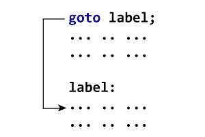

# C `goto`语句

> 原文： [https://www.programiz.com/c-programming/c-goto-statement](https://www.programiz.com/c-programming/c-goto-statement)

#### 在本教程中，您将学习在 C 编程中创建`goto`语句。 此外，您还将学习何时使用`goto`语句以及何时不使用它。

`goto`语句允许我们将程序的控制权转移到指定的标签。

* * *

### `goto`语句的语法

```c
goto label;
... .. ...
... .. ...
label: 
statement; 
```

`label`是一个标识符。 遇到`goto`语句时，程序的控制跳至`label:`并开始执行代码。



* * *

### 示例：`goto`语句

```c
// Program to calculate the sum and average of positive numbers
// If the user enters a negative number, the sum and average are displayed.

#include <stdio.h>

int main() {

   const int maxInput = 100;
   int i;
   double number, average, sum = 0.0;

   for (i = 1; i <= maxInput; ++i) {
      printf("%d. Enter a number: ", i);
      scanf("%lf", &number);

      // go to jump if the user enters a negative number
      if (number < 0.0) {
         goto jump;
      }
      sum += number;
   }

jump:
   average = sum / (i - 1);
   printf("Sum = %.2f\n", sum);
   printf("Average = %.2f", average);

   return 0;
}
```

**输出**

```c
1\. Enter a number: 3
2\. Enter a number: 4.3
3\. Enter a number: 9.3
4\. Enter a number: -2.9
Sum = 16.60
Average = 5.53
```

* * *

### 避免`goto`的原因

使用`goto`语句可能会导致错误且难以理解的代码。 例如，

```c
one:
for (i = 0; i < number; ++i)
{
    test += i;
    goto two;
}
two: 
if (test > 5) {
  goto three;
}
... .. ... 
```

同样，`goto`语句允许您执行不良操作，例如跳出示波器范围。

话虽如此，`goto`有时会有用。 例如：打破嵌套循环。

* * *

### 您应该使用`goto`吗？

如果您认为使用`goto`语句简化了程序，则可以使用它。 话虽这么说，`goto`很少有用，您可以不使用`goto`一起创建任何 C 程序。

这是 C++ 的创建者 Bjarne Stroustrup 的话“`goto`可以做任何事情的事实正是我们不使用它的原因”。