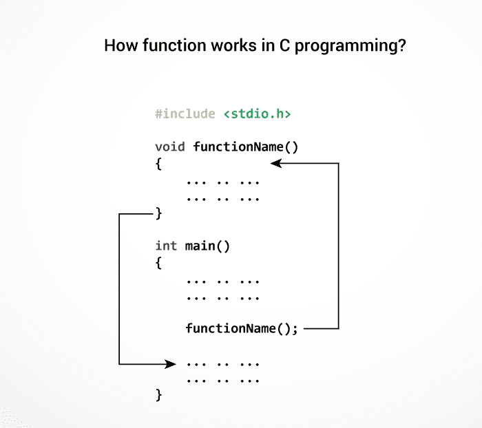

# C 函数

> 原文： [https://www.programiz.com/c-programming/c-functions](https://www.programiz.com/c-programming/c-functions)

#### 在本教程中，将向您介绍 C 编程中的函数（用户定义函数和标准库函数）。 此外，您还将学习为什么在编程中使用函数。

功能是执行特定任务的代码块。

假设您需要创建一个程序来创建一个圆并为其着色。 您可以创建两个函数来解决此问题：

*   创建一个圆函数
*   创建颜色功能

将复杂的问题分成较小的块可以使我们的程序易于理解和重用。

* * *

## 功能类型

C 编程中有两种类型的函数：

*   [标准库函数](/c-programming/library-function "C Library Functions")
*   [用户定义的函数](/c-programming/c-user-defined-functions "C user-defined functions")

* * *

### 标准库功能

标准库函数是 C 编程中的内置函数。

这些功能在头文件中定义。 例如，

*   `printf()`是标准库功能，用于将格式化的输出发送到屏幕（屏幕上的显示输出）。 此功能在`stdio.h`头文件中定义。
    因此，要使用`printf()`函数，我们需要使用`#include <stdio.h>`包含`stdio.h`头文件。
*   `sqrt()`函数计算数字的平方根。 该函数在`math.h`头文件中定义。

请访问 C 编程中的[标准库函数以了解更多信息](/c-programming/library-function "C Library Functions")。

* * *

### 用户定义的函数

您也可以根据需要创建函数。 用户创建的此类功能称为用户定义函数。

## 用户定义的函数如何工作？

```c
#include <stdio.h>
void functionName()
{
    ... .. ...
    ... .. ...
}

int main()
{
    ... .. ...
    ... .. ...

    functionName();

    ... .. ...
    ... .. ...
}

```

C 程序的执行从`main()`函数开始。

当编译器遇到`functionName();`时，程序的控制权跳至

```c
 void functionName()
```

并且，编译器开始执行`functionName()`内部的代码。

一旦执行了功能定义内的代码，程序的控制就会跳回到`main()`函数。



注意，函数名称是标识符，并且应该是唯一的。

这只是用户定义函数的概述。 访问这些页面以了解更多信息：

*   [C 编程中的用户定义函数](/c-programming/c-user-defined-functions "C user-defined Functions")
*   [用户定义函数的类型](/c-programming/types-user-defined-functions "User-defined Function Types")

* * *

### 用户定义函数的优点

1.  该程序将更易于理解，维护和调试。
2.  可在其他程序中使用的可重用代码
3.  大型程序可以分为较小的模块。 因此，一个大型项目可以分配给许多程序员。