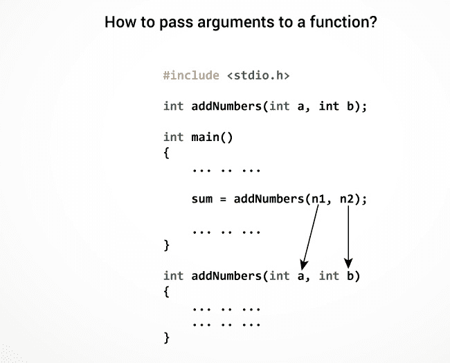
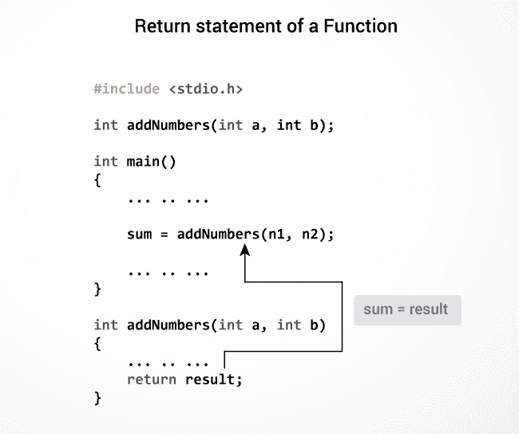

# C 用户定义的功能

> 原文： [https://www.programiz.com/c-programming/c-user-defined-functions](https://www.programiz.com/c-programming/c-user-defined-functions)

#### 在本教程中，您将借助示例学习在 C 编程中创建用户定义的函数。

函数是执行特定任务的代码块。

C 允许您根据需要定义功能。 这些功能称为用户定义功能。 例如：

假设您需要创建一个圆并根据半径和颜色为其着色。 您可以创建两个函数来解决此问题：

*   `createCircle()`功能
*   `color()`功能

* * *

## 示例：用户定义的功能

这是添加两个整数的示例。 为了执行此任务，我们创建了一个用户定义的`addNumbers()`。

```c
#include <stdio.h>
int addNumbers(int a, int b);         // function prototype

int main()
{
    int n1,n2,sum;

    printf("Enters two numbers: ");
    scanf("%d %d",&n1,&n2);

    sum = addNumbers(n1, n2);        // function call
    printf("sum = %d",sum);

    return 0;
}

int addNumbers(int a, int b)         // function definition   
{
    int result;
    result = a+b;
    return result;                  // return statement
}

```

* * *

## 功能原型

函数原型只是函数的声明，用于指定函数的名称，参数和返回类型。 它不包含函数体。

函数原型向编译器提供信息，该函数以后可以在程序中使用。

### 函数原型的语法

```c
returnType functionName(type1 argument1, type2 argument2, ...);
```

在上面的示例中，`int addNumbers(int a, int b);`是函数原型，它向编译器提供以下信息：

1.  该函数的名称为`addNumbers()`
2.  函数的返回类型为`int`
3.  类型为`int`的两个参数传递给函数

如果在`main()`函数之前定义了用户定义的函数，则不需要函数原型。

* * *

## 调用函数

程序的控制权通过调用转移到用户定义的函数。

### 函数调用的语法

```c
functionName(argument1, argument2, ...);
```

在上面的示例中，使用`main()`函数内部的`addNumbers(n1, n2);`语句进行函数调用。

* * *

## 功能定义

函数定义包含执行特定任务的代码块。 在我们的示例中，将两个数字相加并返回。

#### 函数定义的语法

```c
returnType functionName(type1 argument1, type2 argument2, ...)
{
    //body of the function
}

```

调用函数时，程序的控制权将转移到函数定义中。 并且，编译器开始在函数体内执行代码。

* * *

## 将参数传递给函数

在编程中，参数是指传递给函数的变量。 在上面的示例中，在函数调用期间传递了两个变量 `n1` 和 `n2` 。

参数 `a` 和 `b` 接受函数定义中传递的参数。 这些参数称为函数的形式参数。



传递给函数的参数类型和形式参数必须匹配，否则，编译器将引发错误。

如果 `n1` 为 char 类型，则`和`也应为 char 类型。 如果 `n2` 为浮点型，则变量 `b` 也应为浮点型。

也可以在不传递参数的情况下调用函数。

* * *

## 退货声明

return 语句终止函数的执行并将值返回给调用函数。 返回语句后，程序控制权将转移到调用函数。

在上面的示例中，`结果`变量的值返回到主函数。 为`main()`功能中的`总和`变量分配了该值。



### return 语句的语法

```c
return (expression);     

```

例如，

```c
return a;
return (a+b);
```

从函数返回的值的类型与函数原型和函数定义中指定的返回类型必须匹配。

访问此页面以了解有关[传递参数和从函数](/c-programming/types-user-defined-functions "Passing argument and returning value")返回值的更多信息。