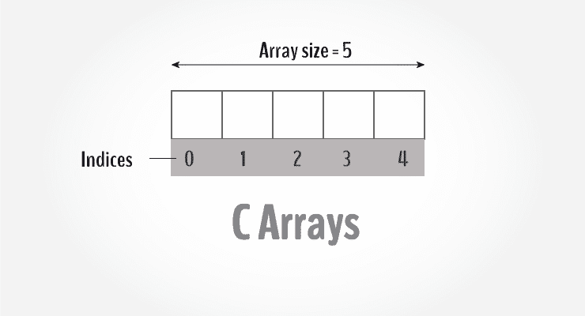
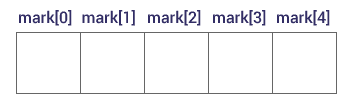
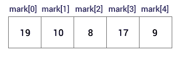

# C 数组

> 原文： [https://www.programiz.com/c-programming/c-arrays](https://www.programiz.com/c-programming/c-arrays)

#### 在本教程中，您将学习如何使用数组。 您将借助示例学习如何声明，初始化和访问数组的元素。



数组是可以存储多个值的变量。 例如，如果要存储 100 个整数，则可以为其创建一个数组。

```c
int data[100]; 

```

* * *

## 如何声明数组？

```c
dataType arrayName[arraySize];

```

**例如，**

```c
float mark[5];
```

在这里，我们声明了一个浮点类型的数组`标记`。 其大小为 5。意味着，它可以容纳 5 个浮点值。

重要的是要注意，数组的大小和类型一旦声明就无法更改。

* * *

## 访问数组元素

您可以按索引访问数组的元素。

假设您如上所述声明了数组`标记`。 第一个元素是`mark [0]`，第二个元素是`mark [1]`，依此类推。



#### **很少有主题演讲**：

*   数组的第一个索引为 0，而不是 1。在此示例中，`标记[0]`是第一个元素。
*   如果数组的大小为`n`，则要访问最后一个元素，将使用`n-1`索引。 在此示例中，`标记[4]`
*   假设`mark[0]`的起始地址为 **2120d** 。 然后，`mark[1]`的地址将是 **2124d** 。 同样，`mark[2]`的地址将是 **2128d** ，依此类推。
    这是因为`float`的大小为 4 个字节。

* * *

## 如何初始化数组？

在声明期间可以初始化数组。 例如，

```c
int mark[5] = {19, 10, 8, 17, 9};
```

您也可以像这样初始化一个数组。

```c
int mark[] = {19, 10, 8, 17, 9};
```

在这里，我们没有指定大小。 但是，当我们使用 5 个元素进行初始化时，编译器知道其大小为 5。


这里，

```c
mark[0] is equal to 19
mark[1] is equal to 10
mark[2] is equal to 8
mark[3] is equal to 17
mark[4] is equal to 9
```

* * *

## 更改数组元素的值

```c
int mark[5] = {19, 10, 8, 17, 9}

// make the value of the third element to -1
mark[2] = -1;

// make the value of the fifth element to 0
mark[4] = 0; 
```

* * *

## 输入和输出数组元素

这是如何从用户那里获取输入并将其存储在数组元素中的方法。

```c
// take input and store it in the 3rd element
​scanf("%d", &mark[2]);

// take input and store it in the ith element
scanf("%d", &mark[i-1]);

```

这是打印数组单个元素的方法。

```c
// print the first element of the array
printf("%d", mark[0]);

// print the third element of the array
printf("%d", mark[2]);

// print ith element of the array
printf("%d", mark[i-1]);

```

* * *

## 示例 1：数组输入/输出

```c
// Program to take 5 values from the user and store them in an array
// Print the elements stored in the array
#include <stdio.h>

int main() {
  int values[5];

  printf("Enter 5 integers: ");

  // taking input and storing it in an array
  for(int i = 0; i < 5; ++i) {
     scanf("%d", &values[i]);
  }

  printf("Displaying integers: ");

  // printing elements of an array
  for(int i = 0; i < 5; ++i) {
     printf("%d\n", values[i]);
  }
  return 0;
}

```

**输出**

```c
Enter 5 integers: 1
-3
34
0
3
Displaying integers: 1
-3
34
0
3

```

在这里，我们使用`for`循环从用户那里获取 5 个输入并将它们存储在一个数组中。 然后，使用另一个`for`循环，这些元素显示在屏幕上。

* * *

## 示例 2：计算平均值

```c
// Program to find the average of n numbers using arrays

#include <stdio.h>
int main()
{
     int marks[10], i, n, sum = 0, average;

     printf("Enter number of elements: ");
     scanf("%d", &n);

     for(i=0; i<n; ++i)
     {
          printf("Enter number%d: ",i+1);
          scanf("%d", &marks[i]);

          // adding integers entered by the user to the sum variable
          sum += marks[i];
     }

     average = sum/n;
     printf("Average = %d", average);

     return 0;
}

```

**Output**

```c
Enter n: 5
Enter number1: 45
Enter number2: 35
Enter number3: 38
Enter number4: 31
Enter number5: 49
Average = 39 
```

在这里，我们计算了用户输入的`n`个数字的平均值。

* * *

### 访问元素超出范围！

假设您声明了一个由 10 个元素组成的数组。 比方说

```c
int testArray[10];
```

您可以从`testArray[0]`到`testArray[9]`访问数组元素。

现在，假设您尝试访问`testArray[12]`。 该元素不可用。 这可能会导致意外输出（不确定的行为）。 有时您可能会遇到错误，而其他时候您的程序可能会正确运行。

因此，永远不要访问数组边界之外的元素。

* * *

## 多维数组

在本教程中，您了解了数组。 这些数组称为一维数组。

在下一个教程中，您将学习[多维数组（数组的数组）](/c-programming/c-multi-dimensional-arrays "C Multidimensional Array")。