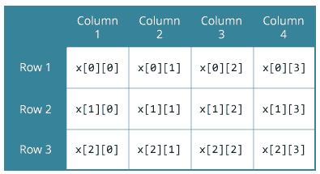

# C 多维数组

> 原文： [https://www.programiz.com/c-programming/c-multi-dimensional-arrays](https://www.programiz.com/c-programming/c-multi-dimensional-arrays)

#### 在本教程中，您将借助示例学习使用多维数组（二维和三维数组）。

在 C 编程中，您可以创建一个数组数组。 这些数组称为多维数组。 例如，

```c
float x[3][4];
```

在此，`x`是二维（2d）数组。 该数组可以容纳 12 个元​​素。 您可以将数组视为具有 3 行的表，每行有 4 列。



同样，您可以声明三维（3d）数组。 例如，

```c
float y[2][4][3];
```

在这里，数组`y`可以容纳 24 个元素。

* * *

## 初始化多维数组

这是初始化二维和三维数组的方法：

* * *

### 二维数组的初始化

```c
// Different ways to initialize two-dimensional array

int c[2][3] = {{1, 3, 0}, {-1, 5, 9}};

int c[][3] = {{1, 3, 0}, {-1, 5, 9}};

int c[2][3] = {1, 3, 0, -1, 5, 9};

```

* * *

### 3D 数组的初始化

您可以用类似于二维数组的类似方式初始化三维数组。 这是一个例子

```c
int test[2][3][4] = {
    {{3, 4, 2, 3}, {0, -3, 9, 11}, {23, 12, 23, 2}},
    {{13, 4, 56, 3}, {5, 9, 3, 5}, {3, 1, 4, 9}}};
```

* * *

### 示例 1：用于存储和打印值的二维数组

```c
// C program to store temperature of two cities of a week and display it.
#include <stdio.h>
const int CITY = 2;
const int WEEK = 7;
int main()
{
  int temperature[CITY][WEEK];

  // Using nested loop to store values in a 2d array
  for (int i = 0; i < CITY; ++i)
  {
    for (int j = 0; j < WEEK; ++j)
    {
      printf("City %d, Day %d: ", i + 1, j + 1);
      scanf("%d", &temperature[i][j]);
    }
  }
  printf("\nDisplaying values: \n\n");

  // Using nested loop to display vlues of a 2d array
  for (int i = 0; i < CITY; ++i)
  {
    for (int j = 0; j < WEEK; ++j)
    {
      printf("City %d, Day %d = %d\n", i + 1, j + 1, temperature[i][j]);
    }
  }
  return 0;
} 
```

**输出**

```c
City 1, Day 1: 33
City 1, Day 2: 34
City 1, Day 3: 35
City 1, Day 4: 33
City 1, Day 5: 32
City 1, Day 6: 31
City 1, Day 7: 30
City 2, Day 1: 23
City 2, Day 2: 22
City 2, Day 3: 21
City 2, Day 4: 24
City 2, Day 5: 22
City 2, Day 6: 25
City 2, Day 7: 26

Displaying values: 

City 1, Day 1 = 33
City 1, Day 2 = 34
City 1, Day 3 = 35
City 1, Day 4 = 33
City 1, Day 5 = 32
City 1, Day 6 = 31
City 1, Day 7 = 30
City 2, Day 1 = 23
City 2, Day 2 = 22
City 2, Day 3 = 21
City 2, Day 4 = 24
City 2, Day 5 = 22
City 2, Day 6 = 25
City 2, Day 7 = 26
```

* * *

### 示例 2：两个矩阵的总和

```c
// C program to find the sum of two matrices of order 2*2

#include <stdio.h>
int main()
{
  float a[2][2], b[2][2], result[2][2];

  // Taking input using nested for loop
  printf("Enter elements of 1st matrix\n");
  for (int i = 0; i < 2; ++i)
    for (int j = 0; j < 2; ++j)
    {
      printf("Enter a%d%d: ", i + 1, j + 1);
      scanf("%f", &a[i][j]);
    }

  // Taking input using nested for loop
  printf("Enter elements of 2nd matrix\n");
  for (int i = 0; i < 2; ++i)
    for (int j = 0; j < 2; ++j)
    {
      printf("Enter b%d%d: ", i + 1, j + 1);
      scanf("%f", &b[i][j]);
    }

  // adding corresponding elements of two arrays
  for (int i = 0; i < 2; ++i)
    for (int j = 0; j < 2; ++j)
    {
      result[i][j] = a[i][j] + b[i][j];
    }

  // Displaying the sum
  printf("\nSum Of Matrix:");

  for (int i = 0; i < 2; ++i)
    for (int j = 0; j < 2; ++j)
    {
      printf("%.1f\t", result[i][j]);

      if (j == 1)
        printf("\n");
    }
  return 0;
}
```

**输出**

```c
Enter elements of 1st matrix
Enter a11: 2;
Enter a12: 0.5;
Enter a21: -1.1;
Enter a22: 2;
Enter elements of 2nd matrix
Enter b11: 0.2;
Enter b12: 0;
Enter b21: 0.23;
Enter b22: 23;

Sum Of Matrix:
2.2     0.5
-0.9    25.0
```

* * *

### 示例 3：三维数组

```c
// C Program to store and print 12 values entered by the user

#include <stdio.h>
int main()
{
  int test[2][3][2];

  printf("Enter 12 values: \n");

  for (int i = 0; i < 2; ++i)
  {
    for (int j = 0; j < 3; ++j)
    {
      for (int k = 0; k < 2; ++k)
      {
        scanf("%d", &test[i][j][k]);
      }
    }
  }

  // Printing values with proper index.

  printf("\nDisplaying values:\n");
  for (int i = 0; i < 2; ++i)
  {
    for (int j = 0; j < 3; ++j)
    {
      for (int k = 0; k < 2; ++k)
      {
        printf("test[%d][%d][%d] = %d\n", i, j, k, test[i][j][k]);
      }
    }
  }

  return 0;
}
```

**输出**

```c
Enter 12 values: 
1
2
3
4
5
6
7
8
9
10
11
12

Displaying Values:
test[0][0][0] = 1
test[0][0][1] = 2
test[0][1][0] = 3
test[0][1][1] = 4
test[0][2][0] = 5
test[0][2][1] = 6
test[1][0][0] = 7
test[1][0][1] = 8
test[1][1][0] = 9
test[1][1][1] = 10
test[1][2][0] = 11
test[1][2][1] = 12
```