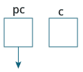
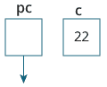
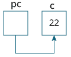
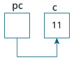
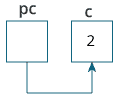

# C 指针

> 原文： [https://www.programiz.com/c-programming/c-pointers](https://www.programiz.com/c-programming/c-pointers)

#### 在本教程中，您将学习指针。 什么是指针，如何使用它们以及在示例的帮助下使用它们时可能遇到的常见错误。

指针是 C 和 C ++编程的强大功能。 在学习指针之前，让我们学习一下 C 编程中的地址。

* * *

## C 地址

如果程序中有变量 `var` ，则`&var`将在内存中提供其地址。

使用`scanf()`功能时，我们已多次使用地址。

```c
scanf("%d", &var);
```

在此，用户输入的值存储在 `var` 变量的地址中。 让我们举一个可行的例子。

```c
#include <stdio.h>
int main()
{
  int var = 5;
  printf("var: %d\n", var);

  // Notice the use of & before var
  printf("address of var: %p", &var);  
  return 0;
} 
```

**输出**

```c
var: 5 
address of var: 2686778
```

**注意：**运行上面的代码时，您可能会获得其他地址。

* * *

## C 指针

指针（指针变量）是用于存储地址而非值的特殊变量。

### 指针语法

这是我们如何声明指针的方法。

```c
int* p;
```

在这里，我们声明了`int`类型的指针 `p` 。

您也可以通过以下方式声明指针。

```c
int *p1;
int * p2; 
```

* * *

让我们再举一个声明指针的例子。

```c
int* p1, p2;
```

在这里，我们声明了一个指针 `p1` 和一个正常变量 `p2` 。

* * *

### 给指针分配地址

让我们举个例子。

```c
int* pc, c;
c = 5;
pc = &c; 
```

在此，将 `c` 变量分配为 5。 并且，将 `c` 的地址分配给 `pc` 指针。

* * *

### 获取指针所指事物的价值

要获取指针所指向的事物的值，我们使用`*`运算符。 例如：

```c
int* pc, c;
c = 5;
pc = &c;
printf("%d", *pc);   // Output: 5
```

此处，`c`的地址分配给 `pc` 指针。 为了获得存储在该地址中的值，我们使用了 `* pc` 。

**注意：**在上面的示例中， `pc` 是指针，而不是`*pc`。 您不能也不应做类似`*pc = &c`的操作；

顺便说一下，`*`被称为解除引用运算符（使用指针时）。 它对指针进行操作并给出存储在该指针中的值。

* * *

### 改变指针指向的价值

Let's take an example.

```c
int* pc, c;
c = 5;
pc = &c;
c = 1;
printf("%d", c);    // Output: 1
printf("%d", *pc);  // Ouptut: 1
```

我们已经将 `c` 的地址分配给 `pc` 指针。

然后，我们将 `c` 的值更改为 1。由于 `pc` 和 `c` 的地址相同，所以`*pc`给出 1。

让我们再举一个例子。

```c
int* pc, c;
c = 5;
pc = &c;
*pc = 1;
printf("%d", *pc);  // Ouptut: 1
printf("%d", c);    // Output: 1

```

We have assigned the address of `c` to the `pc` pointer.

然后，我们使用`*pc = 1;`将`*pc`更改为 1。 由于 `pc` 和 `c` 的地址相同，因此 `c` 等于 1。

让我们再举一个例子。

```c
int* pc, c, d;
c = 5;
d = -15;

pc = &c; printf("%d", *pc); // Output: 5
pc = &d; printf("%d", *pc); // Ouptut: -15
```

最初，使用`pc = &c;`将 `c` 的地址分配给 `pc` 指针。 由于 `c` 为 5，因此`*pc`给我们 5。

然后，使用`pc = &d;`将 `d` 的地址分配给 `pc` 指针。 由于 `d` 为-15，因此`*pc`给我们-15。

* * *

### 示例：指针的工作

让我们举一个可行的例子。

```c
#include <stdio.h>
int main()
{
   int* pc, c;

   c = 22;
   printf("Address of c: %p\n", &c);
   printf("Value of c: %d\n\n", c);  // 22

   pc = &c;
   printf("Address of pointer pc: %p\n", pc);
   printf("Content of pointer pc: %d\n\n", *pc); // 22

   c = 11;
   printf("Address of pointer pc: %p\n", pc);
   printf("Content of pointer pc: %d\n\n", *pc); // 11

   *pc = 2;
   printf("Address of c: %p\n", &c);
   printf("Value of c: %d\n\n", c); // 2
   return 0;
}

```

**Output**

```c
Address of c: 2686784
Value of c: 22

Address of pointer pc: 2686784
Content of pointer pc: 22

Address of pointer pc: 2686784
Content of pointer pc: 11

Address of c: 2686784
Value of c: 2

```

* * *

**程序**的说明

1.  `int* pc, c;`
    
    此处，创建了类型均为`int`的指针 `pc` 和常规变量 `c` 。
    由于 `pc` 和 `c` 最初并未初始化，因此指针 `pc` 指向无地址或随机地址。 并且，变量 `c` 具有地址，但包含随机垃圾值。

2.  `c = 22;`
    
    这将 22 分配给变量 `c` 。 即，将 22 存储在变量 `c` 的存储单元中。

3.  `pc = &c;`
    
    这将变量 `c` 的地址分配给指针 `pc` 。

4.  `c = 11;`
    
    这将 11 分配给变量 `c` 。

5.  `*pc = 2;`
    
    将指针 `pc` 指向的存储位置的值更改为 2。

* * *

### 使用指针时的常见错误

假设您希望指针 `pc` 指向 `c` 的地址。 然后，

```c
int c, *pc;

// pc is address but c is not
pc = c; // Error

// &c is address but *pc is not
*pc = &c; // Error

// both &c and pc are addresses
pc = &c;

// both c and *pc values 
*pc = c;
```

这是指针语法初学者经常会感到困惑的示例。

```c
#include <stdio.h>
int main() {
   int c = 5;
   int *p = &c;

   printf("%d", *p);  // 5
   return 0; 
}
```

**使用`int *p = &c;`时为什么没有出现错误？**

这是因为

```c
int *p = &c;
```

相当于

```c
int *p:
p = &c;
```

在这两种情况下，我们都将创建一个指针`p`（不是`*p`）并为其分配`&c`。

为了避免这种混乱，我们可以使用如下语句：

```c
int* p = &c;
```

* * *

现在您知道了什么是指针，您将在下一个教程中学习指针与数组的关系。