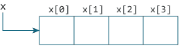

# 数组和指针之间的关系

> 原文： [https://www.programiz.com/c-programming/c-pointers-arrays](https://www.programiz.com/c-programming/c-pointers-arrays)

#### 在本教程中，您将了解 C 编程中数组与指针之间的关系。 您还将学习使用指针访问数组元素。

在了解数组与指针之间的关系之前，请确保检查以下两个主题：

*   [C 数组](/c-programming/c-arrays "C arrays")
*   [C 指针](/c-programming/c-pointers "C pointers")

* * *

## 数组和指针之间的关系

数组是一个顺序数据块。 让我们编写一个程序来打印数组元素的地址。

```c
#include <stdio.h>
int main() {
   int x[4];
   int i;

   for(i = 0; i < 4; ++i) {
      printf("&x[%d] = %p\n", i, &x[i]);
   }

   printf("Address of array x: %p", x);

   return 0;
} 
```

**输出**

```c
&x[0] = 1450734448
&x[1] = 1450734452
&x[2] = 1450734456
&x[3] = 1450734460
Address of array x: 1450734448

```

数组 `x` 的两个连续元素之间相差 4 个字节。 这是因为`int`的大小为 4 个字节（在我们的编译器中）。

注意， `& x [0]` 和 `x` 的地址相同。 这是因为变量名 `x` 指向数组的第一个元素。



从上面的示例中，很明显`&x[0]`等于 `x` 。 并且，`x[0]`等效于`*x`。

同样，

*   `&x[1]`等效于`x+1`，`x[1]`等效于`*(x+1)`。
*   `&x[2]`等效于`x+2`，`x[2]`等效于`*(x+2)`。
*   ...
*   基本上，`&x[i]`等效于`x+i`，`x[i]`等效于`*(x+i)`。

* * *

### 示例 1：指针和数组

```c
#include <stdio.h>
int main() {
  int i, x[6], sum = 0;
  printf("Enter 6 numbers: ");
  for(i = 0; i < 6; ++i) {
  // Equivalent to scanf("%d", &x[i]);
      scanf("%d", x+i);

  // Equivalent to sum += x[i]
      sum += *(x+i);
  }
  printf("Sum = %d", sum);
  return 0;
} 
```

运行该程序时，输出为：

```c
Enter 6 numbers:  2
 3
 4
 4
 12
 4
Sum = 29 
```

在这里，我们声明了一个由 6 个元素组成的数组 `x` 。 为了访问数组的元素，我们使用了指针。

* * *

在大多数情况下，数组名称会衰减为指针。 简而言之，数组名称将转换为指针。 这就是为什么您可以使用指针访问数组元素的原因。 但是，您应该记住**指针和数组不是相同的**。

在某些情况下，数组名称不会衰减到指针。 要了解更多信息，请访问：[数组名称何时不衰减为指针？](https://stackoverflow.com/questions/17752978/exceptions-to-array-decaying-into-a-pointer)

* * *

### 示例 2：数组和指针

```c
#include <stdio.h>
int main() {
  int x[5] = {1, 2, 3, 4, 5};
  int* ptr;

  // ptr is assigned the address of the third element
  ptr = &x[2]; 

  printf("*ptr = %d \n", *ptr);   // 3
  printf("*(ptr+1) = %d \n", *(ptr+1)); // 4
  printf("*(ptr-1) = %d", *(ptr-1));  // 2

  return 0;
}
```

When you run the program, the output will be:

```c
*ptr = 3 
*(ptr+1) = 4 
*(ptr-1) = 2
```

在此示例中，第三个元素的地址`&x[2]`被分配给 `ptr` 指针。 因此，当我们打印`*ptr`时显示`3`。

并且，打印`*(ptr+1)`给我们第四个元素。 同样，打印`*(ptr-1)`提供了第二个要素。