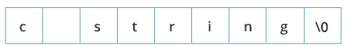
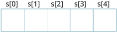
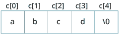

# C 编程字符串

> 原文： [https://www.programiz.com/c-programming/c-strings](https://www.programiz.com/c-programming/c-strings)

#### 在本教程中，您将学习 C 编程中的字符串。 您将学习通过示例来声明它们，对其进行初始化以及如何将它们用于各种 I / O 操作。

在 C 编程中，字符串是一个以空字符`\0`结尾的字符序列。 例如：

```c
char c[] = "c string";

```

当编译器遇到用双引号引起来的字符序列时，默认情况下会在末尾附加一个空字符`\0`。



* * *

## 如何声明一个字符串？

声明字符串的方法如下：

```c
char s[5];

```



在这里，我们声明了一个 5 个字符的字符串。

* * *

## 如何初始化字符串？

您可以通过多种方式初始化字符串。

```c
char c[] = "abcd";

char c[50] = "abcd";

char c[] = {'a', 'b', 'c', 'd', '\0'};

char c[5] = {'a', 'b', 'c', 'd', '\0'};

```



让我们再举一个例子：

```c
char c[5] = "abcde";
```

在这里，我们试图将 6 个字符（最后一个字符为`'\0'`）分配给具有 5 个字符的`char`数组。 这很糟糕，您永远不要这样做。

* * *

## 给字符串赋值

数组和字符串是 C 语言中的二等公民。 一旦声明，它们就不支持赋值运算符。 例如，

```c
char c[100];
c = "C programming";  // Error! array type is not assignable.
```

**注意：**使用 [strcpy（）函数](/c-programming/library-function/string.h/strcpy "C strcpy")复制字符串。

* * *

## 从用户读取字符串

您可以使用`scanf()`函数读取字符串。

`scanf()`函数读取字符序列，直到遇到[空格](https://stackoverflow.com/questions/30033582/what-is-the-symbol-for-whitespace-in-c)（空格，换行符，制表符等）为止。

* * *

### 示例 1：scanf（）读取字符串

```c
#include <stdio.h>
int main()
{
    char name[20];
    printf("Enter name: ");
    scanf("%s", name);
    printf("Your name is %s.", name);
    return 0;
} 
```

**输出**

```c
Enter name: Dennis Ritchie
Your name is Dennis.
```

即使在上述程序中输入了`Dennis Ritchie`，在`名称`字符串中也仅存储了`“ Dennis”`。 这是因为`Dennis`之后有一个空格。

* * *

### 如何阅读一行文字？

您可以使用`fgets()`函数读取一行字符串。 并且，您可以使用`puts()`显示字符串。

* * *

### 示例 2：fgets（）和 puts（）

```c
#include <stdio.h>
int main()
{
    char name[30];
    printf("Enter name: ");
    fgets(name, sizeof(name), stdin);  // read string
    printf("Name: ");
    puts(name);    // display string
    return 0;
} 
```

**输出**

```c
Enter name: Tom Hanks
Name: Tom Hanks

```

在这里，我们使用`fgets()`函数从用户读取字符串。

`fgets(name, sizeof(name), stdlin); // read string`

`sizeof(name)`的结果为 30。因此，我们最多可以输入 30 个字符，这是`名称`字符串的大小。

为了打印字符串，我们使用了`puts(name);`。

**注意：** `gets()`功能也可以接受用户输入。 但是，它已从 C 标准中删除。

这是因为`gets()`允许您输入任何长度的字符。 因此，可能存在缓冲区溢出。

* * *

## 将字符串传递给函数

字符串可以通过类似于数组的方式传递给函数。 了解有关[将数组传递给函数](/c-programming/c-arrays-functions)的更多信息。

* * *

### 示例 3：将字符串传递给函数

```c
#include <stdio.h>
void displayString(char str[]);

int main()
{
    char str[50];
    printf("Enter string: ");
    fgets(str, sizeof(str), stdin);             
    displayString(str);     // Passing string to a function.    
    return 0;
}
void displayString(char str[])
{
    printf("String Output: ");
    puts(str);
}

```

* * *

## 字符串和指针

类似于数组，字符串名称“衰减”到指针。 因此，您可以使用指针来操作字符串的元素。 我们建议您在检查本示例之前，先检查 [C 数组和指针](/c-programming/c-pointers-arrays "C Arrays and Pointers")。

* * *

### 示例 4：字符串和指针

```c
#include <stdio.h>

int main(void) {
  char name[] = "Harry Potter";

  printf("%c", *name);     // Output: H
  printf("%c", *(name+1));   // Output: a
  printf("%c", *(name+7));   // Output: o

  char *namePtr;

  namePtr = name;
  printf("%c", *namePtr);     // Output: H
  printf("%c", *(namePtr+1));   // Output: a
  printf("%c", *(namePtr+7));   // Output: o
}
```

* * *

### 常用的字符串函数

*   [**strlen（）**-计算字符串的长度](/c-programming/library-function/string.h/strlen)
*   [**strcpy（）**-将字符串复制到另一个](/c-programming/library-function/string.h/strcpy)
*   [**strcmp（）**-比较两个字符串](/c-programming/library-function/string.h/strcmp)
*   [**strcat（）**-连接两个字符串](/c-programming/library-function/string.h/strcat)