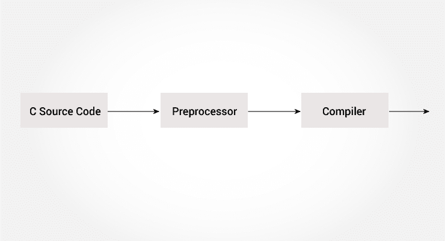

# C 预处理器和宏

> 原文： [https://www.programiz.com/c-programming/c-preprocessor-macros](https://www.programiz.com/c-programming/c-preprocessor-macros)

#### 在本教程中，将向您介绍 c 预处理器，并在示例的帮助下学习使用`#include`，`#define`和条件编译。



C 预处理器是一个宏预处理器（允许您定义宏），可以在编译程序之前对其进行转换。 这些转换可以包括头文件，宏扩展等。

所有预处理指令均以`#`符号开头。 例如，

```c
#define PI 3.14
```

C 预处理器的一些常见用法是：

* * *

## 包括头文件：#include

`#include`预处理器用于将头文件包含到 C 程序中。 例如，

```c
#include <stdio.h>
```

在此，`stdio.h`是头文件。`#include`预处理器指令将上述行替换为`stdio.h`头文件的内容。

这就是为什么在使用`scanf()`和`printf()`之类的功能之前需要使用`#include <stdio.h>`的原因。

您还可以创建自己的包含函数声明的头文件，并使用此预处理器指令将其包含在程序中。

```c
#include "my_header.h"
```

访问此页面以使用头文件了解有关[的更多信息。](https://gcc.gnu.org/onlinedocs/cpp/Header-Files.html#Header-Files "Include preprocessor")

* * *

## 使用`#define`的宏

宏是被命名的代码片段。 您可以使用`#define`预处理器指令在 C 中定义宏。

这是一个例子。

```c
#define c 299792458  // speed of light
```

在这里，当我们在程序中使用`c`时，将其替换为`299792458`。

* * *

### 示例 1：`#define`预处理器

```c
#include <stdio.h>
#define PI 3.1415

int main()
{
    float radius, area;
    printf("Enter the radius: ");
    scanf("%f", &radius);

    // Notice, the use of PI
    area = PI*radius*radius;

    printf("Area=%.2f",area);
    return 0;
}
```

* * *

## 像宏一样的功能

您还可以定义以类似于函数调用的方式工作的宏。 这称为类函数宏。 例如，

```c
#define circleArea(r) (3.1415*(r)*(r))
```

每次程序遇到`circleArea(argument)`时，都将其替换为`(3.1415*(argument)*(argument))`。

假设我们传递了 5 作为参数，则它扩展如下：

```c
circleArea(5) expands to (3.1415*5*5)
```

* * *

### 示例 2：使用`#define`预处理器

```c
#include <stdio.h>
#define PI 3.1415
#define circleArea(r) (PI*r*r)

int main() {
    float radius, area;

    printf("Enter the radius: ");
    scanf("%f", &radius);
    area = circleArea(radius);
    printf("Area = %.2f", area);

    return 0;
}
```

访问此页面以了解有关[宏和`#define`预处理器](https://gcc.gnu.org/onlinedocs/cpp/Macros.html#Macros "C Macros")的更多信息。

* * *

## 条件编译

在 C 编程中，您可以指示预处理器是否包含代码块。 为此，可以使用条件指令。

它类似于`if`语句，但有一个主要区别。

在执行期间测试`if`语句，以检查是否应执行代码块，而条件语句用于在执行之前在程序中包含（或跳过）代码块。

* * *

### 有条件使用

*   根据机器，操作系统使用不同的代码
*   在两个不同的程序中编译相同的源文件
*   从程序中排除某些代码，但保留以备将来参考

* * *

### 如何使用条件式？

要使用条件指令，请使用`#ifdef`，`#if`，`#defined`，`#else`和`#elseif`指令。

* * *

### `#ifdef`指令

```c
#ifdef MACRO     
   // conditional codes
#endif

```

在此，仅当定义了`MACRO`时，条件代码才包含在程序中。

* * *

### `#if`，`#elif`和`#else`指令

```c
#if expression
   // conditional codes
#endif

```

在这里，`表达式`是整数类型的表达式（可以是整数，字符，算术表达式，宏等）。

仅当将`表达式`求值为非零值时，条件代码才包含在程序中。

可选的`#else`指令可与`#if`指令一起使用。

```c
#if expression
   conditional codes if expression is non-zero
#else
   conditional if expression is 0
#endif

```

您还可以使用`#elif`将嵌套条件添加到`#if...#else`

```c
#if expression
    // conditional codes if expression is non-zero
#elif expression1
    // conditional codes if expression is non-zero
#elif expression2
    // conditional codes if expression is non-zero
#else
    // conditional if all expressions are 0
#endif

```

* * *

### #defined

特殊运算符`#defined`用于测试是否定义了某个宏。 通常与`#if`指令一起使用。

```c
#if defined BUFFER_SIZE && BUFFER_SIZE >= 2048
  // codes

```

* * *

## 预定义的宏

这是 C 编程中的一些预定义宏。

| 宏 | 值 |
| --- | --- |
| `__DATE__` | 包含当前日期的字符串 |
| `__FILE__` | 包含文件名的字符串 |
| `__LINE__` | 代表当前行号的整数 |
| `__STDC__` | 如果遵循 ANSI 标准 C，则该值为非零整数 |
| `__TIME__` | 包含当前日期的字符串。 |

* * *

### 示例 3：使用`__TIME__`获取当前时间

以下程序使用`__TIME__`宏输出当前时间。

```c
#include <stdio.h>
int main()
{
   printf("Current time: %s",__TIME__);   
}
```

**输出**

```c
Current time: 19:54:39
```

* * *

### 推荐读物

*   [线路控制](https://gcc.gnu.org/onlinedocs/cpp/Line-Control.html#Line-Control)
*   [语法](https://gcc.gnu.org/onlinedocs/cpp/Pragmas.html#Pragmas)
*   [预处理器输出](https://gcc.gnu.org/onlinedocs/cpp/Preprocessor-Output.html#Preprocessor-Output)
*   [其他指令](https://gcc.gnu.org/onlinedocs/cpp/Other-Directives.html#Other-Directives)