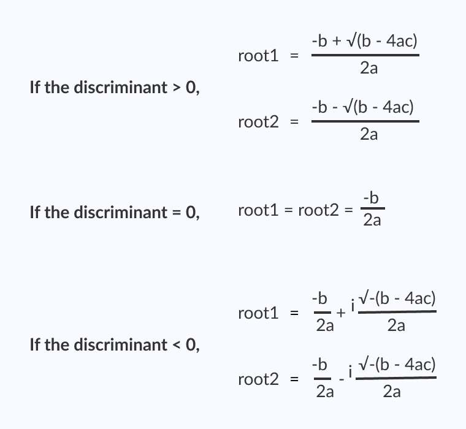

# C 程序：查找二次方程的根

> 原文： [https://www.programiz.com/c-programming/examples/quadratic-roots](https://www.programiz.com/c-programming/examples/quadratic-roots)

#### 在此示例中，您将学习如何在 C 编程中找到二次方程的根。

要理解此示例，您应该了解以下 [C 编程](/c-programming "C tutorial")主题：

*   [C 编程运算符](/c-programming/c-operators)
*   [C `if...else`语句](/c-programming/c-if-else-statement)

* * *

二次方程的标准形式为：

```c
ax2 + bx + c = 0, where
a, b and c are real numbers and
a != 0

```

术语`b<sup>2</sup>-4ac`被称为二次方程的判别式。 它说明了根的性质。

*   如果判别值大于`0`，则根是实数且不同。
*   如果判别式等于`0`，则根是实数且相等。
*   如果判别式小于`0`，则根是复数且不同。



* * *

## 查找二次方程根的程序

```c
#include <math.h>
#include <stdio.h>
int main() {
    double a, b, c, discriminant, root1, root2, realPart, imagPart;
    printf("Enter coefficients a, b and c: ");
    scanf("%lf %lf %lf", &a, &b, &c);

    discriminant = b * b - 4 * a * c;

    // condition for real and different roots
    if (discriminant > 0) {
        root1 = (-b + sqrt(discriminant)) / (2 * a);
        root2 = (-b - sqrt(discriminant)) / (2 * a);
        printf("root1 = %.2lf and root2 = %.2lf", root1, root2);
    }

    // condition for real and equal roots
    else if (discriminant == 0) {
        root1 = root2 = -b / (2 * a);
        printf("root1 = root2 = %.2lf;", root1);
    }

    // if roots are not real
    else {
        realPart = -b / (2 * a);
        imagPart = sqrt(-discriminant) / (2 * a);
        printf("root1 = %.2lf+%.2lfi and root2 = %.2f-%.2fi", realPart, imagPart, realPart, imagPart);
    }

    return 0;
} 
```

**输出**

```c
Enter coefficients a, b and c: 2.3
4
5.6
root1 = -0.87+1.30i and root2 = -0.87-1.30i 
```

在此程序中，`sqrt()`库函数用于查找数字的平方根。 要了解更多信息，请访问： [`sqrt()`函数](https://www.programiz.com/c-programming/library-function/math.h/sqrt)。