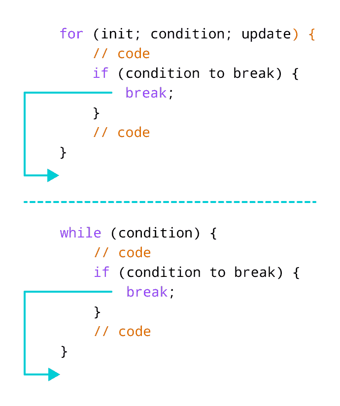

# C++ `break`语句

> 原文： [https://www.programiz.com/cpp-programming/break-continue](https://www.programiz.com/cpp-programming/break-continue)

#### 在本教程中，我们将在示例的帮助下了解`break`语句及其在循环中的工作。

在计算机编程中，`break`语句用于终止使用它的循环。

`break`语句的语法为：

```cpp
break;
```

在学习`break`语句之前，请确保您了解：

*   [C++ `for`循环](/cpp-programming/for-loop "C++ for loop")
*   [C++ `if...else`](/cpp-programming/for-loop "C++ if...else")
*   [C++ `while`循环](/cpp-programming/do-while-loop "C++ while loop")

* * *

## C++ `break`语句的工作



Working of break statement in C++


* * *

## 示例 1：`for`循环和`break`

```cpp
// program to print the value of i

#include <iostream>
using namespace std;

int main() {
    for (int i = 1; i <= 5; i++) {
        // break condition     
        if (i == 3) {
            break;
        }
        cout << i << endl;
    }

return 0;
}
```

**输出**

```cpp
1
2
```

在上述程序中，`for`循环用于在每次迭代中打印`i`的值。 在这里，请注意代码：

```cpp
if (i == 3) {
    break;
}
```

这意味着，当`i`等于 **3** 时，`break`语句终止循环。 因此，输出不包含大于或等于 3 的值。

注意：`break`语句通常与决策语句一起使用。

* * *

## 示例 2：`while`循环与`break`

```cpp
// program to find the sum of positive numbers
// if the user enters a negative numbers, break ends the loop
// the negative number entered is not added to sum

#include <iostream>
using namespace std;

int main() {
    int number;
    int sum = 0;

    while (true) {
        // take input from the user
        cout << "Enter a number: ";
        cin >> number;

        // break condition
        if (number < 0) {
            break;
        }

        // add all positive numbers
        sum += number;
    }

    // display the sum
    cout << "The sum is " << sum << endl;

    return 0;
}
```

**输出**

```cpp
Enter a number: 1
Enter a number: 2
Enter a number: 3
Enter a number: -5
The sum is 6\. 
```

在上述程序中，用户输入一个数字。`while`循环用于打印用户输入的数字的总和。 在这里，请注意代码，

```cpp
if(number < 0) {
    break;
}
```

这意味着，当用户输入一个负数时，`break`语句终止循环，并执行循环外的代码。

`while`循环继续，直到用户输入一个负数。

* * *

## 打破嵌套循环

当`break`与嵌套循环一起使用时，`break`终止内部循环。 例如，

```cpp
// using break statement inside
// nested for loop

#include <iostream>
using namespace std;

int main() {
    int number;
    int sum = 0;

    // nested for loops

    // first loop
    for (int i = 1; i <= 3; i++) {
        // second loop
        for (int j = 1; j <= 3; j++) {
            if (i == 2) {
                break;
            }
            cout << "i = " << i << ", j = " << j << endl;
        }
    }

    return 0;
}
```

**输出**

```cpp
i = 1, j = 1
i = 1, j = 2
i = 1, j = 3
i = 3, j = 1
i = 3, j = 2
i = 3, j = 3
```

在上述程序中，当`i == 2`时执行`break`语句。 它终止了内部循环，程序的控制流移至外部循环。

因此，`i = 2`的值永远不会显示在输出中。

* * *

`break`语句也与`switch`语句一起使用。 要了解更多信息，请访问 [C++ `switch`语句](/cpp-programming/switch-case "C++ switch statement")。