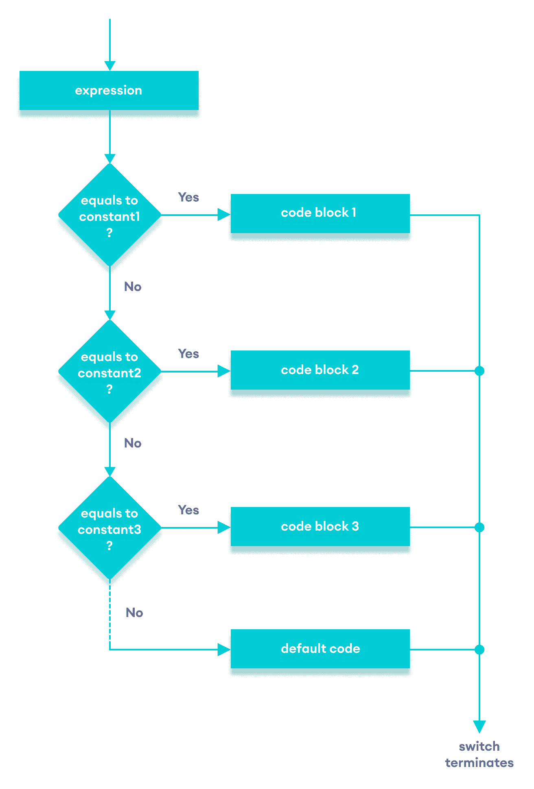

# C++ `switch..case`语句

> 原文： [https://www.programiz.com/cpp-programming/switch-case](https://www.programiz.com/cpp-programming/switch-case)

#### 在本教程中，我们将借助一些示例来学习`switch`语句及其在 C++ 编程中的工作。

`switch`语句使我们可以执行许多替代方案中的代码块。

C++ 中`switch`语句的语法为：

```cpp
switch (expression)  {
    case constant1:
        // code to be executed if 
        // expression is equal to constant1;
        break;

    case constant2:
        // code to be executed if
        // expression is equal to constant2;
        break;
        .
        .
        .
    default:
        // code to be executed if
        // expression doesn't match any constant
}
```

**`switch`语句如何工作？**

对`expression`进行一次求值，并与每个`case`标签的值进行比较。

*   如果匹配，则执行匹配标签后的相应代码。 例如，如果变量的值等于`constant2`，则执行`case constant2:`之后的代码，直到遇到`break`语句。
*   如果不匹配，则执行`default:`之后的代码。

**注意**：我们可以使用`if...else..if`梯形图执行相同的操作。 但是，`switch`语句的语法更简洁，更易于读写。

* * *

## `switch`语句流程图



Flowchart of C++ switch...case statement


* * *

### 示例：使用`switch`语句创建计算器

```cpp
// Program to build a simple calculator using switch Statement
#include <iostream>
using namespace std;

int main() {
    char oper;
    float num1, num2;
    cout << "Enter an operator (+, -, *, /): ";
    cin >> oper;
    cout << "Enter two numbers: " << endl;
    cin >> num1 >> num2;

    switch (oper) {
        case '+':
            cout << num1 << " + " << num2 << " = " << num1 + num2;
            break;
        case '-':
            cout << num1 << " - " << num2 << " = " << num1 - num2;
            break;
        case '*':
            cout << num1 << " * " << num2 << " = " << num1 * num2;
            break;
        case '/':
            cout << num1 << " / " << num2 << " = " << num1 / num2;
            break;
        default:
            // operator is doesn't match any case constant (+, -, *, /)
            cout << "Error! The operator is not correct";
            break;
    }

    return 0;
}
```

**输出 1**

```cpp
Enter an operator (+, -, *, /): +
Enter two numbers: 
2.3
4.5
2.3 + 4.5 = 6.8
```

**输出 2**

```cpp
Enter an operator (+, -, *, /): -
Enter two numbers: 
2.3
4.5
2.3 - 4.5 = -2.2
```

**输出 3**

```cpp
Enter an operator (+, -, *, /): *
Enter two numbers: 
2.3
4.5
2.3 * 4.5 = 10.35
```

**输出 4**

```cpp
Enter an operator (+, -, *, /): /
Enter two numbers: 
2.3
4.5
2.3 / 4.5 = 0.511111
```

**输出 5**

```cpp
Enter an operator (+, -, *, /): ?
Enter two numbers: 
2.3
4.5
Error! The operator is not correct.
```

在上面的程序中，我们使用`switch...case`语句执行加法，减法，乘法和除法。

**本程序的工作方式**

注意，在每个`case`块中都使用了`break`语句。 这将终止`switch`语句。

如果不使用`break`语句，则将执行正确的`case`之后的所有情况。

1.  我们首先提示用户输入所需的运算符。 然后，此输入存储在名为`oper`的`char`变量中。
2.  然后，我们提示用户输入两个数字，它们存储在浮点变量`num1`和`num2`中。
3.  然后，`switch`语句用于检查用户输入的运算符：
    *   如果用户输入`+`，则对数字进行加法运算。
    *   如果用户输入`-`，则对数字进行减法。
    *   如果用户输入`*`，则对数字进行乘法。
    *   如果用户输入`/`，则对数字进行除法。
    *   如果用户输入任何其他字符，则将打印默认代码。