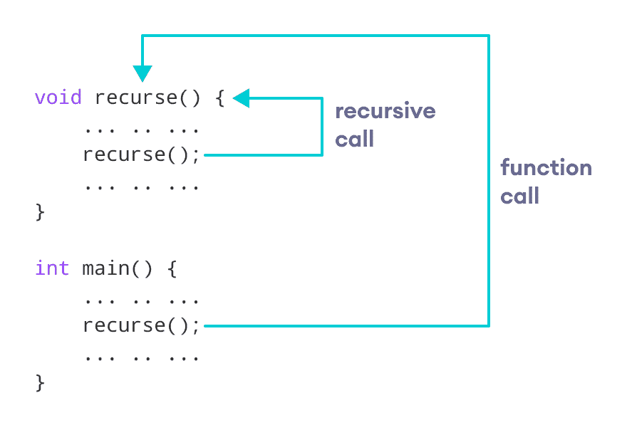
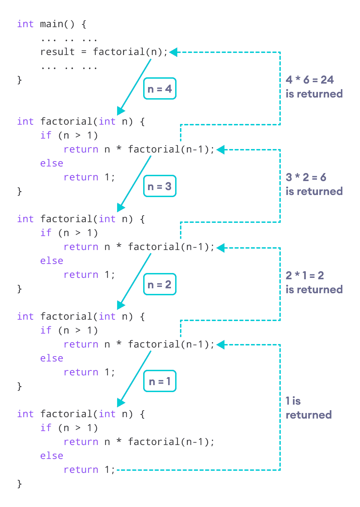

# C++ 递归

> 原文： [https://www.programiz.com/cpp-programming/recursion](https://www.programiz.com/cpp-programming/recursion)

#### 在本教程中，我们将通过示例学习 C++ 中的递归函数及其工作。

调用自身的[函数](/cpp-programming/function)被称为递归函数。 并且，这种技术称为递归。

* * *

## C++ 中的递归工作

```cpp
void recurse()
{
    ... .. ...
    recurse();
    ... .. ...
}

int main()
{
    ... .. ...
    recurse();
    ... .. ...
}
```

下图显示了递归调用的方式。



How recursion works in C++ programming


递归一直持续到满足某些条件为止。

为了防止无限递归，可以在一个分支进行递归调用而另一个不进行递归调用的情况下使用 [if...else 语句](/cpp-programming/if-else)（或类似方法）。

* * *

## 示例 1：使用递归的数字阶乘

```cpp
// Factorial of n = 1*2*3*...*n

#include <iostream>
using namespace std;

int factorial(int);

int main() {
    int n, result;

    cout << "Enter a non-negative number: ";
    cin >> n;

    result = factorial(n);
    cout << "Factorial of " << n << " = " << result;
    return 0;
}

int factorial(int n) {
    if (n > 1) {
        return n * factorial(n - 1);
    } else {
        return 1;
    }
}
```

**输出**

```cpp
Enter a non-negative number: 4
Factorial of 4 = 24
```

* * *

### 析因程序的工作



How this C++ recursion program works


如我们所见，`factorial()`函数正在调用自身。 但是，在每次通话期间，我们将 `n` 的值减小了`1`。 当 `n` 小于`1`时，`factorial()`函数最终返回输出。

* * *

## 递归的优缺点

以下是在 C++ 中使用递归的优缺点。

* * *

### C++ 递归的优点

*   它使我们的代码更短，更清晰。
*   在涉及数据结构和高级算法（例如图形和树遍历）的问题中需要递归。

* * *

### C++ 递归的缺点

*   与迭代程序相比，它占用大量堆栈空间。
*   它使用更多的处理器时间。
*   与等效的迭代程序相比，调试起来会更加困难。