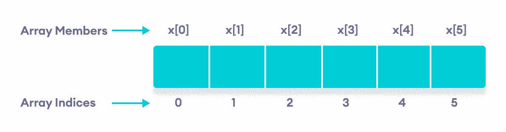
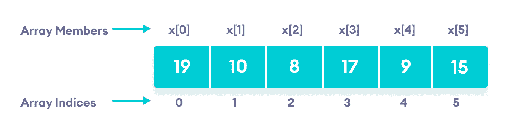
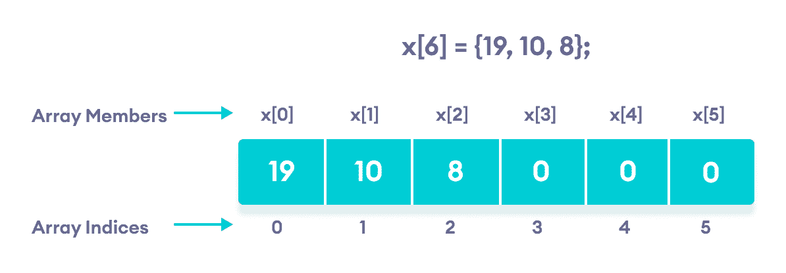

# C++ 数组

> 原文： [https://www.programiz.com/cpp-programming/arrays](https://www.programiz.com/cpp-programming/arrays)

#### 在本教程中，我们将学习如何使用数组。 我们将借助示例学习在 C++ 编程中声明，初始化和访问数组元素。

在 C++ 中，数组是一个变量，可以存储相同类型的多个值。 例如，

假设一班有 27 个学生，我们需要存储所有学生的成绩。 无需创建 27 个单独的变量，我们只需创建一个数组即可：

```cpp
double grade[27];
```

此处，`grade`是最多可容纳 27 个`double`类型元素的数组。

在 C++ 中，声明数组后不能更改数组的大小和类型。

* * *

## C++ 数组声明

```cpp
dataType arrayName[arraySize];
```

例如，

```cpp
int x[6];
```

这里，

*   `int` - 要存储的元素类型
*   `x` - 数组名称
*   `6` - 数组的大小

* * *

## C++ 数组中的访问元素

在 C++ 中，数组中的每个元素都与一个数字关联。 该数字称为数组索引。 我们可以使用这些索引访问数组的元素。

```cpp
// syntax to access array elements
array[index];
```

考虑上面我们看到的数组`x`。



C++ 数组元素


### 几件事要记住：

*   数组索引以`0`开头。 含义`x [0]`是存储在索引`0`的第一个元素。
*   如果数组的大小为`n`，则最后一个元素存储在索引`(n-1)`处。 在此示例中，`x [5]`是最后一个元素。
*   数组的元素具有连续的地址。 例如，假设`x[0]`的起始地址为`2120d`。 然后，下一个元素`x[1]`的地址将为`2124d`，`x[2]`的地址将为`2128d`，依此类推。

    这里，每个元素的大小增加 4。这是因为`int`的大小是 4 个字节。

* * *

## C++ 数组初始化

在 C++ 中，可以在声明期间初始化数组。 例如，

```cpp
// declare and initialize and array
int x[6] = {19, 10, 8, 17, 9, 15};
```



C++ 数组元素及其数据


声明期间初始化数组的另一种方法：

```cpp
// declare and initialize an array
int x[] = {19, 10, 8, 17, 9, 15};
```

在这里，我们没有提到数组的大小。 在这种情况下，编译器会自动计算大小。

* * *

### 空成员的 C++ 数组

在 C++ 中，如果数组的大小为`n`，我们最多可以在数组中存储`n`个元素。 但是，如果我们存储的元质数少于`n`个，将会发生什么。

For example,

```cpp
// store only 3 elements in the array
int x[6] = {19, 10, 8};
```

在此，数组`×`的大小为`6`。 但是，我们仅用 3 个元素对其进行了初始化。

在这种情况下，编译器会为其余位置分配随机值。 通常，此随机值就是`0`。



空数组成员将自动分配值 0


* * *

## 如何插入和打印数组元素？

```cpp
int mark[5] = {19, 10, 8, 17, 9}

// change 4th element to 9
mark[3] = 9;

// take input from the user
// store the value at third position
cin >> mark[2];

// take input from the user
// insert at ith position
cin >> mark[i-1];

// print first element of the array
cout << mark[0];

// print ith element of the array
cout >> mark[i-1];
```

* * *

## 示例 1：显示数组元素

```cpp
#include <iostream>
using namespace std;

int main() {
    int numbers[5] = {7, 5, 6, 12, 35};

    cout << "The numbers are: ";

    //  Printing array elements
    // using range based for loop
    for (const int &n : numbers) {
        cout << n << "  ";
    }

    cout << "\nThe numbers are: ";

    //  Printing array elements
    // using traditional for loop
    for (int i = 0; i < 5; ++i) {
        cout << numbers[i] << "  ";
    }

    return 0;
}
```

**输出**

```cpp
The numbers are: 7  5  6  12  35
The numbers are: 7  5  6  12  35
```

在这里，我们使用了`for`循环从`i = 0`迭代到`i = 4`。 在每次迭代中，我们都打印了`numbers[i]`。

我们再次使用基于范围的`for`循环来打印出数组的元素。 要了解有关此循环的更多信息，请检查[基于 C++ 的循环范围](/cpp-programming/ranged-for)。

**注意**：在基于范围的循环中，我们使用代码`const int &n`而不是`int n`作为范围声明。 但是，`const int &n`更可取，因为：

1.  使用`int n`只需在每次迭代期间将数组元素复制到变量`n`。 这不是高效的内存。 但是，

    `& n`使用数组元素的内存地址来访问其数据，而无需将其复制到新变量中。 这样可以节省内存。
2.  我们只是在打印数组元素，而不修改它们。 因此，我们使用`const`以免意外更改数组的值。

* * *

## 示例 2：从用户那里获取输入并将其存储在数组中

```cpp
#include <iostream>
using namespace std;

int main() {
    int numbers[5];

    cout << "Enter 5 numbers: " << endl;

    //  store input from user to array
    for (int i = 0; i < 5; ++i) {
        cin >> numbers[i];
    }

    cout << "The numbers are: ";

    //  print array elements
    for (int n = 0; n < 5; ++n) {
        cout << numbers[n] << "  ";
    }

    return 0;
}
```

**输出**

```cpp
Enter 5 numbers: 
11
12
13
14
15
The numbers are: 11  12  13  14  15
```

再次，我们使用了`for`循环从`i = 0`迭代到`i = 4`。 在每次迭代中，我们从用户那里获取输入并将其存储在`numbers[i]`中。

然后，我们使用了另一个`for`循环来打印所有数组元素。

* * *

## 示例 3：使用`for`循环显示数组元素的总和和平均值

```cpp
#include <iostream>
using namespace std;

int main() {

    // initialize an array without specifying size
    double numbers[] = {7, 5, 6, 12, 35, 27};

    double sum = 0;
    double count = 0;
    double average;

    cout << "The numbers are: ";

    //  print array elements
    // use of range-based for loop
    for (const double &n : numbers) {
        cout << n << "  ";

        //  calculate the sum
        sum += n;

        // count the no. of array elements
        ++count;
    }

    // print the sum
    cout << "\nTheir Sum = " << sum << endl;

    // find the average
    average = sum / count;
    cout << "Their Average = " << average << endl;

    return 0;
}
```

**输出**

```cpp
The numbers are: 7  5  6  12  35  27
Their Sum = 92
Their Average = 15.3333
```

在此程序中：

1.  我们已初始化名为`num`的`double`数组，但未指定其大小。 我们还声明了三个双变量`sum`，`count`和`average`。

    这里是`sum =0`和`count = 0`。
2.  然后，我们使用基于范围的`for`循环来打印数组元素。 在循环的每次迭代中，我们将当前数组元素添加到`sum`中。
3.  在每次迭代中，我们还将`count`的值增加`1`，以便可以在`for`循环结束时获得数组的大小。
4.  在打印所有元素之后，我们将打印所有数字的总和和平均值。 数字的平均值由`average = sum / count;`给出

**注意**：我们使用基于范围的`for`循环而不是常规的`for`循环，因为我们不知道数组的大小。

普通的`for`循环要求我们指定迭代次数，该次数由数组的大小指定。

但是基于范围的`for`循环不需要这样的规范。

* * *

## C++ 数组越界

如果我们声明一个大小为 10 的数组，则该数组将包含索引从 0 到 9 的元素。

但是，如果尝试访问索引为 10 或大于 10 的元素，则将导致未定义的行为。