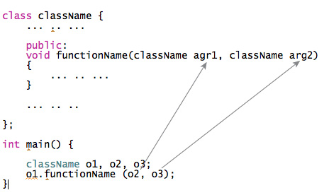
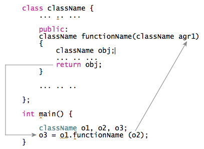

# 如何通过 C++ 中的函数传递和返回对象？

> 原文： [https://www.programiz.com/cpp-programming/pass-return-object-function](https://www.programiz.com/cpp-programming/pass-return-object-function)

#### 在本文中，您将学习在 C++ 编程中将对象传递给函数并从函数返回对象。

在 C++ 编程中，[对象可以与结构](/cpp-programming/structure-function)相似的方式传递给函数。

* * *

## 如何将对象传递给函数？



* * *

## 示例 1：将对象传递给函数

**C++ 程序，通过将对象传递给函数来加两个复数。**

```cpp
#include <iostream>
using namespace std;

class Complex
{
    private:
       int real;
       int imag;
    public:
       Complex(): real(0), imag(0) { }
       void readData()
        {
           cout << "Enter real and imaginary number respectively:"<<endl;
           cin >> real >> imag;
        }
        void addComplexNumbers(Complex comp1, Complex comp2)
        {
           // real represents the real data of object c3 because this function is called using code c3.add(c1,c2);
            real=comp1.real+comp2.real;

             // imag represents the imag data of object c3 because this function is called using code c3.add(c1,c2);
            imag=comp1.imag+comp2.imag;
        }

        void displaySum()
        {
            cout << "Sum = " << real<< "+" << imag << "i";
        }
};
int main()
{
    Complex c1,c2,c3;

    c1.readData();
    c2.readData();

    c3.addComplexNumbers(c1, c2);
    c3.displaySum();

    return 0;
} 
```

**输出**

```cpp
Enter real and imaginary number respectively:
2
4
Enter real and imaginary number respectively:
-3
4
Sum = -1+8i
```

* * *

## 如何从函数返回对象？

在 C++ 编程中，可以通过与结构类似的方式从函数中返回[对象](/cpp-programming/structure-function)。



* * *

## 示例 2：从函数传递和返回对象

在该程序中，复数（对象）的总和返回到`main()`函数并显示。

```cpp
#include <iostream>
using namespace std;
class Complex
{
    private:
       int real;
       int imag;
    public:
       Complex(): real(0), imag(0) { }
       void readData()
        {
           cout << "Enter real and imaginary number respectively:"<<endl;
           cin >> real >> imag;
        }
        Complex addComplexNumbers(Complex comp2)
        {
            Complex temp;

            // real represents the real data of object c3 because this function is called using code c3.add(c1,c2);
            temp.real = real+comp2.real;

            // imag represents the imag data of object c3 because this function is called using code c3.add(c1,c2);
            temp.imag = imag+comp2.imag;
            return temp;
        }
        void displayData()
        {
            cout << "Sum = " << real << "+" << imag << "i";
        }
};

int main()
{
    Complex c1, c2, c3;

    c1.readData();
    c2.readData();

    c3 = c1.addComplexNumbers(c2);

    c3.displayData();

    return 0;
} 
```