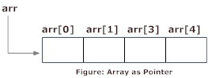

# C++ 指针和数组

> 原文： [https://www.programiz.com/cpp-programming/pointers-arrays](https://www.programiz.com/cpp-programming/pointers-arrays)

#### 在本文中，您将了解数组与指针之间的关系，并在程序中有效地使用它们。

[指针](/cpp-programming/pointers "C++ Pointers")是保存地址的变量。 指针不仅可以存储单个变量的地址，还可以存储[数组](/cpp-programming/arrays "C++ arrays")的单元格的地址。

考虑以下示例：

```cpp
int* ptr;
int a[5];
ptr = &a[2];  // &a[2] is the address of third element of a[5].

```



假设指针需要指向数组的第四个元素，即在上述情况下的第四个数组元素的保存地址。

由于在以上示例中 `ptr` 指向第三元素，所以`ptr + 1`将指向第四元素。

您可能会认为`ptr + 1`为您提供了`ptr`的下一个字节的地址。 但这是不正确的。

这是因为指针 `ptr` 是指向`int`的指针，并且`int`的大小对于操作系统是固定的（`int`的大小是 64 位操作系统的 4 字节）。 因此，`ptr`和`ptr + 1`之间的地址相差 4 个字节。

如果指针 `ptr` 是指向`char`的指针，则`ptr`和`ptr + 1`之间的地址将相差 1 个字节，因为字符的大小为 1 个字节。

* * *

## 示例 1：C++ 指针和数组

**C++ 程序，使用数组和指针显示数组元素的地址**

```cpp
#include <iostream>
using namespace std;

int main()
{
    float arr[5];
    float *ptr;

    cout << "Displaying address using arrays: " << endl;
    for (int i = 0; i < 5; ++i)
    {
        cout << "&arr[" << i << "] = " << &arr[i] << endl;
    }

    // ptr = &arr[0]
    ptr = arr;

    cout<<"\nDisplaying address using pointers: "<< endl;
    for (int i = 0; i < 5; ++i)
    {
        cout << "ptr + " << i << " = "<< ptr + i << endl;
    }

    return 0;
} 
```

**输出**

```cpp
Displaying address using arrays: 
&arr[0] = 0x7fff5fbff880
&arr[1] = 0x7fff5fbff884
&arr[2] = 0x7fff5fbff888
&arr[3] = 0x7fff5fbff88c
&arr[4] = 0x7fff5fbff890

Displaying address using pointers: 
ptr + 0 = 0x7fff5fbff880
ptr + 1 = 0x7fff5fbff884
ptr + 2 = 0x7fff5fbff888
ptr + 3 = 0x7fff5fbff88c
ptr + 4 = 0x7fff5fbff890 
```

在上面的程序中，不同的指针 `ptr` 用于显示数组元素 `arr` 的地址。

但是，可以使用相同的数组名称 `arr` 使用指针符号访问数组元素。 例如：

```cpp
int arr[3];

&arr[0] is equivalent to arr
&arr[1] is equivalent to arr + 1
&arr[2] is equivalen to arr + 2

```

* * *

## 示例 2：指针和数组

**C++ 程序，用于使用指针符号显示数组元素的地址。**

```cpp
#include <iostream>
using namespace std;

int main() {
    float arr[5];

    cout<<"Displaying address using pointers notation: "<< endl;
    for (int i = 0; i < 5; ++i) {
        cout << arr + i <<endl;
    }

    return 0;
} 
```

**Output**

```cpp
Displaying address using pointers notation: 
0x7fff5fbff8a0
0x7fff5fbff8a4
0x7fff5fbff8a8
0x7fff5fbff8ac
0x7fff5fbff8b0
```

您知道，指针 `ptr` 保存地址，表达式`*ptr`给出存储在地址中的值。

同样，您可以使用`*(ptr + 1)`获取存储在指针`ptr + 1`中的值。

请考虑以下代码：

```cpp
int ptr[5] = {3, 4, 5, 5, 3};
```

*   `&ptr[0]`等于`ptr`，`*ptr`等于`ptr[0]`
*   `&ptr[1]`等于`ptr + 1`，`*(ptr + 1)`等于`ptr[1]`
*   `&ptr[2]`等于`ptr + 2`，`*(ptr + 2)`等于`ptr[2]`
*   `&ptr[i]`等于`ptr + i`，`*(ptr + i)`等于`ptr[i]`

* * *

## 示例 3：C++ 指针和数组

**C++ 程序，用于插入和显示使用指针符号输入的数据。**

```cpp
#include <iostream>
using namespace std;

int main() {
    float arr[5];

   // Inserting data using pointer notation
    cout << "Enter 5 numbers: ";
    for (int i = 0; i < 5; ++i) {
        cin >> *(arr + i) ;
    }

    // Displaying data using pointer notation
    cout << "Displaying data: " << endl;
    for (int i = 0; i < 5; ++i) {
        cout << *(arr + i) << endl ;
    }

    return 0;
} 
```

**Output**

```cpp
Enter 5 numbers: 2.5
3.5
4.5
5
2
Displaying data: 
2.5
3.5
4.5
5
2
```