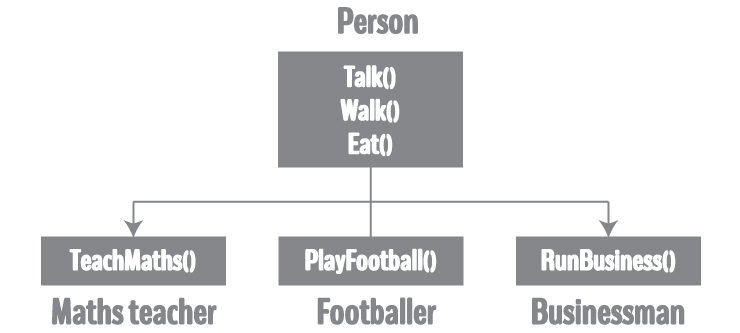

# C++ 继承

> 原文： [https://www.programiz.com/cpp-programming/inheritance](https://www.programiz.com/cpp-programming/inheritance)

#### 在本文中，您将学习有关 C++ 中继承的所有知识。 更具体地说，继承是什么以及通过示例实现继承的不同方法。

继承是 C++ 中面向对象编程的主要功能之一。 它允许用户从现有的类（基类）创建一个新的[类](/cpp-programming/object-class "C++ class")（派生类）。

派生类继承了基类的所有功能，并且可以拥有自己的其他功能。

* * *

## 为什么要使用继承？

假设您在游戏中需要三个角色-**数学老师**，**足球运动员**和**商人**。

由于所有角色都是人，因此他们可以走路和说话。 但是，他们也有一些特殊技能。 数学老师可以**教数学**，足球运动员可以**踢足球**，商人可以**经营企业**。

您可以单独创建三个可以走路，说话和执行其特殊技能的班级，如下图所示。


在每个类中，您将为每个角色复制相同的步行和交谈代码。

如果要添加新功能-eat，则需要为每个字符实现相同的代码。 这很容易导致出错（复制时）和重复代码。

如果我们有一个 **Person** 类，它具有基本的功能，例如说话，走路，吃饭，睡觉，并根据我们的角色向这些功能添加特殊技能，那就容易得多。 这是使用继承完成的。



使用继承，现在您不必为每个类实现相同的代码。 您只需要**继承它们即可。**

因此，对于数学老师（派生类），您可以继承 Person（基类）的所有功能并添加新功能 **TeachMaths** 。 同样，对于足球运动员，您继承了 Person 的所有功能并添加了新功能 **PlayFootball** ，依此类推。

这使您的代码更简洁，易于理解和可扩展。

**重要的是要记住**：在处理继承时，每个派生类都应满足**“不是”** 基类的条件。 在上面的示例中，数学老师**是**人，足球先生**是**人。 您不能拥有：商人**是**企业。

* * *

## C++ 编程中继承的实现

```cpp
class Person 
{
  ... .. ...
};

class MathsTeacher : public Person 
{
  ... .. ...
};

class Footballer : public Person
{
  .... .. ...
};

```

在以上示例中，类别`人员`是基类，类别`MathsTeacher`和`Footballer`是从*人员*派生的。

派生的类与类的声明一起显示，后跟冒号，关键字 `public` 和派生该类的基类的名称。

由于`MathsTeacher`和`Footballer`源自`Person`，因此可以从中访问`人员`的所有数据成员和成员功能。

* * *

## 示例：C++ 编程中的继承

使用继承概念创建游戏角色。

```cpp
#include <iostream>
using namespace std;

class Person
{
     public:
        string profession;
        int age;

        Person(): profession("unemployed"), age(16) { }
        void display()
        {
             cout << "My profession is: " << profession << endl;
             cout << "My age is: " << age << endl;
             walk();
             talk();
        }
        void walk() { cout << "I can walk." << endl; }
        void talk() { cout << "I can talk." << endl; }
};

// MathsTeacher class is derived from base class Person.
class MathsTeacher : public Person
{
    public:
       void teachMaths() { cout << "I can teach Maths." << endl; }
};

// Footballer class is derived from base class Person.
class Footballer : public Person
{
    public:
       void playFootball() { cout << "I can play Football." << endl; }
};

int main()
{
     MathsTeacher teacher;
     teacher.profession = "Teacher";
     teacher.age = 23;
     teacher.display();
     teacher.teachMaths();

     Footballer footballer;
     footballer.profession = "Footballer";
     footballer.age = 19;
     footballer.display();
     footballer.playFootball();

     return 0;
}
```

**输出**

```cpp
My profession is: Teacher
My age is: 23
I can walk.
I can talk.
I can teach Maths.
My profession is: Footballer
My age is: 19
I can walk.
I can talk.
I can play Football.
```

在此程序中，`Person`是基类，而`MathsTeacher`和`Footballer`是从`Person`派生的。

`Person`类具有两个数据成员-`专业`和`age`。 它还具有两个成员函数-`walk()`和`talk()`。

`MathsTeacher`和`Footballer`都可以访问`Person`的所有数据成员和成员功能。

但是，MathsTeacher 和 Footballer 也具有自己的成员函数：分别为`teachMaths()`和`playFootball()`。 这些函数只能由自己的类访问。

在 main（）函数中，创建了一个新的`MathsTeacher`对象`教师`。

由于可以访问`Person`的数据成员，因此设置了`教师`的`专业`和`age`。 使用在`Person`类中定义的`display()`函数显示此数据。 此外，将调用`MathsTeacher`类中定义的`teachMaths()`函数。

同样，还将创建一个新的`Footballer`对象`足球运动员`。 它也可以访问`Person`的数据成员，这可以通过调用`display()`函数来显示。 然后，只有足球运动员才能使用的`playFootball()`函数被调用。

* * *

### 继承中的访问说明符

从基类创建派生类时，可以使用不同的访问说明符来继承基类的数据成员。

这些可以是公共的，受保护的或私有的。

在以上示例中，基类`Person`已由`MathsTeacher`和`Footballer`继承`public` ly。

了解有关 C++ 中的[公共，保护和私有继承的更多信息。](/cpp-programming/public-protected-private-inheritance "Public, Protected and Private inheritance in C++")

* * *

### 继承中的成员函数重写

假设基类和派生类的成员函数具有相同的名称和参数。

如果创建派生类的对象并尝试访问该成员函数，则仅调用派生类中的成员函数。

派生类的成员函数将覆盖基类的成员函数。

了解有关 C++ 中的[函数覆盖的更多信息。](/cpp-programming/function-overriding "C++ function overriding")