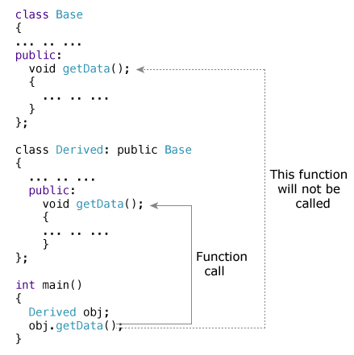
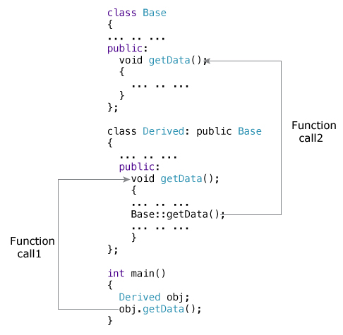

# C++ 函数覆盖

> 原文： [https://www.programiz.com/cpp-programming/function-overriding](https://www.programiz.com/cpp-programming/function-overriding)

#### 在本文中，您将学习函数覆盖。 此外，您还将学习如何在 C++ 编程中评估基类的覆盖功能。

[继承](/cpp-programming/inheritance "C++ Inheritance")允许软件开发人员从现有类派生新类。 派生类继承基类（现有类）的功能。

假设基类和派生类都具有一个具有相同名称和参数（参数的数量和类型）的成员函数。

如果创建派生类的对象并调用在两个类（基类和派生类）中都存在的成员函数，则将调用派生类的成员函数，而忽略基类的函数。

C++ 中的此功能称为函数覆盖。



* * *

### 如何从派生类访问基类中的覆盖函数？

要从派生类访问基类的覆盖函数，请使用范围解析运算符`::`。 例如，

如果要访问基类的`getData()`函数，则可以在派生类中使用以下语句。

```cpp
Base::getData();
```

