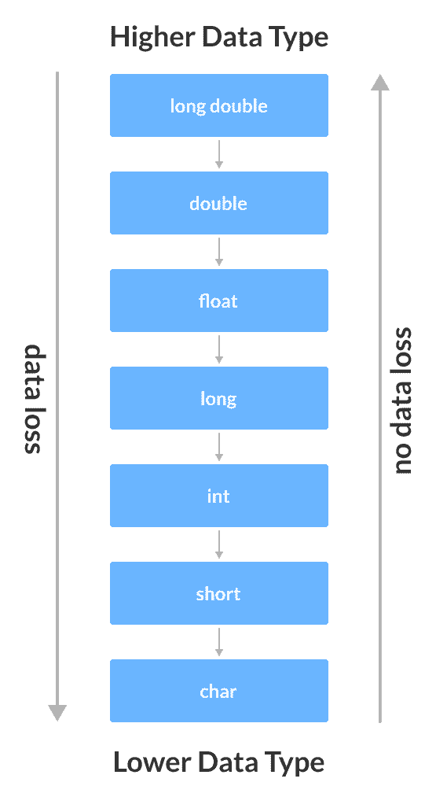

# C++ 类型转换

> 原文： [https://www.programiz.com/cpp-programming/type-conversion](https://www.programiz.com/cpp-programming/type-conversion)

#### 在本教程中，我们将借助示例学习 C++ 类型转换的基础知识。

C++ 允许我们将一种类型的数据转换为另一种类型的数据。 这称为类型转换。

C++ 中有两种类型的类型转换。

1.  隐式转换
2.  显式转换（也称为类型转换）

* * *

## 隐式类型转换

由编译器自动完成的类型转换称为隐式类型转换。 这种类型的转换也称为自动转换。

让我们看一下隐式类型转换的两个例子。

* * *

### 示例 1：从`int`转换为`double`

```cpp
// Working of implicit type-conversion

#include <iostream>
using namespace std;

int main() {
   // assigning an int value to num_int
   int num_int = 9;

   // declaring a double type variable
   double num_double;

   // implicit conversion
   // assigning int value to a double variable
   num_double = num_int;

   cout << "num_int = " << num_int << endl;
   cout << "num_double = " << num_double << endl;

   return 0;
}
```

**输出**

```cpp
num_int = 9
num_double = 9
```

在程序中，我们已将`int`数据分配给`double`变量。

```cpp
num_double = num_int;
```

此处，在将`int`值分配给`num_double`变量之前，编译器会自动将其转换为`double`。 这是隐式类型转换的示例。

* * *

### 示例 2：自动从`double`转换为`int`

```cpp
//Working of Implicit type-conversion

#include <iostream>
using namespace std;

int main() {

   int num_int;
   double num_double = 9.99;

   // implicit conversion
   // assigning a double value to an int variable
   num_int = num_double;

   cout << "num_int = " << num_int << endl;
   cout << "num_double = " << num_double << endl;

   return 0;
}
```

**输出**

```cpp
num_int = 9
num_double = 9.99
```

在程序中，我们已将`double`数据分配给`int`变量。

```cpp
num_double = num_int;
```

此处，在将`double`值分配给`num_int`变量之前，编译器会自动将其转换为`int`。 这也是隐式类型转换的示例。

**注意**：由于`int`不能为小数部分，因此在上面的示例中，小数点后的数字被截断了。

* * *

### 转换期间的数据丢失（缩小转换）

从上面的示例可以看出，从一种数据类型转换为另一种数据类型很容易造成数据丢失。 当较大类型的数据转换为较小类型的数据时，会发生这种情况。



类型转换期间可能的数据丢失


* * *

## C++ 显式转换

当用户手动将数据从一种类型更改为另一种类型时，这称为**显式转换**。 这种类型的转换也称为**类型转换**。

我们可以使用三种主要方法在 C++ 中使用显式转换。 他们是：

1.  C 样式类型转换（也称为**转换符号**）
2.  函数符号（也称为**旧的 C++ 样式类型转换**）
3.  类型转换运算符

* * *

### C 风格转换

顾名思义，这种类型的转换受到 **C 编程语言**的青睐。 也称为**强制转换符号**。

这种样式的语法是：

```cpp
(data_type)expression;
```

例如，

```cpp
// initializing int variable
int num_int = 26;

// declaring double variable
double num_double;

// converting from int to double
num_double = (double)num_int;
```

* * *

### 函数样式转换

我们还可以使用类似符号的功能将数据从一种类型转换为另一种类型。

The syntax for this style is:

```cpp
data_type(expression);
```

For example,

```cpp
// initializing int variable
int num_int = 26;

// declaring double variable
double num_double;

// converting from int to double
num_double = double(num_int);
```

* * *

### 示例 3：类型转换

```cpp
#include <iostream>

using namespace std;

int main() {
    // initializing a double variable
    double num_double = 3.56;
    cout << "num_double = " << num_double << endl;

    // C-style conversion from double to int
    int num_int1 = (int)num_double;
    cout << "num_int1   = " << num_int1 << endl;

    // function-style conversion from double to int
    int num_int2 = int(num_double);
    cout << "num_int2   = " << num_int2 << endl;

    return 0;
}
```

**输出**

```cpp
num_double = 3.56
num_int1   = 3
num_int2   = 3
```

我们将 **C 样式类型转换**和**函数样式转换都用于类型转换**，并显示了结果。 由于它们执行相同的任务，因此两者都给我们相同的输出。

* * *

### 类型转换运算符

除了这两个类型转换外，C++ 还具有四个用于类型转换的运算符。 它们被称为**类型转换运算符**。 他们是：

*   `static_cast`
*   `dynamic_cast`
*   `const_cast`
*   `reinterpret_cast`

我们将在以后的教程中了解这些强制转换。

* * *

**推荐教程**：

*   *C++ 字符串转换为`int`，反之亦然*
*   *C++ 字符串转换为`float`，`double`，反之亦然*