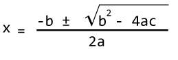

# 用 C++ 程序查找二次方程式的所有根

> 原文： [https://www.programiz.com/cpp-programming/examples/quadratic-roots](https://www.programiz.com/cpp-programming/examples/quadratic-roots)

#### 该程序从用户那里接受二次方程式的系数，并显示根（实数根和复数根都取决于判别式）。

要理解此示例，您应该了解以下 [C++ 编程](/cpp-programming "C++ tutorial")主题：

*   [C++  if，if ... else 和嵌套 if ... else](/cpp-programming/if-else)

* * *

对于二次方程 **ax <sup>2</sup> + bx + c = 0** （其中 a，b 和 c 为系数），其根由以下公式给出。



术语`b<sup>2</sup>-4ac`被称为二次方程的判别式。 判别式说明了根的性质。

*   如果判别式大于 0，则根是真实的且不同。
*   如果判别式等于 0，则根是实数且相等。
*   如果判别式小于 0，则根是复杂且不同的。


* * *

## 示例：二次方程的根

```cpp
#include <iostream>
#include <cmath>
using namespace std;

int main() {

    float a, b, c, x1, x2, discriminant, realPart, imaginaryPart;
    cout << "Enter coefficients a, b and c: ";
    cin >> a >> b >> c;
    discriminant = b*b - 4*a*c;

    if (discriminant > 0) {
        x1 = (-b + sqrt(discriminant)) / (2*a);
        x2 = (-b - sqrt(discriminant)) / (2*a);
        cout << "Roots are real and different." << endl;
        cout << "x1 = " << x1 << endl;
        cout << "x2 = " << x2 << endl;
    }

    else if (discriminant == 0) {
        cout << "Roots are real and same." << endl;
        x1 = (-b + sqrt(discriminant)) / (2*a);
        cout << "x1 = x2 =" << x1 << endl;
    }

    else {
        realPart = -b/(2*a);
        imaginaryPart =sqrt(-discriminant)/(2*a);
        cout << "Roots are complex and different."  << endl;
        cout << "x1 = " << realPart << "+" << imaginaryPart << "i" << endl;
        cout << "x2 = " << realPart << "-" << imaginaryPart << "i" << endl;
    }

    return 0;
}
```

**输出**

```cpp
Enter coefficients a, b and c: 4
5
1
Roots are real and different.
x1 = -0.25
x2 = -1 
```

在此程序中，`sqrt()`库函数用于查找数字的平方根。