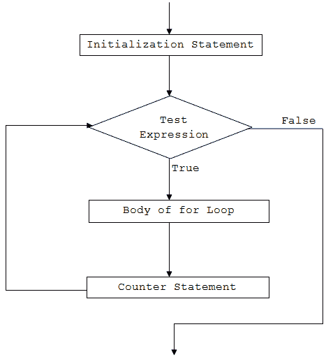

# C# `for`循环

> 原文： [https://www.programiz.com/csharp-programming/for-loop](https://www.programiz.com/csharp-programming/for-loop)

#### 在本文中，我们将学习 C# 中的`for`循环以及在程序中使用它们的不同方法。

在编程中，通常需要执行特定次数的语句块。 一种可能的解决方案是键入所需次数的语句。 但是，重复的次数可能事先未知（在编译时），或者可能不够大（例如 10000）。

此类问题的最佳解决方案是循环。 循环在编程中用于重复执行某个语句块，直到满足某些条件为止。

在本文中，我们将介绍 C# 中的`for`循环。

* * *

## C# `for`循环

关键字`for`**用于在 C# 中创建`for`循环**。`for`循环的语法为：

```cs
for (initialization; condition; iterator)
{
	// body of for loop
}

```

* * *

## `for`循环如何工作？

1.  C# `for`循环具有三个语句：`initialization`，`condition`和`iterator`。
2.  首先执行`initialization`语句，并且仅执行一次。 在这里，变量通常被声明和初始化。
3.  然后，求值`condition`。`condition`是布尔表达式，即它返回`true`或`false`。
4.  如果将`condition`求值为`true`：
    1.  `for`循环内的语句将执行。
    2.  然后，执行`iterator`语句，该语句通常会更改初始化变量的值。
    3.  再次求值`condition`。
    4.  该过程一直持续到`condition`被求值为`false`为止。
5.  如果将`condition`求值为`false`，则`for`循环终止。

* * *

## `for`循环流程图



* * *

### 示例 1：C# `for`循环

```cs
using System;

namespace Loop
{
	class ForLoop
	{
		public static void Main(string[] args)
		{
			for (int i=1; i<=5; i++)
			{
				Console.WriteLine("C# For Loop: Iteration {0}", i);
			}
		}
	}	
} 
```

当我们运行程序时，输出将是：

```cs
C# For Loop: Iteration 1
C# For Loop: Iteration 2
C# For Loop: Iteration 3
C# For Loop: Iteration 4
C# For Loop: Iteration 5
```

在这个程序中

*   `initialization`语句为`int i=1`
*   `condition`语句为`i<=5`
*   `iterator`语句为`i++`

该程序运行时

*   首先，声明变量`i`并将其初始化为 1。
*   然后，求值条件（`i<=5`）。
*   由于条件返回`true`，因此程序将执行`for`循环的主体。 它使用迭代 1 打印给定的行（迭代只是表示重复）。
*   现在，求值迭代器（`i++`）。 这会将`i`的值增加到 2。
*   再次求值条件（`i<=5`），最后将`i`的值加 1。该条件将在前 5 次求值为`true`。
*   当`i`的值为 6 并且条件为`false`时，循环将终止。

### 示例 2：计算前 n 个自然数之和的`for`循环

```cs
using System;

namespace Loop
{
	class ForLoop
	{
		public static void Main(string[] args)
		{
			int n = 5,sum = 0;

			for (int i=1; i<=n; i++)
			{
				// sum = sum + i;
				sum += i;
			}

			Console.WriteLine("Sum of first {0} natural numbers = {1}", n, sum);
		}
	}
} 
```

When we run the program, the output will be:

```cs
Sum of first 5 natural numbers = 15
```

在此，将`sum`和`n`的值分别初始化为 0 和 5。 迭代变量`i`初始化为 1，并在每次迭代时递增。

在`for`循环内，`sum`的值增加`i`即`sum = sum + i`的值。`for`循环继续进行，直到`i`小于或等于`n`（用户输入）。

让我们看看给定程序在每次迭代中会发生什么。

最初，`i = 1`，`sum = 0`，`n = 3`

For loop execution steps

| 迭代 | `i`的值 | `i <= 5` | `sum`的值 |
| --- | --- | --- | --- |
| 1 | 1 | `true` | `0+1 = 1` |
| 2 | 2 | `true` | `1+2 = 3` |
| 3 | 3 | `true` | `3+3 = 6` |
| 4 | 4 | `true` | `6+4 = 10` |
| 5 | 5 | `true` | `10+5 = 15` |
| 6 | 6 | `false` | 循环终止 |

因此，当`n = 5`时，总和的最终值为 15。

* * *

## `for`循环内的多个表达式

我们还可以在`for`循环中使用多个表达式。 这意味着我们在`for`循环中可以有多个初始化和/或迭代器语句。 让我们看下面的例子。

### 示例 3：具有多个初始化和迭代器表达式的`for`循环

```cs
using System;

namespace Loop
{
	class ForLoop
	{
		public static void Main(string[] args)
		{
			for (int i=0, j=0; i+j<=5; i++, j++)
			{
				Console.WriteLine("i = {0} and j = {1}", i,j);
			}         
		}
	}
} 
```

When we run the program, the output will be:

```cs
i = 0 and j = 0
i = 1 and j = 1
i = 2 and j = 2
```

在此程序中，我们已声明并初始化了两个变量：初始化语句中的`i`和`j`。

同样，我们在迭代器部分有两个表达式。 这意味着`i`和`j`在每次迭代中均增加 1。

* * *

## 没有初始化和迭代器语句的`for`循环

初始化，条件和迭代器语句在`for`循环中是可选的。 这意味着我们也可以在没有这些语句的情况下运行`for`循环。

在这种情况下，`for`循环充当[`while`循环](/csharp-programming/do-while-loop "while loop in c#")。 让我们看下面的例子。

### 示例 4：不带初始化和迭代器语句的`for`循环

```cs
using System;

namespace Loop
{
	class ForLoop
	{
		public static void Main(string[] args)
		{
			int i = 1;
			for ( ; i<=5; )
			{
				Console.WriteLine("C# For Loop: Iteration {0}", i);
				i++;
			}
		}
	}
} 
```

When we run the program, the output will be:

```cs
C# For Loop: Iteration 1
C# For Loop: Iteration 2
C# For Loop: Iteration 3
C# For Loop: Iteration 4
C# For Loop: Iteration 5
```

在此示例中，我们没有使用初始化和迭代器语句。

变量`i`在`for`循环上方初始化，并且其值在循环体内递增。 该程序与示例 1 中的程序相同。

同样，条件也是可选语句。 但是，如果我们不使用测试表达式，则`for`循环将不会测试任何条件，并且将永远运行（无限循环）。

* * *

## 无限循环

如果`for`循环中的条件始终为`true`，则`for`循环将永远运行。 这称为无限循环。

### 示例 5：无限循环

```cs
using System;

namespace Loop
{
	class ForLoop
	{
		public static void Main(string[] args)
		{
			for (int i=1 ; i>0; i++)
			{
				Console.WriteLine("C# For Loop: Iteration {0}", i);
			}
		}
	}
} 
```

在此，`i`初始化为 1，条件为`i>0`。 在每次迭代中，我们将`i`的值增加 1，因此条件永远不会是`false`。 这将导致循环无限执行。

我们也可以通过将条件替换为空白来创建无限循环。 例如，

```cs
for ( ; ; )
{
	// body of for loop
}

```

要么

```cs
for (initialization ; ; iterator)
{
	// body of for loop
}

```