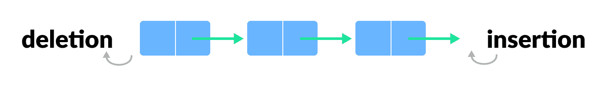
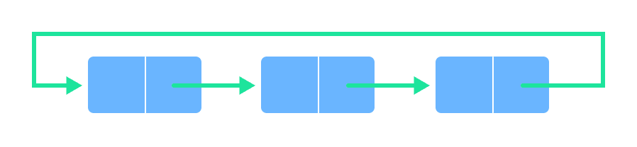
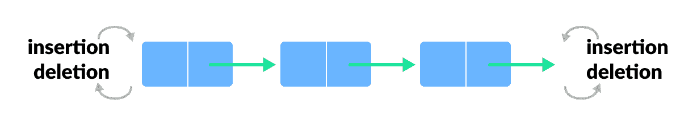

# 队列类型

> 原文： [https://www.programiz.com/dsa/types-of-queue](https://www.programiz.com/dsa/types-of-queue)

#### 在本教程中，您将学习不同类型的队列以及插图。

[队列](https://www.programiz.com/dsa/queue)是编程中有用的数据结构。 它类似于电影院大厅外面的售票队列，在该队列中，第一个进入队列的人是第一个获得票的人。

数据结构中有四种不同类型的队列。 让我们在下面讨论它们。

* * *

## 简单队列

在简单的队列中，插入发生在后面，而取出发生在前面。 它严格遵循 FIFO 规则。

Simple queue

请访问[队列](https://www.programiz.com/dsa/queue)，以了解有关简单队列及其在不同编程语言中的实现的更多信息。

* * *

## 循环队列

在循环队列中，最后一个元素指向进行循环链接的第一个元素。

Circular queue

循环队列比简单队列的主要优点是更好的内存利用率。 如果最后一个位置已满，而第一个位置为空，则可以在第一个位置插入元素。 在简单的队列中无法执行此操作。

请访问[循环队列](https://www.programiz.com/dsa/circular-queue)，以了解有关循环队列的更多信息。

* * *

## 优先队列

优先级队列是一种特殊的队列，其中每个元素都与一个优先级相关联，并根据其优先级进行服务。 如果出现具有相同优先级的元素，则会根据其在队列中的顺序为其提供服务。

Priority queue

插入根据值的到达发生，而删除根据优先级发生。

请访问[优先级队列](https://www.programiz.com/dsa/priority-queue)，以了解有关优先级队列的更多信息。

## 双端队列或双端队列

双端队列是一种队列类型，其中可以从前面或后面执行元素的插入和删除。 因此，它不遵循 FIFO 规则（先进先出）。

Double ended queue

请访问[双端队列](https://www.programiz.com/dsa/deque)，以了解有关双端队列的更多信息。