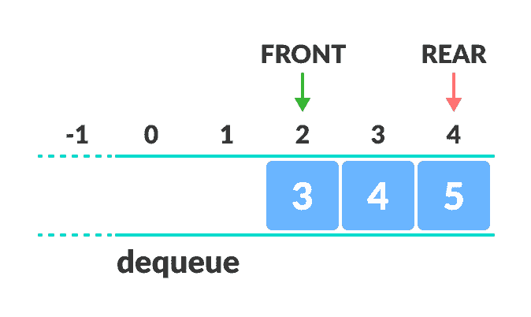
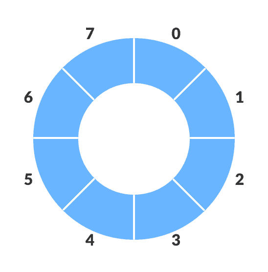
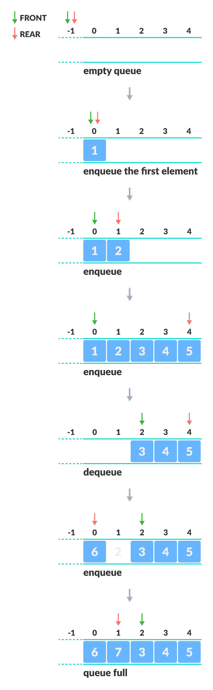

# 循环队列

> 原文： [https://www.programiz.com/dsa/circular-queue](https://www.programiz.com/dsa/circular-queue)

#### 在本教程中，您将学习什么是循环队列。 此外，您还将发现在 C，C++ ，Java 和 Python 中实现循环队列。

循环队列避免了使用数组实现的[常规队列](/data-structures/queue)中的空间浪费。



Demerit of queue


如您在上图中所看到的，在进行一些入队和出队后，队列的大小已减小。

只有当所有元素都已出队后，才能在重置队列后使用索引 0 和 1。

* * *

## 循环队列如何工作

循环队列通过循环递增的过程来工作，即，当我们尝试递增任何变量并到达队列的末尾时，我们通过对队列大小进行模除从队列的开头开始。

即

```
if REAR + 1 == 5 (overflow!), REAR = (REAR + 1)%5 = 0 (start of queue)
```



Circular queue representation


队列操作如下：

*   两个称为`FRONT`和`REAR`的指针用于跟踪队列中的第一个和最后一个元素。
*   初始化队列时，我们将`FRONT`和`REAR`的值设置为 -1。
*   在对元素进行排队时，我们循环增加`REAR`索引的值，并将新元素放置在`REAR`指向的位置。
*   在元素出队时，我们返回`FRONT`指向的值，并循环增加`FRONT`索引。
*   在入队之前，我们检查队列是否已满。
*   在出队之前，我们检查队列是否已经为空。
*   当对第一个元素进行排队时，我们将`FRONT`的值设置为 0。
*   使最后一个元素出队时，我们将`FRONT`和`REAR`的值重置为 -1。

但是，检查完整队列还有另外一种新情况：

*   情况 1：`FRONT = 0 && REAR == SIZE - 1`
*   情况 2：`FRONT = REAR + 1`

第二种情况发生在`REAR`由于循环增量而从 0 开始且其值仅比`FRONT`小 1 时，队列已满。



Working of circular queue


* * *

## Python，Java 和 C/C++ 示例

最常见的队列实现是使用数组，但是也可以使用列表来实现。

[Python](#python-code)[Java](#java-code)[C](#c-code)[C+](#cpp-code)

```
# Circular Queue implementation in Python

class MyCircularQueue(object):

    def __init__(self, k):
        self.maxlen = k
        self.currlen = 0
        self.queue = [None] * k
        self.head = -1
        self.tail = -1

    # Insert an element into the circular queue
    def enQueue(self, value):

        if self.isFull():
            return False

        tail = (self.tail + 1) % self.maxlen
        self.queue[tail] = value
        self.tail = tail
        self.currlen += 1
        if self.currlen == 1:
            self.head = 0

        return True

    # Delete an element from the circular queue
    def deQueue(self):
        if self.isEmpty():
            return False

        self.head = (self.head + 1) % self.maxlen
        self.currlen -= 1
        if self.isEmpty():
            self.head = -1
            self.tail = -1

        return True

    # Get the front item from the queue
    def Front(self):
        if self.isEmpty():
            return -1

        return self.queue[self.head]

    # Get the last item from the queue
    def Rear(self):
        if self.isEmpty():
            return -1

        return self.queue[self.tail]

    # Checks whether the circular queue is empty or not
    def isEmpty(self):
        return self.currlen == 0

    # Checks whether the circular queue is full or not
    def isFull(self):
        return self.currlen == self.maxlen

    # Display the queue
    def Display(self):
        for i in range(self.head, self.tail):
            print(self.queue[i], end=" ")

# Your MyCircularQueue object will be instantiated and called as such:
obj = MyCircularQueue(5)
obj.enQueue(1)
obj.enQueue(2)
obj.enQueue(3)
obj.enQueue(4)
obj.enQueue(5)

print("Initial array")
print(obj.Display())

print("After removing an element")
obj.deQueue()
obj.Display()
```

```
// Circular Queue implementation in Java

public class CQueue {
  int SIZE = 5; // Size of Circular Queue
  int front, rear;
  int items[] = new int[SIZE];

  CQueue() {
    front = -1;
    rear = -1;
  }

  // Check if the queue is full
  boolean isFull() {
    if (front == 0 && rear == SIZE - 1) {
      return true;
    }
    if (front == rear + 1) {
      return true;
    }
    return false;
  }

  // Check if the queue is empty
  boolean isEmpty() {
    if (front == -1)
      return true;
    else
      return false;
  }

  // Adding an element
  void enQueue(int element) {
    if (isFull()) {
      System.out.println("Queue is full");
    } else {
      if (front == -1)
        front = 0;
      rear = (rear + 1) % SIZE;
      items[rear] = element;
      System.out.println("Inserted " + element);
    }
  }

  // Removing an element
  int deQueue() {
    int element;
    if (isEmpty()) {
      System.out.println("Queue is empty");
      return (-1);
    } else {
      element = items[front];
      if (front == rear) {
        front = -1;
        rear = -1;
      } /* Q has only one element, so we reset the queue after deleting it. */
      else {
        front = (front + 1) % SIZE;
      }
      return (element);
    }
  }

  void display() {
    /* Function to display status of Circular Queue */
    int i;
    if (isEmpty()) {
      System.out.println("Empty Queue");
    } else {
      System.out.println("Front -> " + front);
      System.out.println("Items -> ");
      for (i = front; i != rear; i = (i + 1) % SIZE)
        System.out.print(items[i] + " ");
      System.out.println(items[i]);
      System.out.println("Rear -> " + rear);
    }
  }

  public static void main(String[] args) {

    CQueue q = new CQueue();

    // Fails because front = -1
    q.deQueue();

    q.enQueue(1);
    q.enQueue(2);
    q.enQueue(3);
    q.enQueue(4);
    q.enQueue(5);

    // Fails to enqueue because front == 0 && rear == SIZE - 1
    q.enQueue(6);

    q.display();

    int elem = q.deQueue();

    if (elem != -1) {
      System.out.println("Deleted Element is " + elem);
    }
    q.display();

    q.enQueue(7);

    q.display();

    // Fails to enqueue because front == rear + 1
    q.enQueue(8);
  }

}
```

```
// Circular Queue implementation in C

#include <stdio.h>

#define SIZE 5

int items[SIZE];
int front = -1, rear = -1;

// Check if the queue is full
int isFull() {
  if ((front == rear + 1) || (front == 0 && rear == SIZE - 1)) return 1;
  return 0;
}

// Check if the queue is empty
int isEmpty() {
  if (front == -1) return 1;
  return 0;
}

// Adding an element
void enQueue(int element) {
  if (isFull())
    printf("\n Queue is full!! \n");
  else {
    if (front == -1) front = 0;
    rear = (rear + 1) % SIZE;
    items[rear] = element;
    printf("\n Inserted -> %d", element);
  }
}

// Removing an element
int deQueue() {
  int element;
  if (isEmpty()) {
    printf("\n Queue is empty !! \n");
    return (-1);
  } else {
    element = items[front];
    if (front == rear) {
      front = -1;
      rear = -1;
    } 
    // Q has only one element, so we reset the 
    // queue after dequeing it. ?
    else {
      front = (front + 1) % SIZE;
    }
    printf("\n Deleted element -> %d \n", element);
    return (element);
  }
}

// Display the queue
void display() {
  int i;
  if (isEmpty())
    printf(" \n Empty Queue\n");
  else {
    printf("\n Front -> %d ", front);
    printf("\n Items -> ");
    for (i = front; i != rear; i = (i + 1) % SIZE) {
      printf("%d ", items[i]);
    }
    printf("%d ", items[i]);
    printf("\n Rear -> %d \n", rear);
  }
}

int main() {
  // Fails because front = -1
  deQueue();

  enQueue(1);
  enQueue(2);
  enQueue(3);
  enQueue(4);
  enQueue(5);

  // Fails to enqueue because front == 0 && rear == SIZE - 1
  enQueue(6);

  display();
  deQueue();

  display();

  enQueue(7);
  display();

  // Fails to enqueue because front == rear + 1
  enQueue(8);

  return 0;
}
```

```
// Circular Queue implementation in C++

#include <iostream>
#define SIZE 5 /* Size of Circular Queue */

using namespace std;

class Queue {
   private:
  int items[SIZE], front, rear;

   public:
  Queue() {
    front = -1;
    rear = -1;
  }
  // Check if the queue is full
  bool isFull() {
    if (front == 0 && rear == SIZE - 1) {
      return true;
    }
    if (front == rear + 1) {
      return true;
    }
    return false;
  }
  // Check if the queue is empty
  bool isEmpty() {
    if (front == -1)
      return true;
    else
      return false;
  }
  // Adding an element
  void enQueue(int element) {
    if (isFull()) {
      cout << "Queue is full";
    } else {
      if (front == -1) front = 0;
      rear = (rear + 1) % SIZE;
      items[rear] = element;
      cout << endl
         << "Inserted " << element << endl;
    }
  }
  // Removing an element
  int deQueue() {
    int element;
    if (isEmpty()) {
      cout << "Queue is empty" << endl;
      return (-1);
    } else {
      element = items[front];
      if (front == rear) {
        front = -1;
        rear = -1;
      }
      // Q has only one element,
      // so we reset the queue after deleting it.
      else {
        front = (front + 1) % SIZE;
      }
      return (element);
    }
  }

  void display() {
    // Function to display status of Circular Queue
    int i;
    if (isEmpty()) {
      cout << endl
         << "Empty Queue" << endl;
    } else {
      cout << "Front -> " << front;
      cout << endl
         << "Items -> ";
      for (i = front; i != rear; i = (i + 1) % SIZE)
        cout << items[i];
      cout << items[i];
      cout << endl
         << "Rear -> " << rear;
    }
  }
};

int main() {
  Queue q;

  // Fails because front = -1
  q.deQueue();

  q.enQueue(1);
  q.enQueue(2);
  q.enQueue(3);
  q.enQueue(4);
  q.enQueue(5);

  // Fails to enqueue because front == 0 && rear == SIZE - 1
  q.enQueue(6);

  q.display();

  int elem = q.deQueue();

  if (elem != -1)
    cout << endl
       << "Deleted Element is " << elem;

  q.display();

  q.enQueue(7);

  q.display();

  // Fails to enqueue because front == rear + 1
  q.enQueue(8);

  return 0;
}
```

* * *

## 循环队列复杂度

对于（数组实现），循环队列的入队和出队操作的复杂度为`O(1)`。

* * *

## 循环队列应用

*   CPU 调度
*   内存管理
*   交通管理