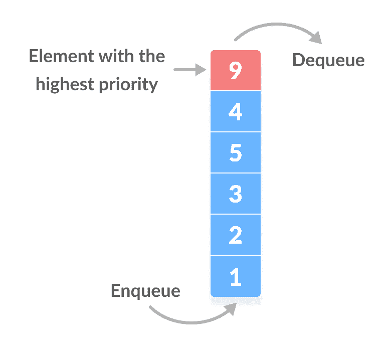
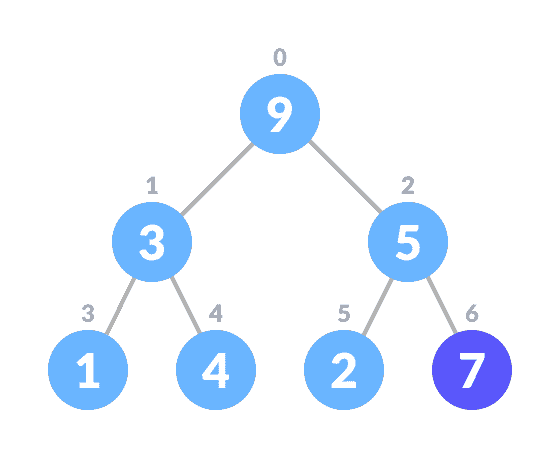
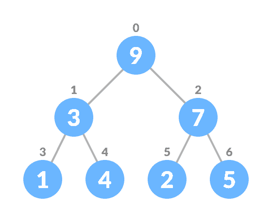
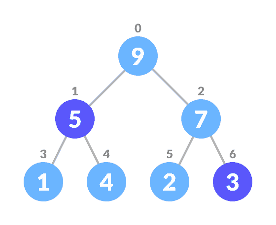
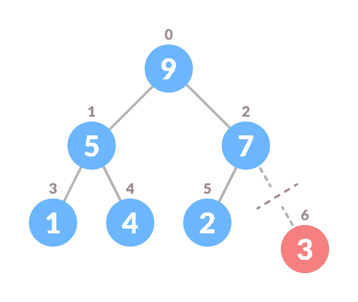
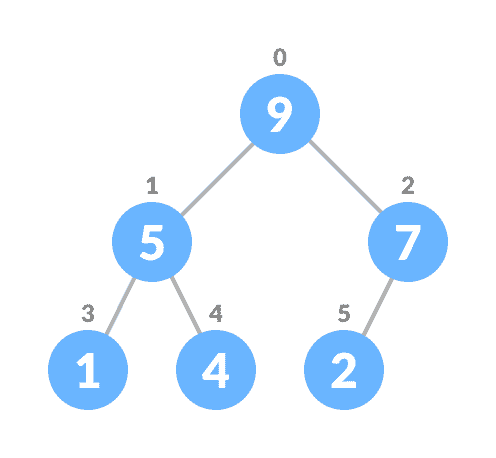

# 优先队列

> 原文： [https://www.programiz.com/dsa/priority-queue](https://www.programiz.com/dsa/priority-queue)

#### 在本教程中，您将学习什么是优先级队列。 另外，您还将找到 C，C++ ，Java 和 Python 中优先级队列操作的工作示例。

优先级队列是一种特殊的队列，其中每个元素都与一个优先级相关联，并根据其优先级进行服务。 如果出现具有相同优先级的元素，则会根据其在队列中的顺序为其提供服务。

通常，元素本身的值被认为用于分配优先级。

例如：具有最高值的元素被视为最高优先级元素。 但是，在其他情况下，我们可以将具有最低值的元素视为最高优先级元素。 在其他情况下，我们可以根据需要设置优先级。



The highest priority element dequeued first


* * *

### 优先级队列与队列有何不同？

在队列中，实施**先进先出规则**，而在优先级队列中，基于优先级删除值**。 优先级最高的元素将首先被删除。**

* * *

## 优先队列的实施

可以使用数组，链接列表，堆数据结构或二进制搜索树来实现优先级队列。 在这些数据结构中，堆数据结构提供了优先级队列的有效实现。

下面给出优先级队列的不同实现的比较分析。

|   | 窥视 | 插 | 删除 |
| 链表 | `O(1)` | `O(n)` | `O(1)` |
| 二进制堆 | `O(1)` | `O(log n)` | `O(log n)` |
| 二进制搜索树 | `O(1)` | `O(log n)` | `O(log n)` |

* * *

## 优先队列操作

优先级队列的基本操作是插入，删除和查看元素。

在研究优先级队列之前，请参考[堆数据结构](/dsa/heap-data-structure)，以更好地了解二进制堆，因为该二进制堆用于实现本文中的优先级队列。

* * *

### 从优先级队列插入元素

通过以下步骤将元素插入优先级队列（最大堆）。

1.  在树的末尾插入新元素。

    

    在队列的末尾插入元素

    

2.  堆肥树。

    

    插入后堆

    

将元素插入优先级队列的算法（最大堆）

```
If there is no node, 
  create a newNode.
else (a node is already present)
  insert the newNode at the end (last node from left to right.)

heapify the array
```

对于最小堆，对上述算法进行了修改，以使`parentNode`始终小于`newNode`。

* * *

### 从优先级队列中删除元素

从优先级队列（最大堆）中删除元素的操作如下：

1.  选择要删除的元素。

    

    选择要删除的元素

    

2.  将其与最后一个元素交换。

    

    与最后一个叶节点元素

    

    交换
3.  删除最后一个元素。

    

    删除最后一个元素/叶子

    

4.  堆肥树。

    

    堆处理队列

    

删除优先级队列中元素的算法（最大堆）

```
If nodeToBeDeleted is the leafNode
  remove the node
Else swap nodeToBeDeleted with the lastLeafNode
  remove noteToBeDeleted

heapify the array
```

对于最小堆，对上述算法进行了修改，以使`childNodes`均小于`currentNode`。

* * *

### 从优先队列中偷看（查找最大值/最小值）

窥视操作从最大堆中返回最大元素，或者从最小堆中返回最小元素，而不删除节点。

对于最大堆和最小堆

```
return rootNode
```

* * *

### 从优先级队列中提取最大/最小

从最大堆中删除节点后，Extract-Max 返回具有最大值的节点，而从最小堆中删除节点后，Extract-Min 返回具有最小值的节点。

* * *

## Python，Java，C/C++ 示例

[Python](#python-code)[Java](#java-code)[C](#c-code)[C+](#cpp-code)

```
# Max-Heap data structure in Python

# Function to heapify the tree
def heapify(arr, n, i):
    # Find the largest among root, left child and right child
    largest = i
    l = 2 * i + 1
    r = 2 * i + 2

    if l < n and arr[i] < arr[l]:
        largest = l

    if r < n and arr[largest] < arr[r]:
        largest = r

    # Swap and continue heapifying if root is not largest
    if largest != i:
        arr[i], arr[largest] = arr[largest], arr[i]
        heapify(arr, n, largest)

# Function to insert an element into the tree
def insert(array, newNum):
    size = len(array)
    if size == 0:
        array.append(newNum)
    else:
        array.append(newNum)
        for i in range((size // 2) - 1, -1, -1):
            heapify(array, size, i)

# Function to delete an element from the tree
def deleteNode(array, num):
    size = len(array)
    i = 0
    for i in range(0, size):
        if num == array[i]:
            break

    array[i], array[size - 1] = array[size - 1], array[i]

    array.remove(size - 1)

    for i in range((len(array) // 2) - 1, -1, -1):
        heapify(array, len(array), i)

arr = []

insert(arr, 3)
insert(arr, 4)
insert(arr, 9)
insert(arr, 5)
insert(arr, 2)

print ("Max-Heap array: " + str(arr))

deleteNode(arr, 4)
print("After deleting an element: " + str(arr))
```

```
// Max-Heap data structure in Java

import java.util.ArrayList;

class Heap {
  // Function to heapify the tree
  void heapify(ArrayList<Integer> hT, int i) {
    int size = hT.size();
    // Find the largest among root, left child and right child
    int largest = i;
    int l = 2 * i + 1;
    int r = 2 * i + 2;
    if (l < size && hT.get(l) > hT.get(largest))
      largest = l;
    if (r < size && hT.get(r) > hT.get(largest))
      largest = r;

    // Swap and continue heapifying if root is not largest
    if (largest != i) {
      int temp = hT.get(largest);
      hT.set(largest, hT.get(i));
      hT.set(i, temp);

      heapify(hT, largest);
    }
  }

  // Function to insert an element into the tree
  void insert(ArrayList<Integer> hT, int newNum) {
    int size = hT.size();
    if (size == 0) {
      hT.add(newNum);
    } else {
      hT.add(newNum);
      for (int i = size / 2 - 1; i >= 0; i--) {
        heapify(hT, i);
      }
    }
  }

  // Function to delete an element from the tree
  void deleteNode(ArrayList<Integer> hT, int num) {
    int size = hT.size();
    int i;
    for (i = 0; i < size; i++) {
      if (num == hT.get(i))
        break;
    }

    int temp = hT.get(i);
    hT.set(i, hT.get(size - 1));
    hT.set(size - 1, temp);

    hT.remove(size - 1);
    for (int j = size / 2 - 1; j >= 0; j--) {
      heapify(hT, j);
    }
  }

  // Print the tree
  void printArray(ArrayList<Integer> array, int size) {
    for (Integer i : array) {
      System.out.print(i + " ");
    }
    System.out.println();
  }

  // Driver code
  public static void main(String args[]) {

    ArrayList<Integer> array = new ArrayList<Integer>();
    int size = array.size();

    Heap h = new Heap();
    h.insert(array, 3);
    h.insert(array, 4);
    h.insert(array, 9);
    h.insert(array, 5);
    h.insert(array, 2);

    System.out.println("Max-Heap array: ");
    h.printArray(array, size);

    h.deleteNode(array, 4);
    System.out.println("After deleting an element: ");
    h.printArray(array, size);
  }
}
```

```
// Max-Heap data structure in C

#include <stdio.h>
int size = 0;
void swap(int *a, int *b) {
  int temp = *b;
  *b = *a;
  *a = temp;
}

// Function to heapify the tree
void heapify(int array[], int size, int i) {
  if (size == 1) {
    printf("Single element in the heap");
  } else {
    // Find the largest among root, left child and right child
    int largest = i;
    int l = 2 * i + 1;
    int r = 2 * i + 2;
    if (l < size && array[l] > array[largest])
      largest = l;
    if (r < size && array[r] > array[largest])
      largest = r;

    // Swap and continue heapifying if root is not largest
    if (largest != i) {
      swap(&array[i], &array[largest]);
      heapify(array, size, largest);
    }
  }
}

// Function to insert an element into the tree
void insert(int array[], int newNum) {
  if (size == 0) {
    array[0] = newNum;
    size += 1;
  } else {
    array[size] = newNum;
    size += 1;
    for (int i = size / 2 - 1; i >= 0; i--) {
      heapify(array, size, i);
    }
  }
}

// Function to delete an element from the tree
void deleteRoot(int array[], int num) {
  int i;
  for (i = 0; i < size; i++) {
    if (num == array[i])
      break;
  }

  swap(&array[i], &array[size - 1]);
  size -= 1;
  for (int i = size / 2 - 1; i >= 0; i--) {
    heapify(array, size, i);
  }
}

// Print the array
void printArray(int array[], int size) {
  for (int i = 0; i < size; ++i)
    printf("%d ", array[i]);
  printf("\n");
}

// Driver code
int main() {
  int array[10];

  insert(array, 3);
  insert(array, 4);
  insert(array, 9);
  insert(array, 5);
  insert(array, 2);

  printf("Max-Heap array: ");
  printArray(array, size);

  deleteRoot(array, 4);

  printf("After deleting an element: ");

  printArray(array, size);
}
```

```
// Max-Heap data structure in C++

#include <iostream>
#include <vector>
using namespace std;

// Function to swap position of two elements
void swap(int *a, int *b) {
  int temp = *b;
  *b = *a;
  *a = temp;
}

// Function to heapify the tree
void heapify(vector<int> &hT, int i) {
  int size = hT.size();

  // Find the largest among root, left child and right child
  int largest = i;
  int l = 2 * i + 1;
  int r = 2 * i + 2;
  if (l < size && hT[l] > hT[largest])
    largest = l;
  if (r < size && hT[r] > hT[largest])
    largest = r;

  // Swap and continue heapifying if root is not largest
  if (largest != i) {
    swap(&hT[i], &hT[largest]);
    heapify(hT, largest);
  }
}

// Function to insert an element into the tree
void insert(vector<int> &hT, int newNum) {
  int size = hT.size();
  if (size == 0) {
    hT.push_back(newNum);
  } else {
    hT.push_back(newNum);
    for (int i = size / 2 - 1; i >= 0; i--) {
      heapify(hT, i);
    }
  }
}

// Function to delete an element from the tree
void deleteNode(vector<int> &hT, int num) {
  int size = hT.size();
  int i;
  for (i = 0; i < size; i++) {
    if (num == hT[i])
      break;
  }
  swap(&hT[i], &hT[size - 1]);

  hT.pop_back();
  for (int i = size / 2 - 1; i >= 0; i--) {
    heapify(hT, i);
  }
}

// Print the tree
void printArray(vector<int> &hT) {
  for (int i = 0; i < hT.size(); ++i)
    cout << hT[i] << " ";
  cout << "\n";
}

// Driver code
int main() {
  vector<int> heapTree;

  insert(heapTree, 3);
  insert(heapTree, 4);
  insert(heapTree, 9);
  insert(heapTree, 5);
  insert(heapTree, 2);

  cout << "Max-Heap array: ";
  printArray(heapTree);

  deleteNode(heapTree, 4);

  cout << "After deleting an element: ";

  printArray(heapTree);
}
```

* * *

## 优先队列申请

优先级队列的一些应用程序是：

*   Dijkstra 算法
*   用于实现栈
*   用于操作系统中的负载平衡和中断处理
*   用于霍夫曼代码中的数据压缩