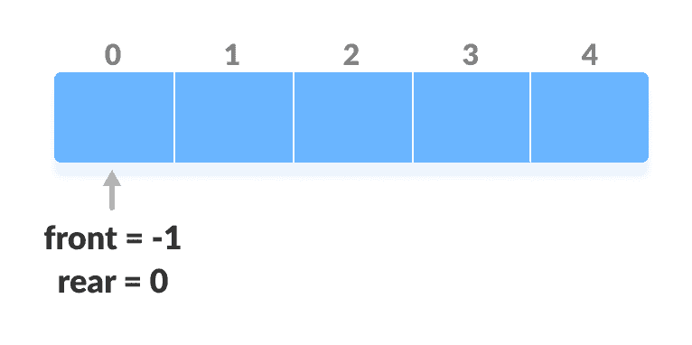
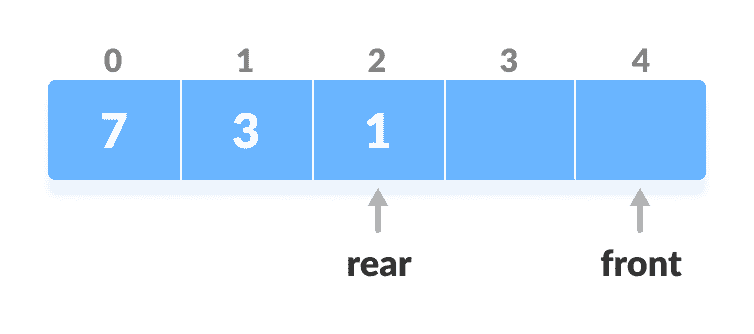
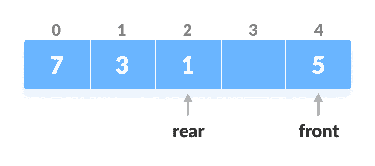
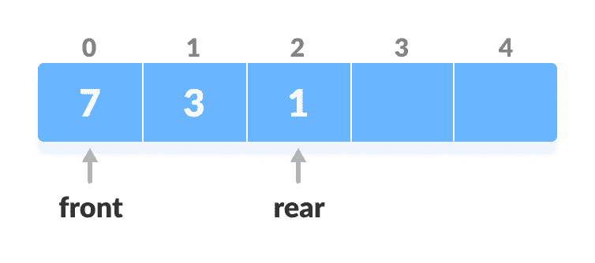
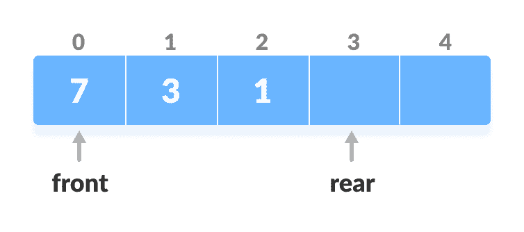
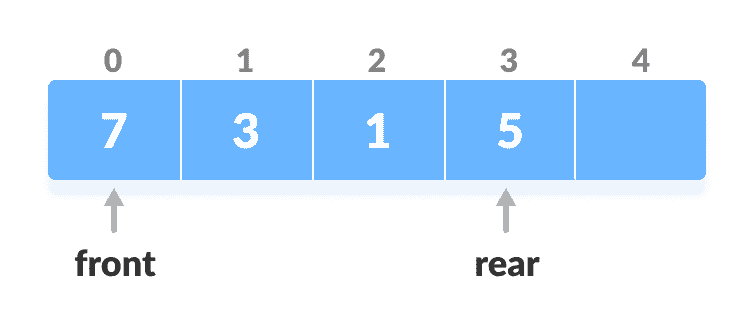
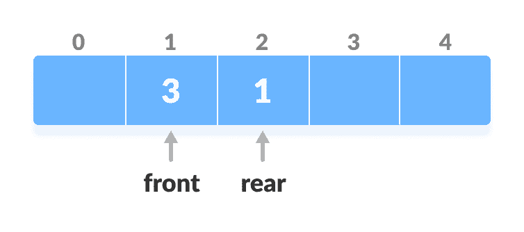
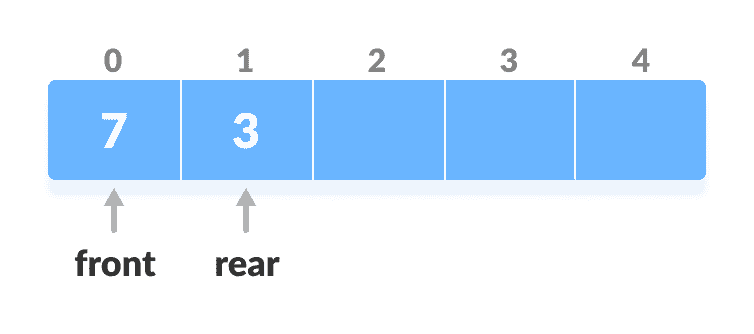

# 和

> 原文： [https://www.programiz.com/dsa/deque](https://www.programiz.com/dsa/deque)

#### 在本教程中，您将学习什么是双端队列（双端队列）。 另外，您还将找到在 C，C++ ，Java 和 Python 的双端队列上进行不同操作的工作示例。

双端队列或双端队列是[队列](https://www.programiz.com/dsa/queue)的一种，其中元素的插入和删除可以从前面或后面进行。 因此，它不遵循 FIFO 规则（先进先出）。


Deque or Double Ended Queue


* * *

## 双端队列的类型

1.  输入限制双端队列
    在此双端队列中，输入在一端限制，但允许在两端删除。
2.  输出限制双端队列
    在此双端队列中，输出限制在一个端部，但允许在两端插入。

* * *

## 计票操作

下面是[圆形双端数组](https://www.programiz.com/dsa/circular-queue)实现的双端队列。 在圆形数组中，如果数组已满，我们将从头开始。

但是在线性数组实现中，如果数组已满，则无法插入更多元素。 在下面的每个操作中，如果阵列已满，则会引发“溢出消息”。

在执行以下操作之前，请执行以下步骤。

1.  取大小为`n`的数组。
2.  在第一个位置设置两个指针，然后设置`front = -1`和`rear = 0`。



Initialize an array and pointers


### 在前面插入

此操作在前面添加了一个元素。

1.  检查前面的位置。

    

    检查正面

    

2.  如果为`front < 1`，请重新初始化`front = n-1`（最后一个索引）。

    

    前端发送

    

3.  否则，将`前`减小 1。
4.  将新密钥`5`添加到`array[front]`中。

    

    插入密钥

    

### 插入后方

此操作在后部增加了一个元素。

1.  检查阵列是否已满。

    

    检查完整的

    

2.  如果阵列已满，请重新初始化`rear = 0`。
3.  否则，将`后`增加 1。

    

    增加后

    

4.  将新密钥`5`添加到`array[rear]`中。

    

    插入密钥

    

### 从前面删除

该操作从前面删除一个元素。

1.  检查数组是否为空。

    

    检查为空

    

2.  如果数组为空（即`front = -1`），则无法执行删除操作（**下溢条件**）。
3.  如果双端队列只有一个元素（即`front = rear`），请设置`front = -1`和`rear = -1`。
4.  否则，如果`前`位于末尾（即`front = n - 1`），则设置转到前`front = 0`。
5.  否则，`front = front + 1`。

    

    增加前线

    

### 从后方删除

此操作从背面删除一个元素。

1.  检查数组是否为空。

    

    检查为空

    

2.  如果数组为空（即`front = -1`），则无法执行删除操作（**下溢条件**）。
3.  如果双端队列只有一个元素（即`front = rear`），请设置`front = -1`和`rear = -1`，否则请按照以下步骤操作。
4.  如果`后`在前面（即`rear = 0`），则设置转到前`rear = n - 1`。
5.  否则，`rear = rear - 1`。

    

    降低后排

    

### 检查空

此操作检查数组是否为空。 如果为`front = -1`，则双端队列为空。

### 检查满

此操作检查双端队列是否已满。 如果`front = 0`和`rear = n - 1`，则双端队列已满。

* * *

## Python，Java 和 C/C++ 示例

[Python](#python-code)[Java](#java-code)[C](#c-code)[C+](#cpp-code)

```
# Deque operations in python

class Deque:
    def __init__(self):
        self.items = []

    def isEmpty(self):
        return self.items == []

    def addFront(self, item):
        self.items.append(item)

    def addRear(self, item):
        self.items.insert(0, item)

    def removeFront(self):
        return self.items.pop()

    def removeRear(self):
        return self.items.pop(0)

    def size(self):
        return len(self.items)

d = Deque()
print(d.isEmpty())
d.addRear(8)
d.addRear(5)
d.addFront(7)
d.addFront(10)
print(d.size())
print(d.isEmpty())
d.addRear(11)
print(d.removeRear())
print(d.removeFront())
d.addFront(55)
d.addRear(45)
print(d.items)
```

```
// Deque operations in Java

class Deque {
  static final int MAX = 100;
  int arr[];
  int front;
  int rear;
  int size;

  public Deque(int size) {
    arr = new int[MAX];
    front = -1;
    rear = 0;
    this.size = size;
  }

  boolean isFull() {
    return ((front == 0 && rear == size - 1) || front == rear + 1);
  }

  boolean isEmpty() {
    return (front == -1);
  }

  void insertfront(int key) {
    if (isFull()) {
      System.out.println("Overflow");
      return;
    }

    if (front == -1) {
      front = 0;
      rear = 0;
    }

    else if (front == 0)
      front = size - 1;

    else
      front = front - 1;

    arr[front] = key;
  }

  void insertrear(int key) {
    if (isFull()) {
      System.out.println(" Overflow ");
      return;
    }

    if (front == -1) {
      front = 0;
      rear = 0;
    }

    else if (rear == size - 1)
      rear = 0;

    else
      rear = rear + 1;

    arr[rear] = key;
  }

  void deletefront() {
    if (isEmpty()) {
      System.out.println("Queue Underflow\n");
      return;
    }

    // Deque has only one element
    if (front == rear) {
      front = -1;
      rear = -1;
    } else if (front == size - 1)
      front = 0;

    else
      front = front + 1;
  }

  void deleterear() {
    if (isEmpty()) {
      System.out.println(" Underflow");
      return;
    }

    if (front == rear) {
      front = -1;
      rear = -1;
    } else if (rear == 0)
      rear = size - 1;
    else
      rear = rear - 1;
  }

  int getFront() {
    if (isEmpty()) {
      System.out.println(" Underflow");
      return -1;
    }
    return arr[front];
  }

  int getRear() {
    if (isEmpty() || rear < 0) {
      System.out.println(" Underflow\n");
      return -1;
    }
    return arr[rear];
  }

  public static void main(String[] args) {

    Deque dq = new Deque(4);

    System.out.println("Insert element at rear end : 12 ");
    dq.insertrear(12);

    System.out.println("insert element at rear end : 14 ");
    dq.insertrear(14);

    System.out.println("get rear element : " + dq.getRear());

    dq.deleterear();
    System.out.println("After delete rear element new rear become : " + dq.getRear());

    System.out.println("inserting element at front end");
    dq.insertfront(13);

    System.out.println("get front element: " + dq.getFront());

    dq.deletefront();

    System.out.println("After delete front element new front become : " + +dq.getFront());

  }
}
```

```
// Deque operations in C

#include <stdio.h>

#define MAX 10

void addFront(int *, int, int *, int *);
void addRear(int *, int, int *, int *);
int delFront(int *, int *, int *);
int delRear(int *, int *, int *);
void display(int *);
int count(int *);

int main()
{
  int arr[MAX];
  int front, rear, i, n;

  front = rear = -1;
  for (i = 0; i < MAX; i++)
    arr[i] = 0;

  addRear(arr, 5, &front, &rear);
  addFront(arr, 12, &front, &rear);
  addRear(arr, 11, &front, &rear);
  addFront(arr, 5, &front, &rear);
  addRear(arr, 6, &front, &rear);
  addFront(arr, 8, &front, &rear);

  printf("\nElements in a deque: ");
  display(arr);

  i = delFront(arr, &front, &rear);
  printf("\nremoved item: %d", i);

  printf("\nElements in a deque after deletion: ");
  display(arr);

  addRear(arr, 16, &front, &rear);
  addRear(arr, 7, &front, &rear);

  printf("\nElements in a deque after addition: ");
  display(arr);

  i = delRear(arr, &front, &rear);
  printf("\nremoved item: %d", i);

  printf("\nElements in a deque after deletion: ");
  display(arr);

  n = count(arr);
  printf("\nTotal number of elements in deque: %d", n);
}

void addFront(int *arr, int item, int *pfront, int *prear)
{
  int i, k, c;

  if (*pfront == 0 && *prear == MAX - 1)
  {
    printf("\nDeque is full.\n");
    return;
  }

  if (*pfront == -1)
  {
    *pfront = *prear = 0;
    arr[*pfront] = item;
    return;
  }

  if (*prear != MAX - 1)
  {
    c = count(arr);
    k = *prear + 1;
    for (i = 1; i <= c; i++)
    {
      arr[k] = arr[k - 1];
      k--;
    }
    arr[k] = item;
    *pfront = k;
    (*prear)++;
  }
  else
  {
    (*pfront)--;
    arr[*pfront] = item;
  }
}

void addRear(int *arr, int item, int *pfront, int *prear)
{
  int i, k;

  if (*pfront == 0 && *prear == MAX - 1)
  {
    printf("\nDeque is full.\n");
    return;
  }

  if (*pfront == -1)
  {
    *prear = *pfront = 0;
    arr[*prear] = item;
    return;
  }

  if (*prear == MAX - 1)
  {
    k = *pfront - 1;
    for (i = *pfront - 1; i < *prear; i++)
    {
      k = i;
      if (k == MAX - 1)
        arr[k] = 0;
      else
        arr[k] = arr[i + 1];
    }
    (*prear)--;
    (*pfront)--;
  }
  (*prear)++;
  arr[*prear] = item;
}

int delFront(int *arr, int *pfront, int *prear)
{
  int item;

  if (*pfront == -1)
  {
    printf("\nDeque is empty.\n");
    return 0;
  }

  item = arr[*pfront];
  arr[*pfront] = 0;

  if (*pfront == *prear)
    *pfront = *prear = -1;
  else
    (*pfront)++;

  return item;
}

int delRear(int *arr, int *pfront, int *prear)
{
  int item;

  if (*pfront == -1)
  {
    printf("\nDeque is empty.\n");
    return 0;
  }

  item = arr[*prear];
  arr[*prear] = 0;
  (*prear)--;
  if (*prear == -1)
    *pfront = -1;
  return item;
}

void display(int *arr)
{
  int i;

  printf("\n front:  ");
  for (i = 0; i < MAX; i++)
    printf("  %d", arr[i]);
  printf("  :rear");
}

int count(int *arr)
{
  int c = 0, i;

  for (i = 0; i < MAX; i++)
  {
    if (arr[i] != 0)
      c++;
  }
  return c;
}
```

```
// Deque operations in C++

#include <iostream>
using namespace std;

#define MAX 10

class Deque
{
  int arr[MAX];
  int front;
  int rear;
  int size;

public:
  Deque(int size)
  {
    front = -1;
    rear = 0;
    this->size = size;
  }

  void insertfront(int key);
  void insertrear(int key);
  void deletefront();
  void deleterear();
  bool isFull();
  bool isEmpty();
  int getFront();
  int getRear();
};

bool Deque::isFull()
{
  return ((front == 0 && rear == size - 1) ||
      front == rear + 1);
}

bool Deque::isEmpty()
{
  return (front == -1);
}

void Deque::insertfront(int key)
{
  if (isFull())
  {
    cout << "Overflow\n"
       << endl;
    return;
  }

  if (front == -1)
  {
    front = 0;
    rear = 0;
  }

  else if (front == 0)
    front = size - 1;

  else
    front = front - 1;

  arr[front] = key;
}

void Deque ::insertrear(int key)
{
  if (isFull())
  {
    cout << " Overflow\n " << endl;
    return;
  }

  if (front == -1)
  {
    front = 0;
    rear = 0;
  }

  else if (rear == size - 1)
    rear = 0;

  else
    rear = rear + 1;

  arr[rear] = key;
}

void Deque ::deletefront()
{
  if (isEmpty())
  {
    cout << "Queue Underflow\n"
       << endl;
    return;
  }

  if (front == rear)
  {
    front = -1;
    rear = -1;
  }
  else if (front == size - 1)
    front = 0;

  else
    front = front + 1;
}

void Deque::deleterear()
{
  if (isEmpty())
  {
    cout << " Underflow\n"
       << endl;
    return;
  }

  if (front == rear)
  {
    front = -1;
    rear = -1;
  }
  else if (rear == 0)
    rear = size - 1;
  else
    rear = rear - 1;
}

int Deque::getFront()
{
  if (isEmpty())
  {
    cout << " Underflow\n"
       << endl;
    return -1;
  }
  return arr[front];
}

int Deque::getRear()
{
  if (isEmpty() || rear < 0)
  {
    cout << " Underflow\n"
       << endl;
    return -1;
  }
  return arr[rear];
}

int main()
{
  Deque dq(4);

  cout << "insert element at rear end \n";
  dq.insertrear(5);
  dq.insertrear(11);

  cout << "rear element: "
     << dq.getRear() << endl;

  dq.deleterear();
  cout << "after deletion of the rear element, the new rear element: " << dq.getRear() << endl;

  cout << "insert element at front end \n";

  dq.insertfront(8);

  cout << "front element: " << dq.getFront() << endl;

  dq.deletefront();

  cout << "after deletion of front element new front element: " << dq.getFront() << endl;
}
```

* * *

## 和复杂性

所有上述操作的时间复杂度是恒定的，即`O(1)`。

* * *

## 和应用

1.  在对软件的撤消操作中。
2.  在浏览器中存储历史记录。
3.  为了实现[栈](https://www.programiz.com/dsa/stack)和[队列](https://www.programiz.com/dsa/queue)。