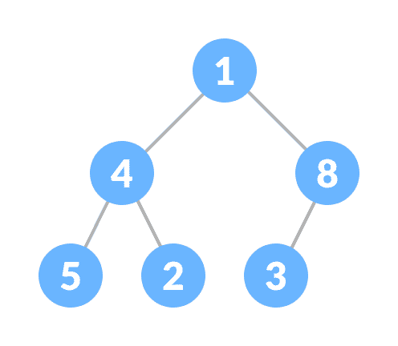
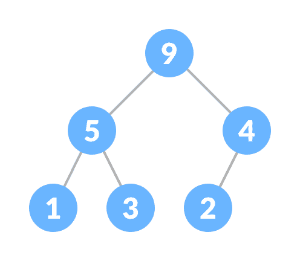
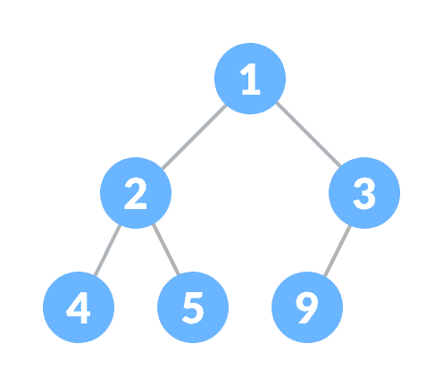
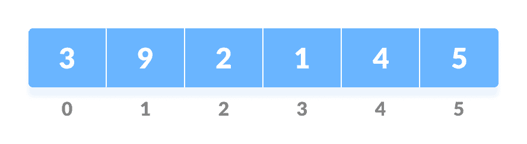
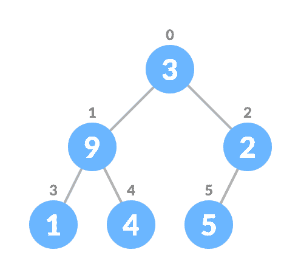
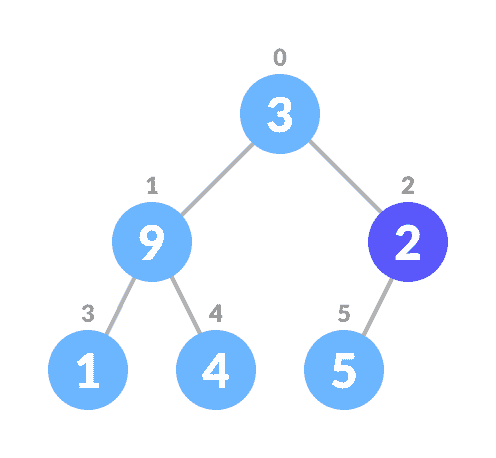
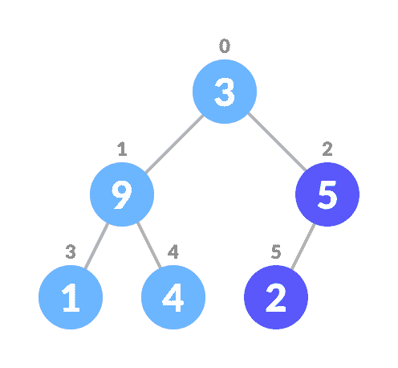
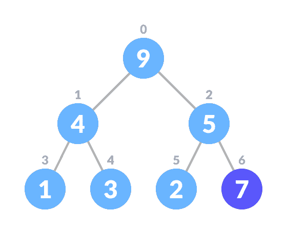
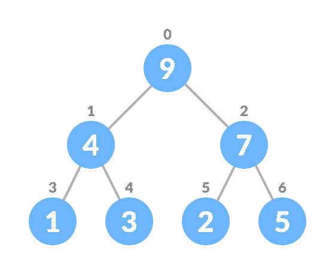
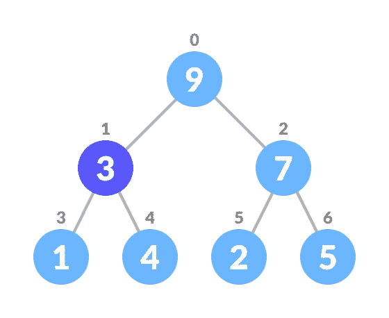

# 堆数据结构

> 原文： [https://www.programiz.com/dsa/heap-data-structure](https://www.programiz.com/dsa/heap-data-structure)

#### 在本教程中，您将学习什么是堆数据结构。 此外，您还将找到在 C，C ++，Java 和 Python 中进行堆操作的工作示例。

堆数据结构是满足**堆属性**的完整二叉树。 二进制堆也称为**。**

完整的二叉树是一种特殊的二叉树，其中

*   除最后一个级别外，每个级别都已填充
*   所有节点都尽可能地向左



堆属性是其中节点的属性

*   （对于最大堆）每个节点的密钥始终大于其子节点，并且根节点的密钥在所有其他节点中最大；
    
*   （对于最小堆）每个节点的密钥始终小于子节点，而根节点的密钥在所有其他节点中最小。



* * *

## 堆操作

下面将对在堆上执行的一些重要操作及其算法进行描述。

### 堆肥

Heapify 是从二叉树创建堆数据结构的过程。 它用于创建最小堆或最大堆。

1.  令输入数组为
    
2.  从数组
    创建完整的二叉树
3.  从索引为`n/2 - 1`的非叶节点的第一个索引开始。
    
4.  将当前元素`i`设置为`largest`。
5.  左子索引由`2i + 1`给出，右子索引由`2i + 2`给出。
    如果`leftChild`大于`currentElement`（即位于`ith`索引处的元素），则将`leftChildIndex`设置为最大。
    如果`rightChild`大于`largest`中的元素，请将`rightChildIndex`设置为`largest`。
6.  将`largest`与`currentElement`
    交换
7.  重复步骤 3-7，直到子树也被堆积。

**算法**

```
Heapify(array, size, i)
  set i as largest
  leftChild = 2i + 1
  rightChild = 2i + 2

  if leftChild &gt; array[largest]
    set leftChildIndex as largest
  if rightChild &gt; array[largest]
    set rightChildIndex as largest

  swap array[i] and array[largest]
```

要创建最大堆：

```
MaxHeap(array, size)
  loop from the first index of non-leaf node down to zero
    call heapify
```

对于 Min-Heap，对于所有节点，`leftChild`和`rightChild`都必须小于父节点。

* * *

### 将元素插入堆

最大堆中的插入算法

```
If there is no node, 
  create a newNode.
else (a node is already present)
  insert the newNode at the end (last node from left to right.)

heapify the array
```

1.  在树的末尾插入新元素。
    
2.  堆肥树。



对于 Min Heap，对上述算法进行了修改，以使`parentNode`始终小于`newNode`。

* * *

### 从堆中删除元素

Max Heap 中的删除算法

```
If nodeToBeDeleted is the leafNode
  remove the node
Else swap nodeToBeDeleted with the lastLeafNode
  remove noteToBeDeleted

heapify the array
```

1.  选择要删除的元素。
    
2.  将其与最后一个元素交换。
    
3.  删除最后一个元素。
    
4.  堆肥树。


对于 Min Heap，对上述算法进行了修改，以使`childNodes`均小于`currentNode`。

* * *

### 窥视（找到最大/最小）

窥视操作从最大堆中返回最大元素，或者从最小堆中返回最小元素，而不删除节点。

对于最大堆和最小堆

```
return rootNode
```

* * *

### 提取最大/最小

从最大堆中删除后，Extract-Max 返回具有最大值的节点，而从最小堆中删除后，Extract-Min 返回具有最小值的节点。

* * *

## Python，Java，C / C ++示例

[Python](#python-code)[Java](#java-code)[C](#c-code)[C++](#cpp-code)

```
# Max-Heap data structure in Python

def heapify(arr, n, i):
    largest = i
    l = 2 * i + 1
    r = 2 * i + 2 

    if l < n and arr[i] < arr[l]:
        largest = l

    if r < n and arr[largest] < arr[r]:
        largest = r

    if largest != i:
        arr[i],arr[largest] = arr[largest],arr[i]
        heapify(arr, n, largest)

def insert(array, newNum):
    size = len(array)
    if size == 0:
        array.append(newNum)
    else:
        array.append(newNum);
        for i in range((size//2)-1, -1, -1):
            heapify(array, size, i)

def deleteNode(array, num):
    size = len(array)
    i = 0
    for i in range(0, size):
        if num == array[i]:
            break

    array[i], array[size-1] = array[size-1], array[i]

    array.remove(size-1)

    for i in range((len(array)//2)-1, -1, -1):
        heapify(array, len(array), i)

arr = []

insert(arr, 3)
insert(arr, 4)
insert(arr, 9)
insert(arr, 5)
insert(arr, 2)

print ("Max-Heap array: " + str(arr))

deleteNode(arr, 4)
print("After deleting an element: " + str(arr)) 
```

```
 // Max-Heap data structure in Java

import java.util.ArrayList;

class Heap {
  void heapify(ArrayList<Integer> hT, int i) {
    int size = hT.size();
    int largest = i;
    int l = 2 * i + 1;
    int r = 2 * i + 2;
    if (l < size && hT.get(l) > hT.get(largest))
      largest = l;
    if (r < size && hT.get(r) > hT.get(largest))
      largest = r;

    if (largest != i) {
      int temp = hT.get(largest);
      hT.set(largest, hT.get(i));
      hT.set(i, temp);

      heapify(hT, largest);
    }
  }

  void insert(ArrayList<Integer> hT, int newNum) {
    int size = hT.size();
    if (size == 0) {
      hT.add(newNum);
    } else {
      hT.add(newNum);
      for (int i = size / 2 - 1; i >= 0; i--) {
        heapify(hT, i);
      }
    }
  }

  void deleteNode(ArrayList<Integer> hT, int num)
  {
    int size = hT.size();
    int i;
    for (i = 0; i < size; i++)
    {
      if (num == hT.get(i))
        break;
    }

    int temp = hT.get(i);
    hT.set(i, hT.get(size-1));
    hT.set(size-1, temp);

    hT.remove(size-1);
    for (int j = size / 2 - 1; j >= 0; j--)
    {
      heapify(hT, j);
    }
  }

  void printArray(ArrayList<Integer> array, int size) {
    for (Integer i : array) {
      System.out.print(i + " ");
    }
    System.out.println();
  }

  public static void main(String args[]) {

    ArrayList<Integer> array = new ArrayList<Integer>();
    int size = array.size();

    Heap h = new Heap();
    h.insert(array, 3);
    h.insert(array, 4);
    h.insert(array, 9);
    h.insert(array, 5);
    h.insert(array, 2);

    System.out.println("Max-Heap array: ");
    h.printArray(array, size);

    h.deleteNode(array, 4);
    System.out.println("After deleting an element: ");
    h.printArray(array, size);
  }
}
```

```
// Max-Heap data structure in C

#include <stdio.h>
int size = 0;
void swap(int *a, int *b)
{
  int temp = *b;
  *b = *a;
  *a = temp;
}
void heapify(int array[], int size, int i)
{
  if (size == 1)
  {
    printf("Single element in the heap");
  }
  else
  {
    int largest = i;
    int l = 2 * i + 1;
    int r = 2 * i + 2;
    if (l < size && array[l] > array[largest])
      largest = l;
    if (r < size && array[r] > array[largest])
      largest = r;
    if (largest != i)
    {
      swap(&array[i], &array[largest]);
      heapify(array, size, largest);
    }
  }
}
void insert(int array[], int newNum)
{
  if (size == 0)
  {
    array[0] = newNum;
    size += 1;
  }
  else
  {
    array[size] = newNum;
    size += 1;
    for (int i = size / 2 - 1; i >= 0; i--)
    {
      heapify(array, size, i);
    }
  }
}
void deleteRoot(int array[], int num)
{
  int i;
  for (i = 0; i < size; i++)
  {
    if (num == array[i])
      break;
  }

  swap(&array[i], &array[size - 1]);
  size -= 1;
  for (int i = size / 2 - 1; i >= 0; i--)
  {
    heapify(array, size, i);
  }
}
void printArray(int array[], int size)
{
  for (int i = 0; i < size; ++i)
    printf("%d ", array[i]);
  printf("\n");
}
int main()
{
  int array[10];

  insert(array, 3);
  insert(array, 4);
  insert(array, 9);
  insert(array, 5);
  insert(array, 2);

  printf("Max-Heap array: ");
  printArray(array, size);

  deleteRoot(array, 4);

  printf("After deleting an element: ");

  printArray(array, size);
}
```

```
// Max-Heap data structure in C++

#include <iostream>
#include <vector>
using namespace std;

void swap(int *a, int *b)
{
  int temp = *b;
  *b = *a;
  *a = temp;
}
void heapify(vector<int> &hT, int i)
{
  int size = hT.size();
  int largest = i;
  int l = 2 * i + 1;
  int r = 2 * i + 2;
  if (l < size && hT[l] > hT[largest])
    largest = l;
  if (r < size && hT[r] > hT[largest])
    largest = r;

  if (largest != i)
  {
    swap(&hT[i], &hT[largest]);
    heapify(hT, largest);
  }
}
void insert(vector<int> &hT, int newNum)
{
  int size = hT.size();
  if (size == 0)
  {
    hT.push_back(newNum);
  }
  else
  {
    hT.push_back(newNum);
    for (int i = size / 2 - 1; i >= 0; i--)
    {
      heapify(hT, i);
    }
  }
}
void deleteNode(vector<int> &hT, int num)
{
  int size = hT.size();
  int i;
  for (i = 0; i < size; i++)
  {
    if (num == hT[i])
      break;
  }
  swap(&hT[i], &hT[size - 1]);

  hT.pop_back();
  for (int i = size / 2 - 1; i >= 0; i--)
  {
    heapify(hT, i);
  }
}
void printArray(vector<int> &hT)
{
  for (int i = 0; i < hT.size(); ++i)
    cout << hT[i] << " ";
  cout << "\n";
}

int main()
{
  vector<int> heapTree;

  insert(heapTree, 3);
  insert(heapTree, 4);
  insert(heapTree, 9);
  insert(heapTree, 5);
  insert(heapTree, 2);

  cout << "Max-Heap array: ";
  printArray(heapTree);

  deleteNode(heapTree, 4);

  cout << "After deleting an element: ";

  printArray(heapTree);
}
```

* * *

## 堆数据结构应用

*   在实现优先级队列时使用堆。
*   Dijkstra 的算法
*   堆排序