# 斐波那契堆

> 原文： [https://www.programiz.com/dsa/fibonacci-heap](https://www.programiz.com/dsa/fibonacci-heap)

#### 在本教程中，您将学习什么是斐波那契堆。 此外，您还将在 C，C++ ，Java 和 Python 中找到斐波纳契堆上不同操作的工作示例。

斐波那契堆是二项式堆的一种修改形式，其堆操作比二项式和二进制堆所支持的更有效。

与二进制堆不同，一个节点可以有两个以上的子节点。

斐波那契堆称为**斐波那契**堆，因为树的构建方式使得 n 阶树中至少有`F n+2`个节点，其中`F n+2`为`(n + 2)nd`斐波那契数。

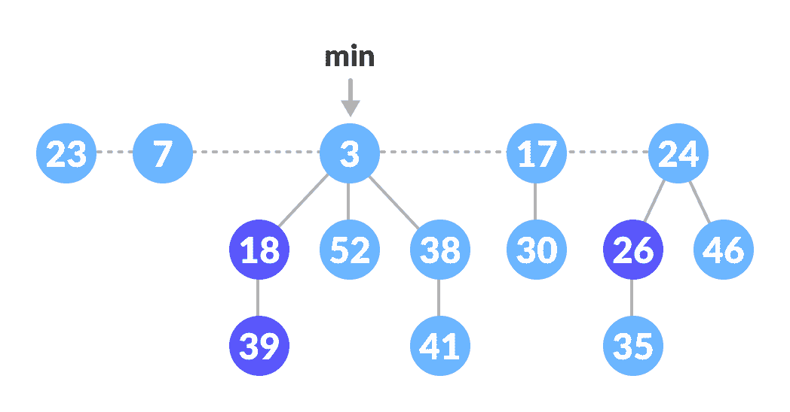

Fibonacci Heap


* * *

## 斐波那契堆的性质

斐波那契堆的重要属性是：

1.  它是**最小堆-** [**有序**](https://cs.lmu.edu/~ray/notes/orderedtrees/) 树的集合。 （即，父母总是比子女小。）
2.  指针保持在最小元素节点上。
3.  它由一组标记的节点组成。 （减少按键操作）
4.  斐波那契堆中的树是无序的，但[植根于](https://mathworld.wolfram.com/RootedTree.html)。

* * *

## 斐波那契堆中节点的内存表示

所有树的根链接在一起，以加快访问速度。 父节点的子节点通过圆形双向链表相互连接，如下所示。

使用循环双链表有两个主要优点。

1.  从树中删除节点需要`O(1)`时间。
2.  两个这样的列表的串联需要花费`O(1)`时间。

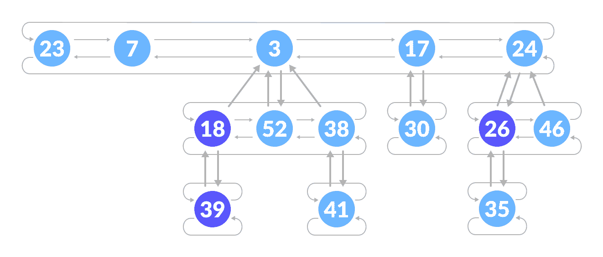

Fibonacci Heap Structure


* * *

## 斐波那契堆上的操作

### 插入

算法

```
insert(H, x)
    degree[x] = 0
    p[x] = NIL
    child[x] = NIL
    left[x] = x
    right[x] = x
    mark[x] = FALSE
    concatenate the root list containing x with root list H 
    if min[H] == NIL or key[x] < key[min[H]]
        then min[H] = x
    n[H] = n[H] + 1

```

将节点插入到现有堆中的步骤如下。

1.  为该元素创建一个新节点。
2.  检查堆是否为空。
3.  如果堆为空，则将新节点设置为根节点，并将其标记为`min`。
4.  否则，将节点插入根列表并更新`min`。

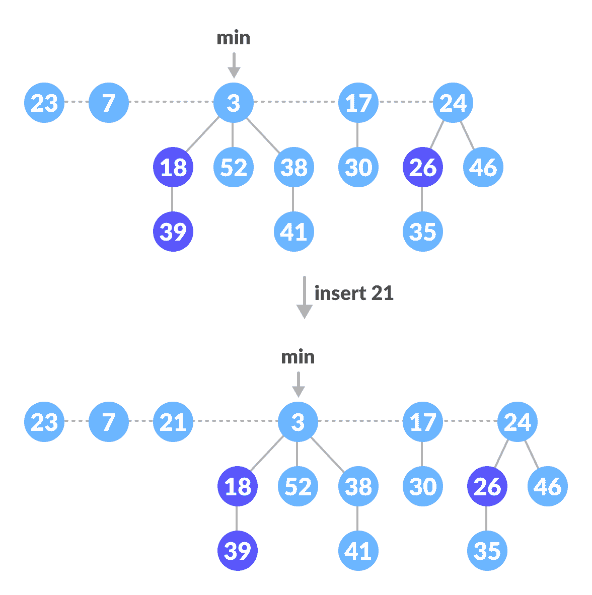

Insertion Example


### 寻找敏

最小元素始终由`min`指针指定。

### 联盟

两个斐波那契堆的并集包括以下步骤。

1.  连接两个堆的根。
2.  通过从新的根列表中选择一个最小密钥来更新`min`。

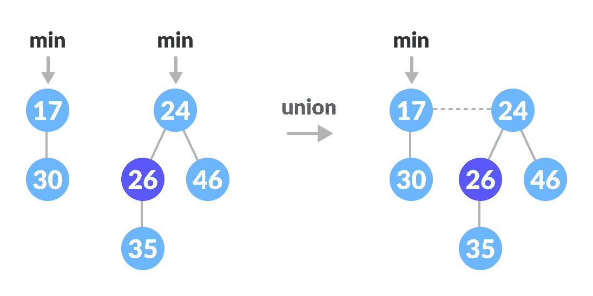

Union of two heaps


### 提取物最小值

这是斐波那契堆上最重要的操作。 在此操作中，从堆中删除了具有最小值的节点，并重新调整了树。

遵循以下步骤：

1.  删除最小节点。
2.  将最小指针设置为根列表中的下一个根。
3.  创建一个大小等于删除前堆中树的最大程度的数组。
4.  执行以下操作（步骤 5-7），直到不存在具有相同度数的多个根。
5.  将当前根的度数（最小指针）映射到数组中的度数。
6.  将下一个根的度数映射到数组中的度数。
7.  如果同一度数有两个以上的映射，则对这些根应用联合操作，以保持最小堆属性（即最小值在根处）。

在以下示例中可以理解上述步骤的实现。

1.  我们将在下面的堆上执行`extract-min`操作。

    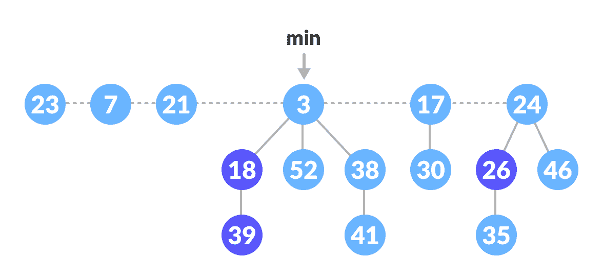

    斐波那契堆

    

2.  删除`min`节点，将其所有子节点添加到根列表中，并将`min`指针设置为根列表中的下一个根。

    

    删除最小节点

    

3.  树中的最大度为 3。创建一个大小为 4 的数组，并使用该数组映射下一个根的度。

    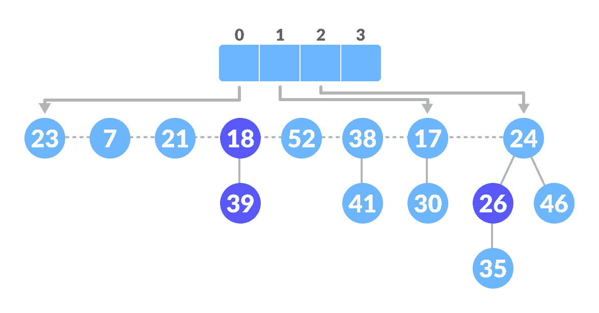

    创建阵列

    

4.  在这里，23 和 7 具有相同的度数，因此将它们合并。

    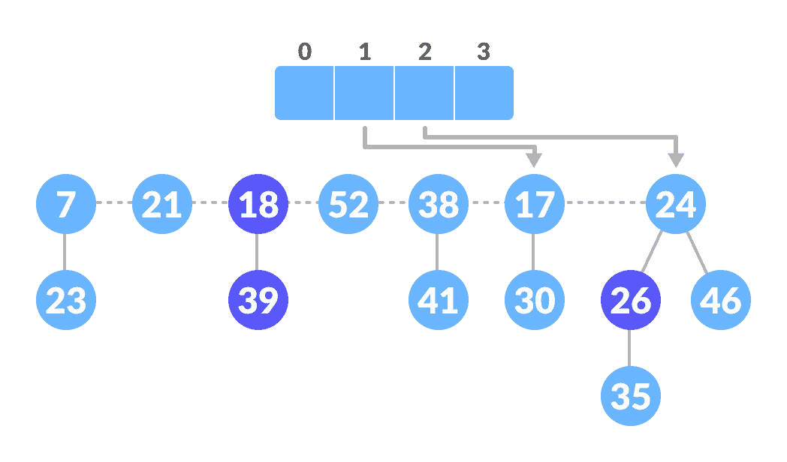

    团结那些具有相同度数的人

    

5.  同样，7 和 17 具有相同的度数，因此也将它们合并。

    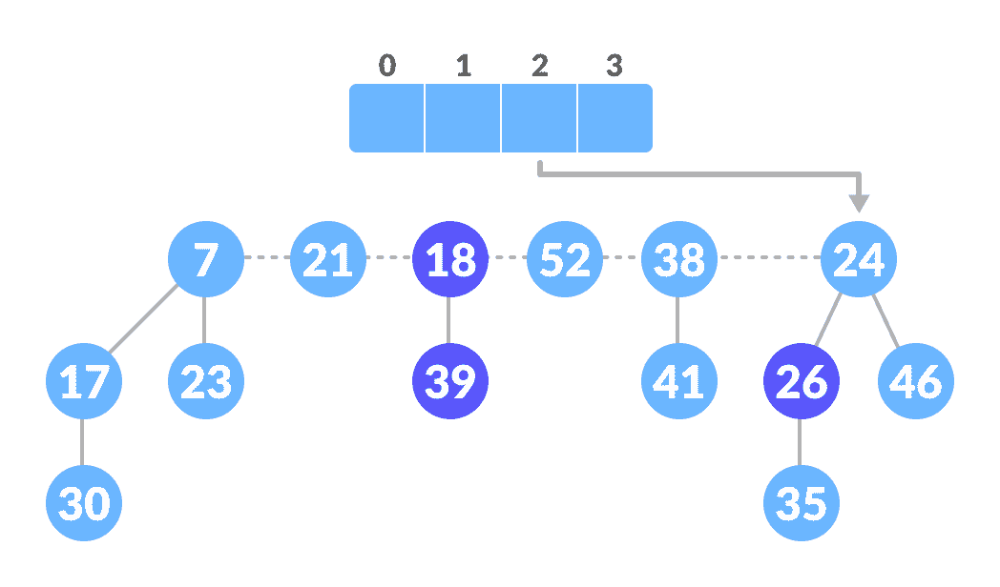

    团结那些具有相同度数的人

    

6.  同样，7 和 24 具有相同的度数，因此将它们合并。

    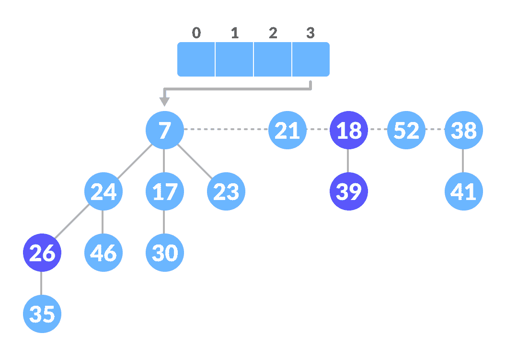

    团结那些具有相同度数的人

    

7.  映射下一个节点。

    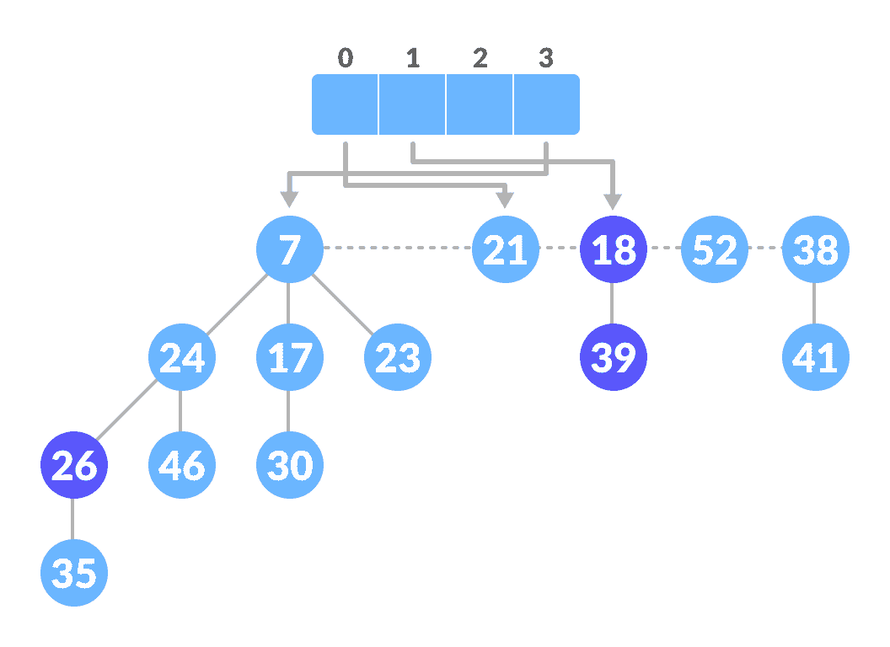

    映射其余节点

    

8.  同样，52 和 21 具有相同的度数，因此将它们合并

    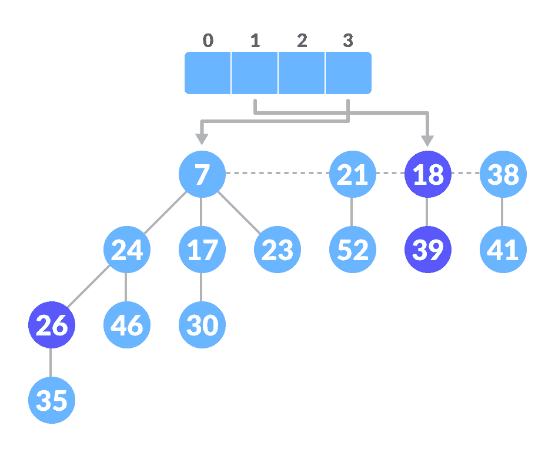

    将具有相同度数的

    

    合并
9.  同样，将 21 和 18 结合在一起。

    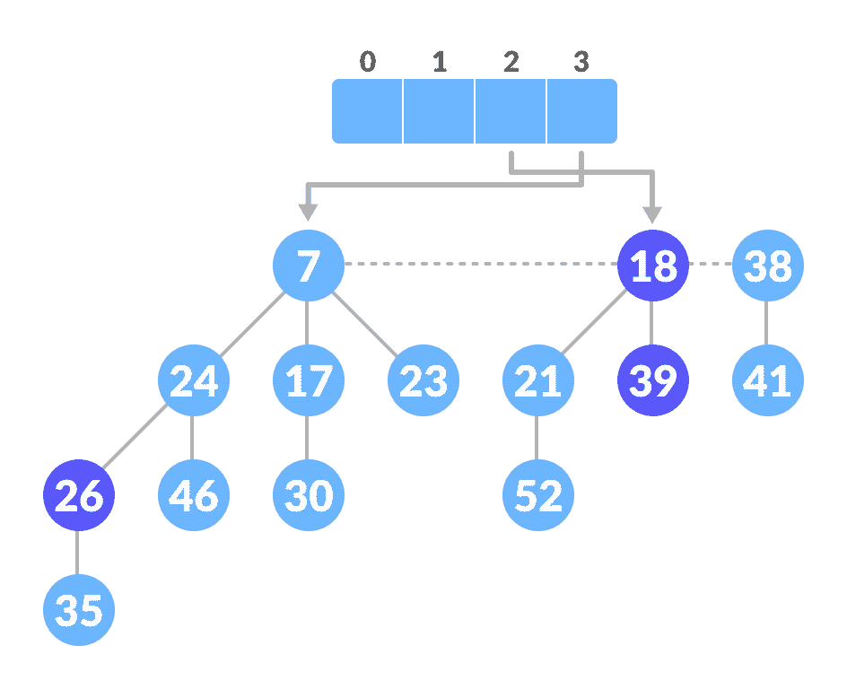

    将具有相同度数的那些结合在一起

    

10.  映射剩余的根。

    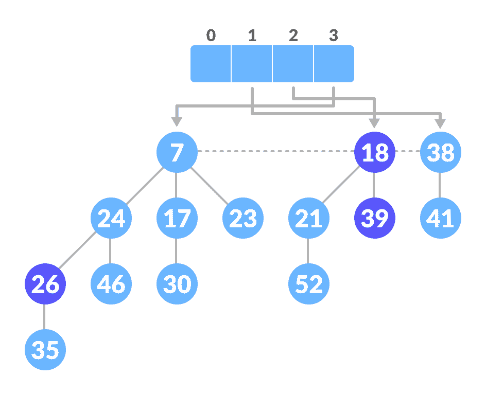

    映射其余节点

    

11.  最后的堆是。

    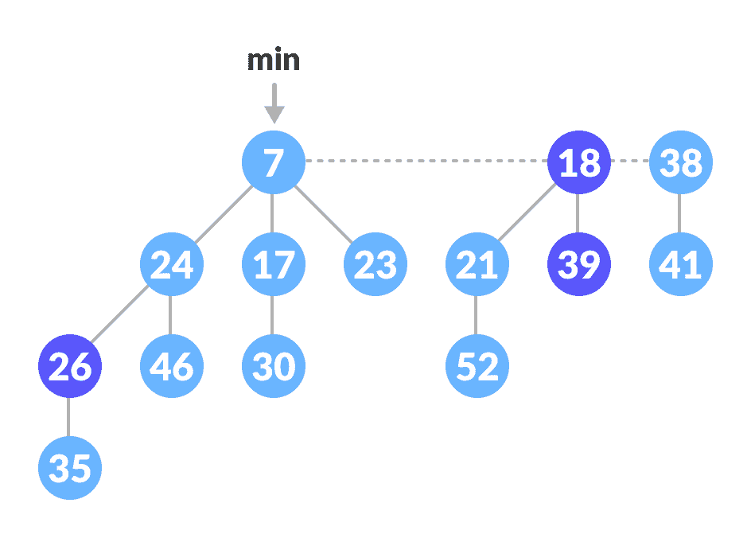

    最终斐波那契堆

    

### 减少密钥并删除节点

这些是[减少键和删除节点操作](https://www.programiz.com/dsa/decrease-key-and-delete-node-from-a-fibonacci-heap)中讨论的最重要的操作。

* * *

## Python，Java 和 C/C++ 示例

[Python](#python-code)[Java](#java-code)[C](#c-code)[C+](#cpp-code)

```
# Fibonacci Heap in python

import math

# Creating fibonacci tree
class FibonacciTree:
    def __init__(self, value):
        self.value = value
        self.child = []
        self.order = 0

    # Adding tree at the end of the tree
    def add_at_end(self, t):
        self.child.append(t)
        self.order = self.order + 1

# Creating Fibonacci heap
class FibonacciHeap:
    def __init__(self):
        self.trees = []
        self.least = None
        self.count = 0

    # Insert a node
    def insert_node(self, value):
        new_tree = FibonacciTree(value)
        self.trees.append(new_tree)
        if (self.least is None or value < self.least.value):
            self.least = new_tree
        self.count = self.count + 1

    # Get minimum value
    def get_min(self):
        if self.least is None:
            return None
        return self.least.value

    # Extract the minimum value
    def extract_min(self):
        smallest = self.least
        if smallest is not None:
            for child in smallest.child:
                self.trees.append(child)
            self.trees.remove(smallest)
            if self.trees == []:
                self.least = None
            else:
                self.least = self.trees[0]
                self.consolidate()
            self.count = self.count - 1
            return smallest.value

    # Consolidate the tree
    def consolidate(self):
        aux = (floor_log(self.count) + 1) * [None]

        while self.trees != []:
            x = self.trees[0]
            order = x.order
            self.trees.remove(x)
            while aux[order] is not None:
                y = aux[order]
                if x.value > y.value:
                    x, y = y, x
                x.add_at_end(y)
                aux[order] = None
                order = order + 1
            aux[order] = x

        self.least = None
        for k in aux:
            if k is not None:
                self.trees.append(k)
                if (self.least is None
                        or k.value < self.least.value):
                    self.least = k

def floor_log(x):
    return math.frexp(x)[1] - 1

fibonacci_heap = FibonacciHeap()

fibonacci_heap.insert_node(7)
fibonacci_heap.insert_node(3)
fibonacci_heap.insert_node(17)
fibonacci_heap.insert_node(24)

print('the minimum value of the fibonacci heap: {}'.format(fibonacci_heap.get_min()))

print('the minimum value removed: {}'.format(fibonacci_heap.extract_min())) 
```

```
// Operations on Fibonacci Heap in Java

// Node creation
class node {
  node parent;
  node left;
  node right;
  node child;
  int degree;
  boolean mark;
  int key;

  public node() {
    this.degree = 0;
    this.mark = false;
    this.parent = null;
    this.left = this;
    this.right = this;
    this.child = null;
    this.key = Integer.MAX_VALUE;
  }

  node(int x) {
    this();
    this.key = x;
  }

  void set_parent(node x) {
    this.parent = x;
  }

  node get_parent() {
    return this.parent;
  }

  void set_left(node x) {
    this.left = x;
  }

  node get_left() {
    return this.left;
  }

  void set_right(node x) {
    this.right = x;
  }

  node get_right() {
    return this.right;
  }

  void set_child(node x) {
    this.child = x;
  }

  node get_child() {
    return this.child;
  }

  void set_degree(int x) {
    this.degree = x;
  }

  int get_degree() {
    return this.degree;
  }

  void set_mark(boolean m) {
    this.mark = m;
  }

  boolean get_mark() {
    return this.mark;
  }

  void set_key(int x) {
    this.key = x;
  }

  int get_key() {
    return this.key;
  }
}

public class fibHeap {
  node min;
  int n;
  boolean trace;
  node found;

  public boolean get_trace() {
    return trace;
  }

  public void set_trace(boolean t) {
    this.trace = t;
  }

  public static fibHeap create_heap() {
    return new fibHeap();
  }

  fibHeap() {
    min = null;
    n = 0;
    trace = false;
  }

  private void insert(node x) {
    if (min == null) {
      min = x;
      x.set_left(min);
      x.set_right(min);
    } else {
      x.set_right(min);
      x.set_left(min.get_left());
      min.get_left().set_right(x);
      min.set_left(x);
      if (x.get_key() < min.get_key())
        min = x;
    }
    n += 1;
  }

  public void insert(int key) {
    insert(new node(key));
  }

  public void display() {
    display(min);
    System.out.println();
  }

  private void display(node c) {
    System.out.print("(");
    if (c == null) {
      System.out.print(")");
      return;
    } else {
      node temp = c;
      do {
        System.out.print(temp.get_key());
        node k = temp.get_child();
        display(k);
        System.out.print("->");
        temp = temp.get_right();
      } while (temp != c);
      System.out.print(")");
    }
  }

  public static void merge_heap(fibHeap H1, fibHeap H2, fibHeap H3) {
    H3.min = H1.min;

    if (H1.min != null && H2.min != null) {
      node t1 = H1.min.get_left();
      node t2 = H2.min.get_left();
      H1.min.set_left(t2);
      t1.set_right(H2.min);
      H2.min.set_left(t1);
      t2.set_right(H1.min);
    }
    if (H1.min == null || (H2.min != null && H2.min.get_key() < H1.min.get_key()))
      H3.min = H2.min;
    H3.n = H1.n + H2.n;
  }

  public int find_min() {
    return this.min.get_key();
  }

  private void display_node(node z) {
    System.out.println("right: " + ((z.get_right() == null) ? "-1" : z.get_right().get_key()));
    System.out.println("left: " + ((z.get_left() == null) ? "-1" : z.get_left().get_key()));
    System.out.println("child: " + ((z.get_child() == null) ? "-1" : z.get_child().get_key()));
    System.out.println("degree " + z.get_degree());
  }

  public int extract_min() {
    node z = this.min;
    if (z != null) {
      node c = z.get_child();
      node k = c, p;
      if (c != null) {
        do {
          p = c.get_right();
          insert(c);
          c.set_parent(null);
          c = p;
        } while (c != null && c != k);
      }
      z.get_left().set_right(z.get_right());
      z.get_right().set_left(z.get_left());
      z.set_child(null);
      if (z == z.get_right())
        this.min = null;
      else {
        this.min = z.get_right();
        this.consolidate();
      }
      this.n -= 1;
      return z.get_key();
    }
    return Integer.MAX_VALUE;
  }

  public void consolidate() {
    double phi = (1 + Math.sqrt(5)) / 2;
    int Dofn = (int) (Math.log(this.n) / Math.log(phi));
    node[] A = new node[Dofn + 1];
    for (int i = 0; i <= Dofn; ++i)
      A[i] = null;
    node w = min;
    if (w != null) {
      node check = min;
      do {
        node x = w;
        int d = x.get_degree();
        while (A[d] != null) {
          node y = A[d];
          if (x.get_key() > y.get_key()) {
            node temp = x;
            x = y;
            y = temp;
            w = x;
          }
          fib_heap_link(y, x);
          check = x;
          A[d] = null;
          d += 1;
        }
        A[d] = x;
        w = w.get_right();
      } while (w != null && w != check);
      this.min = null;
      for (int i = 0; i <= Dofn; ++i) {
        if (A[i] != null) {
          insert(A[i]);
        }
      }
    }
  }

  // Linking operation
  private void fib_heap_link(node y, node x) {
    y.get_left().set_right(y.get_right());
    y.get_right().set_left(y.get_left());

    node p = x.get_child();
    if (p == null) {
      y.set_right(y);
      y.set_left(y);
    } else {
      y.set_right(p);
      y.set_left(p.get_left());
      p.get_left().set_right(y);
      p.set_left(y);
    }
    y.set_parent(x);
    x.set_child(y);
    x.set_degree(x.get_degree() + 1);
    y.set_mark(false);
  }

  // Search operation
  private void find(int key, node c) {
    if (found != null || c == null)
      return;
    else {
      node temp = c;
      do {
        if (key == temp.get_key())
          found = temp;
        else {
          node k = temp.get_child();
          find(key, k);
          temp = temp.get_right();
        }
      } while (temp != c && found == null);
    }
  }

  public node find(int k) {
    found = null;
    find(k, this.min);
    return found;
  }

  public void decrease_key(int key, int nval) {
    node x = find(key);
    decrease_key(x, nval);
  }

  // Decrease key operation
  private void decrease_key(node x, int k) {
    if (k > x.get_key())
      return;
    x.set_key(k);
    node y = x.get_parent();
    if (y != null && x.get_key() < y.get_key()) {
      cut(x, y);
      cascading_cut(y);
    }
    if (x.get_key() < min.get_key())
      min = x;
  }

  // Cut operation
  private void cut(node x, node y) {
    x.get_right().set_left(x.get_left());
    x.get_left().set_right(x.get_right());

    y.set_degree(y.get_degree() - 1);

    x.set_right(null);
    x.set_left(null);
    insert(x);
    x.set_parent(null);
    x.set_mark(false);
  }

  private void cascading_cut(node y) {
    node z = y.get_parent();
    if (z != null) {
      if (y.get_mark() == false)
        y.set_mark(true);
      else {
        cut(y, z);
        cascading_cut(z);
      }
    }
  }

  // Delete operations
  public void delete(node x) {
    decrease_key(x, Integer.MIN_VALUE);
    int p = extract_min();
  }

  public static void main(String[] args) {
    fibHeap obj = create_heap();
    obj.insert(7);
    obj.insert(26);
    obj.insert(30);
    obj.insert(39);
    obj.insert(10);
    obj.display();

    System.out.println(obj.extract_min());
    obj.display();
    System.out.println(obj.extract_min());
    obj.display();
    System.out.println(obj.extract_min());
    obj.display();
    System.out.println(obj.extract_min());
    obj.display();
    System.out.println(obj.extract_min());
    obj.display();
  }
}
```

```
// Operations on a Fibonacci heap in C

#include <math.h>
#include <stdbool.h>
#include <stdio.h>
#include <stdlib.h>

typedef struct _NODE {
  int key;
  int degree;
  struct _NODE *left_sibling;
  struct _NODE *right_sibling;
  struct _NODE *parent;
  struct _NODE *child;
  bool mark;
  bool visited;
} NODE;

typedef struct fibanocci_heap {
  int n;
  NODE *min;
  int phi;
  int degree;
} FIB_HEAP;

FIB_HEAP *make_fib_heap();
void insertion(FIB_HEAP *H, NODE *new, int val);
NODE *extract_min(FIB_HEAP *H);
void consolidate(FIB_HEAP *H);
void fib_heap_link(FIB_HEAP *H, NODE *y, NODE *x);
NODE *find_min_node(FIB_HEAP *H);
void decrease_key(FIB_HEAP *H, NODE *node, int key);
void cut(FIB_HEAP *H, NODE *node_to_be_decrease, NODE *parent_node);
void cascading_cut(FIB_HEAP *H, NODE *parent_node);
void Delete_Node(FIB_HEAP *H, int dec_key);

FIB_HEAP *make_fib_heap() {
  FIB_HEAP *H;
  H = (FIB_HEAP *)malloc(sizeof(FIB_HEAP));
  H->n = 0;
  H->min = NULL;
  H->phi = 0;
  H->degree = 0;
  return H;
}

// Printing the heap
void print_heap(NODE *n) {
  NODE *x;
  for (x = n;; x = x->right_sibling) {
    if (x->child == NULL) {
      printf("node with no child (%d) \n", x->key);
    } else {
      printf("NODE(%d) with child (%d)\n", x->key, x->child->key);
      print_heap(x->child);
    }
    if (x->right_sibling == n) {
      break;
    }
  }
}

// Inserting nodes
void insertion(FIB_HEAP *H, NODE *new, int val) {
  new = (NODE *)malloc(sizeof(NODE));
  new->key = val;
  new->degree = 0;
  new->mark = false;
  new->parent = NULL;
  new->child = NULL;
  new->visited = false;
  new->left_sibling = new;
  new->right_sibling = new;
  if (H->min == NULL) {
    H->min = new;
  } else {
    H->min->left_sibling->right_sibling = new;
    new->right_sibling = H->min;
    new->left_sibling = H->min->left_sibling;
    H->min->left_sibling = new;
    if (new->key < H->min->key) {
      H->min = new;
    }
  }
  (H->n)++;
}

// Find min node
NODE *find_min_node(FIB_HEAP *H) {
  if (H == NULL) {
    printf(" \n Fibonacci heap not yet created \n");
    return NULL;
  } else
    return H->min;
}

// Union operation
FIB_HEAP *unionHeap(FIB_HEAP *H1, FIB_HEAP *H2) {
  FIB_HEAP *Hnew;
  Hnew = make_fib_heap();
  Hnew->min = H1->min;

  NODE *temp1, *temp2;
  temp1 = Hnew->min->right_sibling;
  temp2 = H2->min->left_sibling;

  Hnew->min->right_sibling->left_sibling = H2->min->left_sibling;
  Hnew->min->right_sibling = H2->min;
  H2->min->left_sibling = Hnew->min;
  temp2->right_sibling = temp1;

  if ((H1->min == NULL) || (H2->min != NULL && H2->min->key < H1->min->key))
    Hnew->min = H2->min;
  Hnew->n = H1->n + H2->n;
  return Hnew;
}

// Calculate the degree
int cal_degree(int n) {
  int count = 0;
  while (n > 0) {
    n = n / 2;
    count++;
  }
  return count;
}

// Consolidate function
void consolidate(FIB_HEAP *H) {
  int degree, i, d;
  degree = cal_degree(H->n);
  NODE *A[degree], *x, *y, *z;
  for (i = 0; i <= degree; i++) {
    A[i] = NULL;
  }
  x = H->min;
  do {
    d = x->degree;
    while (A[d] != NULL) {
      y = A[d];
      if (x->key > y->key) {
        NODE *exchange_help;
        exchange_help = x;
        x = y;
        y = exchange_help;
      }
      if (y == H->min)
        H->min = x;
      fib_heap_link(H, y, x);
      if (y->right_sibling == x)
        H->min = x;
      A[d] = NULL;
      d++;
    }
    A[d] = x;
    x = x->right_sibling;
  } while (x != H->min);

  H->min = NULL;
  for (i = 0; i < degree; i++) {
    if (A[i] != NULL) {
      A[i]->left_sibling = A[i];
      A[i]->right_sibling = A[i];
      if (H->min == NULL) {
        H->min = A[i];
      } else {
        H->min->left_sibling->right_sibling = A[i];
        A[i]->right_sibling = H->min;
        A[i]->left_sibling = H->min->left_sibling;
        H->min->left_sibling = A[i];
        if (A[i]->key < H->min->key) {
          H->min = A[i];
        }
      }
      if (H->min == NULL) {
        H->min = A[i];
      } else if (A[i]->key < H->min->key) {
        H->min = A[i];
      }
    }
  }
}

// Linking
void fib_heap_link(FIB_HEAP *H, NODE *y, NODE *x) {
  y->right_sibling->left_sibling = y->left_sibling;
  y->left_sibling->right_sibling = y->right_sibling;

  if (x->right_sibling == x)
    H->min = x;

  y->left_sibling = y;
  y->right_sibling = y;
  y->parent = x;

  if (x->child == NULL) {
    x->child = y;
  }
  y->right_sibling = x->child;
  y->left_sibling = x->child->left_sibling;
  x->child->left_sibling->right_sibling = y;
  x->child->left_sibling = y;
  if ((y->key) < (x->child->key))
    x->child = y;

  (x->degree)++;
}

// Extract min
NODE *extract_min(FIB_HEAP *H) {
  if (H->min == NULL)
    printf("\n The heap is empty");
  else {
    NODE *temp = H->min;
    NODE *pntr;
    pntr = temp;
    NODE *x = NULL;
    if (temp->child != NULL) {
      x = temp->child;
      do {
        pntr = x->right_sibling;
        (H->min->left_sibling)->right_sibling = x;
        x->right_sibling = H->min;
        x->left_sibling = H->min->left_sibling;
        H->min->left_sibling = x;
        if (x->key < H->min->key)
          H->min = x;
        x->parent = NULL;
        x = pntr;
      } while (pntr != temp->child);
    }

    (temp->left_sibling)->right_sibling = temp->right_sibling;
    (temp->right_sibling)->left_sibling = temp->left_sibling;
    H->min = temp->right_sibling;

    if (temp == temp->right_sibling && temp->child == NULL)
      H->min = NULL;
    else {
      H->min = temp->right_sibling;
      consolidate(H);
    }
    H->n = H->n - 1;
    return temp;
  }
  return H->min;
}

void cut(FIB_HEAP *H, NODE *node_to_be_decrease, NODE *parent_node) {
  NODE *temp_parent_check;

  if (node_to_be_decrease == node_to_be_decrease->right_sibling)
    parent_node->child = NULL;

  node_to_be_decrease->left_sibling->right_sibling = node_to_be_decrease->right_sibling;
  node_to_be_decrease->right_sibling->left_sibling = node_to_be_decrease->left_sibling;
  if (node_to_be_decrease == parent_node->child)
    parent_node->child = node_to_be_decrease->right_sibling;
  (parent_node->degree)--;

  node_to_be_decrease->left_sibling = node_to_be_decrease;
  node_to_be_decrease->right_sibling = node_to_be_decrease;
  H->min->left_sibling->right_sibling = node_to_be_decrease;
  node_to_be_decrease->right_sibling = H->min;
  node_to_be_decrease->left_sibling = H->min->left_sibling;
  H->min->left_sibling = node_to_be_decrease;

  node_to_be_decrease->parent = NULL;
  node_to_be_decrease->mark = false;
}

void cascading_cut(FIB_HEAP *H, NODE *parent_node) {
  NODE *aux;
  aux = parent_node->parent;
  if (aux != NULL) {
    if (parent_node->mark == false) {
      parent_node->mark = true;
    } else {
      cut(H, parent_node, aux);
      cascading_cut(H, aux);
    }
  }
}

void decrease_key(FIB_HEAP *H, NODE *node_to_be_decrease, int new_key) {
  NODE *parent_node;
  if (H == NULL) {
    printf("\n FIbonacci heap not created ");
    return;
  }
  if (node_to_be_decrease == NULL) {
    printf("Node is not in the heap");
  }

  else {
    if (node_to_be_decrease->key < new_key) {
      printf("\n Invalid new key for decrease key operation \n ");
    } else {
      node_to_be_decrease->key = new_key;
      parent_node = node_to_be_decrease->parent;
      if ((parent_node != NULL) && (node_to_be_decrease->key < parent_node->key)) {
        printf("\n cut called");
        cut(H, node_to_be_decrease, parent_node);
        printf("\n cascading cut called");
        cascading_cut(H, parent_node);
      }
      if (node_to_be_decrease->key < H->min->key) {
        H->min = node_to_be_decrease;
      }
    }
  }
}

void *find_node(FIB_HEAP *H, NODE *n, int key, int new_key) {
  NODE *find_use = n;
  NODE *f = NULL;
  find_use->visited = true;
  if (find_use->key == key) {
    find_use->visited = false;
    f = find_use;
    decrease_key(H, f, new_key);
  }
  if (find_use->child != NULL) {
    find_node(H, find_use->child, key, new_key);
  }
  if ((find_use->right_sibling->visited != true)) {
    find_node(H, find_use->right_sibling, key, new_key);
  }

  find_use->visited = false;
}

FIB_HEAP *insertion_procedure() {
  FIB_HEAP *temp;
  int no_of_nodes, ele, i;
  NODE *new_node;
  temp = (FIB_HEAP *)malloc(sizeof(FIB_HEAP));
  temp = NULL;
  if (temp == NULL) {
    temp = make_fib_heap();
  }
  printf(" \n enter number of nodes to be insert = ");
  scanf("%d", &no_of_nodes);
  for (i = 1; i <= no_of_nodes; i++) {
    printf("\n node %d and its key value = ", i);
    scanf("%d", &ele);
    insertion(temp, new_node, ele);
  }
  return temp;
}
void Delete_Node(FIB_HEAP *H, int dec_key) {
  NODE *p = NULL;
  find_node(H, H->min, dec_key, -5000);
  p = extract_min(H);
  if (p != NULL)
    printf("\n Node deleted");
  else
    printf("\n Node not deleted:some error");
}

int main(int argc, char **argv) {
  NODE *new_node, *min_node, *extracted_min, *node_to_be_decrease, *find_use;
  FIB_HEAP *heap, *h1, *h2;
  int operation_no, new_key, dec_key, ele, i, no_of_nodes;
  heap = (FIB_HEAP *)malloc(sizeof(FIB_HEAP));
  heap = NULL;
  while (1) {
    printf(" \n Operations \n 1\. Create Fibonacci heap \n 2\. Insert nodes into fibonacci heap \n 3\. Find min \n 4\. Union \n 5\. Extract min \n 6\. Decrease key \n 7.Delete node \n 8\. print heap \n 9\. exit \n enter operation_no = ");
    scanf("%d", &operation_no);

    switch (operation_no) {
      case 1:
        heap = make_fib_heap();
        break;

      case 2:
        if (heap == NULL) {
          heap = make_fib_heap();
        }
        printf(" enter number of nodes to be insert = ");
        scanf("%d", &no_of_nodes);
        for (i = 1; i <= no_of_nodes; i++) {
          printf("\n node %d and its key value = ", i);
          scanf("%d", &ele);
          insertion(heap, new_node, ele);
        }
        break;

      case 3:
        min_node = find_min_node(heap);
        if (min_node == NULL)
          printf("No minimum value");
        else
          printf("\n min value = %d", min_node->key);
        break;

      case 4:
        if (heap == NULL) {
          printf("\n no FIbonacci heap created \n ");
          break;
        }
        h1 = insertion_procedure();
        heap = unionHeap(heap, h1);
        printf("Unified Heap:\n");
        print_heap(heap->min);
        break;

      case 5:
        if (heap == NULL)
          printf("Empty Fibonacci heap");
        else {
          extracted_min = extract_min(heap);
          printf("\n min value = %d", extracted_min->key);
          printf("\n Updated heap: \n");
          print_heap(heap->min);
        }
        break;

      case 6:
        if (heap == NULL)
          printf("Fibonacci heap is empty");
        else {
          printf(" \n node to be decreased = ");
          scanf("%d", &dec_key);
          printf(" \n enter the new key = ");
          scanf("%d", &new_key);
          find_use = heap->min;
          find_node(heap, find_use, dec_key, new_key);
          printf("\n Key decreased- Corresponding heap:\n");
          print_heap(heap->min);
        }
        break;
      case 7:
        if (heap == NULL)
          printf("Fibonacci heap is empty");
        else {
          printf(" \n Enter node key to be deleted = ");
          scanf("%d", &dec_key);
          Delete_Node(heap, dec_key);
          printf("\n Node Deleted- Corresponding heap:\n");
          print_heap(heap->min);
          break;
        }
      case 8:
        print_heap(heap->min);
        break;

      case 9:
        free(new_node);
        free(heap);
        exit(0);

      default:
        printf("Invalid choice ");
    }
  }
}
```

```
// Operations on a Fibonacci heap in C++

#include <cmath>
#include <cstdlib>
#include <iostream>

using namespace std;

// Node creation
struct node {
  int n;
  int degree;
  node *parent;
  node *child;
  node *left;
  node *right;
  char mark;

  char C;
};

// Implementation of Fibonacci heap
class FibonacciHeap {
   private:
  int nH;

  node *H;

   public:
  node *InitializeHeap();
  int Fibonnaci_link(node *, node *, node *);
  node *Create_node(int);
  node *Insert(node *, node *);
  node *Union(node *, node *);
  node *Extract_Min(node *);
  int Consolidate(node *);
  int Display(node *);
  node *Find(node *, int);
  int Decrease_key(node *, int, int);
  int Delete_key(node *, int);
  int Cut(node *, node *, node *);
  int Cascase_cut(node *, node *);
  FibonacciHeap() { H = InitializeHeap(); }
};

// Initialize heap
node *FibonacciHeap::InitializeHeap() {
  node *np;
  np = NULL;
  return np;
}

// Create node
node *FibonacciHeap::Create_node(int value) {
  node *x = new node;
  x->n = value;
  return x;
}

// Insert node
node *FibonacciHeap::Insert(node *H, node *x) {
  x->degree = 0;
  x->parent = NULL;
  x->child = NULL;
  x->left = x;
  x->right = x;
  x->mark = 'F';
  x->C = 'N';
  if (H != NULL) {
    (H->left)->right = x;
    x->right = H;
    x->left = H->left;
    H->left = x;
    if (x->n < H->n)
      H = x;
  } else {
    H = x;
  }
  nH = nH + 1;
  return H;
}

// Create linking
int FibonacciHeap::Fibonnaci_link(node *H1, node *y, node *z) {
  (y->left)->right = y->right;
  (y->right)->left = y->left;
  if (z->right == z)
    H1 = z;
  y->left = y;
  y->right = y;
  y->parent = z;

  if (z->child == NULL)
    z->child = y;

  y->right = z->child;
  y->left = (z->child)->left;
  ((z->child)->left)->right = y;
  (z->child)->left = y;

  if (y->n < (z->child)->n)
    z->child = y;
  z->degree++;
}

// Union Operation
node *FibonacciHeap::Union(node *H1, node *H2) {
  node *np;
  node *H = InitializeHeap();
  H = H1;
  (H->left)->right = H2;
  (H2->left)->right = H;
  np = H->left;
  H->left = H2->left;
  H2->left = np;
  return H;
}

// Display the heap
int FibonacciHeap::Display(node *H) {
  node *p = H;
  if (p == NULL) {
    cout << "Empty Heap" << endl;
    return 0;
  }
  cout << "Root Nodes: " << endl;

  do {
    cout << p->n;
    p = p->right;
    if (p != H) {
      cout << "-->";
    }
  } while (p != H && p->right != NULL);
  cout << endl;
}

// Extract min
node *FibonacciHeap::Extract_Min(node *H1) {
  node *p;
  node *ptr;
  node *z = H1;
  p = z;
  ptr = z;
  if (z == NULL)
    return z;

  node *x;
  node *np;

  x = NULL;

  if (z->child != NULL)
    x = z->child;

  if (x != NULL) {
    ptr = x;
    do {
      np = x->right;
      (H1->left)->right = x;
      x->right = H1;
      x->left = H1->left;
      H1->left = x;
      if (x->n < H1->n)
        H1 = x;

      x->parent = NULL;
      x = np;
    } while (np != ptr);
  }

  (z->left)->right = z->right;
  (z->right)->left = z->left;
  H1 = z->right;

  if (z == z->right && z->child == NULL)
    H = NULL;

  else {
    H1 = z->right;
    Consolidate(H1);
  }
  nH = nH - 1;
  return p;
}

// Consolidation Function
int FibonacciHeap::Consolidate(node *H1) {
  int d, i;
  float f = (log(nH)) / (log(2));
  int D = f;
  node *A[D];

  for (i = 0; i <= D; i++)
    A[i] = NULL;

  node *x = H1;
  node *y;
  node *np;
  node *pt = x;

  do {
    pt = pt->right;

    d = x->degree;

    while (A[d] != NULL)

    {
      y = A[d];

      if (x->n > y->n)

      {
        np = x;

        x = y;

        y = np;
      }

      if (y == H1)
        H1 = x;
      Fibonnaci_link(H1, y, x);
      if (x->right == x)
        H1 = x;
      A[d] = NULL;
      d = d + 1;
    }

    A[d] = x;
    x = x->right;

  }

  while (x != H1);
  H = NULL;
  for (int j = 0; j <= D; j++) {
    if (A[j] != NULL) {
      A[j]->left = A[j];
      A[j]->right = A[j];
      if (H != NULL) {
        (H->left)->right = A[j];
        A[j]->right = H;
        A[j]->left = H->left;
        H->left = A[j];
        if (A[j]->n < H->n)
          H = A[j];
      } else {
        H = A[j];
      }
      if (H == NULL)
        H = A[j];
      else if (A[j]->n < H->n)
        H = A[j];
    }
  }
}

// Decrease Key Operation
int FibonacciHeap::Decrease_key(node *H1, int x, int k) {
  node *y;
  if (H1 == NULL) {
    cout << "The Heap is Empty" << endl;
    return 0;
  }
  node *ptr = Find(H1, x);
  if (ptr == NULL) {
    cout << "Node not found in the Heap" << endl;
    return 1;
  }

  if (ptr->n < k) {
    cout << "Entered key greater than current key" << endl;
    return 0;
  }
  ptr->n = k;
  y = ptr->parent;
  if (y != NULL && ptr->n < y->n) {
    Cut(H1, ptr, y);
    Cascase_cut(H1, y);
  }

  if (ptr->n < H->n)
    H = ptr;

  return 0;
}

// Cutting Function
int FibonacciHeap::Cut(node *H1, node *x, node *y)

{
  if (x == x->right)
    y->child = NULL;
  (x->left)->right = x->right;
  (x->right)->left = x->left;
  if (x == y->child)
    y->child = x->right;
  y->degree = y->degree - 1;
  x->right = x;
  x->left = x;
  (H1->left)->right = x;
  x->right = H1;
  x->left = H1->left;
  H1->left = x;
  x->parent = NULL;
  x->mark = 'F';
}

// Cascade cut
int FibonacciHeap::Cascase_cut(node *H1, node *y) {
  node *z = y->parent;
  if (z != NULL) {
    if (y->mark == 'F') {
      y->mark = 'T';
    } else

    {
      Cut(H1, y, z);
      Cascase_cut(H1, z);
    }
  }
}

// Search function
node *FibonacciHeap::Find(node *H, int k) {
  node *x = H;
  x->C = 'Y';
  node *p = NULL;
  if (x->n == k) {
    p = x;
    x->C = 'N';
    return p;
  }

  if (p == NULL) {
    if (x->child != NULL)
      p = Find(x->child, k);
    if ((x->right)->C != 'Y')
      p = Find(x->right, k);
  }

  x->C = 'N';
  return p;
}

// Deleting key
int FibonacciHeap::Delete_key(node *H1, int k) {
  node *np = NULL;
  int t;
  t = Decrease_key(H1, k, -5000);
  if (!t)
    np = Extract_Min(H);
  if (np != NULL)
    cout << "Key Deleted" << endl;
  else
    cout << "Key not Deleted" << endl;
  return 0;
}

int main() {
  int n, m, l;
  FibonacciHeap fh;
  node *p;
  node *H;
  H = fh.InitializeHeap();

  p = fh.Create_node(7);
  H = fh.Insert(H, p);
  p = fh.Create_node(3);
  H = fh.Insert(H, p);
  p = fh.Create_node(17);
  H = fh.Insert(H, p);
  p = fh.Create_node(24);
  H = fh.Insert(H, p);

  fh.Display(H);

  p = fh.Extract_Min(H);
  if (p != NULL)
    cout << "The node with minimum key: " << p->n << endl;
  else
    cout << "Heap is empty" << endl;

  m = 26;
  l = 16;
  fh.Decrease_key(H, m, l);

  m = 16;
  fh.Delete_key(H, m);
}
```

* * *

## 复杂性

| 插入 | `O(1)` |
| 寻找敏 | `O(1)` |
| 联盟 | `O(1)` |
| 提取最小值 | `O(log n)` |
| 降低金钥 | `O(1)` |
| 删除节点 | `O(log n)` |

* * *

## 斐波那契堆应用

1.  为了提高 Dijkstra 算法的渐近运行时间。