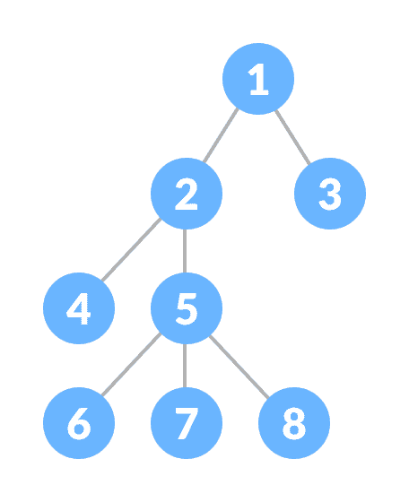
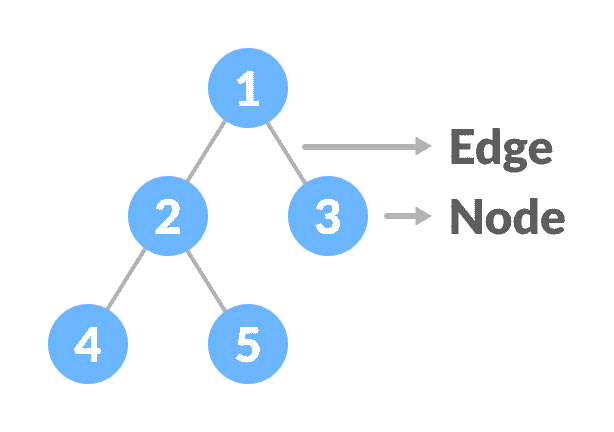
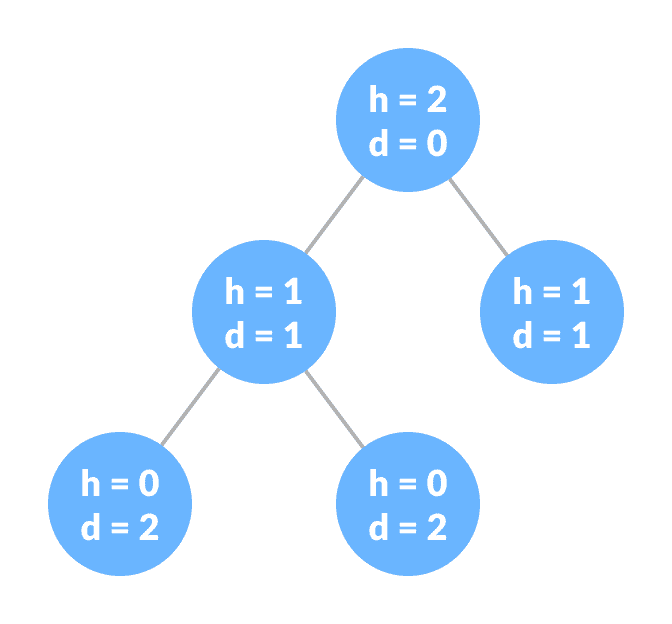
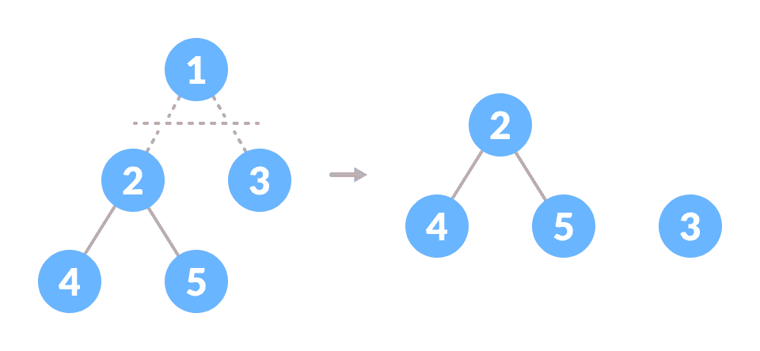

# 树数据结构

> 原文： [https://www.programiz.com/dsa/trees](https://www.programiz.com/dsa/trees)

#### 在本教程中，您将学习树数据结构。 此外，您还将了解不同类型的树以及树中使用的术语。

树是一种非线性的分层数据结构，由边连接的节点组成。

A Tree

* * *

## 为什么是树数据结构？

其他数据结构（例如数组，链表，栈和队列）是线性数据结构，可顺序存储数据。 为了在线性数据结构中执行任何操作，时间复杂度随数据大小的增加而增加。 但是，在当今的计算世界中这是不可接受的。

不同的树数据结构是非线性数据结构，因此可以更快，更轻松地访问数据。

* * *

## 树术语

### 节点

节点是一个包含键或值以及指向其子节点的指针的实体。

每个路径的最后一个节点称为**叶节点**或外部节点，不包含指向子节点的链接/指针。

具有至少一个子节点的节点被称为**内部节点**。

### 边

它是任何两个节点之间的链接。

Nodes and edges of a tree

### 根

它是树的最高节点。

### 节点高度

节点的高度是从节点到最深叶（即，从节点到叶节点的最长路径）的边数。

### 节点深度

节点的深度是从根到节点的边数。

### 一棵树的高度

树的高度是根节点的高度或最深节点的深度。

Height and depth of each node in a tree

### 节点的度

节点的度数是该节点的分支总数。

### 森林

不连贯的树木的集合称为森林。

Creating forest from a tree

您可以通过切割树的根来创建森林。

* * *

## 树的类型

1.  [二叉树](http://www.programiz.com/dsa/binary-tree)
2.  [二叉搜索树](https://www.programiz.com/dsa/binary-search-tree)
3.  [AVL 树](https://www.programiz.com/dsa/avl-tree)
4.  [B 树](http://programiz.com/dsa/b-tree)

* * *

## 树的遍历

为了对树执行任何操作，您需要到达特定节点。 树遍历算法有助于访问树中的所需节点。

要了解更多信息，请访问[树遍历](https://www.programiz.com/dsa/tree-traversal)。

* * *

## 树的应用

*   二叉搜索树（BST）用于快速检查元素是否存在于集合中。
*   堆是一种用于堆排序的树。
*   现代路由器中使用称为 Tries 的树的修改版本来存储路由信息。
*   最受欢迎的数据库使用 B 树和 T 树，这是我们上面学习的树结构的变体，用于存储其数据
*   编译器使用语法树来验证您编写的每个程序的语法。