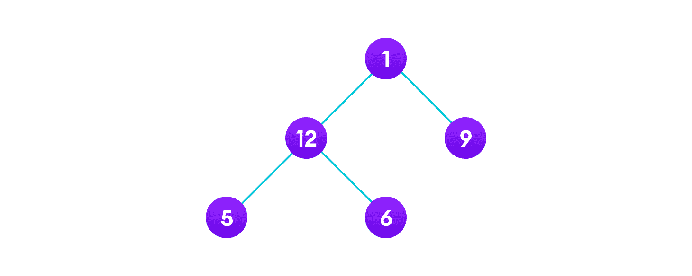
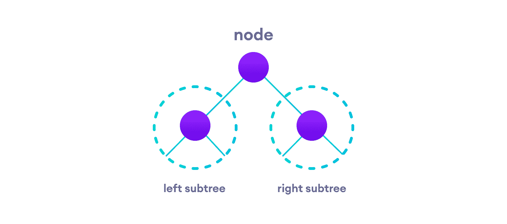
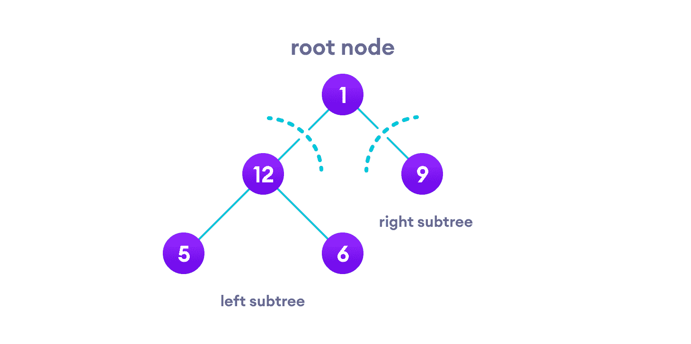
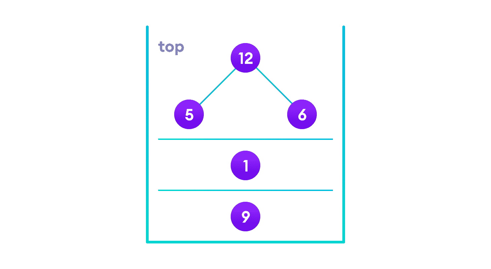
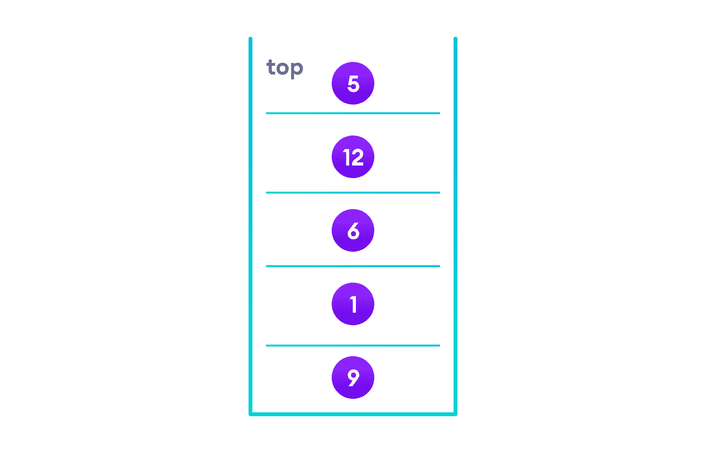

# 树的遍历 - 中序，前序和后序

> 原文： [https://www.programiz.com/dsa/tree-traversal](https://www.programiz.com/dsa/tree-traversal)

#### 在本教程中，您将学习不同的树遍历技术。 此外，您还将找到 C，C++ ，Java 和 Python 中不同的树遍历方法的工作示例。

遍历树意味着访问树中的每个节点。 例如，您可能想在树中添加所有值或找到最大的值。 对于所有这些操作，您将需要访问树的每个节点。

线性数据结构（例如数组，[栈](/data-structures/stack)，[队列](/data-structures/queue)和[链表](/data-structures/linked-list)）只有一种读取数据的方法。 但是可以以不同的方式遍历分层数据结构，例如[树](/data-structures/trees)。



树的遍历


让我们考虑一下如何读取上图所示的树元素。

从上到下，从左到右

```
1 -> 12 -> 5 -> 6 -> 9
```

从底部开始，从左到右

```
5 -> 6 -> 12 -> 9 -> 1
```

尽管此过程有些容易，但它不考虑树的层次结构，而仅考虑节点的深度。

相反，我们使用考虑树的基本结构的遍历方法，即

```
struct node {
    int data;
    struct node* left;
    struct node* right;
}
```

由`left`和`right`指向的结构节点可能还有其他左右子级，因此我们应该将它们视为子树而不是子节点。

根据这种结构，每棵树都是

*   承载数据的节点
*   两个子树



左右子树


请记住，我们的目标是访问每个节点，因此我们需要访问子树中的所有节点，访问根节点以及访问右子树中的所有节点。

根据执行顺序，可以有三种遍历类型。

* * *

## 中序遍历

1.  首先，访问左侧子树中的所有节点
2.  然后是根节点
3.  访问右侧子树中的所有节点

```
inorder(root->left)
display(root->data)
inorder(root->right)
```

* * *

## 前序遍历

1.  访问根节点
2.  访问左侧子树中的所有节点
3.  访问右侧子树中的所有节点

```
display(root->data)
preorder(root->left)
preorder(root->right)
```

* * *

## 后序遍历

1.  访问左侧子树中的所有节点
2.  访问右侧子树中的所有节点
3.  访问根节点

```
postorder(root->left)
postorder(root->right)
display(root->data)
```

让我们可视化顺序遍历。 我们从根节点开始。



左右子树


我们首先遍历左子树。 我们还需要记住，完成树后，访问根节点和正确的子树。

让我们将所有这些放入[栈](/data-structures/stack)中，以便我们记住。



栈


现在我们遍历指向栈顶部的子树。

同样，我们遵循相同的有序规则

```
Left subtree -> root -> right subtree
```

遍历左子树后，我们剩下



最终栈


由于节点“5”没有任何子树，因此我们直接打印它。 之后，我们先打印其父级“12”，然后打印正确的子级“6”。

将所有内容放到栈上很有帮助，因为现在遍历了根节点的左子树，我们可以将其打印并转到右子树。

遍历所有元素之后，我们得到的有序遍历为

```
5 -> 12 -> 6 -> 1 -> 9
```

我们不必自己创建栈，因为递归可以为我们保持正确的顺序。

* * *

## Python，Java 和 C/C++ 示例


```
# Tree traversal in Python

class Node:
    def __init__(self, item):
        self.left = None
        self.right = None
        self.val = item

def inorder(root):

    if root:
        # Traverse left
        inorder(root.left)
        # Traverse root
        print(str(root.val) + "->", end='')
        # Traverse right
        inorder(root.right)

def postorder(root):

    if root:
        # Traverse left
        postorder(root.left)
        # Traverse right
        postorder(root.right)
        # Traverse root
        print(str(root.val) + "->", end='')

def preorder(root):

    if root:
        # Traverse root
        print(str(root.val) + "->", end='')
        # Traverse left
        preorder(root.left)
        # Traverse right
        preorder(root.right)

root = Node(1)
root.left = Node(2)
root.right = Node(3)
root.left.left = Node(4)
root.left.right = Node(5)

print("Inorder traversal ")
inorder(root)

print("\nPreorder traversal ")
preorder(root)

print("\nPostorder traversal ")
postorder(root)
```

```
// Tree traversal in Java

class Node {
  int item;
  Node left, right;

  public Node(int key) {
  item = key;
  left = right = null;
  }
}

class BinaryTree {
  // Root of Binary Tree
  Node root;

  BinaryTree() {
  root = null;
  }

  void postorder(Node node) {
  if (node == null)
    return;

  // Traverse left
  postorder(node.left);
  // Traverse right
  postorder(node.right);
  // Traverse root
  System.out.print(node.item + "->");
  }

  void inorder(Node node) {
  if (node == null)
    return;

  // Traverse left
  inorder(node.left);
  // Traverse root
  System.out.print(node.item + "->");
  // Traverse right
  inorder(node.right);
  }

  void preorder(Node node) {
  if (node == null)
    return;

  // Traverse root
  System.out.print(node.item + "->");
  // Traverse left
  preorder(node.left);
  // Traverse right
  preorder(node.right);
  }

  public static void main(String[] args) {
  BinaryTree tree = new BinaryTree();
  tree.root = new Node(1);
  tree.root.left = new Node(12);
  tree.root.right = new Node(9);
  tree.root.left.left = new Node(5);
  tree.root.left.right = new Node(6);

  System.out.println("Inorder traversal");
  tree.inorder(tree.root);

  System.out.println("\nPreorder traversal ");
  tree.preorder(tree.root);

  System.out.println("\nPostorder traversal");
  tree.postorder(tree.root);
  }
}
```

```
// Tree traversal in C

#include <stdio.h>
#include <stdlib.h>

struct node {
  int item;
  struct node* left;
  struct node* right;
};

// Inorder traversal
void inorderTraversal(struct node* root) {
  if (root == NULL) return;
  inorderTraversal(root->left);
  printf("%d ->", root->item);
  inorderTraversal(root->right);
}

// preorderTraversal traversal
void preorderTraversal(struct node* root) {
  if (root == NULL) return;
  printf("%d ->", root->item);
  preorderTraversal(root->left);
  preorderTraversal(root->right);
}

// postorderTraversal traversal
void postorderTraversal(struct node* root) {
  if (root == NULL) return;
  postorderTraversal(root->left);
  postorderTraversal(root->right);
  printf("%d ->", root->item);
}

// Create a new Node
struct node* createNode(value) {
  struct node* newNode = malloc(sizeof(struct node));
  newNode->item = value;
  newNode->left = NULL;
  newNode->right = NULL;

  return newNode;
}

// Insert on the left of the node
struct node* insertLeft(struct node* root, int value) {
  root->left = createNode(value);
  return root->left;
}

// Insert on the right of the node
struct node* insertRight(struct node* root, int value) {
  root->right = createNode(value);
  return root->right;
}

int main() {
  struct node* root = createNode(1);
  insertLeft(root, 12);
  insertRight(root, 9);

  insertLeft(root->left, 5);
  insertRight(root->left, 6);

  printf("Inorder traversal \n");
  inorderTraversal(root);

  printf("\nPreorder traversal \n");
  preorderTraversal(root);

  printf("\nPostorder traversal \n");
  postorderTraversal(root);
}
```

```
// Tree traversal in C++

#include <iostream>
using namespace std;

struct Node {
  int data;
  struct Node *left, *right;
  Node(int data) {
    this->data = data;
    left = right = NULL;
  }
};

// Preorder traversal
void preorderTraversal(struct Node* node) {
  if (node == NULL)
    return;

  cout << node->data << "->";
  preorderTraversal(node->left);
  preorderTraversal(node->right);
}

// Postorder traversal
void postorderTraversal(struct Node* node) {
  if (node == NULL)
    return;

  postorderTraversal(node->left);
  postorderTraversal(node->right);
  cout << node->data << "->";
}

// Inorder traversal
void inorderTraversal(struct Node* node) {
  if (node == NULL)
    return;

  inorderTraversal(node->left);
  cout << node->data << "->";
  inorderTraversal(node->right);
}

int main() {
  struct Node* root = new Node(1);
  root->left = new Node(12);
  root->right = new Node(9);
  root->left->left = new Node(5);
  root->left->right = new Node(6);

  cout << "Inorder traversal ";
  inorderTraversal(root);

  cout << "\nPreorder traversal ";
  preorderTraversal(root);

  cout << "\nPostorder traversal ";
  postorderTraversal(root);
```