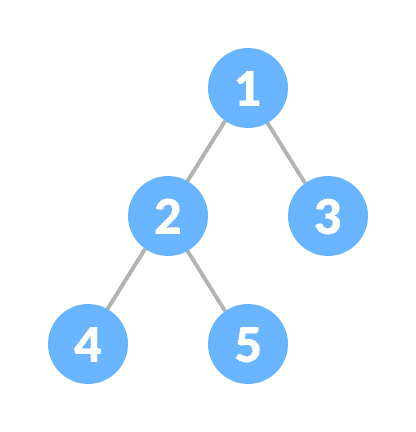
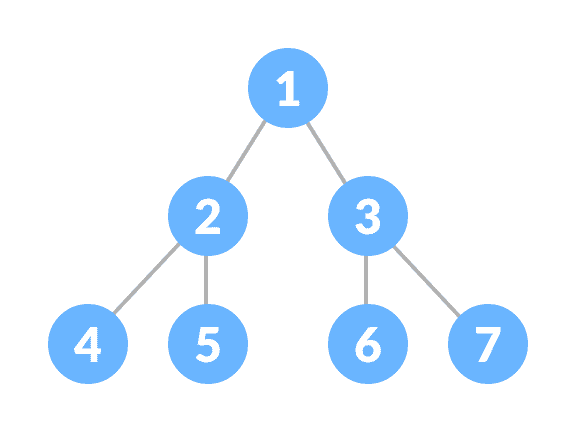
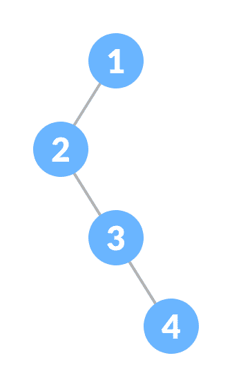
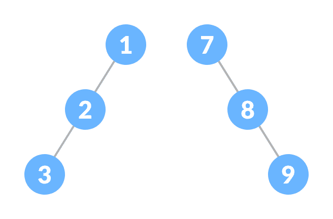
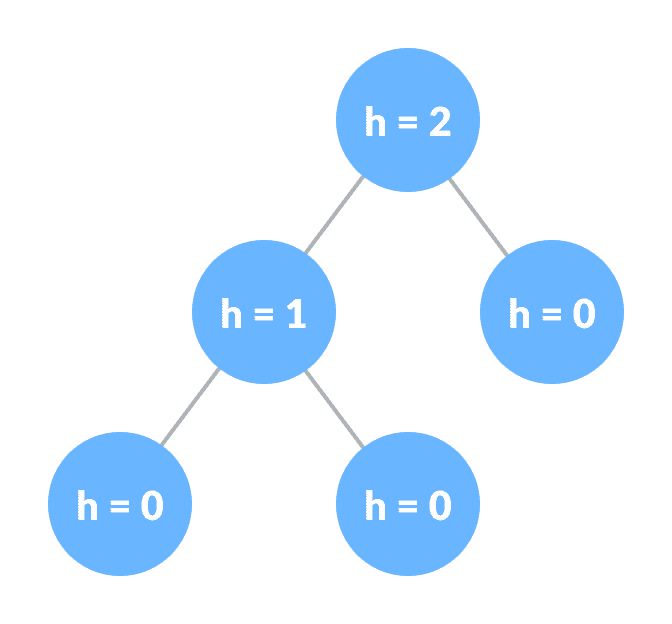
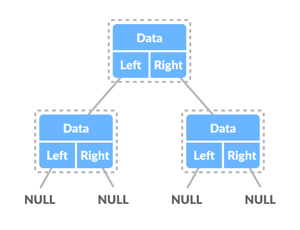

# 二叉树

> 原文： [https://www.programiz.com/dsa/binary-tree](https://www.programiz.com/dsa/binary-tree)

#### 在本教程中，您将学习二叉树及其不同类型。 另外，您还将找到 C，C++ ，Java 和 Python 中二叉树的工作示例。

二叉树是一种树数据结构，其中每个父节点最多可以有两个子节点。

例如：在下图中，每个元素最多有两个子代。



Binary Tree


* * *

## 二叉树的类型

### 全二叉树

完整的二叉树是二叉树的一种特殊类型，其中每个父节点/内部节点都有两个或没有子节点。


Full Binary Tree


要了解更多信息，请访问[完整的二叉树](http://programiz.com/dsa/full-binary-tree)。

### 完美的二叉树

完美的二叉树是一种二叉树，其中每个内部节点恰好有两个子节点，而所有叶节点都处于同一级别。



Perfect Binary Tree


要了解更多信息，请访问[完美二叉树](http://programiz.com/dsa/perfect-binary-tree)。

### 完整的二叉树

完整的二叉树就像完整的二叉树，但有两个主要区别

1.  每个级别都必须完全填满
2.  所有叶子元素都必须向左倾斜。
3.  最后一个叶子元素可能没有正确的同级，即完整的二叉树不必是完整的二叉树。


Complete Binary Tree


要了解更多信息，请访问[完整的二叉树](http://programiz.com/dsa/complete-binary-tree)。

### 退化树或病理树

退化或病态的树是具有左右一个独生子的树。



Degenerate Binary Tree


### 偏二叉树

偏斜的二叉树是一种病态/退化的树，其中该树由左节点或右节点支配。 因此，存在两种类型的斜二叉树：**左斜二叉树**和**右斜二叉树**。



Skewed Binary Tree


### 平衡二叉树

它是一种二叉树，其中每个节点的左和右子树之间的差为 0 或 1。



Balanced Binary Tree


要了解更多信息，请访问[平衡二叉树](http://programiz.com/dsa/balanced-binary-tree)。

* * *

## 二叉树表示

二叉树的节点由包含数据部分和两个指向相同类型其他结构的指针的结构表示。

```
struct node
{
 int data;
 struct node *left;
 struct node *right;
}; 
```



Binary Tree Representation


* * *

## Python，Java 和 C / C++ 示例

[Python](#python-code)[Java](#java-code)[C](#c-code)[C+](#cpp-code)

```
# Binary Tree in Python

class Node:
    def __init__(self, key):
        self.left = None
        self.right = None
        self.val = key

    # Traverse preorder
    def traversePreOrder(self):
        print(self.val, end=' ')
        if self.left:
            self.left.traversePreOrder()
        if self.right:
            self.right.traversePreOrder()

    # Traverse inorder
    def traverseInOrder(self):
        if self.left:
            self.left.traverseInOrder()
        print(self.val, end=' ')
        if self.right:
            self.right.traverseInOrder()

    # Traverse postorder
    def traversePostOrder(self):
        if self.left:
            self.left.traversePostOrder()
        if self.right:
            self.right.traversePostOrder()
        print(self.val, end=' ')

root = Node(1)

root.left = Node(2)
root.right = Node(3)

root.left.left = Node(4)

print("Pre order Traversal: ", end="")
root.traversePreOrder()
print("\nIn order Traversal: ", end="")
root.traverseInOrder()
print("\nPost order Traversal: ", end="")
root.traversePostOrder()
```

```
// Binary Tree in Java

// Node creation
class Node {
  int key;
  Node left, right;

  public Node(int item) {
  key = item;
  left = right = null;
  }
}

class BinaryTree {
  Node root;

  BinaryTree(int key) {
  root = new Node(key);
  }

  BinaryTree() {
  root = null;
  }

  // Traverse Inorder
  public void traverseInOrder(Node node) {
  if (node != null) {
    traverseInOrder(node.left);
    System.out.print(" " + node.key);
    traverseInOrder(node.right);
  }
  }

  // Traverse Postorder
  public void traversePostOrder(Node node) {
  if (node != null) {
    traversePostOrder(node.left);
    traversePostOrder(node.right);
    System.out.print(" " + node.key);
  }
  }

  // Traverse Preorder
  public void traversePreOrder(Node node) {
  if (node != null) {
    System.out.print(" " + node.key);
    traversePreOrder(node.left);
    traversePreOrder(node.right);
  }
  }

  public static void main(String[] args) {
  BinaryTree tree = new BinaryTree();

  tree.root = new Node(1);
  tree.root.left = new Node(2);
  tree.root.right = new Node(3);
  tree.root.left.left = new Node(4);

  System.out.print("Pre order Traversal: ");
  tree.traversePreOrder(tree.root);
  System.out.print("\nIn order Traversal: ");
  tree.traverseInOrder(tree.root);
  System.out.print("\nPost order Traversal: ");
  tree.traversePostOrder(tree.root);
  }
}
```

```
// Tree traversal in C

#include <stdio.h>
#include <stdlib.h>

struct node {
  int item;
  struct node* left;
  struct node* right;
};

// Inorder traversal
void inorderTraversal(struct node* root) {
  if (root == NULL) return;
  inorderTraversal(root->left);
  printf("%d ->", root->item);
  inorderTraversal(root->right);
}

// Preorder traversal
void preorderTraversal(struct node* root) {
  if (root == NULL) return;
  printf("%d ->", root->item);
  preorderTraversal(root->left);
  preorderTraversal(root->right);
}

// Postorder traversal
void postorderTraversal(struct node* root) {
  if (root == NULL) return;
  postorderTraversal(root->left);
  postorderTraversal(root->right);
  printf("%d ->", root->item);
}

// Create a new Node
struct node* createNode(value) {
  struct node* newNode = malloc(sizeof(struct node));
  newNode->item = value;
  newNode->left = NULL;
  newNode->right = NULL;

  return newNode;
}

// Insert on the left of the node
struct node* insertLeft(struct node* root, int value) {
  root->left = createNode(value);
  return root->left;
}

// Insert on the right of the node
struct node* insertRight(struct node* root, int value) {
  root->right = createNode(value);
  return root->right;
}

int main() {
  struct node* root = createNode(1);
  insertLeft(root, 2);
  insertRight(root, 3);
  insertLeft(root->left, 4);

  printf("Inorder traversal \n");
  inorderTraversal(root);

  printf("\nPreorder traversal \n");
  preorderTraversal(root);

  printf("\nPostorder traversal \n");
  postorderTraversal(root);
}
```

```
// Binary Tree in C++

#include <stdlib.h>

#include <iostream>

using namespace std;

struct node {
  int data;
  struct node *left;
  struct node *right;
};

// New node creation
struct node *newNode(int data) {
  struct node *node = (struct node *)malloc(sizeof(struct node));

  node->data = data;

  node->left = NULL;
  node->right = NULL;
  return (node);
}

// Traverse Preorder
void traversePreOrder(struct node *temp) {
  if (temp != NULL) {
    cout << " " << temp->data;
    traversePreOrder(temp->left);
    traversePreOrder(temp->right);
  }
}

// Traverse Inorder
void traverseInOrder(struct node *temp) {
  if (temp != NULL) {
    traverseInOrder(temp->left);
    cout << " " << temp->data;
    traverseInOrder(temp->right);
  }
}

// Traverse Postorder
void traversePostOrder(struct node *temp) {
  if (temp != NULL) {
    traversePostOrder(temp->left);
    traversePostOrder(temp->right);
    cout << " " << temp->data;
  }
}

int main() {
  struct node *root = newNode(1);
  root->left = newNode(2);
  root->right = newNode(3);
  root->left->left = newNode(4);

  cout << "preorder traversal: ";
  traversePreOrder(root);
  cout << "\nInorder traversal: ";
  traverseInOrder(root);
  cout << "\nPostorder traversal: ";
  traversePostOrder(root);
}
```

* * *

## 二叉树应用

*   轻松快速地访问数据
*   在路由器算法中
*   实现[堆数据结构](https://www.programiz.com/dsa/heap-data-structure)
*   语法树