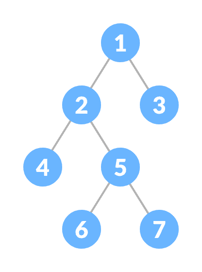

# 满二叉树

> 原文： [https://www.programiz.com/dsa/full-binary-tree](https://www.programiz.com/dsa/full-binary-tree)

#### 在本教程中，您将学习满二叉树及其不同的定理。 此外，您还将找到一些工作示例，以检查 C，C++ ，Java 和 Python 中的完整二进制树。

满二叉树是二叉树的一种特殊类型，其中每个父节点/内部节点都有两个或没有子节点。

**也称为适当的二叉树。**



满二叉树


* * *

## 满二叉树定理

```
Let, i = the number of internal nodes
       n = be the total number of nodes
       l = number of leaves
      λ = number of levels 
```

1.  叶子数为`i + 1`。
2.  节点总数为`2i + 1`。
3.  内部节点数为`(n – 1) / 2`。
4.  叶子数为`(n + 1) / 2`。
5.  节点总数为`2l – 1`。
6.  内部节点数为`l – 1`。
7.  叶子数最多为`2^(λ - 1)`。

* * *

## Python，Java 和 C/C++ 示例

以下代码用于检查树是否为满二叉树。


```
# Checking if a binary tree is a full binary tree in Python

# Creating a node
class Node:

    def __init__(self, item):
        self.item = item
        self.leftChild = None
        self.rightChild = None

# Checking full binary tree
def isFullTree(root):

    # Tree empty case
    if root is None:
        return True

    # Checking whether child is present
    if root.leftChild is None and root.rightChild is None:
        return True

    if root.leftChild is not None and root.rightChild is not None:
        return (isFullTree(root.leftChild) and isFullTree(root.rightChild))

    return False

root = Node(1)
root.rightChild = Node(3)
root.leftChild = Node(2)

root.leftChild.leftChild = Node(4)
root.leftChild.rightChild = Node(5)
root.rightChild.leftChild.leftChild = Node(6)
root.rightChild.leftChild.rightChild = Node(7)

if isFullTree(root):
    print("The tree is a full binary tree")
else:
    print("The tree is not a full binary full") 
```

```
// Checking if a binary tree is a full binary tree in Java

class Node {
  int data;
  Node leftChild, rightChild;

  Node(int item) {
  data = item;
  leftChild = rightChild = null;
  }
}

class BinaryTree {
  Node root;

  // Check for Full Binary Tree
  boolean isFullBinaryTree(Node node) {

  // Checking tree emptiness
  if (node == null)
    return true;

  // Checking the children
  if (node.leftChild == null && node.rightChild == null)
    return true;

  if ((node.leftChild != null) && (node.rightChild != null))
    return (isFullBinaryTree(node.leftChild) && isFullBinaryTree(node.rightChild));

  return false;
  }

  public static void main(String args[]) {
    BinaryTree tree = new BinaryTree();
    tree.root = new Node(1);
    tree.root.leftChild = new Node(2);
    tree.root.rightChild = new Node(3);
    tree.root.leftChild.leftChild = new Node(4);
    tree.root.leftChild.rightChild = new Node(5);
    tree.root.rightChild.leftChild = new Node(6);
    tree.root.rightChild.rightChild = new Node(7);

    if (tree.isFullBinaryTree(tree.root))
      System.out.print("The tree is a full binary tree");
    else
      System.out.print("The tree is not a full binary tree");
  }
}
```

```
// Checking if a binary tree is a full binary tree in C

#include <stdbool.h>
#include <stdio.h>
#include <stdlib.h>

struct Node {
  int item;
  struct Node *left, *right;
};

// Creation of new Node
struct Node *createNewNode(char k) {
  struct Node *node = (struct Node *)malloc(sizeof(struct Node));
  node->item = k;
  node->right = node->left = NULL;
  return node;
}

bool isFullBinaryTree(struct Node *root) {
  // Checking tree emptiness
  if (root == NULL)
    return true;

  // Checking the presence of children
  if (root->left == NULL && root->right == NULL)
    return true;

  if ((root->left) && (root->right))
    return (isFullBinaryTree(root->left) && isFullBinaryTree(root->right));

  return false;
}

int main() {
  struct Node *root = NULL;
  root = createNewNode(1);
  root->left = createNewNode(2);
  root->right = createNewNode(3);

  root->left->left = createNewNode(4);
  root->left->right = createNewNode(5);
  root->right->left->left = createNewNode(6);
  root->right->left->right = createNewNode(7);

  if (isFullBinaryTree(root))
    printf("The tree is a full binary tree\n");
  else
    printf("The tree is not a full binary full\n");
}
```

```
// Checking if a binary tree is a full binary tree in C++

#include <iostream>
using namespace std;

struct Node {
  int key;
  struct Node *left, *right;
};

// New node creation
struct Node *newNode(char k) {
  struct Node *node = (struct Node *)malloc(sizeof(struct Node));
  node->key = k;
  node->right = node->left = NULL;
  return node;
}

bool isFullBinaryTree(struct Node *root) {

  // Checking for emptiness
  if (root == NULL)
    return true;

  // Checking for the presence of children
  if (root->left == NULL && root->right == NULL)
    return true;

  if ((root->left) && (root->right))
    return (isFullBinaryTree(root->left) && isFullBinaryTree(root->right));

  return false;
}

int main() {
  struct Node *root = NULL;
  root = newNode(1);
  root->left = newNode(2);
  root->right = newNode(3);
  root->left->left = newNode(4);
  root->left->right = newNode(5);
  root->right->left->left = newNode(6);
  root->right->left->right = newNode(7);

  if (isFullBinaryTree(root))
    cout << "The tree is a full binary tree\n";
  else
    cout << "The tree is not a full binary full\n";
}
```