# 二进制搜索树（BST）

> 原文： [https://www.programiz.com/dsa/binary-search-tree](https://www.programiz.com/dsa/binary-search-tree)

#### 在本教程中，您将学习二进制搜索树的工作原理。 此外，您还将找到 C，C++ ，Java 和 Python 中的二进制搜索树的工作示例。

二进制搜索树是一种数据结构，可快速使我们维护一个排序的数字列表。

*   之所以称为二叉树，是因为每个树节点最多有两个子节点。
*   之所以称为搜索树，是因为它可用于在`O(log(n))`时间中搜索数字的存在。

将二分搜索树与常规[二叉树](/data-structures/trees)分开的属性是

1.  左子树的所有节点均小于根节点
2.  右子树的所有节点均大于根节点
3.  每个节点的两个子树也是 BST，即它们具有上述两个属性

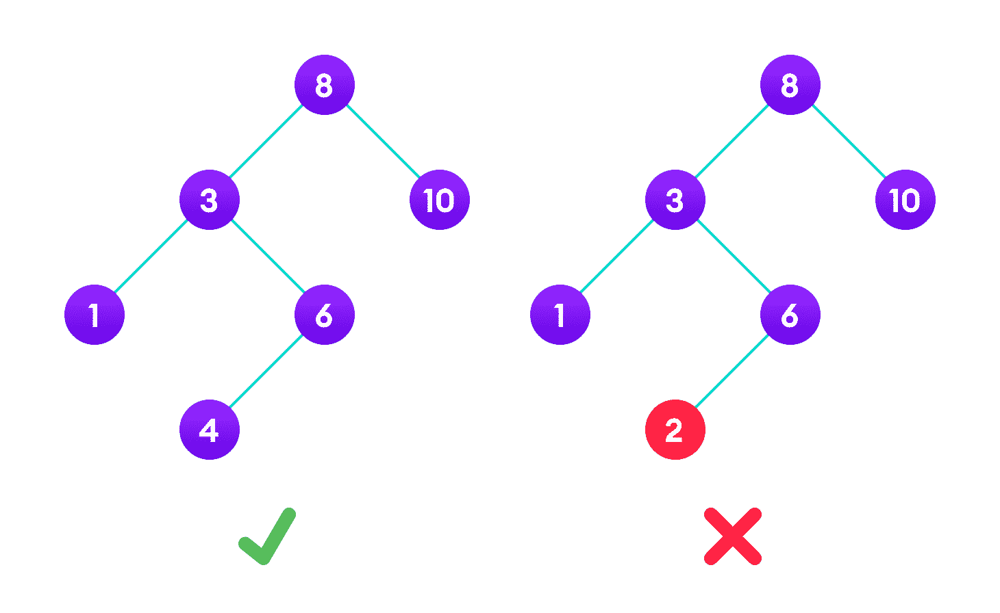

A tree having a right subtree with one value smaller than the root is shown to demonstrate that it is not a valid binary search tree


右边的二叉树不是二叉搜索树，因为节点“3”的右子树包含的值小于它。

您可以对二进制搜索树执行两个基本操作：

* * *

## 搜索操作

该算法取决于 BST 的属性，即每个左子树的值都低于根，而每个右子树的值都高于根。

如果该值低于根，则可以确定该值不在正确的子树中。 我们只需要在左子树中搜索，如果该值在根之上，则可以肯定地说该值不在左子树中； 我们只需要在正确的子树中搜索。

**算法：**

```
If root == NULL 
    return NULL;
If number == root->data 
    return root->data;
If number < root->data 
    return search(root->left)
If number > root->data 
    return search(root->right)
```

让我们尝试通过图表将其可视化。

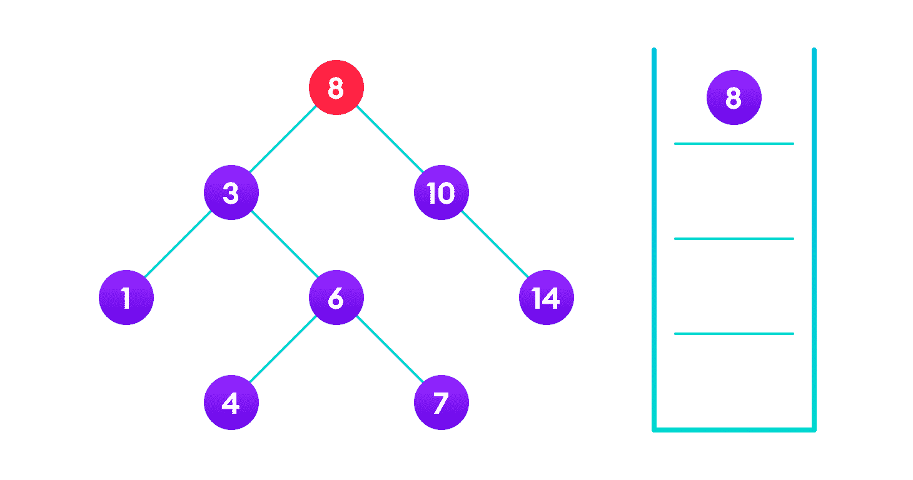

4 is not found so, traverse through the left subtree of 8


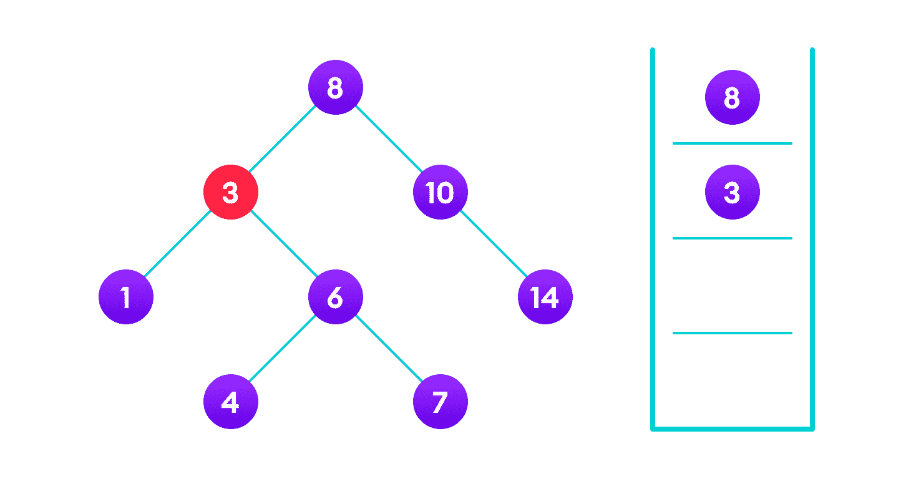

4 is not found so, traverse through the right subtree of 3


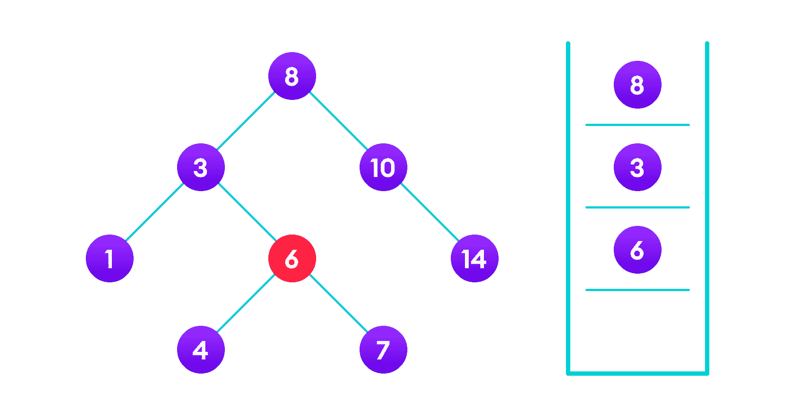

4 is not found so, traverse through the left subtree of 6


4 is found


如果找到该值，则返回该值，以便在每个递归步骤中将其传播，如下图所示。

如果您可能已经注意到，我们已经四次调用`return search(struct node *)`。 当我们返回新节点或`NULL`时，该值会一次又一次返回，直到`search(root)`返回最终结果。

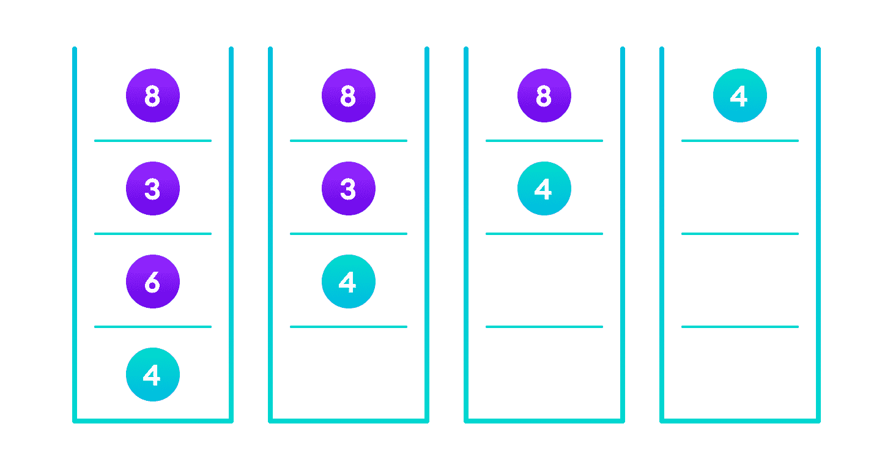

If the value is found in any of the subtrees, it is propagated up so that in the end it is returned, otherwise null is returned


如果找不到该值，则最终到达叶节点的左或右子节点，该子节点为`NULL`，并传播并返回。

* * *

## 插入操作

在正确的位置插入值类似于搜索，因为我们尝试维护以下规则：左子树小于根，右子树大于根。

我们继续根据值去右子树或左子树，当我们到达左或右子树为`null`的点时，将新节点放在那里。

**Algorithm:**

```
If node == NULL 
    return createNode(data)
if (data < node->data)
    node->left  = insert(node->left, data);
else if (data > node->data)
    node->right = insert(node->right, data);  
return node;
```

该算法并不像看起来那样简单。 让我们尝试可视化如何将数字添加到现有的 BST。

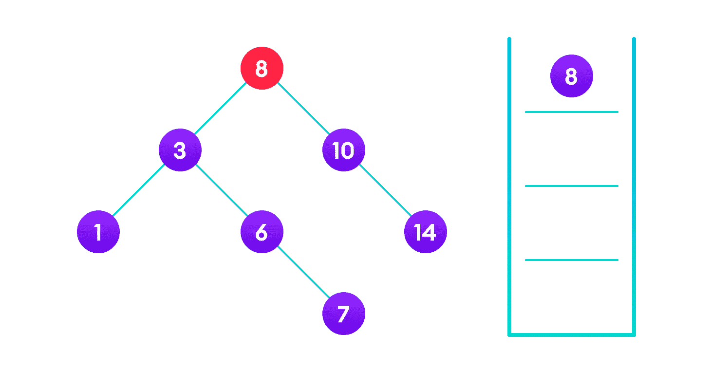

4<8 so, transverse through the left child of 8


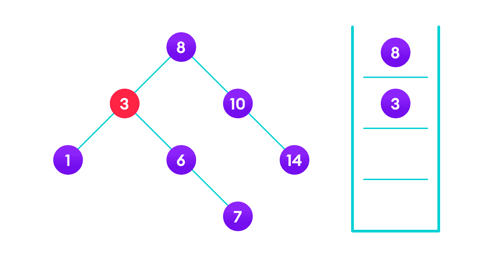

4>3 so, transverse through the right child of 8


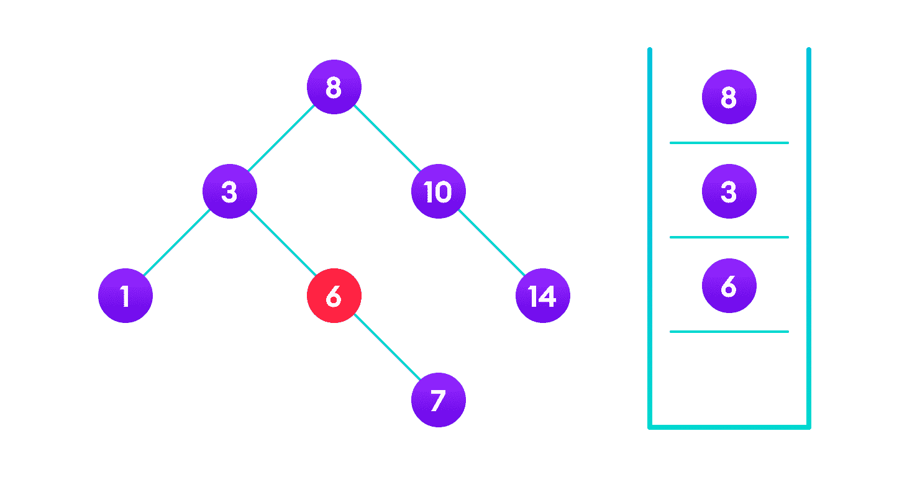

4<6 so, transverse through the left child of 6


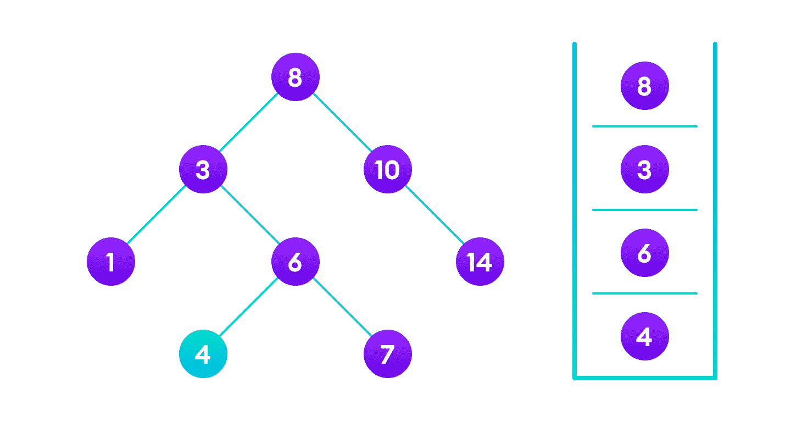

Insert 4 as a left child of 6


我们已经附加了节点，但是我们仍然必须退出该函数，而不会损坏树的其余部分。 这是最后的`return node;`派上用场的地方。 在`NULL`的情况下，将返回新创建的节点并将其附加到父节点，否则在返回到根节点之前，将返回相同的节点，而不会进行任何更改。

这可以确保当我们向后移动树时，其他节点连接不会更改。

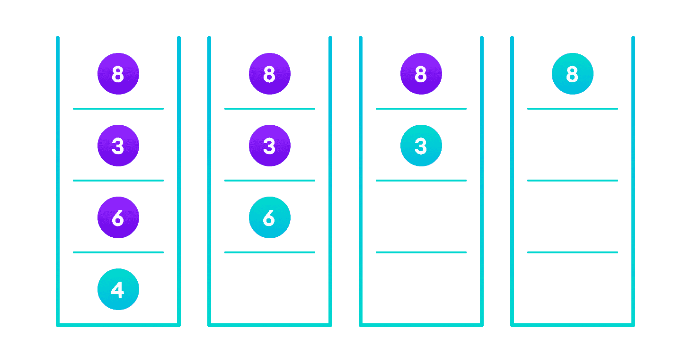

Image showing the importance of returning the root element at the end so that the elements don't lose their position during the upward recursion step.


* * *

## 删除操作

从二进制搜索树中删除节点的情况有三种。

### 案例一

在第一种情况下，要删除的节点是叶节点。 在这种情况下，只需从树中删除该节点即可。

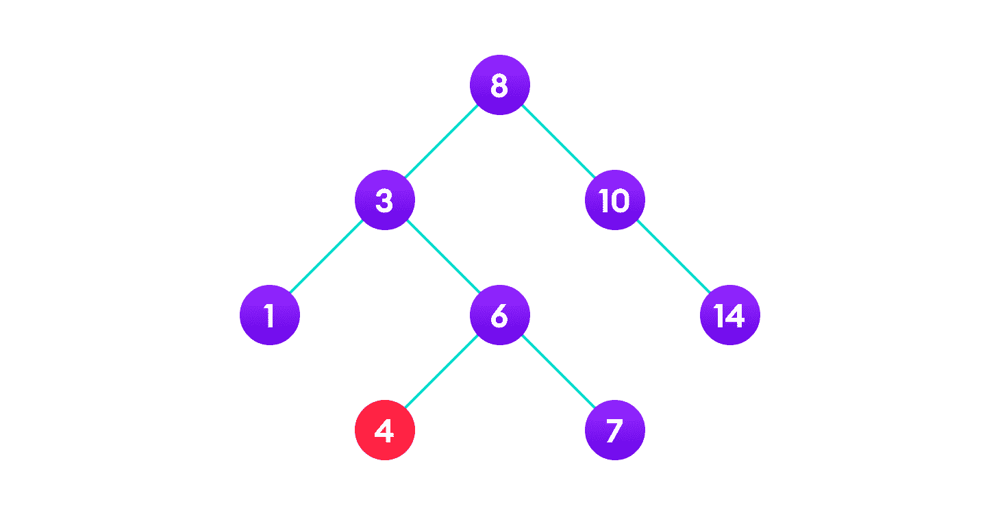

4 is to be deleted


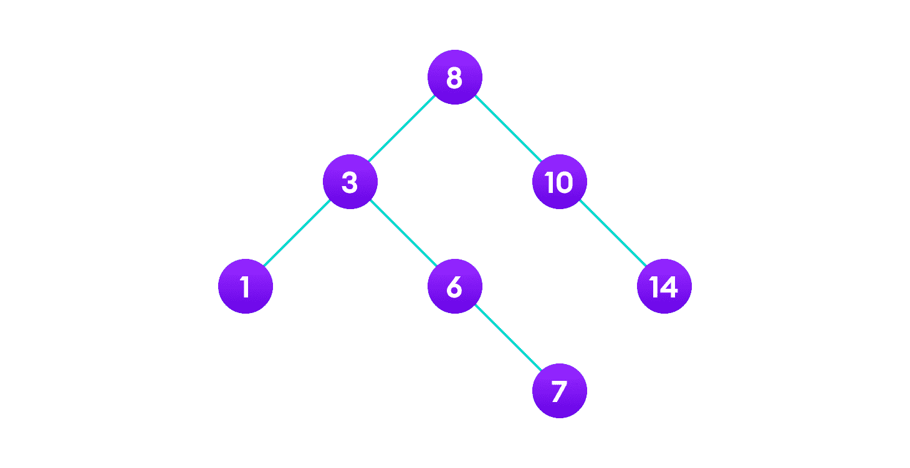

Delete the node


### 案例二

在第二种情况下，要删除的节点只有一个子节点。 在这种情况下，请执行以下步骤：

1.  将该节点替换为其子节点。
2.  从其原始位置删除子节点。

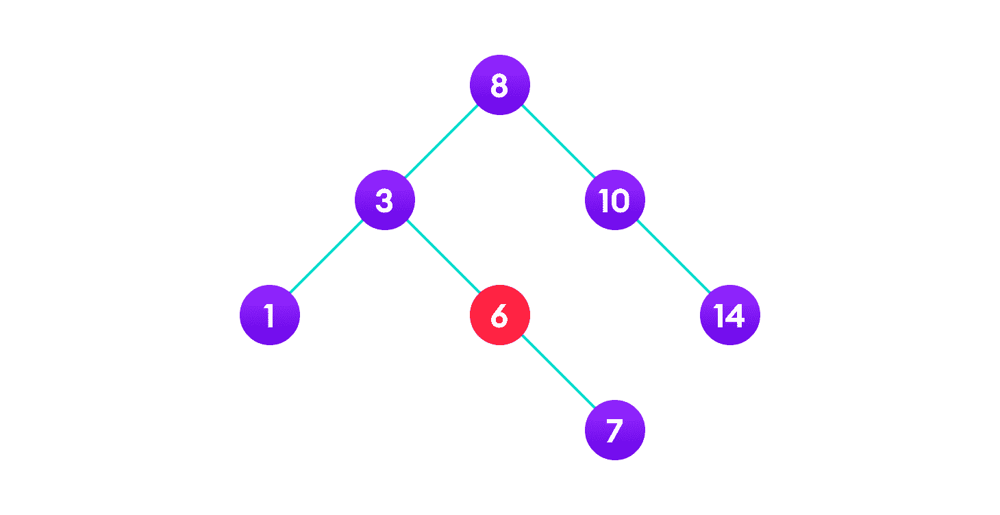

6 is to be deleted


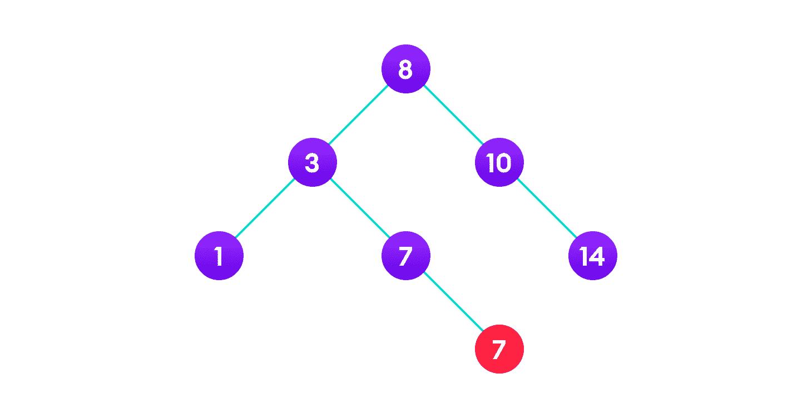

copy the value of its child to the node and delete the child


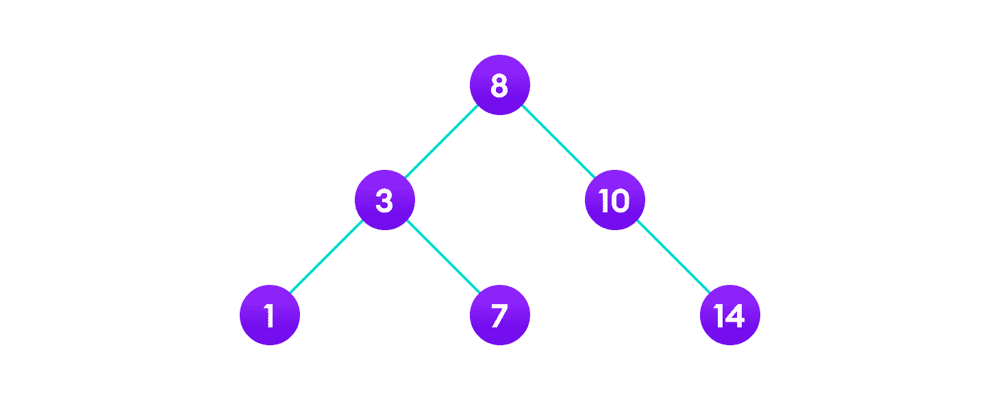

Final tree


### 案例三

在第三种情况下，要删除的节点有两个孩子。 在这种情况下，请执行以下步骤：

1.  获取该节点的有序后继者。
2.  将节点替换为有序后继节点。
3.  从原始位置卸下有序后继器。

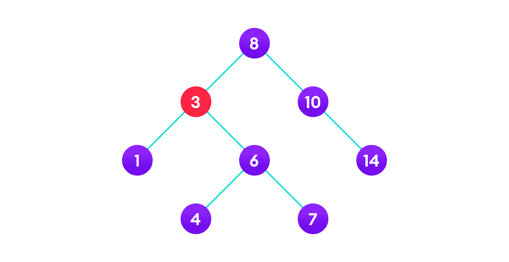

3 is to be deleted


Copy the value of the inorder successor (4) to the node


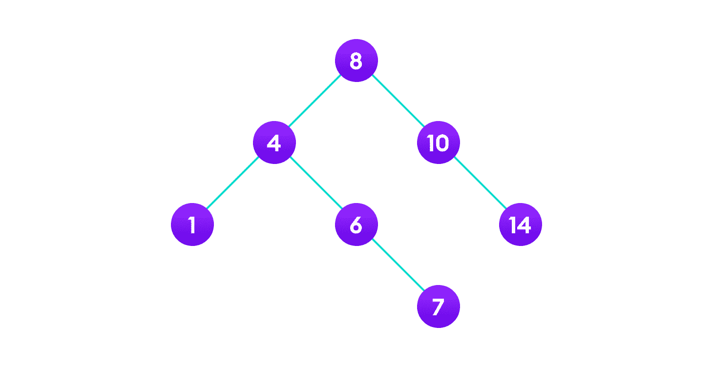

Delete the inorder successor


* * *

## Python，Java 和 C/C++ 示例

[Python](#python-code)[Java](#java-code)[C](#c-code)[C++](#cpp-code)

```
# Binary Search Tree operations in Python

# Create a node
class Node:
    def __init__(self, key):
        self.key = key
        self.left = None
        self.right = None

# Inorder traversal
def inorder(root):
    if root is not None:
        # Traverse left
        inorder(root.left)

        # Traverse root
        print(str(root.key) + "->", end=' ')

        # Traverse right
        inorder(root.right)

# Insert a node
def insert(node, key):

    # Return a new node if the tree is empty
    if node is None:
        return Node(key)

    # Traverse to the right place and insert the node
    if key < node.key:
        node.left = insert(node.left, key)
    else:
        node.right = insert(node.right, key)

    return node

# Find the inorder successor
def minValueNode(node):
    current = node

    # Find the leftmost leaf
    while(current.left is not None):
        current = current.left

    return current

# Deleting a node
def deleteNode(root, key):

    # Return if the tree is empty
    if root is None:
        return root

    # Find the node to be deleted
    if key < root.key:
        root.left = deleteNode(root.left, key)
    elif(key > root.key):
        root.right = deleteNode(root.right, key)
    else:
        # If the node is with only one child or no child
        if root.left is None:
            temp = root.right
            root = None
            return temp

        elif root.right is None:
            temp = root.left
            root = None
            return temp

        # If the node has two children,
        # place the inorder successor in position of the node to be deleted
        temp = minValueNode(root.right)

        root.key = temp.key

        # Delete the inorder successor
        root.right = deleteNode(root.right, temp.key)

    return root

root = None
root = insert(root, 8)
root = insert(root, 3)
root = insert(root, 1)
root = insert(root, 6)
root = insert(root, 7)
root = insert(root, 10)
root = insert(root, 14)
root = insert(root, 4)

print("Inorder traversal: ", end=' ')
inorder(root)

print("\nDelete 10")
root = deleteNode(root, 10)
print("Inorder traversal: ", end=' ')
inorder(root)
```

```
// Binary Search Tree operations in Java

class BinarySearchTree {
  class Node {
    int key;
    Node left, right;

    public Node(int item) {
      key = item;
      left = right = null;
    }
  }

  Node root;

  BinarySearchTree() {
    root = null;
  }

  void insert(int key) {
    root = insertKey(root, key);
  }

  // Insert key in the tree
  Node insertKey(Node root, int key) {
    // Return a new node if the tree is empty
    if (root == null) {
      root = new Node(key);
      return root;
    }

    // Traverse to the right place and insert the node
    if (key < root.key)
      root.left = insertKey(root.left, key);
    else if (key > root.key)
      root.right = insertKey(root.right, key);

    return root;
  }

  void inorder() {
    inorderRec(root);
  }

  // Inorder Traversal
  void inorderRec(Node root) {
    if (root != null) {
      inorderRec(root.left);
      System.out.print(root.key + " -> ");
      inorderRec(root.right);
    }
  }

  void deleteKey(int key) {
    root = deleteRec(root, key);
  }

  Node deleteRec(Node root, int key) {
    // Return if the tree is empty
    if (root == null)
      return root;

    // Find the node to be deleted
    if (key < root.key)
      root.left = deleteRec(root.left, key);
    else if (key > root.key)
      root.right = deleteRec(root.right, key);
    else {
      // If the node is with only one child or no child
      if (root.left == null)
        return root.right;
      else if (root.right == null)
        return root.left;

      // If the node has two children
      // Place the inorder successor in position of the node to be deleted
      root.key = minValue(root.right);

      // Delete the inorder successor
      root.right = deleteRec(root.right, root.key);
    }

    return root;
  }

  // Find the inorder successor
  int minValue(Node root) {
    int minv = root.key;
    while (root.left != null) {
      minv = root.left.key;
      root = root.left;
    }
    return minv;
  }

  // Driver Program to test above functions
  public static void main(String[] args) {
    BinarySearchTree tree = new BinarySearchTree();

    tree.insert(8);
    tree.insert(3);
    tree.insert(1);
    tree.insert(6);
    tree.insert(7);
    tree.insert(10);
    tree.insert(14);
    tree.insert(4);

    System.out.print("Inorder traversal: ");
    tree.inorder();

    System.out.println("\n\nAfter deleting 10");
    tree.deleteKey(10);
    System.out.print("Inorder traversal: ");
    tree.inorder();
  }
}
```

```
// Binary Search Tree operations in C

#include <stdio.h>
#include <stdlib.h>

struct node {
  int key;
  struct node *left, *right;
};

// Create a node
struct node *newNode(int item) {
  struct node *temp = (struct node *)malloc(sizeof(struct node));
  temp->key = item;
  temp->left = temp->right = NULL;
  return temp;
}

// Inorder Traversal
void inorder(struct node *root) {
  if (root != NULL) {
    // Traverse left
    inorder(root->left);

    // Traverse root
    printf("%d -> ", root->key);

    // Traverse right
    inorder(root->right);
  }
}

// Insert a node
struct node *insert(struct node *node, int key) {
  // Return a new node if the tree is empty
  if (node == NULL) return newNode(key);

  // Traverse to the right place and insert the node
  if (key < node->key)
    node->left = insert(node->left, key);
  else
    node->right = insert(node->right, key);

  return node;
}

// Find the inorder successor
struct node *minValueNode(struct node *node) {
  struct node *current = node;

  // Find the leftmost leaf
  while (current && current->left != NULL)
    current = current->left;

  return current;
}

// Deleting a node
struct node *deleteNode(struct node *root, int key) {
  // Return if the tree is empty
  if (root == NULL) return root;

  // Find the node to be deleted
  if (key < root->key)
    root->left = deleteNode(root->left, key);
  else if (key > root->key)
    root->right = deleteNode(root->right, key);

  else {
    // If the node is with only one child or no child
    if (root->left == NULL) {
      struct node *temp = root->right;
      free(root);
      return temp;
    } else if (root->right == NULL) {
      struct node *temp = root->left;
      free(root);
      return temp;
    }

    // If the node has two children
    struct node *temp = minValueNode(root->right);

    // Place the inorder successor in position of the node to be deleted
    root->key = temp->key;

    // Delete the inorder successor
    root->right = deleteNode(root->right, temp->key);
  }
  return root;
}

// Driver code
int main() {
  struct node *root = NULL;
  root = insert(root, 8);
  root = insert(root, 3);
  root = insert(root, 1);
  root = insert(root, 6);
  root = insert(root, 7);
  root = insert(root, 10);
  root = insert(root, 14);
  root = insert(root, 4);

  printf("Inorder traversal: ");
  inorder(root);

  printf("\nAfter deleting 10\n");
  root = deleteNode(root, 10);
  printf("Inorder traversal: ");
  inorder(root);
}
```

```
// Binary Search Tree operations in C++

#include <iostream>
using namespace std;

struct node {
  int key;
  struct node *left, *right;
};

// Create a node
struct node *newNode(int item) {
  struct node *temp = (struct node *)malloc(sizeof(struct node));
  temp->key = item;
  temp->left = temp->right = NULL;
  return temp;
}

// Inorder Traversal
void inorder(struct node *root) {
  if (root != NULL) {
    // Traverse left
    inorder(root->left);

    // Traverse root
    cout << root->key << " -> ";

    // Traverse right
    inorder(root->right);
  }
}

// Insert a node
struct node *insert(struct node *node, int key) {
  // Return a new node if the tree is empty
  if (node == NULL) return newNode(key);

  // Traverse to the right place and insert the node
  if (key < node->key)
    node->left = insert(node->left, key);
  else
    node->right = insert(node->right, key);

  return node;
}

// Find the inorder successor
struct node *minValueNode(struct node *node) {
  struct node *current = node;

  // Find the leftmost leaf
  while (current && current->left != NULL)
    current = current->left;

  return current;
}

// Deleting a node
struct node *deleteNode(struct node *root, int key) {
  // Return if the tree is empty
  if (root == NULL) return root;

  // Find the node to be deleted
  if (key < root->key)
    root->left = deleteNode(root->left, key);
  else if (key > root->key)
    root->right = deleteNode(root->right, key);
  else {
    // If the node is with only one child or no child
    if (root->left == NULL) {
      struct node *temp = root->right;
      free(root);
      return temp;
    } else if (root->right == NULL) {
      struct node *temp = root->left;
      free(root);
      return temp;
    }

    // If the node has two children
    struct node *temp = minValueNode(root->right);

    // Place the inorder successor in position of the node to be deleted
    root->key = temp->key;

    // Delete the inorder successor
    root->right = deleteNode(root->right, temp->key);
  }
  return root;
}

// Driver code
int main() {
  struct node *root = NULL;
  root = insert(root, 8);
  root = insert(root, 3);
  root = insert(root, 1);
  root = insert(root, 6);
  root = insert(root, 7);
  root = insert(root, 10);
  root = insert(root, 14);
  root = insert(root, 4);

  cout << "Inorder traversal: ";
  inorder(root);

  cout << "\nAfter deleting 10\n";
  root = deleteNode(root, 10);
  cout << "Inorder traversal: ";
  inorder(root);
}
```

* * *

## 二叉搜索树的复杂性

### 时间复杂度

| **操作** | **最佳案例复杂度** | **平均案件复杂度** | **最坏情况的复杂性** |
| 搜索 | `O(log n)` | `O(log n)` | `O(n)` |
| 插入 | `O(log n)` | `O(log n)` | `O(n)` |
| 删除中 | `O(log n)` | `O(log n)` | `O(n)` |

这里，`n`是树中的节点数。

### 空间复杂度

所有操作的空间复杂度为`O(n)`。

* * *

## 二进制搜索树应用

1.  在数据库中进行多级索引
2.  用于动态排序
3.  用于管理 Unix 内核中的虚拟内存区域