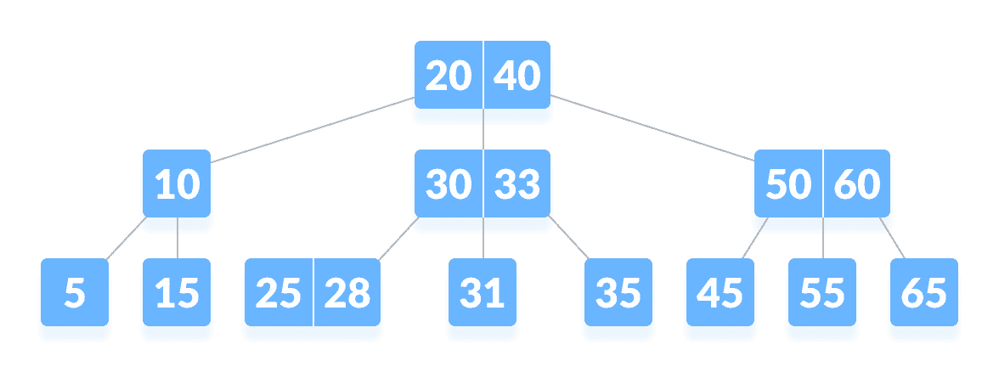
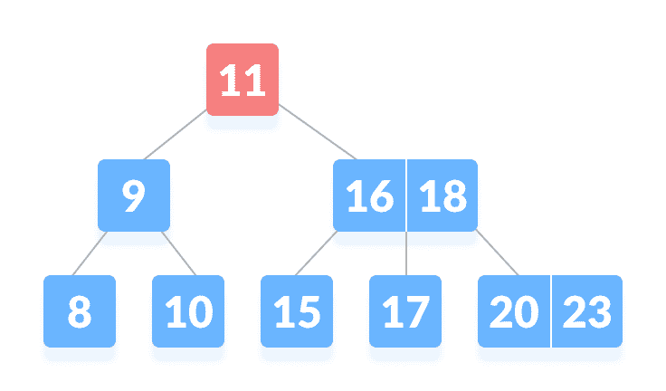
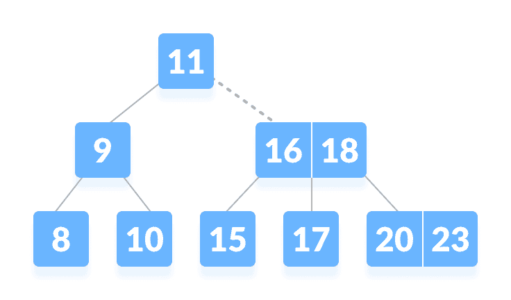
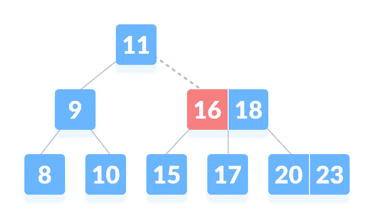
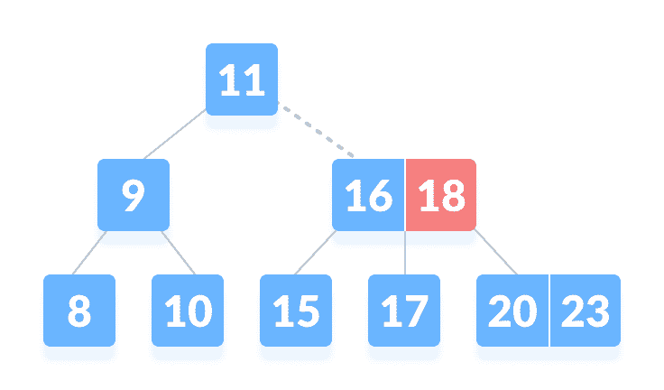
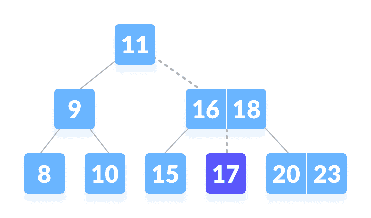

# B 树

> 原文： [https://www.programiz.com/dsa/b-tree](https://www.programiz.com/dsa/b-tree)

#### 在本教程中，您将学习什么是 B 树。 此外，您还将在 C，C++ ，Java 和 Python 的 B 树上找到搜索操作的工作示例。

B 树是一种特殊类型的自平衡搜索树，其中每个节点可以包含多个关键字，并且可以具有两个以上子节点。 它是[二叉搜索树](https://www.programiz.com/dsa/binary-search-tree)的广义形式。

它也被称为高度平衡的 m-way 树。



B-tree


* * *

## 为什么选择 B 树？

随着访问硬盘等物理存储介质所需的时间越来越少，对 B 树的需求也随之增加。 辅助存储设备速度较慢，容量较大。 需要这种类型的数据结构以最小化磁盘访问。

其他数据结构（例如二叉搜索树，avl 树，红黑树等）只能在一个节点中存储一个密钥。 如果必须存储大量密钥，则此类树的高度将变得非常大，并且访问时间会增加。

但是，B 树可以在一个节点中存储许多密钥，并且可以具有多个子节点。 这样可以大大降低高度，从而可以更快地访问磁盘。

* * *

## B 树属性

1.  对于每个节点`x`，密钥以升序存储。
2.  在每个节点中，都有一个布尔值`x.leaf`，如果`x`是叶，则为`true`。
3.  如果`n`是树的顺序，则每个内部节点最多可以包含`n-1`键以及指向每个子节点的指针。
4.  除根节点外，每个节点最多可以有`n`个子节点，并且至少`n / 2`个子节点。
5.  所有叶子具有相同的深度（即树的高度`h`）。
6.  根至少有 2 个子节点，并且至少包含 1 个密钥。
7.  如果`n≥1`，则对于任何高度为`h`且最小度为`t ≥ 2`的`n`键 B 树，`h ≥ log_t(n+1)/2`。

* * *

## 运作方式

### 正在搜寻

在 B 树中搜索元素是在二叉搜索树中搜索元素的一般形式。 遵循以下步骤。

1.  从根节点开始，将`k`与节点的第一个键进行比较。
    如果为`k = the first key of the node`，则返回节点和索引。
2.  如果为`k.leaf = true`，则返回`NULL`（即未找到）。
3.  如果`k < the first key of the root node`，则递归搜索此键的左子级。
4.  如果当前节点和`k > the first key`中有多个密钥，请将`k`与该节点中的下一个密钥进行比较。
    如果为`k < next key`，则搜索该键的左子键（即`k`位于第一键和第二键之间）。
    否则，搜索密钥的右子级。
5.  重复步骤 1 到 4，直到到达叶子。

### 搜寻范例

1.  让我们在等级 3 下面的树中搜索关键字`k = 17`。

    

    B 树

    

2.  在根目录中找不到`k`，因此，请将其与根密钥进行比较。 在根节点 上找不到

    

    k

    

3.  从`k > 11`开始，转到根节点的右子节点。

    

    转到右侧的子树

    

4.  比较`k`与 16。由于`k > 16`，将 k 与下一个键 18 比较。

    

    与从左到右的键比较

    

5.  由于`k < 18`，k 在 16 到 18 之间。在右子级 16 或左子级 18 中搜索。

    

    `k`在 16 到 18 之间

    

6.  找到了`k`。

    

    找到了`k`

    

* * *

## 搜索元素的算法

```
BtreeSearch(x, k)
 i = 1
 while i ≤ n[x] and k ≥ keyi[x]        // n[x] means number of keys in x node
    do i = i + 1
if i  n[x] and k = keyi[x]
    then return (x, i)
if leaf [x]
    then return NIL
else
    return BtreeSearch(ci[x], k) 
```

要了解有关不同 B 树操作的更多信息，请访问

*   [插入 B 树](https://www.programiz.com/dsa/insertion-into-a-b-tree)
*   [B 树](https://www.programiz.com/dsa/deletion-from-a-b-tree)上的删除

* * *

## Python，Java 和 C/C++ 示例

[Python](#python-code)[Java](#java-code)[C](#c-code)[C++](#cpp-code)

```
# Searching a key on a B-tree in Python

# Create node
class BTreeNode:
    def __init__(self, leaf=False):
        self.leaf = leaf
        self.keys = []
        self.child = []

class BTree:
    def __init__(self, t):
        self.root = BTreeNode(True)
        self.t = t

    # Print the tree
    def print_tree(self, x, l=0):
        print("Level ", l, " ", len(x.keys), end=":")
        for i in x.keys:
            print(i, end=" ")
        print()
        l += 1
        if len(x.child) > 0:
            for i in x.child:
                self.print_tree(i, l)

    # Search key
    def search_key(self, k, x=None):
        if x is not None:
            i = 0
            while i < len(x.keys) and k > x.keys[i][0]:
                i += 1
            if i < len(x.keys) and k == x.keys[i][0]:
                return (x, i)
            elif x.leaf:
                return None
            else:
                return self.search_key(k, x.child[i])
        else:
            return self.search_key(k, self.root)

    # Insert the key
    def insert_key(self, k):
        root = self.root
        if len(root.keys) == (2 * self.t) - 1:
            temp = BTreeNode()
            self.root = temp
            temp.child.insert_key(0, root)
            self.split(temp, 0)
            self.insert_non_full(temp, k)
        else:
            self.insert_non_full(root, k)

    # Insert non full condition
    def insert_non_full(self, x, k):
        i = len(x.keys) - 1
        if x.leaf:
            x.keys.append((None, None))
            while i >= 0 and k[0] < x.keys[i][0]:
                x.keys[i + 1] = x.keys[i]
                i -= 1
            x.keys[i + 1] = k
        else:
            while i >= 0 and k[0] < x.keys[i][0]:
                i -= 1
            i += 1
            if len(x.child[i].keys) == (2 * self.t) - 1:
                self.split(x, i)
                if k[0] > x.keys[i][0]:
                    i += 1
            self.insert_non_full(x.child[i], k)

    # Split
    def split(self, x, i):
        t = self.t
        y = x.child[i]
        z = BTreeNode(y.leaf)
        x.child.insert_key(i + 1, z)
        x.keys.insert_key(i, y.keys[t - 1])
        z.keys = y.keys[t: (2 * t) - 1]
        y.keys = y.keys[0: t - 1]
        if not y.leaf:
            z.child = y.child[t: 2 * t]
            y.child = y.child[0: t - 1]

def main():
    B = BTree(3)

    for i in range(10):
        B.insert_key((i, 2 * i))

    B.print_tree(B.root)

    if B.search_key(8) is not None:
        print("\nFound")
    else:
        print("\nNot found")

if __name__ == '__main__':
    main()
```

```
 // Searching a key on a B-tree in Java 

public class BTree {

  private int T;

  // Node creation
  public class Node {
    int n;
    int key[] = new int[2 * T - 1];
    Node child[] = new Node[2 * T];
    boolean leaf = true;

    public int Find(int k) {
      for (int i = 0; i < this.n; i++) {
        if (this.key[i] == k) {
          return i;
        }
      }
      return -1;
    };
  }

  public BTree(int t) {
    T = t;
    root = new Node();
    root.n = 0;
    root.leaf = true;
  }

  private Node root;

  // Search key
  private Node Search(Node x, int key) {
    int i = 0;
    if (x == null)
      return x;
    for (i = 0; i < x.n; i++) {
      if (key < x.key[i]) {
        break;
      }
      if (key == x.key[i]) {
        return x;
      }
    }
    if (x.leaf) {
      return null;
    } else {
      return Search(x.child[i], key);
    }
  }

  // Splitting the node
  private void Split(Node x, int pos, Node y) {
    Node z = new Node();
    z.leaf = y.leaf;
    z.n = T - 1;
    for (int j = 0; j < T - 1; j++) {
      z.key[j] = y.key[j + T];
    }
    if (!y.leaf) {
      for (int j = 0; j < T; j++) {
        z.child[j] = y.child[j + T];
      }
    }
    y.n = T - 1;
    for (int j = x.n; j >= pos + 1; j--) {
      x.child[j + 1] = x.child[j];
    }
    x.child[pos + 1] = z;

    for (int j = x.n - 1; j >= pos; j--) {
      x.key[j + 1] = x.key[j];
    }
    x.key[pos] = y.key[T - 1];
    x.n = x.n + 1;
  }

  // Inserting a value
  public void Insert(final int key) {
    Node r = root;
    if (r.n == 2 * T - 1) {
      Node s = new Node();
      root = s;
      s.leaf = false;
      s.n = 0;
      s.child[0] = r;
      Split(s, 0, r);
      insertValue(s, key);
    } else {
      insertValue(r, key);
    }
  }

  // Insert the node
  final private void insertValue(Node x, int k) {

    if (x.leaf) {
      int i = 0;
      for (i = x.n - 1; i >= 0 && k < x.key[i]; i--) {
        x.key[i + 1] = x.key[i];
      }
      x.key[i + 1] = k;
      x.n = x.n + 1;
    } else {
      int i = 0;
      for (i = x.n - 1; i >= 0 && k < x.key[i]; i--) {
      }
      ;
      i++;
      Node tmp = x.child[i];
      if (tmp.n == 2 * T - 1) {
        Split(x, i, tmp);
        if (k > x.key[i]) {
          i++;
        }
      }
      insertValue(x.child[i], k);
    }

  }

  public void Show() {
    Show(root);
  }

  // Display
  private void Show(Node x) {
    assert (x == null);
    for (int i = 0; i < x.n; i++) {
      System.out.print(x.key[i] + " ");
    }
    if (!x.leaf) {
      for (int i = 0; i < x.n + 1; i++) {
        Show(x.child[i]);
      }
    }
  }

  // Check if present
  public boolean Contain(int k) {
    if (this.Search(root, k) != null) {
      return true;
    } else {
      return false;
    }
  }

  public static void main(String[] args) {
    BTree b = new BTree(3);
    b.Insert(8);
    b.Insert(9);
    b.Insert(10);
    b.Insert(11);
    b.Insert(15);
    b.Insert(20);
    b.Insert(17);

    b.Show();

    if (b.Contain(12)) {
      System.out.println("\nfound");
    } else {
      System.out.println("\nnot found");
    }
    ;
  }
}
```

```
// Searching a key on a B-tree in C

#include <stdio.h>
#include <stdlib.h>

#define MAX 3
#define MIN 2

struct BTreeNode {
  int val[MAX + 1], count;
  struct BTreeNode *link[MAX + 1];
};

struct BTreeNode *root;

// Create a node
struct BTreeNode *createNode(int val, struct BTreeNode *child) {
  struct BTreeNode *newNode;
  newNode = (struct BTreeNode *)malloc(sizeof(struct BTreeNode));
  newNode->val[1] = val;
  newNode->count = 1;
  newNode->link[0] = root;
  newNode->link[1] = child;
  return newNode;
}

// Insert node
void insertNode(int val, int pos, struct BTreeNode *node,
        struct BTreeNode *child) {
  int j = node->count;
  while (j > pos) {
    node->val[j + 1] = node->val[j];
    node->link[j + 1] = node->link[j];
    j--;
  }
  node->val[j + 1] = val;
  node->link[j + 1] = child;
  node->count++;
}

// Split node
void splitNode(int val, int *pval, int pos, struct BTreeNode *node,
         struct BTreeNode *child, struct BTreeNode **newNode) {
  int median, j;

  if (pos > MIN)
    median = MIN + 1;
  else
    median = MIN;

  *newNode = (struct BTreeNode *)malloc(sizeof(struct BTreeNode));
  j = median + 1;
  while (j <= MAX) {
    (*newNode)->val[j - median] = node->val[j];
    (*newNode)->link[j - median] = node->link[j];
    j++;
  }
  node->count = median;
  (*newNode)->count = MAX - median;

  if (pos <= MIN) {
    insertNode(val, pos, node, child);
  } else {
    insertNode(val, pos - median, *newNode, child);
  }
  *pval = node->val[node->count];
  (*newNode)->link[0] = node->link[node->count];
  node->count--;
}

// Set the value
int setValue(int val, int *pval,
           struct BTreeNode *node, struct BTreeNode **child) {
  int pos;
  if (!node) {
    *pval = val;
    *child = NULL;
    return 1;
  }

  if (val < node->val[1]) {
    pos = 0;
  } else {
    for (pos = node->count;
       (val < node->val[pos] && pos > 1); pos--)
      ;
    if (val == node->val[pos]) {
      printf("Duplicates are not permitted\n");
      return 0;
    }
  }
  if (setValue(val, pval, node->link[pos], child)) {
    if (node->count < MAX) {
      insertNode(*pval, pos, node, *child);
    } else {
      splitNode(*pval, pval, pos, node, *child, child);
      return 1;
    }
  }
  return 0;
}

// Insert the value
void insert(int val) {
  int flag, i;
  struct BTreeNode *child;

  flag = setValue(val, &i, root, &child);
  if (flag)
    root = createNode(i, child);
}

// Search node
void search(int val, int *pos, struct BTreeNode *myNode) {
  if (!myNode) {
    return;
  }

  if (val < myNode->val[1]) {
    *pos = 0;
  } else {
    for (*pos = myNode->count;
       (val < myNode->val[*pos] && *pos > 1); (*pos)--)
      ;
    if (val == myNode->val[*pos]) {
      printf("%d is found", val);
      return;
    }
  }
  search(val, pos, myNode->link[*pos]);

  return;
}

// Traverse then nodes
void traversal(struct BTreeNode *myNode) {
  int i;
  if (myNode) {
    for (i = 0; i < myNode->count; i++) {
      traversal(myNode->link[i]);
      printf("%d ", myNode->val[i + 1]);
    }
    traversal(myNode->link[i]);
  }
}

int main() {
  int val, ch;

  insert(8);
  insert(9);
  insert(10);
  insert(11);
  insert(15);
  insert(16);
  insert(17);
  insert(18);
  insert(20);
  insert(23);

  traversal(root);

  printf("\n");
  search(11, &ch, root);
}
```

```
// Searching a key on a B-tree in C++

#include <iostream>
using namespace std;

class TreeNode {
  int *keys;
  int t;
  TreeNode **C;
  int n;
  bool leaf;

   public:
  TreeNode(int temp, bool bool_leaf);

  void insertNonFull(int k);
  void splitChild(int i, TreeNode *y);
  void traverse();

  TreeNode *search(int k);

  friend class BTree;
};

class BTree {
  TreeNode *root;
  int t;

   public:
  BTree(int temp) {
    root = NULL;
    t = temp;
  }

  void traverse() {
    if (root != NULL)
      root->traverse();
  }

  TreeNode *search(int k) {
    return (root == NULL) ? NULL : root->search(k);
  }

  void insert(int k);
};

TreeNode::TreeNode(int t1, bool leaf1) {
  t = t1;
  leaf = leaf1;

  keys = new int[2 * t - 1];
  C = new TreeNode *[2 * t];

  n = 0;
}

void TreeNode::traverse() {
  int i;
  for (i = 0; i < n; i++) {
    if (leaf == false)
      C[i]->traverse();
    cout << " " << keys[i];
  }

  if (leaf == false)
    C[i]->traverse();
}

TreeNode *TreeNode::search(int k) {
  int i = 0;
  while (i < n && k > keys[i])
    i++;

  if (keys[i] == k)
    return this;

  if (leaf == true)
    return NULL;

  return C[i]->search(k);
}

void BTree::insert(int k) {
  if (root == NULL) {
    root = new TreeNode(t, true);
    root->keys[0] = k;
    root->n = 1;
  } else {
    if (root->n == 2 * t - 1) {
      TreeNode *s = new TreeNode(t, false);

      s->C[0] = root;

      s->splitChild(0, root);

      int i = 0;
      if (s->keys[0] < k)
        i++;
      s->C[i]->insertNonFull(k);

      root = s;
    } else
      root->insertNonFull(k);
  }
}

void TreeNode::insertNonFull(int k) {
  int i = n - 1;

  if (leaf == true) {
    while (i >= 0 && keys[i] > k) {
      keys[i + 1] = keys[i];
      i--;
    }

    keys[i + 1] = k;
    n = n + 1;
  } else {
    while (i >= 0 && keys[i] > k)
      i--;

    if (C[i + 1]->n == 2 * t - 1) {
      splitChild(i + 1, C[i + 1]);

      if (keys[i + 1] < k)
        i++;
    }
    C[i + 1]->insertNonFull(k);
  }
}

void TreeNode::splitChild(int i, TreeNode *y) {
  TreeNode *z = new TreeNode(y->t, y->leaf);
  z->n = t - 1;

  for (int j = 0; j < t - 1; j++)
    z->keys[j] = y->keys[j + t];

  if (y->leaf == false) {
    for (int j = 0; j < t; j++)
      z->C[j] = y->C[j + t];
  }

  y->n = t - 1;
  for (int j = n; j >= i + 1; j--)
    C[j + 1] = C[j];

  C[i + 1] = z;

  for (int j = n - 1; j >= i; j--)
    keys[j + 1] = keys[j];

  keys[i] = y->keys[t - 1];
  n = n + 1;
}

int main() {
  BTree t(3);
  t.insert(8);
  t.insert(9);
  t.insert(10);
  t.insert(11);
  t.insert(15);
  t.insert(16);
  t.insert(17);
  t.insert(18);
  t.insert(20);
  t.insert(23);

  cout << "The B-tree is: ";
  t.traverse();

  int k = 10;
  (t.search(k) != NULL) ? cout << endl
                 << k << " is found"
              : cout << endl
                 << k << " is not Found";

  k = 2;
  (t.search(k) != NULL) ? cout << endl
                 << k << " is found"
              : cout << endl
                 << k << " is not Found\n";
}
```

* * *

## 在 B 树上搜索复杂度

最坏情况下的时间复杂度：`Θ(log n)`

平均情况时间复杂度：`Θ(log n)`

最佳情况时间复杂度：`Θ(log n)`

平均情况空间复杂度：`Θ(n)`

最坏情况的空间复杂度：`Θ(n)`

* * *

## B 树应用

*   数据库和文件系统
*   存储数据块（辅助存储介质）
*   多级索引