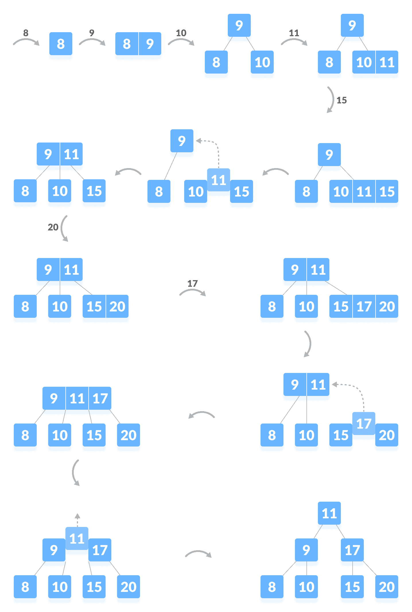

# 插入 B 树

> 原文： [https://www.programiz.com/dsa/insertion-into-a-b-tree](https://www.programiz.com/dsa/insertion-into-a-b-tree)

#### 在本教程中，您将学习如何将密钥插入 btree。 此外，您还将找到在 C，C++ ，Java 和 Python 中将键插入 B 树的工作示例。

在 B 树上插入元素包括两个事件：**搜索适当的节点**以插入元素，以及**拆分节点**。如有必要，插入操作始终从下往上进行 方法。

让我们在下面了解这些事件。

* * *

## 插入操作

1.  如果树为空，请分配一个根节点并插入密钥。
2.  更新节点中允许的键数。
3.  搜索适当的节点以进行插入。
4.  如果节点已满，请执行以下步骤。
5.  按递增顺序插入元素。
6.  现在，有一些元素超出了其限制。 因此，将中位数拆分。
7.  向上推中键，将左键作为左子代，将右键作为右子代。
8.  如果节点未满，请执行以下步骤。
9.  按升序插入节点。

* * *

## 插入示例

让我们通过以下插图了解插入操作。

要插入的元素是 8、9、10、11、15、16、17、18、20、23。



Inserting elements into a B-tree


* * *

## 元素插入算法

```
BreeInsertion(T, k)
r  root[T]
if n[r] = 2t - 1
    s = AllocateNode()
    root[T] = s
    leaf[s] = FALSE
    n[s] <- 0
    c1[s] <- r
    BtreeSplitChild(s, 1, r)
    BtreeInsertNonFull(s, k)
else BtreeInsertNonFull(r, k)
BtreeInsertNonFull(x, k)
i = n[x]
if leaf[x]
    while i ≥ 1 and k < keyi[x]
        keyi+1 [x] = keyi[x]
        i = i - 1
    keyi+1[x] = k
    n[x] = n[x] + 1
else while i ≥ 1 and k < keyi[x]
        i = i - 1
    i = i + 1
    if n[ci[x]] == 2t - 1
        BtreeSplitChild(x, i, ci[x])
        if k &rt; keyi[x]
            i = i + 1
    BtreeInsertNonFull(ci[x], k)
BtreeSplitChild(x, i)
BtreeSplitChild(x, i, y)
z = AllocateNode()
leaf[z] = leaf[y]
n[z] = t - 1
for j = 1 to t - 1
    keyj[z] = keyj+t[y]
if not leaf [y]
    for j = 1 to t
        cj[z] = cj + t[y]
n[y] = t - 1
for j = n[x] + 1 to i + 1
    cj+1[x] = cj[x]
ci+1[x] = z
for j = n[x] to i
    keyj+1[x] = keyj[x]
keyi[x] = keyt[y]
n[x] = n[x] + 1 
```

* * *

## Python，Java 和 C / C++ 示例

[Python](#python-code)[Java](#java-code)[C](#c-code)[C++](#cpp-code)

```
# Inserting a key on a B-tree in Python

# Create a node
class BTreeNode:
    def __init__(self, leaf=False):
        self.leaf = leaf
        self.keys = []
        self.child = []

# Tree
class BTree:
    def __init__(self, t):
        self.root = BTreeNode(True)
        self.t = t

    # Insert node
    def insert(self, k):
        root = self.root
        if len(root.keys) == (2 * self.t) - 1:
            temp = BTreeNode()
            self.root = temp
            temp.child.insert(0, root)
            self.split_child(temp, 0)
            self.insert_non_full(temp, k)
        else:
            self.insert_non_full(root, k)

    # Insert nonfull
    def insert_non_full(self, x, k):
        i = len(x.keys) - 1
        if x.leaf:
            x.keys.append((None, None))
            while i >= 0 and k[0] < x.keys[i][0]:
                x.keys[i + 1] = x.keys[i]
                i -= 1
            x.keys[i + 1] = k
        else:
            while i >= 0 and k[0] < x.keys[i][0]:
                i -= 1
            i += 1
            if len(x.child[i].keys) == (2 * self.t) - 1:
                self.split_child(x, i)
                if k[0] > x.keys[i][0]:
                    i += 1
            self.insert_non_full(x.child[i], k)

    # Split the child
    def split_child(self, x, i):
        t = self.t
        y = x.child[i]
        z = BTreeNode(y.leaf)
        x.child.insert(i + 1, z)
        x.keys.insert(i, y.keys[t - 1])
        z.keys = y.keys[t: (2 * t) - 1]
        y.keys = y.keys[0: t - 1]
        if not y.leaf:
            z.child = y.child[t: 2 * t]
            y.child = y.child[0: t - 1]

    # Print the tree
    def print_tree(self, x, l=0):
        print("Level ", l, " ", len(x.keys), end=":")
        for i in x.keys:
            print(i, end=" ")
        print()
        l += 1
        if len(x.child) > 0:
            for i in x.child:
                self.print_tree(i, l)

def main():
    B = BTree(3)

    for i in range(10):
        B.insert((i, 2 * i))

    B.print_tree(B.root)

if __name__ == '__main__':
    main()
```

```
// Inserting a key on a B-tree in Java 

public class BTree {

  private int T;

  // Node Creation
  public class Node {
    int n;
    int key[] = new int[2 * T - 1];
    Node child[] = new Node[2 * T];
    boolean leaf = true;

    public int Find(int k) {
      for (int i = 0; i < this.n; i++) {
        if (this.key[i] == k) {
          return i;
        }
      }
      return -1;
    };
  }

  public BTree(int t) {
    T = t;
    root = new Node();
    root.n = 0;
    root.leaf = true;
  }

  private Node root;

  // split
  private void split(Node x, int pos, Node y) {
    Node z = new Node();
    z.leaf = y.leaf;
    z.n = T - 1;
    for (int j = 0; j < T - 1; j++) {
      z.key[j] = y.key[j + T];
    }
    if (!y.leaf) {
      for (int j = 0; j < T; j++) {
        z.child[j] = y.child[j + T];
      }
    }
    y.n = T - 1;
    for (int j = x.n; j >= pos + 1; j--) {
      x.child[j + 1] = x.child[j];
    }
    x.child[pos + 1] = z;

    for (int j = x.n - 1; j >= pos; j--) {
      x.key[j + 1] = x.key[j];
    }
    x.key[pos] = y.key[T - 1];
    x.n = x.n + 1;
  }

  // insert key
  public void insert(final int key) {
    Node r = root;
    if (r.n == 2 * T - 1) {
      Node s = new Node();
      root = s;
      s.leaf = false;
      s.n = 0;
      s.child[0] = r;
      split(s, 0, r);
      _insert(s, key);
    } else {
      _insert(r, key);
    }
  }

  // insert node
  final private void _insert(Node x, int k) {

    if (x.leaf) {
      int i = 0;
      for (i = x.n - 1; i >= 0 && k < x.key[i]; i--) {
        x.key[i + 1] = x.key[i];
      }
      x.key[i + 1] = k;
      x.n = x.n + 1;
    } else {
      int i = 0;
      for (i = x.n - 1; i >= 0 && k < x.key[i]; i--) {
      }
      ;
      i++;
      Node tmp = x.child[i];
      if (tmp.n == 2 * T - 1) {
        split(x, i, tmp);
        if (k > x.key[i]) {
          i++;
        }
      }
      _insert(x.child[i], k);
    }

  }

  public void display() {
    display(root);
  }

  // Display the tree
  private void display(Node x) {
    assert (x == null);
    for (int i = 0; i < x.n; i++) {
      System.out.print(x.key[i] + " ");
    }
    if (!x.leaf) {
      for (int i = 0; i < x.n + 1; i++) {
        display(x.child[i]);
      }
    }
  }

  public static void main(String[] args) {
    BTree b = new BTree(3);
    b.insert(8);
    b.insert(9);
    b.insert(10);
    b.insert(11);
    b.insert(15);
    b.insert(20);
    b.insert(17);

    b.display();
  }
}
```

```
// insertioning a key on a B-tree in C

#include <stdio.h>
#include <stdlib.h>

#define MAX 3
#define MIN 2

struct btreeNode {
  int item[MAX + 1], count;
  struct btreeNode *link[MAX + 1];
};

struct btreeNode *root;

// Node creation
struct btreeNode *createNode(int item, struct btreeNode *child) {
  struct btreeNode *newNode;
  newNode = (struct btreeNode *)malloc(sizeof(struct btreeNode));
  newNode->item[1] = item;
  newNode->count = 1;
  newNode->link[0] = root;
  newNode->link[1] = child;
  return newNode;
}

// Insert
void insertValue(int item, int pos, struct btreeNode *node,
          struct btreeNode *child) {
  int j = node->count;
  while (j > pos) {
    node->item[j + 1] = node->item[j];
    node->link[j + 1] = node->link[j];
    j--;
  }
  node->item[j + 1] = item;
  node->link[j + 1] = child;
  node->count++;
}

// Split node
void splitNode(int item, int *pval, int pos, struct btreeNode *node,
         struct btreeNode *child, struct btreeNode **newNode) {
  int median, j;

  if (pos > MIN)
    median = MIN + 1;
  else
    median = MIN;

  *newNode = (struct btreeNode *)malloc(sizeof(struct btreeNode));
  j = median + 1;
  while (j <= MAX) {
    (*newNode)->item[j - median] = node->item[j];
    (*newNode)->link[j - median] = node->link[j];
    j++;
  }
  node->count = median;
  (*newNode)->count = MAX - median;

  if (pos <= MIN) {
    insertValue(item, pos, node, child);
  } else {
    insertValue(item, pos - median, *newNode, child);
  }
  *pval = node->item[node->count];
  (*newNode)->link[0] = node->link[node->count];
  node->count--;
}

// Set the value of node
int setNodeValue(int item, int *pval,
           struct btreeNode *node, struct btreeNode **child) {
  int pos;
  if (!node) {
    *pval = item;
    *child = NULL;
    return 1;
  }

  if (item < node->item[1]) {
    pos = 0;
  } else {
    for (pos = node->count;
       (item < node->item[pos] && pos > 1); pos--)
      ;
    if (item == node->item[pos]) {
      printf("Duplicates not allowed\n");
      return 0;
    }
  }
  if (setNodeValue(item, pval, node->link[pos], child)) {
    if (node->count < MAX) {
      insertValue(*pval, pos, node, *child);
    } else {
      splitNode(*pval, pval, pos, node, *child, child);
      return 1;
    }
  }
  return 0;
}

// Insert the value
void insertion(int item) {
  int flag, i;
  struct btreeNode *child;

  flag = setNodeValue(item, &i, root, &child);
  if (flag)
    root = createNode(i, child);
}

// Copy the successor
void copySuccessor(struct btreeNode *myNode, int pos) {
  struct btreeNode *dummy;
  dummy = myNode->link[pos];

  for (; dummy->link[0] != NULL;)
    dummy = dummy->link[0];
  myNode->item[pos] = dummy->item[1];
}

// Do rightshift
void rightShift(struct btreeNode *myNode, int pos) {
  struct btreeNode *x = myNode->link[pos];
  int j = x->count;

  while (j > 0) {
    x->item[j + 1] = x->item[j];
    x->link[j + 1] = x->link[j];
  }
  x->item[1] = myNode->item[pos];
  x->link[1] = x->link[0];
  x->count++;

  x = myNode->link[pos - 1];
  myNode->item[pos] = x->item[x->count];
  myNode->link[pos] = x->link[x->count];
  x->count--;
  return;
}

// Do leftshift
void leftShift(struct btreeNode *myNode, int pos) {
  int j = 1;
  struct btreeNode *x = myNode->link[pos - 1];

  x->count++;
  x->item[x->count] = myNode->item[pos];
  x->link[x->count] = myNode->link[pos]->link[0];

  x = myNode->link[pos];
  myNode->item[pos] = x->item[1];
  x->link[0] = x->link[1];
  x->count--;

  while (j <= x->count) {
    x->item[j] = x->item[j + 1];
    x->link[j] = x->link[j + 1];
    j++;
  }
  return;
}

// Merge the nodes
void mergeNodes(struct btreeNode *myNode, int pos) {
  int j = 1;
  struct btreeNode *x1 = myNode->link[pos], *x2 = myNode->link[pos - 1];

  x2->count++;
  x2->item[x2->count] = myNode->item[pos];
  x2->link[x2->count] = myNode->link[0];

  while (j <= x1->count) {
    x2->count++;
    x2->item[x2->count] = x1->item[j];
    x2->link[x2->count] = x1->link[j];
    j++;
  }

  j = pos;
  while (j < myNode->count) {
    myNode->item[j] = myNode->item[j + 1];
    myNode->link[j] = myNode->link[j + 1];
    j++;
  }
  myNode->count--;
  free(x1);
}

// Adjust the node
void adjustNode(struct btreeNode *myNode, int pos) {
  if (!pos) {
    if (myNode->link[1]->count > MIN) {
      leftShift(myNode, 1);
    } else {
      mergeNodes(myNode, 1);
    }
  } else {
    if (myNode->count != pos) {
      if (myNode->link[pos - 1]->count > MIN) {
        rightShift(myNode, pos);
      } else {
        if (myNode->link[pos + 1]->count > MIN) {
          leftShift(myNode, pos + 1);
        } else {
          mergeNodes(myNode, pos);
        }
      }
    } else {
      if (myNode->link[pos - 1]->count > MIN)
        rightShift(myNode, pos);
      else
        mergeNodes(myNode, pos);
    }
  }
}

// Traverse the tree
void traversal(struct btreeNode *myNode) {
  int i;
  if (myNode) {
    for (i = 0; i < myNode->count; i++) {
      traversal(myNode->link[i]);
      printf("%d ", myNode->item[i + 1]);
    }
    traversal(myNode->link[i]);
  }
}

int main() {
  int item, ch;

  insertion(8);
  insertion(9);
  insertion(10);
  insertion(11);
  insertion(15);
  insertion(16);
  insertion(17);
  insertion(18);
  insertion(20);
  insertion(23);

  traversal(root);
}
```

```
// Inserting a key on a B-tree in C++

#include <iostream>
using namespace std;

class Node {
  int *keys;
  int t;
  Node **C;
  int n;
  bool leaf;

   public:
  Node(int _t, bool _leaf);

  void insertNonFull(int k);
  void splitChild(int i, Node *y);
  void traverse();

  friend class BTree;
};

class BTree {
  Node *root;
  int t;

   public:
  BTree(int _t) {
    root = NULL;
    t = _t;
  }

  void traverse() {
    if (root != NULL)
      root->traverse();
  }

  void insert(int k);
};

Node::Node(int t1, bool leaf1) {
  t = t1;
  leaf = leaf1;

  keys = new int[2 * t - 1];
  C = new Node *[2 * t];

  n = 0;
}

// Traverse the nodes
void Node::traverse() {
  int i;
  for (i = 0; i < n; i++) {
    if (leaf == false)
      C[i]->traverse();
    cout << " " << keys[i];
  }

  if (leaf == false)
    C[i]->traverse();
}

// Insert the node
void BTree::insert(int k) {
  if (root == NULL) {
    root = new Node(t, true);
    root->keys[0] = k;
    root->n = 1;
  } else {
    if (root->n == 2 * t - 1) {
      Node *s = new Node(t, false);

      s->C[0] = root;

      s->splitChild(0, root);

      int i = 0;
      if (s->keys[0] < k)
        i++;
      s->C[i]->insertNonFull(k);

      root = s;
    } else
      root->insertNonFull(k);
  }
}

// Insert non full condition
void Node::insertNonFull(int k) {
  int i = n - 1;

  if (leaf == true) {
    while (i >= 0 && keys[i] > k) {
      keys[i + 1] = keys[i];
      i--;
    }

    keys[i + 1] = k;
    n = n + 1;
  } else {
    while (i >= 0 && keys[i] > k)
      i--;

    if (C[i + 1]->n == 2 * t - 1) {
      splitChild(i + 1, C[i + 1]);

      if (keys[i + 1] < k)
        i++;
    }
    C[i + 1]->insertNonFull(k);
  }
}

// split the child
void Node::splitChild(int i, Node *y) {
  Node *z = new Node(y->t, y->leaf);
  z->n = t - 1;

  for (int j = 0; j < t - 1; j++)
    z->keys[j] = y->keys[j + t];

  if (y->leaf == false) {
    for (int j = 0; j < t; j++)
      z->C[j] = y->C[j + t];
  }

  y->n = t - 1;
  for (int j = n; j >= i + 1; j--)
    C[j + 1] = C[j];

  C[i + 1] = z;

  for (int j = n - 1; j >= i; j--)
    keys[j + 1] = keys[j];

  keys[i] = y->keys[t - 1];
  n = n + 1;
}

int main() {
  BTree t(3);
  t.insert(8);
  t.insert(9);
  t.insert(10);
  t.insert(11);
  t.insert(15);
  t.insert(16);
  t.insert(17);
  t.insert(18);
  t.insert(20);
  t.insert(23);

  cout << "The B-tree is: ";
  t.traverse();
}
```