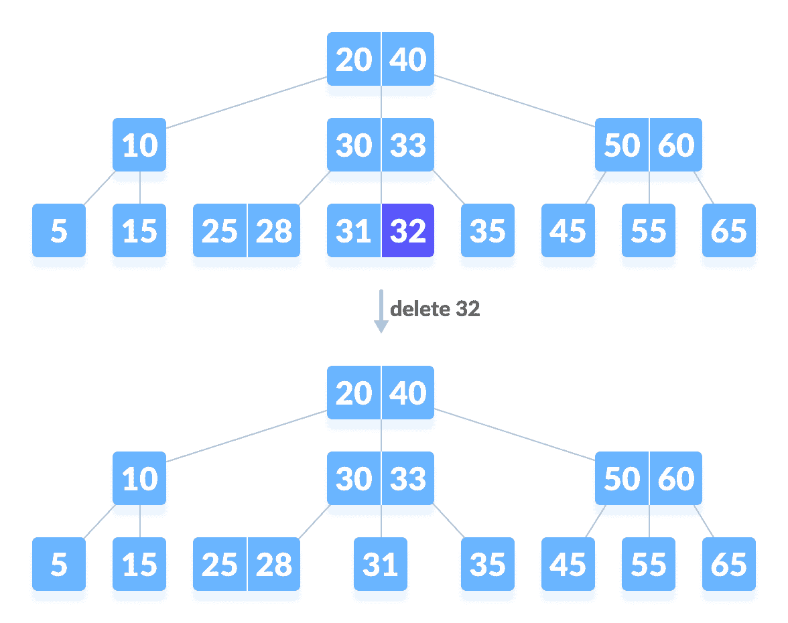
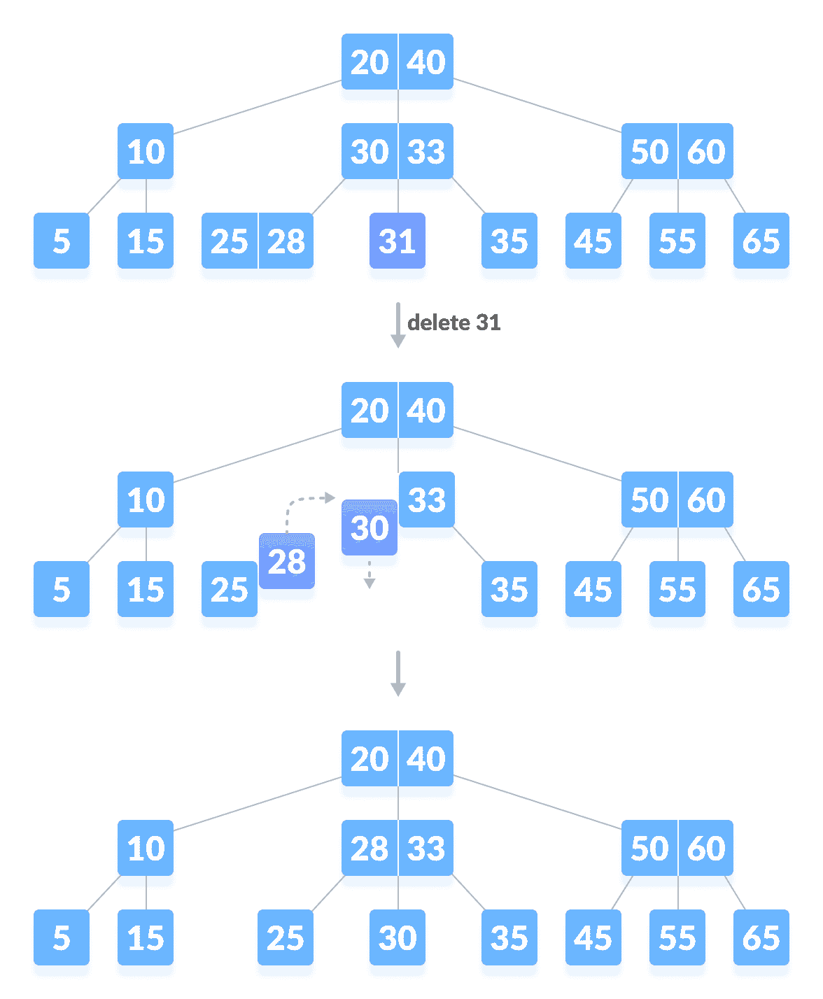
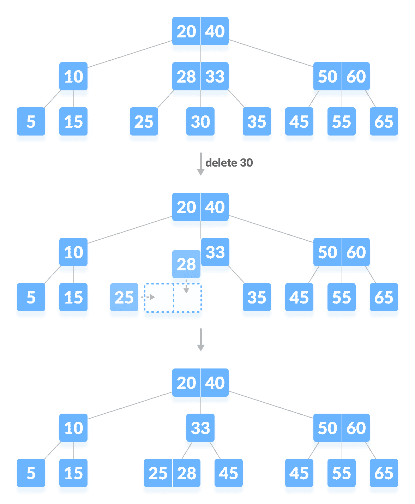
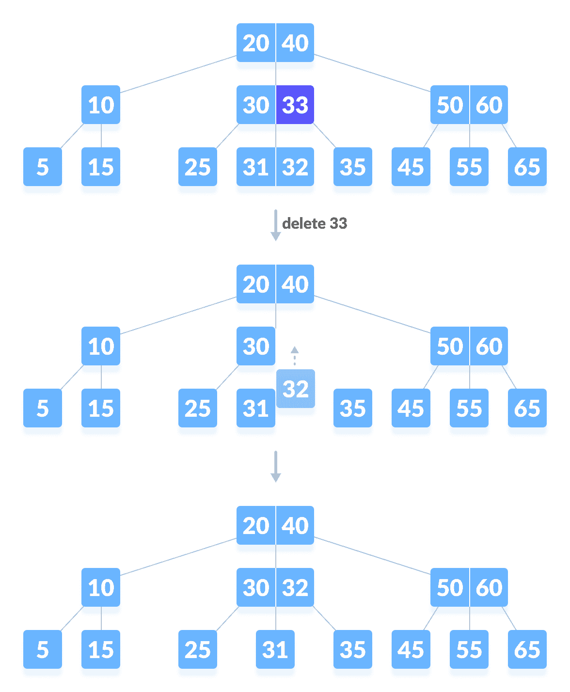
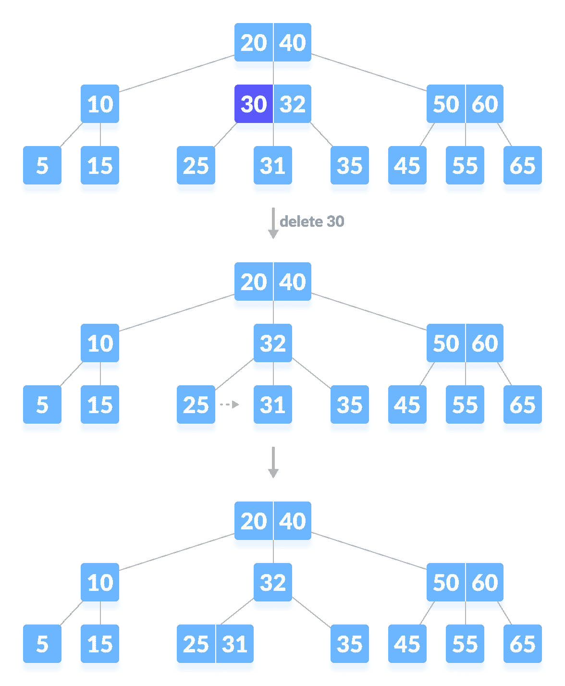

# 从 B 树删除

> 原文： [https://www.programiz.com/dsa/deletion-from-a-b-tree](https://www.programiz.com/dsa/deletion-from-a-b-tree)

#### 在本教程中，您将学习如何从 b 树中删除键。 此外，您还将找到在 C，C++ ，Java 和 Python 中从 B 树中删除键的工作示例。

删除 B 树上的元素包括三个主要事件：**搜索要删除的键存在的节点**，删除键并按需平衡树。

删除树时，可能会发生称为**下溢**的条件。 当节点包含的数量少于其应持有的最小键数时，就会发生下溢。

在研究删除操作之前，应了解以下术语：

1.  **有序前驱**
    节点左子级上的最大键称为其有序前驱。
2.  **有序后继**
    节点右子级上的最小键称为其有序后继。

* * *

## 删除操作

在执行以下步骤之前，必须了解有关度为`m`的 B 树的这些事实。

1.  一个节点最多可以有`m`个子节点。 （即 3）
2.  一个节点最多可以包含`m - 1`个键。 （即 2）
3.  一个节点至少应具有`⌈m/2⌉`个子节点。 （即 2）
4.  一个节点（根节点除外）应至少包含`⌈m/2⌉ - 1`键。 （即 1）

B 树中的删除操作主要有三种情况。

### 情况一

要删除的键位于叶子中。 有两种情况。

1.  删除键不会违反节点应持有的最小键数的属性。

    在下面的树中，删除 32 不违反上述属性。

    

    从 B 树中删除叶子键（32）

    

2.  键的删除违反了节点应持有的最小键数的属性。 在这种情况下，我们以从左到右的顺序从其直接相邻的兄弟节点借用键。

    首先，访问紧邻的左兄弟姐妹。 如果左兄弟节点的键数目超过最小数目，则从该节点借用键。

    否则，请检查以从紧邻的右同级节点借用。

    在下面的树中，删除 31 将导致上述情况。 让我们从左侧兄弟节点借用一个键。

    

    删除叶子键（31）

    

    如果两个直接同级节点都已经具有最小数量的键，则将该节点与左同级节点或右同级节点合并 节点。 **此合并是通过父节点完成的。**

    在上述情况下，删除 30 个结果。

    

    删除叶子键（30）

    

### 情况二

如果要删除的键位于内部节点中，则会发生以下情况。

1.  如果左子节点的键数超过最小数目，则删除的内部节点将替换为有序的前驱节点。

    

    删除内部节点（33）

    

2.  如果正确的子项超过了最小数目的键，则删除的内部节点将被有序后继替换。
3.  如果任一子项的键数恰好最小，则合并左子项和右子项。

    

    删除内部节点（30）

    

    合并后，如果父节点的键数少于最小数目，则像情况 I 一样查找同级。

### 情况三

在这种情况下，树的高度会缩小。 如果目标键位于内部节点中，并且键的删除导致节点中键的数量减少（即少于所需的最小数量），则寻找有序前驱和有序后继。 如果两个子级都包含最少数量的钥匙，则无法进行借用。 这导致情况二（3），即合并子级。

同样，寻找同胞借用钥匙。 但是，如果同级也只有最少数量的键，则将同级节点与父级合并。 相应地安排子级们（增加顺序）。


Deleting an internal node (10)


* * *

## Python，Java 和 C/C++ 示例

[Python](#python-code)[Java](#java-code)[C](#c-code)[C++](#cpp-code)

```
# Deleting a key on a B-tree in Python

# Btree node
class BTreeNode:
    def __init__(self, leaf=False):
        self.leaf = leaf
        self.keys = []
        self.child = []

class BTree:
    def __init__(self, t):
        self.root = BTreeNode(True)
        self.t = t

    # Insert a key
    def insert(self, k):
        root = self.root
        if len(root.keys) == (2 * self.t) - 1:
            temp = BTreeNode()
            self.root = temp
            temp.child.insert(0, root)
            self.split_child(temp, 0)
            self.insert_non_full(temp, k)
        else:
            self.insert_non_full(root, k)

    # Insert non full
    def insert_non_full(self, x, k):
        i = len(x.keys) - 1
        if x.leaf:
            x.keys.append((None, None))
            while i >= 0 and k[0] < x.keys[i][0]:
                x.keys[i + 1] = x.keys[i]
                i -= 1
            x.keys[i + 1] = k
        else:
            while i >= 0 and k[0] < x.keys[i][0]:
                i -= 1
            i += 1
            if len(x.child[i].keys) == (2 * self.t) - 1:
                self.split_child(x, i)
                if k[0] > x.keys[i][0]:
                    i += 1
            self.insert_non_full(x.child[i], k)

    # Split the child
    def split_child(self, x, i):
        t = self.t
        y = x.child[i]
        z = BTreeNode(y.leaf)
        x.child.insert(i + 1, z)
        x.keys.insert(i, y.keys[t - 1])
        z.keys = y.keys[t: (2 * t) - 1]
        y.keys = y.keys[0: t - 1]
        if not y.leaf:
            z.child = y.child[t: 2 * t]
            y.child = y.child[0: t - 1]

    # Delete a node
    def delete(self, x, k):
        t = self.t
        i = 0
        while i < len(x.keys) and k[0] > x.keys[i][0]:
            i += 1
        if x.leaf:
            if i < len(x.keys) and x.keys[i][0] == k[0]:
                x.keys.pop(i)
                return
            return

        if i < len(x.keys) and x.keys[i][0] == k[0]:
            return self.delete_internal_node(x, k, i)
        elif len(x.child[i].keys) >= t:
            self.delete(x.child[i], k)
        else:
            if i != 0 and i + 2 < len(x.child):
                if len(x.child[i - 1].keys) >= t:
                    self.delete_sibling(x, i, i - 1)
                elif len(x.child[i + 1].keys) >= t:
                    self.delete_sibling(x, i, i + 1)
                else:
                    self.delete_merge(x, i, i + 1)
            elif i == 0:
                if len(x.child[i + 1].keys) >= t:
                    self.delete_sibling(x, i, i + 1)
                else:
                    self.delete_merge(x, i, i + 1)
            elif i + 1 == len(x.child):
                if len(x.child[i - 1].keys) >= t:
                    self.delete_sibling(x, i, i - 1)
                else:
                    self.delete_merge(x, i, i - 1)
            self.delete(x.child[i], k)

    # Delete internal node
    def delete_internal_node(self, x, k, i):
        t = self.t
        if x.leaf:
            if x.keys[i][0] == k[0]:
                x.keys.pop(i)
                return
            return

        if len(x.child[i].keys) >= t:
            x.keys[i] = self.delete_predecessor(x.child[i])
            return
        elif len(x.child[i + 1].keys) >= t:
            x.keys[i] = self.delete_successor(x.child[i + 1])
            return
        else:
            self.delete_merge(x, i, i + 1)
            self.delete_internal_node(x.child[i], k, self.t - 1)

    # Delete the predecessor
    def delete_predecessor(self, x):
        if x.leaf:
            return x.pop()
        n = len(x.keys) - 1
        if len(x.child[n].keys) >= self.t:
            self.delete_sibling(x, n + 1, n)
        else:
            self.delete_merge(x, n, n + 1)
        self.delete_predecessor(x.child[n])

    # Delete the successor
    def delete_successor(self, x):
        if x.leaf:
            return x.keys.pop(0)
        if len(x.child[1].keys) >= self.t:
            self.delete_sibling(x, 0, 1)
        else:
            self.delete_merge(x, 0, 1)
        self.delete_successor(x.child[0])

    # Delete resolution
    def delete_merge(self, x, i, j):
        cnode = x.child[i]

        if j > i:
            rsnode = x.child[j]
            cnode.keys.append(x.keys[i])
            for k in range(len(rsnode.keys)):
                cnode.keys.append(rsnode.keys[k])
                if len(rsnode.child) > 0:
                    cnode.child.append(rsnode.child[k])
            if len(rsnode.child) > 0:
                cnode.child.append(rsnode.child.pop())
            new = cnode
            x.keys.pop(i)
            x.child.pop(j)
        else:
            lsnode = x.child[j]
            lsnode.keys.append(x.keys[j])
            for i in range(len(cnode.keys)):
                lsnode.keys.append(cnode.keys[i])
                if len(lsnode.child) > 0:
                    lsnode.child.append(cnode.child[i])
            if len(lsnode.child) > 0:
                lsnode.child.append(cnode.child.pop())
            new = lsnode
            x.keys.pop(j)
            x.child.pop(i)

        if x == self.root and len(x.keys) == 0:
            self.root = new

    # Delete the sibling
    def delete_sibling(self, x, i, j):
        cnode = x.child[i]
        if i < j:
            rsnode = x.child[j]
            cnode.keys.append(x.keys[i])
            x.keys[i] = rsnode.keys[0]
            if len(rsnode.child) > 0:
                cnode.child.append(rsnode.child[0])
                rsnode.child.pop(0)
            rsnode.keys.pop(0)
        else:
            lsnode = x.child[j]
            cnode.keys.insert(0, x.keys[i - 1])
            x.keys[i - 1] = lsnode.keys.pop()
            if len(lsnode.child) > 0:
                cnode.child.insert(0, lsnode.child.pop())

    # Print the tree
    def print_tree(self, x, l=0):
        print("Level ", l, " ", len(x.keys), end=":")
        for i in x.keys:
            print(i, end=" ")
        print()
        l += 1
        if len(x.child) > 0:
            for i in x.child:
                self.print_tree(i, l)

def main():
    B = BTree(3)

    for i in range(10):
        B.insert((i, 2 * i))

    B.print_tree(B.root)

    B.delete(B.root, (8,))
    print("\n")
    B.print_tree(B.root)
```

```
// Inserting a key on a B-tree in Java

import java.util.Stack;

public class BTree {

  private int T;

  public class Node {
    int n;
    int key[] = new int[2 * T - 1];
    Node child[] = new Node[2 * T];
    boolean leaf = true;

    public int Find(int k) {
      for (int i = 0; i < this.n; i++) {
        if (this.key[i] == k) {
          return i;
        }
      }
      return -1;
    };
  }

  public BTree(int t) {
    T = t;
    root = new Node();
    root.n = 0;
    root.leaf = true;
  }

  private Node root;

  // Search the key
  private Node Search(Node x, int key) {
    int i = 0;
    if (x == null)
      return x;
    for (i = 0; i < x.n; i++) {
      if (key < x.key[i]) {
        break;
      }
      if (key == x.key[i]) {
        return x;
      }
    }
    if (x.leaf) {
      return null;
    } else {
      return Search(x.child[i], key);
    }
  }

  // Split function
  private void Split(Node x, int pos, Node y) {
    Node z = new Node();
    z.leaf = y.leaf;
    z.n = T - 1;
    for (int j = 0; j < T - 1; j++) {
      z.key[j] = y.key[j + T];
    }
    if (!y.leaf) {
      for (int j = 0; j < T; j++) {
        z.child[j] = y.child[j + T];
      }
    }
    y.n = T - 1;
    for (int j = x.n; j >= pos + 1; j--) {
      x.child[j + 1] = x.child[j];
    }
    x.child[pos + 1] = z;

    for (int j = x.n - 1; j >= pos; j--) {
      x.key[j + 1] = x.key[j];
    }
    x.key[pos] = y.key[T - 1];
    x.n = x.n + 1;
  }

  // Insert the key
  public void Insert(final int key) {
    Node r = root;
    if (r.n == 2 * T - 1) {
      Node s = new Node();
      root = s;
      s.leaf = false;
      s.n = 0;
      s.child[0] = r;
      Split(s, 0, r);
      _Insert(s, key);
    } else {
      _Insert(r, key);
    }
  }

  // Insert the node
  final private void _Insert(Node x, int k) {

    if (x.leaf) {
      int i = 0;
      for (i = x.n - 1; i >= 0 && k < x.key[i]; i--) {
        x.key[i + 1] = x.key[i];
      }
      x.key[i + 1] = k;
      x.n = x.n + 1;
    } else {
      int i = 0;
      for (i = x.n - 1; i >= 0 && k < x.key[i]; i--) {
      }
      ;
      i++;
      Node tmp = x.child[i];
      if (tmp.n == 2 * T - 1) {
        Split(x, i, tmp);
        if (k > x.key[i]) {
          i++;
        }
      }
      _Insert(x.child[i], k);
    }

  }

  public void Show() {
    Show(root);
  }

  private void Remove(Node x, int key) {
    int pos = x.Find(key);
    if (pos != -1) {
      if (x.leaf) {
        int i = 0;
        for (i = 0; i < x.n && x.key[i] != key; i++) {
        }
        ;
        for (; i < x.n; i++) {
          if (i != 2 * T - 2) {
            x.key[i] = x.key[i + 1];
          }
        }
        x.n--;
        return;
      }
      if (!x.leaf) {

        Node pred = x.child[pos];
        int predKey = 0;
        if (pred.n >= T) {
          for (;;) {
            if (pred.leaf) {
              System.out.println(pred.n);
              predKey = pred.key[pred.n - 1];
              break;
            } else {
              pred = pred.child[pred.n];
            }
          }
          Remove(pred, predKey);
          x.key[pos] = predKey;
          return;
        }

        Node nextNode = x.child[pos + 1];
        if (nextNode.n >= T) {
          int nextKey = nextNode.key[0];
          if (!nextNode.leaf) {
            nextNode = nextNode.child[0];
            for (;;) {
              if (nextNode.leaf) {
                nextKey = nextNode.key[nextNode.n - 1];
                break;
              } else {
                nextNode = nextNode.child[nextNode.n];
              }
            }
          }
          Remove(nextNode, nextKey);
          x.key[pos] = nextKey;
          return;
        }

        int temp = pred.n + 1;
        pred.key[pred.n++] = x.key[pos];
        for (int i = 0, j = pred.n; i < nextNode.n; i++) {
          pred.key[j++] = nextNode.key[i];
          pred.n++;
        }
        for (int i = 0; i < nextNode.n + 1; i++) {
          pred.child[temp++] = nextNode.child[i];
        }

        x.child[pos] = pred;
        for (int i = pos; i < x.n; i++) {
          if (i != 2 * T - 2) {
            x.key[i] = x.key[i + 1];
          }
        }
        for (int i = pos + 1; i < x.n + 1; i++) {
          if (i != 2 * T - 1) {
            x.child[i] = x.child[i + 1];
          }
        }
        x.n--;
        if (x.n == 0) {
          if (x == root) {
            root = x.child[0];
          }
          x = x.child[0];
        }
        Remove(pred, key);
        return;
      }
    } else {
      for (pos = 0; pos < x.n; pos++) {
        if (x.key[pos] > key) {
          break;
        }
      }
      Node tmp = x.child[pos];
      if (tmp.n >= T) {
        Remove(tmp, key);
        return;
      }
      if (true) {
        Node nb = null;
        int devider = -1;

        if (pos != x.n && x.child[pos + 1].n >= T) {
          devider = x.key[pos];
          nb = x.child[pos + 1];
          x.key[pos] = nb.key[0];
          tmp.key[tmp.n++] = devider;
          tmp.child[tmp.n] = nb.child[0];
          for (int i = 1; i < nb.n; i++) {
            nb.key[i - 1] = nb.key[i];
          }
          for (int i = 1; i <= nb.n; i++) {
            nb.child[i - 1] = nb.child[i];
          }
          nb.n--;
          Remove(tmp, key);
          return;
        } else if (pos != 0 && x.child[pos - 1].n >= T) {

          devider = x.key[pos - 1];
          nb = x.child[pos - 1];
          x.key[pos - 1] = nb.key[nb.n - 1];
          Node child = nb.child[nb.n];
          nb.n--;

          for (int i = tmp.n; i > 0; i--) {
            tmp.key[i] = tmp.key[i - 1];
          }
          tmp.key[0] = devider;
          for (int i = tmp.n + 1; i > 0; i--) {
            tmp.child[i] = tmp.child[i - 1];
          }
          tmp.child[0] = child;
          tmp.n++;
          Remove(tmp, key);
          return;
        } else {
          Node lt = null;
          Node rt = null;
          boolean last = false;
          if (pos != x.n) {
            devider = x.key[pos];
            lt = x.child[pos];
            rt = x.child[pos + 1];
          } else {
            devider = x.key[pos - 1];
            rt = x.child[pos];
            lt = x.child[pos - 1];
            last = true;
            pos--;
          }
          for (int i = pos; i < x.n - 1; i++) {
            x.key[i] = x.key[i + 1];
          }
          for (int i = pos + 1; i < x.n; i++) {
            x.child[i] = x.child[i + 1];
          }
          x.n--;
          lt.key[lt.n++] = devider;

          for (int i = 0, j = lt.n; i < rt.n + 1; i++, j++) {
            if (i < rt.n) {
              lt.key[j] = rt.key[i];
            }
            lt.child[j] = rt.child[i];
          }
          lt.n += rt.n;
          if (x.n == 0) {
            if (x == root) {
              root = x.child[0];
            }
            x = x.child[0];
          }
          Remove(lt, key);
          return;
        }
      }
    }
  }

  public void Remove(int key) {
    Node x = Search(root, key);
    if (x == null) {
      return;
    }
    Remove(root, key);
  }

  public void Task(int a, int b) {
    Stack<Integer> st = new Stack<>();
    FindKeys(a, b, root, st);
    while (st.isEmpty() == false) {
      this.Remove(root, st.pop());
    }
  }

  private void FindKeys(int a, int b, Node x, Stack<Integer> st) {
    int i = 0;
    for (i = 0; i < x.n && x.key[i] < b; i++) {
      if (x.key[i] > a) {
        st.push(x.key[i]);
      }
    }
    if (!x.leaf) {
      for (int j = 0; j < i + 1; j++) {
        FindKeys(a, b, x.child[j], st);
      }
    }
  }

  public boolean Contain(int k) {
    if (this.Search(root, k) != null) {
      return true;
    } else {
      return false;
    }
  }

  // Show the node
  private void Show(Node x) {
    assert (x == null);
    for (int i = 0; i < x.n; i++) {
      System.out.print(x.key[i] + " ");
    }
    if (!x.leaf) {
      for (int i = 0; i < x.n + 1; i++) {
        Show(x.child[i]);
      }
    }
  }

  public static void main(String[] args) {
    BTree b = new BTree(3);
    b.Insert(8);
    b.Insert(9);
    b.Insert(10);
    b.Insert(11);
    b.Insert(15);
    b.Insert(20);
    b.Insert(17);

    b.Show();

    b.Remove(10);
    System.out.println();
    b.Show();
  }
}
```

```
// Deleting a key from a B-tree in C

#include <stdio.h>
#include <stdlib.h>

#define MAX 3
#define MIN 2

struct BTreeNode {
  int item[MAX + 1], count;
  struct BTreeNode *linker[MAX + 1];
};

struct BTreeNode *root;

// Node creation
struct BTreeNode *createNode(int item, struct BTreeNode *child) {
  struct BTreeNode *newNode;
  newNode = (struct BTreeNode *)malloc(sizeof(struct BTreeNode));
  newNode->item[1] = item;
  newNode->count = 1;
  newNode->linker[0] = root;
  newNode->linker[1] = child;
  return newNode;
}

// Add value to the node
void addValToNode(int item, int pos, struct BTreeNode *node,
          struct BTreeNode *child) {
  int j = node->count;
  while (j > pos) {
    node->item[j + 1] = node->item[j];
    node->linker[j + 1] = node->linker[j];
    j--;
  }
  node->item[j + 1] = item;
  node->linker[j + 1] = child;
  node->count++;
}

// Split the node
void splitNode(int item, int *pval, int pos, struct BTreeNode *node,
         struct BTreeNode *child, struct BTreeNode **newNode) {
  int median, j;

  if (pos > MIN)
    median = MIN + 1;
  else
    median = MIN;

  *newNode = (struct BTreeNode *)malloc(sizeof(struct BTreeNode));
  j = median + 1;
  while (j <= MAX) {
    (*newNode)->item[j - median] = node->item[j];
    (*newNode)->linker[j - median] = node->linker[j];
    j++;
  }
  node->count = median;
  (*newNode)->count = MAX - median;

  if (pos <= MIN) {
    addValToNode(item, pos, node, child);
  } else {
    addValToNode(item, pos - median, *newNode, child);
  }
  *pval = node->item[node->count];
  (*newNode)->linker[0] = node->linker[node->count];
  node->count--;
}

// Set the value in the node
int setValueInNode(int item, int *pval,
           struct BTreeNode *node, struct BTreeNode **child) {
  int pos;
  if (!node) {
    *pval = item;
    *child = NULL;
    return 1;
  }

  if (item < node->item[1]) {
    pos = 0;
  } else {
    for (pos = node->count;
       (item < node->item[pos] && pos > 1); pos--)
      ;
    if (item == node->item[pos]) {
      printf("Duplicates not allowed\n");
      return 0;
    }
  }
  if (setValueInNode(item, pval, node->linker[pos], child)) {
    if (node->count < MAX) {
      addValToNode(*pval, pos, node, *child);
    } else {
      splitNode(*pval, pval, pos, node, *child, child);
      return 1;
    }
  }
  return 0;
}

// Insertion operation
void insertion(int item) {
  int flag, i;
  struct BTreeNode *child;

  flag = setValueInNode(item, &i, root, &child);
  if (flag)
    root = createNode(i, child);
}

// Copy the successor
void copySuccessor(struct BTreeNode *myNode, int pos) {
  struct BTreeNode *dummy;
  dummy = myNode->linker[pos];

  for (; dummy->linker[0] != NULL;)
    dummy = dummy->linker[0];
  myNode->item[pos] = dummy->item[1];
}

// Remove the value
void removeVal(struct BTreeNode *myNode, int pos) {
  int i = pos + 1;
  while (i <= myNode->count) {
    myNode->item[i - 1] = myNode->item[i];
    myNode->linker[i - 1] = myNode->linker[i];
    i++;
  }
  myNode->count--;
}

// Do right shift
void rightShift(struct BTreeNode *myNode, int pos) {
  struct BTreeNode *x = myNode->linker[pos];
  int j = x->count;

  while (j > 0) {
    x->item[j + 1] = x->item[j];
    x->linker[j + 1] = x->linker[j];
  }
  x->item[1] = myNode->item[pos];
  x->linker[1] = x->linker[0];
  x->count++;

  x = myNode->linker[pos - 1];
  myNode->item[pos] = x->item[x->count];
  myNode->linker[pos] = x->linker[x->count];
  x->count--;
  return;
}

// Do left shift
void leftShift(struct BTreeNode *myNode, int pos) {
  int j = 1;
  struct BTreeNode *x = myNode->linker[pos - 1];

  x->count++;
  x->item[x->count] = myNode->item[pos];
  x->linker[x->count] = myNode->linker[pos]->linker[0];

  x = myNode->linker[pos];
  myNode->item[pos] = x->item[1];
  x->linker[0] = x->linker[1];
  x->count--;

  while (j <= x->count) {
    x->item[j] = x->item[j + 1];
    x->linker[j] = x->linker[j + 1];
    j++;
  }
  return;
}

// Merge the nodes
void mergeNodes(struct BTreeNode *myNode, int pos) {
  int j = 1;
  struct BTreeNode *x1 = myNode->linker[pos], *x2 = myNode->linker[pos - 1];

  x2->count++;
  x2->item[x2->count] = myNode->item[pos];
  x2->linker[x2->count] = myNode->linker[0];

  while (j <= x1->count) {
    x2->count++;
    x2->item[x2->count] = x1->item[j];
    x2->linker[x2->count] = x1->linker[j];
    j++;
  }

  j = pos;
  while (j < myNode->count) {
    myNode->item[j] = myNode->item[j + 1];
    myNode->linker[j] = myNode->linker[j + 1];
    j++;
  }
  myNode->count--;
  free(x1);
}

// Adjust the node
void adjustNode(struct BTreeNode *myNode, int pos) {
  if (!pos) {
    if (myNode->linker[1]->count > MIN) {
      leftShift(myNode, 1);
    } else {
      mergeNodes(myNode, 1);
    }
  } else {
    if (myNode->count != pos) {
      if (myNode->linker[pos - 1]->count > MIN) {
        rightShift(myNode, pos);
      } else {
        if (myNode->linker[pos + 1]->count > MIN) {
          leftShift(myNode, pos + 1);
        } else {
          mergeNodes(myNode, pos);
        }
      }
    } else {
      if (myNode->linker[pos - 1]->count > MIN)
        rightShift(myNode, pos);
      else
        mergeNodes(myNode, pos);
    }
  }
}

// Delete a value from the node
int delValFromNode(int item, struct BTreeNode *myNode) {
  int pos, flag = 0;
  if (myNode) {
    if (item < myNode->item[1]) {
      pos = 0;
      flag = 0;
    } else {
      for (pos = myNode->count; (item < myNode->item[pos] && pos > 1); pos--)
        ;
      if (item == myNode->item[pos]) {
        flag = 1;
      } else {
        flag = 0;
      }
    }
    if (flag) {
      if (myNode->linker[pos - 1]) {
        copySuccessor(myNode, pos);
        flag = delValFromNode(myNode->item[pos], myNode->linker[pos]);
        if (flag == 0) {
          printf("Given data is not present in B-Tree\n");
        }
      } else {
        removeVal(myNode, pos);
      }
    } else {
      flag = delValFromNode(item, myNode->linker[pos]);
    }
    if (myNode->linker[pos]) {
      if (myNode->linker[pos]->count < MIN)
        adjustNode(myNode, pos);
    }
  }
  return flag;
}

// Delete operaiton
void delete (int item, struct BTreeNode *myNode) {
  struct BTreeNode *tmp;
  if (!delValFromNode(item, myNode)) {
    printf("Not present\n");
    return;
  } else {
    if (myNode->count == 0) {
      tmp = myNode;
      myNode = myNode->linker[0];
      free(tmp);
    }
  }
  root = myNode;
  return;
}

void searching(int item, int *pos, struct BTreeNode *myNode) {
  if (!myNode) {
    return;
  }

  if (item < myNode->item[1]) {
    *pos = 0;
  } else {
    for (*pos = myNode->count;
       (item < myNode->item[*pos] && *pos > 1); (*pos)--)
      ;
    if (item == myNode->item[*pos]) {
      printf("%d present in B-tree", item);
      return;
    }
  }
  searching(item, pos, myNode->linker[*pos]);
  return;
}

void traversal(struct BTreeNode *myNode) {
  int i;
  if (myNode) {
    for (i = 0; i < myNode->count; i++) {
      traversal(myNode->linker[i]);
      printf("%d ", myNode->item[i + 1]);
    }
    traversal(myNode->linker[i]);
  }
}

int main() {
  int item, ch;

  insertion(8);
  insertion(9);
  insertion(10);
  insertion(11);
  insertion(15);
  insertion(16);
  insertion(17);
  insertion(18);
  insertion(20);
  insertion(23);

  traversal(root);

  delete (20, root);
  printf("\n");
  traversal(root);
}
```

```
// Deleting a key from a B-tree in C++

#include <iostream>
using namespace std;

class BTreeNode {
  int *keys;
  int t;
  BTreeNode **C;
  int n;
  bool leaf;

   public:
  BTreeNode(int _t, bool _leaf);

  void traverse();

  int findKey(int k);
  void insertNonFull(int k);
  void splitChild(int i, BTreeNode *y);
  void deletion(int k);
  void removeFromLeaf(int idx);
  void removeFromNonLeaf(int idx);
  int getPredecessor(int idx);
  int getSuccessor(int idx);
  void fill(int idx);
  void borrowFromPrev(int idx);
  void borrowFromNext(int idx);
  void merge(int idx);
  friend class BTree;
};

class BTree {
  BTreeNode *root;
  int t;

   public:
  BTree(int _t) {
    root = NULL;
    t = _t;
  }

  void traverse() {
    if (root != NULL)
      root->traverse();
  }

  void insertion(int k);

  void deletion(int k);
};

// B tree node
BTreeNode::BTreeNode(int t1, bool leaf1) {
  t = t1;
  leaf = leaf1;

  keys = new int[2 * t - 1];
  C = new BTreeNode *[2 * t];

  n = 0;
}

// Find the key
int BTreeNode::findKey(int k) {
  int idx = 0;
  while (idx < n && keys[idx] < k)
    ++idx;
  return idx;
}

// Deletion operation
void BTreeNode::deletion(int k) {
  int idx = findKey(k);

  if (idx < n && keys[idx] == k) {
    if (leaf)
      removeFromLeaf(idx);
    else
      removeFromNonLeaf(idx);
  } else {
    if (leaf) {
      cout << "The key " << k << " is does not exist in the tree\n";
      return;
    }

    bool flag = ((idx == n) ? true : false);

    if (C[idx]->n < t)
      fill(idx);

    if (flag && idx > n)
      C[idx - 1]->deletion(k);
    else
      C[idx]->deletion(k);
  }
  return;
}

// Remove from the leaf
void BTreeNode::removeFromLeaf(int idx) {
  for (int i = idx + 1; i < n; ++i)
    keys[i - 1] = keys[i];

  n--;

  return;
}

// Delete from non leaf node
void BTreeNode::removeFromNonLeaf(int idx) {
  int k = keys[idx];

  if (C[idx]->n >= t) {
    int pred = getPredecessor(idx);
    keys[idx] = pred;
    C[idx]->deletion(pred);
  }

  else if (C[idx + 1]->n >= t) {
    int succ = getSuccessor(idx);
    keys[idx] = succ;
    C[idx + 1]->deletion(succ);
  }

  else {
    merge(idx);
    C[idx]->deletion(k);
  }
  return;
}

int BTreeNode::getPredecessor(int idx) {
  BTreeNode *cur = C[idx];
  while (!cur->leaf)
    cur = cur->C[cur->n];

  return cur->keys[cur->n - 1];
}

int BTreeNode::getSuccessor(int idx) {
  BTreeNode *cur = C[idx + 1];
  while (!cur->leaf)
    cur = cur->C[0];

  return cur->keys[0];
}

void BTreeNode::fill(int idx) {
  if (idx != 0 && C[idx - 1]->n >= t)
    borrowFromPrev(idx);

  else if (idx != n && C[idx + 1]->n >= t)
    borrowFromNext(idx);

  else {
    if (idx != n)
      merge(idx);
    else
      merge(idx - 1);
  }
  return;
}

// Borrow from previous
void BTreeNode::borrowFromPrev(int idx) {
  BTreeNode *child = C[idx];
  BTreeNode *sibling = C[idx - 1];

  for (int i = child->n - 1; i >= 0; --i)
    child->keys[i + 1] = child->keys[i];

  if (!child->leaf) {
    for (int i = child->n; i >= 0; --i)
      child->C[i + 1] = child->C[i];
  }

  child->keys[0] = keys[idx - 1];

  if (!child->leaf)
    child->C[0] = sibling->C[sibling->n];

  keys[idx - 1] = sibling->keys[sibling->n - 1];

  child->n += 1;
  sibling->n -= 1;

  return;
}

// Borrow from the next
void BTreeNode::borrowFromNext(int idx) {
  BTreeNode *child = C[idx];
  BTreeNode *sibling = C[idx + 1];

  child->keys[(child->n)] = keys[idx];

  if (!(child->leaf))
    child->C[(child->n) + 1] = sibling->C[0];

  keys[idx] = sibling->keys[0];

  for (int i = 1; i < sibling->n; ++i)
    sibling->keys[i - 1] = sibling->keys[i];

  if (!sibling->leaf) {
    for (int i = 1; i <= sibling->n; ++i)
      sibling->C[i - 1] = sibling->C[i];
  }

  child->n += 1;
  sibling->n -= 1;

  return;
}

// Merge
void BTreeNode::merge(int idx) {
  BTreeNode *child = C[idx];
  BTreeNode *sibling = C[idx + 1];

  child->keys[t - 1] = keys[idx];

  for (int i = 0; i < sibling->n; ++i)
    child->keys[i + t] = sibling->keys[i];

  if (!child->leaf) {
    for (int i = 0; i <= sibling->n; ++i)
      child->C[i + t] = sibling->C[i];
  }

  for (int i = idx + 1; i < n; ++i)
    keys[i - 1] = keys[i];

  for (int i = idx + 2; i <= n; ++i)
    C[i - 1] = C[i];

  child->n += sibling->n + 1;
  n--;

  delete (sibling);
  return;
}

// Insertion operation
void BTree::insertion(int k) {
  if (root == NULL) {
    root = new BTreeNode(t, true);
    root->keys[0] = k;
    root->n = 1;
  } else {
    if (root->n == 2 * t - 1) {
      BTreeNode *s = new BTreeNode(t, false);

      s->C[0] = root;

      s->splitChild(0, root);

      int i = 0;
      if (s->keys[0] < k)
        i++;
      s->C[i]->insertNonFull(k);

      root = s;
    } else
      root->insertNonFull(k);
  }
}

// Insertion non full
void BTreeNode::insertNonFull(int k) {
  int i = n - 1;

  if (leaf == true) {
    while (i >= 0 && keys[i] > k) {
      keys[i + 1] = keys[i];
      i--;
    }

    keys[i + 1] = k;
    n = n + 1;
  } else {
    while (i >= 0 && keys[i] > k)
      i--;

    if (C[i + 1]->n == 2 * t - 1) {
      splitChild(i + 1, C[i + 1]);

      if (keys[i + 1] < k)
        i++;
    }
    C[i + 1]->insertNonFull(k);
  }
}

// Split child
void BTreeNode::splitChild(int i, BTreeNode *y) {
  BTreeNode *z = new BTreeNode(y->t, y->leaf);
  z->n = t - 1;

  for (int j = 0; j < t - 1; j++)
    z->keys[j] = y->keys[j + t];

  if (y->leaf == false) {
    for (int j = 0; j < t; j++)
      z->C[j] = y->C[j + t];
  }

  y->n = t - 1;

  for (int j = n; j >= i + 1; j--)
    C[j + 1] = C[j];

  C[i + 1] = z;

  for (int j = n - 1; j >= i; j--)
    keys[j + 1] = keys[j];

  keys[i] = y->keys[t - 1];

  n = n + 1;
}

// Traverse
void BTreeNode::traverse() {
  int i;
  for (i = 0; i < n; i++) {
    if (leaf == false)
      C[i]->traverse();
    cout << " " << keys[i];
  }

  if (leaf == false)
    C[i]->traverse();
}

// Delete Operation
void BTree::deletion(int k) {
  if (!root) {
    cout << "The tree is empty\n";
    return;
  }

  root->deletion(k);

  if (root->n == 0) {
    BTreeNode *tmp = root;
    if (root->leaf)
      root = NULL;
    else
      root = root->C[0];

    delete tmp;
  }
  return;
}

int main() {
  BTree t(3);
  t.insertion(8);
  t.insertion(9);
  t.insertion(10);
  t.insertion(11);
  t.insertion(15);
  t.insertion(16);
  t.insertion(17);
  t.insertion(18);
  t.insertion(20);
  t.insertion(23);

  cout << "The B-tree is: ";
  t.traverse();

  t.deletion(20);

  cout << "\nThe B-tree is: ";
  t.traverse();
}
```

* * *

## 删除复杂度

最佳情况时间复杂度：`Θ(log n)`

平均情况空间复杂度：`Θ(n)`

最坏情况的空间复杂度：`Θ(n)`