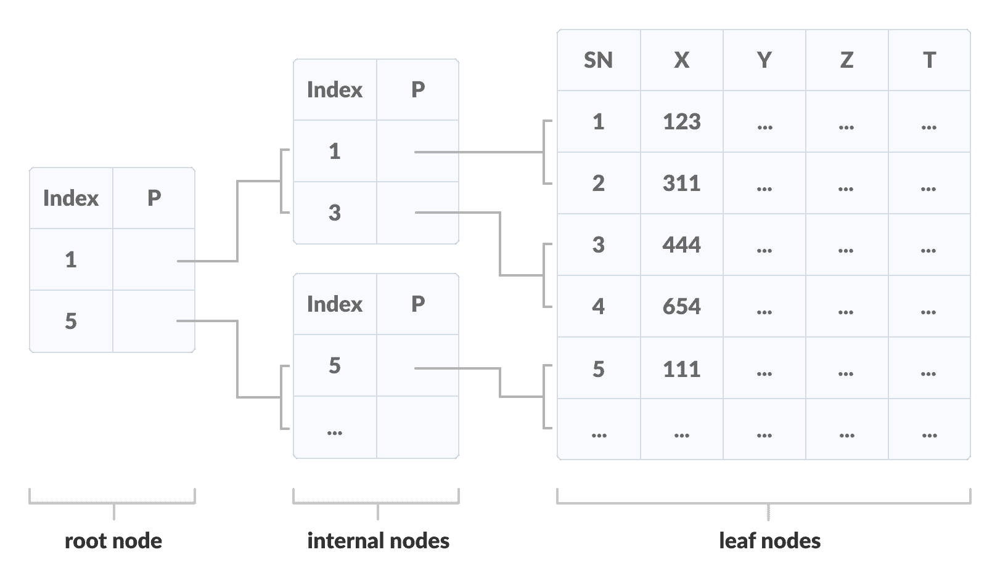
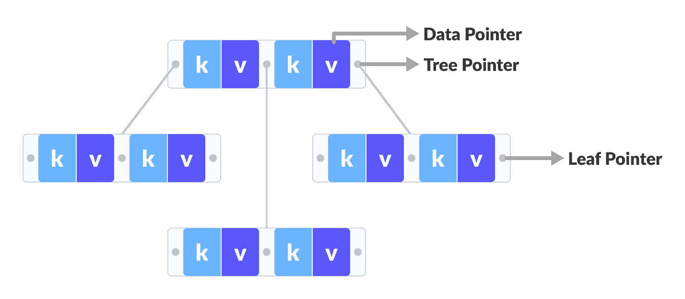
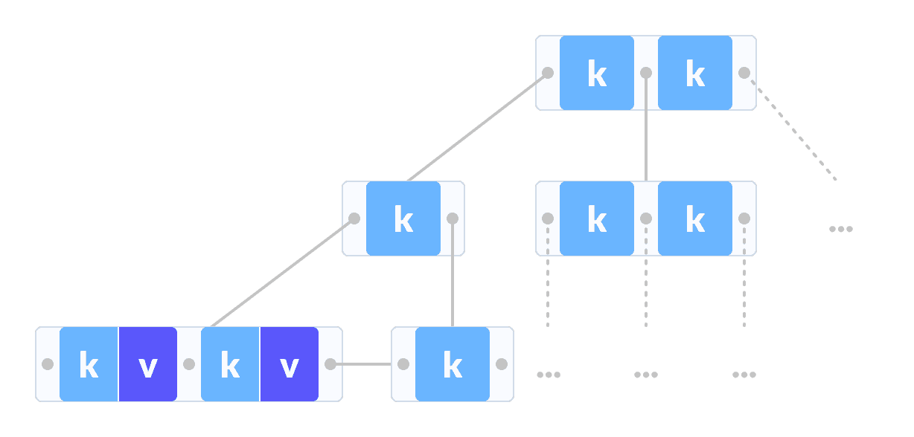
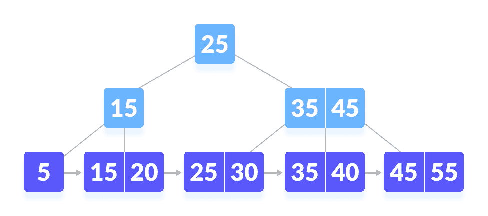
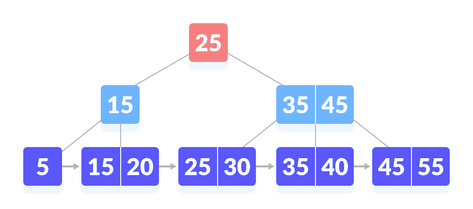
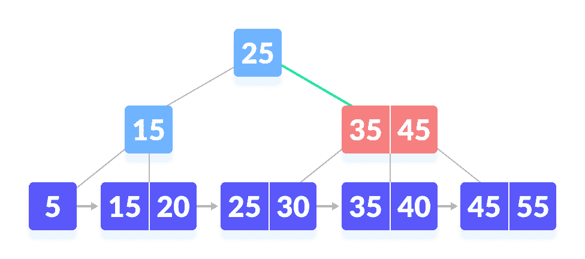
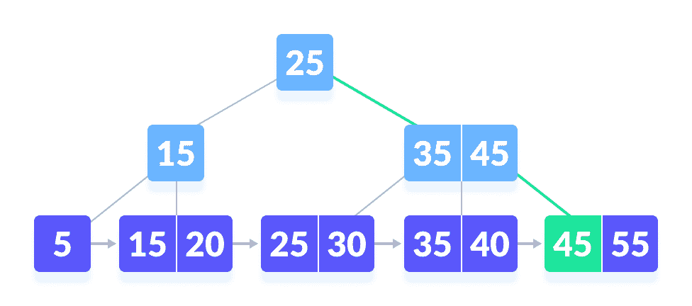

# B+ 树

> 原文： [https://www.programiz.com/dsa/b-plus-tree](https://www.programiz.com/dsa/b-plus-tree)

#### 在本教程中，您将学习什么是 B+ 树。 此外，您还将找到在 C，C++ ，Java 和 Python 中对 B+ 树进行搜索操作的工作示例。

B+ 树是自平衡树的高级形式，其中所有值都存在于叶级别中。

学习 B+ 树之前要理解的重要概念是多级索引。 在多级索引中，索引索引如下图所示创建。 它使访问数据更容易，更快捷。



Multilevel Indexing using B+ tree


* * *

## B+ 树的属性

1.  所有叶子处于同一级别。
2.  根至少有两个子级。
3.  除根节点外，每个节点最多可以包含`m`个子级，并且至少具有`m / 2`个子级。
4.  每个节点最多可以包含`m -1`键，以及最小`⌈m/2⌉ -1`键。

* * *

## B 树和 B+ 树之间的比较



B-tree




B+ tree


数据指针仅出现在 B+ 树的叶子节点上，而数据指针则出现在 B 树的内部，叶子或根节点上。

叶子在 B 树上不相互连接，而在 B+ 树上连接。

B+ 树上的操作比 B 树上的操作快。

* * *

## 在 B+ 树上搜索

遵循以下步骤以在顺序为`m`的 B+ 树中搜索数据。 令要搜索的数据为`k`。

1.  从根节点开始。 比较`k`与根节点`[k1, k2, k3, ... k(m-1)]`上的键。
2.  如果`k < k1`，请转到根节点的左子节点。
3.  否则，如果`k == k1`，则比较`k2`。 如果`k < k2`，则`k`位于`k1`和`k2`之间。 因此，搜索`k2`的左子级。
4.  如果`k > k2`，则按照步骤 2 和步骤 6 中的`k3，k4，... k(m-1)`进行操作。
5.  重复上述步骤，直到到达叶节点。
6.  如果`k`在叶节点中存在，则返回`true`，否则返回`false`。

* * *

## 在 B+ 树上搜索示例

让我们在以下 B+ 树上搜索`k = 45`。



B+ tree


1.  将`k`与根节点进行比较。 在根 的根下找不到

    

    

2.  由于`k > 25`，请找到合适的子级。

    

    移至根的右侧
3.  比较`k`与 35。由于`k > 30`，将`k`与 45 比较。

    

    未找到`k`

    

4.  由于`k≥45`，因此请找到合适的子级。

    

    移至右侧

    

5.  找到了`k`。 

    


    

* * *

## Python，Java 和 C/C++ 示例

[Python](#python-code)[Java](#java-code)[C](#c-code)[C++](#cpp-code)

```
# B+ tee in python

import math

# Node creation
class Node:
    def __init__(self, order):
        self.order = order
        self.values = []
        self.keys = []
        self.nextKey = None
        self.parent = None
        self.check_leaf = False

    # Insert at the leaf
    def insert_at_leaf(self, leaf, value, key):
        if (self.values):
            temp1 = self.values
            for i in range(len(temp1)):
                if (value == temp1[i]):
                    self.keys[i].append(key)
                    break
                elif (value < temp1[i]):
                    self.values = self.values[:i] + [value] + self.values[i:]
                    self.keys = self.keys[:i] + [[key]] + self.keys[i:]
                    break
                elif (i + 1 == len(temp1)):
                    self.values.append(value)
                    self.keys.append([key])
                    break
        else:
            self.values = [value]
            self.keys = [[key]]

# B plus tree
class BplusTree:
    def __init__(self, order):
        self.root = Node(order)
        self.root.check_leaf = True

    # Insert operation
    def insert(self, value, key):
        value = str(value)
        old_node = self.search(value)
        old_node.insert_at_leaf(old_node, value, key)

        if (len(old_node.values) == old_node.order):
            node1 = Node(old_node.order)
            node1.check_leaf = True
            node1.parent = old_node.parent
            mid = int(math.ceil(old_node.order / 2)) - 1
            node1.values = old_node.values[mid + 1:]
            node1.keys = old_node.keys[mid + 1:]
            node1.nextKey = old_node.nextKey
            old_node.values = old_node.values[:mid + 1]
            old_node.keys = old_node.keys[:mid + 1]
            old_node.nextKey = node1
            self.insert_in_parent(old_node, node1.values[0], node1)

    # Search operation for different operations
    def search(self, value):
        current_node = self.root
        while(current_node.check_leaf == False):
            temp2 = current_node.values
            for i in range(len(temp2)):
                if (value == temp2[i]):
                    current_node = current_node.keys[i + 1]
                    break
                elif (value < temp2[i]):
                    current_node = current_node.keys[i]
                    break
                elif (i + 1 == len(current_node.values)):
                    current_node = current_node.keys[i + 1]
                    break
        return current_node

    # Find the node
    def find(self, value, key):
        l = self.search(value)
        for i, item in enumerate(l.values):
            if item == value:
                if key in l.keys[i]:
                    return True
                else:
                    return False
        return False

    # Inserting at the parent
    def insert_in_parent(self, n, value, ndash):
        if (self.root == n):
            rootNode = Node(n.order)
            rootNode.values = [value]
            rootNode.keys = [n, ndash]
            self.root = rootNode
            n.parent = rootNode
            ndash.parent = rootNode
            return

        parentNode = n.parent
        temp3 = parentNode.keys
        for i in range(len(temp3)):
            if (temp3[i] == n):
                parentNode.values = parentNode.values[:i] + \
                    [value] + parentNode.values[i:]
                parentNode.keys = parentNode.keys[:i +
                                                  1] + [ndash] + parentNode.keys[i + 1:]
                if (len(parentNode.keys) > parentNode.order):
                    parentdash = Node(parentNode.order)
                    parentdash.parent = parentNode.parent
                    mid = int(math.ceil(parentNode.order / 2)) - 1
                    parentdash.values = parentNode.values[mid + 1:]
                    parentdash.keys = parentNode.keys[mid + 1:]
                    value_ = parentNode.values[mid]
                    if (mid == 0):
                        parentNode.values = parentNode.values[:mid + 1]
                    else:
                        parentNode.values = parentNode.values[:mid]
                    parentNode.keys = parentNode.keys[:mid + 1]
                    for j in parentNode.keys:
                        j.parent = parentNode
                    for j in parentdash.keys:
                        j.parent = parentdash
                    self.insert_in_parent(parentNode, value_, parentdash)

    # Delete a node
    def delete(self, value, key):
        node_ = self.search(value)

        temp = 0
        for i, item in enumerate(node_.values):
            if item == value:
                temp = 1

                if key in node_.keys[i]:
                    if len(node_.keys[i]) > 1:
                        node_.keys[i].pop(node_.keys[i].index(key))
                    elif node_ == self.root:
                        node_.values.pop(i)
                        node_.keys.pop(i)
                    else:
                        node_.keys[i].pop(node_.keys[i].index(key))
                        del node_.keys[i]
                        node_.values.pop(node_.values.index(value))
                        self.deleteEntry(node_, value, key)
                else:
                    print("Value not in Key")
                    return
        if temp == 0:
            print("Value not in Tree")
            return

    # Delete an entry
    def deleteEntry(self, node_, value, key):

        if not node_.check_leaf:
            for i, item in enumerate(node_.keys):
                if item == key:
                    node_.keys.pop(i)
                    break
            for i, item in enumerate(node_.values):
                if item == value:
                    node_.values.pop(i)
                    break

        if self.root == node_ and len(node_.keys) == 1:
            self.root = node_.keys[0]
            node_.keys[0].parent = None
            del node_
            return
        elif (len(node_.keys) < int(math.ceil(node_.order / 2)) and node_.check_leaf == False) or (len(node_.values) < int(math.ceil((node_.order - 1) / 2)) and node_.check_leaf == True):

            is_predecessor = 0
            parentNode = node_.parent
            PrevNode = -1
            NextNode = -1
            PrevK = -1
            PostK = -1
            for i, item in enumerate(parentNode.keys):

                if item == node_:
                    if i > 0:
                        PrevNode = parentNode.keys[i - 1]
                        PrevK = parentNode.values[i - 1]

                    if i < len(parentNode.keys) - 1:
                        NextNode = parentNode.keys[i + 1]
                        PostK = parentNode.values[i]

            if PrevNode == -1:
                ndash = NextNode
                value_ = PostK
            elif NextNode == -1:
                is_predecessor = 1
                ndash = PrevNode
                value_ = PrevK
            else:
                if len(node_.values) + len(NextNode.values) < node_.order:
                    ndash = NextNode
                    value_ = PostK
                else:
                    is_predecessor = 1
                    ndash = PrevNode
                    value_ = PrevK

            if len(node_.values) + len(ndash.values) < node_.order:
                if is_predecessor == 0:
                    node_, ndash = ndash, node_
                ndash.keys += node_.keys
                if not node_.check_leaf:
                    ndash.values.append(value_)
                else:
                    ndash.nextKey = node_.nextKey
                ndash.values += node_.values

                if not ndash.check_leaf:
                    for j in ndash.keys:
                        j.parent = ndash

                self.deleteEntry(node_.parent, value_, node_)
                del node_
            else:
                if is_predecessor == 1:
                    if not node_.check_leaf:
                        ndashpm = ndash.keys.pop(-1)
                        ndashkm_1 = ndash.values.pop(-1)
                        node_.keys = [ndashpm] + node_.keys
                        node_.values = [value_] + node_.values
                        parentNode = node_.parent
                        for i, item in enumerate(parentNode.values):
                            if item == value_:
                                p.values[i] = ndashkm_1
                                break
                    else:
                        ndashpm = ndash.keys.pop(-1)
                        ndashkm = ndash.values.pop(-1)
                        node_.keys = [ndashpm] + node_.keys
                        node_.values = [ndashkm] + node_.values
                        parentNode = node_.parent
                        for i, item in enumerate(p.values):
                            if item == value_:
                                parentNode.values[i] = ndashkm
                                break
                else:
                    if not node_.check_leaf:
                        ndashp0 = ndash.keys.pop(0)
                        ndashk0 = ndash.values.pop(0)
                        node_.keys = node_.keys + [ndashp0]
                        node_.values = node_.values + [value_]
                        parentNode = node_.parent
                        for i, item in enumerate(parentNode.values):
                            if item == value_:
                                parentNode.values[i] = ndashk0
                                break
                    else:
                        ndashp0 = ndash.keys.pop(0)
                        ndashk0 = ndash.values.pop(0)
                        node_.keys = node_.keys + [ndashp0]
                        node_.values = node_.values + [ndashk0]
                        parentNode = node_.parent
                        for i, item in enumerate(parentNode.values):
                            if item == value_:
                                parentNode.values[i] = ndash.values[0]
                                break

                if not ndash.check_leaf:
                    for j in ndash.keys:
                        j.parent = ndash
                if not node_.check_leaf:
                    for j in node_.keys:
                        j.parent = node_
                if not parentNode.check_leaf:
                    for j in parentNode.keys:
                        j.parent = parentNode

# Print the tree
def printTree(tree):
    lst = [tree.root]
    level = [0]
    leaf = None
    flag = 0
    lev_leaf = 0

    node1 = Node(str(level[0]) + str(tree.root.values))

    while (len(lst) != 0):
        x = lst.pop(0)
        lev = level.pop(0)
        if (x.check_leaf == False):
            for i, item in enumerate(x.keys):
                print(item.values)
        else:
            for i, item in enumerate(x.keys):
                print(item.values)
            if (flag == 0):
                lev_leaf = lev
                leaf = x
                flag = 1

record_len = 3
bplustree = BplusTree(record_len)
bplustree.insert('5', '33')
bplustree.insert('15', '21')
bplustree.insert('25', '31')
bplustree.insert('35', '41')
bplustree.insert('45', '10')

printTree(bplustree)

if(bplustree.find('5', '34')):
    print("Found")
else:
    print("Not found")
```

```
// Searching on a B+ tree in Java

import java.util.*;

public class BPlusTree {
  int m;
  InternalNode root;
  LeafNode firstLeaf;

  // Binary search program
  private int binarySearch(DictionaryPair[] dps, int numPairs, int t) {
    Comparator<DictionaryPair> c = new Comparator<DictionaryPair>() {
      @Override
      public int compare(DictionaryPair o1, DictionaryPair o2) {
        Integer a = Integer.valueOf(o1.key);
        Integer b = Integer.valueOf(o2.key);
        return a.compareTo(b);
      }
    };
    return Arrays.binarySearch(dps, 0, numPairs, new DictionaryPair(t, 0), c);
  }

  // Find the leaf node
  private LeafNode findLeafNode(int key) {

    Integer[] keys = this.root.keys;
    int i;

    for (i = 0; i < this.root.degree - 1; i++) {
      if (key < keys[i]) {
        break;
      }
    }

    Node child = this.root.childPointers[i];
    if (child instanceof LeafNode) {
      return (LeafNode) child;
    } else {
      return findLeafNode((InternalNode) child, key);
    }
  }

  // Find the leaf node
  private LeafNode findLeafNode(InternalNode node, int key) {

    Integer[] keys = node.keys;
    int i;

    for (i = 0; i < node.degree - 1; i++) {
      if (key < keys[i]) {
        break;
      }
    }
    Node childNode = node.childPointers[i];
    if (childNode instanceof LeafNode) {
      return (LeafNode) childNode;
    } else {
      return findLeafNode((InternalNode) node.childPointers[i], key);
    }
  }

  // Finding the index of the pointer
  private int findIndexOfPointer(Node[] pointers, LeafNode node) {
    int i;
    for (i = 0; i < pointers.length; i++) {
      if (pointers[i] == node) {
        break;
      }
    }
    return i;
  }

  // Get the mid point
  private int getMidpoint() {
    return (int) Math.ceil((this.m + 1) / 2.0) - 1;
  }

  // Balance the tree
  private void handleDeficiency(InternalNode in) {

    InternalNode sibling;
    InternalNode parent = in.parent;

    if (this.root == in) {
      for (int i = 0; i < in.childPointers.length; i++) {
        if (in.childPointers[i] != null) {
          if (in.childPointers[i] instanceof InternalNode) {
            this.root = (InternalNode) in.childPointers[i];
            this.root.parent = null;
          } else if (in.childPointers[i] instanceof LeafNode) {
            this.root = null;
          }
        }
      }
    }

    else if (in.leftSibling != null && in.leftSibling.isLendable()) {
      sibling = in.leftSibling;
    } else if (in.rightSibling != null && in.rightSibling.isLendable()) {
      sibling = in.rightSibling;

      int borrowedKey = sibling.keys[0];
      Node pointer = sibling.childPointers[0];

      in.keys[in.degree - 1] = parent.keys[0];
      in.childPointers[in.degree] = pointer;

      parent.keys[0] = borrowedKey;

      sibling.removePointer(0);
      Arrays.sort(sibling.keys);
      sibling.removePointer(0);
      shiftDown(in.childPointers, 1);
    } else if (in.leftSibling != null && in.leftSibling.isMergeable()) {

    } else if (in.rightSibling != null && in.rightSibling.isMergeable()) {
      sibling = in.rightSibling;
      sibling.keys[sibling.degree - 1] = parent.keys[parent.degree - 2];
      Arrays.sort(sibling.keys, 0, sibling.degree);
      parent.keys[parent.degree - 2] = null;

      for (int i = 0; i < in.childPointers.length; i++) {
        if (in.childPointers[i] != null) {
          sibling.prependChildPointer(in.childPointers[i]);
          in.childPointers[i].parent = sibling;
          in.removePointer(i);
        }
      }

      parent.removePointer(in);

      sibling.leftSibling = in.leftSibling;
    }

    if (parent != null && parent.isDeficient()) {
      handleDeficiency(parent);
    }
  }

  private boolean isEmpty() {
    return firstLeaf == null;
  }

  private int linearNullSearch(DictionaryPair[] dps) {
    for (int i = 0; i < dps.length; i++) {
      if (dps[i] == null) {
        return i;
      }
    }
    return -1;
  }

  private int linearNullSearch(Node[] pointers) {
    for (int i = 0; i < pointers.length; i++) {
      if (pointers[i] == null) {
        return i;
      }
    }
    return -1;
  }

  private void shiftDown(Node[] pointers, int amount) {
    Node[] newPointers = new Node[this.m + 1];
    for (int i = amount; i < pointers.length; i++) {
      newPointers[i - amount] = pointers[i];
    }
    pointers = newPointers;
  }

  private void sortDictionary(DictionaryPair[] dictionary) {
    Arrays.sort(dictionary, new Comparator<DictionaryPair>() {
      @Override
      public int compare(DictionaryPair o1, DictionaryPair o2) {
        if (o1 == null && o2 == null) {
          return 0;
        }
        if (o1 == null) {
          return 1;
        }
        if (o2 == null) {
          return -1;
        }
        return o1.compareTo(o2);
      }
    });
  }

  private Node[] splitChildPointers(InternalNode in, int split) {

    Node[] pointers = in.childPointers;
    Node[] halfPointers = new Node[this.m + 1];

    for (int i = split + 1; i < pointers.length; i++) {
      halfPointers[i - split - 1] = pointers[i];
      in.removePointer(i);
    }

    return halfPointers;
  }

  private DictionaryPair[] splitDictionary(LeafNode ln, int split) {

    DictionaryPair[] dictionary = ln.dictionary;

    DictionaryPair[] halfDict = new DictionaryPair[this.m];

    for (int i = split; i < dictionary.length; i++) {
      halfDict[i - split] = dictionary[i];
      ln.delete(i);
    }

    return halfDict;
  }

  private void splitInternalNode(InternalNode in) {

    InternalNode parent = in.parent;

    int midpoint = getMidpoint();
    int newParentKey = in.keys[midpoint];
    Integer[] halfKeys = splitKeys(in.keys, midpoint);
    Node[] halfPointers = splitChildPointers(in, midpoint);

    in.degree = linearNullSearch(in.childPointers);

    InternalNode sibling = new InternalNode(this.m, halfKeys, halfPointers);
    for (Node pointer : halfPointers) {
      if (pointer != null) {
        pointer.parent = sibling;
      }
    }

    sibling.rightSibling = in.rightSibling;
    if (sibling.rightSibling != null) {
      sibling.rightSibling.leftSibling = sibling;
    }
    in.rightSibling = sibling;
    sibling.leftSibling = in;

    if (parent == null) {

      Integer[] keys = new Integer[this.m];
      keys[0] = newParentKey;
      InternalNode newRoot = new InternalNode(this.m, keys);
      newRoot.appendChildPointer(in);
      newRoot.appendChildPointer(sibling);
      this.root = newRoot;

      in.parent = newRoot;
      sibling.parent = newRoot;

    } else {

      parent.keys[parent.degree - 1] = newParentKey;
      Arrays.sort(parent.keys, 0, parent.degree);

      int pointerIndex = parent.findIndexOfPointer(in) + 1;
      parent.insertChildPointer(sibling, pointerIndex);
      sibling.parent = parent;
    }
  }

  private Integer[] splitKeys(Integer[] keys, int split) {

    Integer[] halfKeys = new Integer[this.m];

    keys[split] = null;

    for (int i = split + 1; i < keys.length; i++) {
      halfKeys[i - split - 1] = keys[i];
      keys[i] = null;
    }

    return halfKeys;
  }

  public void insert(int key, double value) {
    if (isEmpty()) {

      LeafNode ln = new LeafNode(this.m, new DictionaryPair(key, value));

      this.firstLeaf = ln;

    } else {
      LeafNode ln = (this.root == null) ? this.firstLeaf : findLeafNode(key);

      if (!ln.insert(new DictionaryPair(key, value))) {

        ln.dictionary[ln.numPairs] = new DictionaryPair(key, value);
        ln.numPairs++;
        sortDictionary(ln.dictionary);

        int midpoint = getMidpoint();
        DictionaryPair[] halfDict = splitDictionary(ln, midpoint);

        if (ln.parent == null) {

          Integer[] parent_keys = new Integer[this.m];
          parent_keys[0] = halfDict[0].key;
          InternalNode parent = new InternalNode(this.m, parent_keys);
          ln.parent = parent;
          parent.appendChildPointer(ln);

        } else {
          int newParentKey = halfDict[0].key;
          ln.parent.keys[ln.parent.degree - 1] = newParentKey;
          Arrays.sort(ln.parent.keys, 0, ln.parent.degree);
        }

        LeafNode newLeafNode = new LeafNode(this.m, halfDict, ln.parent);

        int pointerIndex = ln.parent.findIndexOfPointer(ln) + 1;
        ln.parent.insertChildPointer(newLeafNode, pointerIndex);

        newLeafNode.rightSibling = ln.rightSibling;
        if (newLeafNode.rightSibling != null) {
          newLeafNode.rightSibling.leftSibling = newLeafNode;
        }
        ln.rightSibling = newLeafNode;
        newLeafNode.leftSibling = ln;

        if (this.root == null) {

          this.root = ln.parent;

        } else {
          InternalNode in = ln.parent;
          while (in != null) {
            if (in.isOverfull()) {
              splitInternalNode(in);
            } else {
              break;
            }
            in = in.parent;
          }
        }
      }
    }
  }

  public Double search(int key) {

    if (isEmpty()) {
      return null;
    }

    LeafNode ln = (this.root == null) ? this.firstLeaf : findLeafNode(key);

    DictionaryPair[] dps = ln.dictionary;
    int index = binarySearch(dps, ln.numPairs, key);

    if (index < 0) {
      return null;
    } else {
      return dps[index].value;
    }
  }

  public ArrayList<Double> search(int lowerBound, int upperBound) {

    ArrayList<Double> values = new ArrayList<Double>();

    LeafNode currNode = this.firstLeaf;
    while (currNode != null) {

      DictionaryPair dps[] = currNode.dictionary;
      for (DictionaryPair dp : dps) {

        if (dp == null) {
          break;
        }

        if (lowerBound <= dp.key && dp.key <= upperBound) {
          values.add(dp.value);
        }
      }
      currNode = currNode.rightSibling;

    }

    return values;
  }

  public BPlusTree(int m) {
    this.m = m;
    this.root = null;
  }

  public class Node {
    InternalNode parent;
  }

  private class InternalNode extends Node {
    int maxDegree;
    int minDegree;
    int degree;
    InternalNode leftSibling;
    InternalNode rightSibling;
    Integer[] keys;
    Node[] childPointers;

    private void appendChildPointer(Node pointer) {
      this.childPointers[degree] = pointer;
      this.degree++;
    }

    private int findIndexOfPointer(Node pointer) {
      for (int i = 0; i < childPointers.length; i++) {
        if (childPointers[i] == pointer) {
          return i;
        }
      }
      return -1;
    }

    private void insertChildPointer(Node pointer, int index) {
      for (int i = degree - 1; i >= index; i--) {
        childPointers[i + 1] = childPointers[i];
      }
      this.childPointers[index] = pointer;
      this.degree++;
    }

    private boolean isDeficient() {
      return this.degree < this.minDegree;
    }

    private boolean isLendable() {
      return this.degree > this.minDegree;
    }

    private boolean isMergeable() {
      return this.degree == this.minDegree;
    }

    private boolean isOverfull() {
      return this.degree == maxDegree + 1;
    }

    private void prependChildPointer(Node pointer) {
      for (int i = degree - 1; i >= 0; i--) {
        childPointers[i + 1] = childPointers[i];
      }
      this.childPointers[0] = pointer;
      this.degree++;
    }

    private void removeKey(int index) {
      this.keys[index] = null;
    }

    private void removePointer(int index) {
      this.childPointers[index] = null;
      this.degree--;
    }

    private void removePointer(Node pointer) {
      for (int i = 0; i < childPointers.length; i++) {
        if (childPointers[i] == pointer) {
          this.childPointers[i] = null;
        }
      }
      this.degree--;
    }

    private InternalNode(int m, Integer[] keys) {
      this.maxDegree = m;
      this.minDegree = (int) Math.ceil(m / 2.0);
      this.degree = 0;
      this.keys = keys;
      this.childPointers = new Node[this.maxDegree + 1];
    }

    private InternalNode(int m, Integer[] keys, Node[] pointers) {
      this.maxDegree = m;
      this.minDegree = (int) Math.ceil(m / 2.0);
      this.degree = linearNullSearch(pointers);
      this.keys = keys;
      this.childPointers = pointers;
    }
  }

  public class LeafNode extends Node {
    int maxNumPairs;
    int minNumPairs;
    int numPairs;
    LeafNode leftSibling;
    LeafNode rightSibling;
    DictionaryPair[] dictionary;

    public void delete(int index) {
      this.dictionary[index] = null;
      numPairs--;
    }

    public boolean insert(DictionaryPair dp) {
      if (this.isFull()) {
        return false;
      } else {
        this.dictionary[numPairs] = dp;
        numPairs++;
        Arrays.sort(this.dictionary, 0, numPairs);

        return true;
      }
    }

    public boolean isDeficient() {
      return numPairs < minNumPairs;
    }

    public boolean isFull() {
      return numPairs == maxNumPairs;
    }

    public boolean isLendable() {
      return numPairs > minNumPairs;
    }

    public boolean isMergeable() {
      return numPairs == minNumPairs;
    }

    public LeafNode(int m, DictionaryPair dp) {
      this.maxNumPairs = m - 1;
      this.minNumPairs = (int) (Math.ceil(m / 2) - 1);
      this.dictionary = new DictionaryPair[m];
      this.numPairs = 0;
      this.insert(dp);
    }

    public LeafNode(int m, DictionaryPair[] dps, InternalNode parent) {
      this.maxNumPairs = m - 1;
      this.minNumPairs = (int) (Math.ceil(m / 2) - 1);
      this.dictionary = dps;
      this.numPairs = linearNullSearch(dps);
      this.parent = parent;
    }
  }

  public class DictionaryPair implements Comparable<DictionaryPair> {
    int key;
    double value;

    public DictionaryPair(int key, double value) {
      this.key = key;
      this.value = value;
    }

    public int compareTo(DictionaryPair o) {
      if (key == o.key) {
        return 0;
      } else if (key > o.key) {
        return 1;
      } else {
        return -1;
      }
    }
  }

  public static void main(String[] args) {
    BPlusTree bpt = null;
    bpt = new BPlusTree(3);
    bpt.insert(5, 33);
    bpt.insert(15, 21);
    bpt.insert(25, 31);
    bpt.insert(35, 41);
    bpt.insert(45, 10);

    if (bpt.search(15) != null) {
      System.out.println("Found");
    } else {
      System.out.println("Not Found");
    }
    ;
  }
}
```

```
// Searching on a B+ Tree in C

#include <stdbool.h>
#include <stdio.h>
#include <stdlib.h>
#include <string.h>

// Default order
#define ORDER 3

typedef struct record {
  int value;
} record;

// Node
typedef struct node {
  void **pointers;
  int *keys;
  struct node *parent;
  bool is_leaf;
  int num_keys;
  struct node *next;
} node;

int order = ORDER;
node *queue = NULL;
bool verbose_output = false;

// Enqueue
void enqueue(node *new_node);

// Dequeue
node *dequeue(void);
int height(node *const root);
int pathToLeaves(node *const root, node *child);
void printLeaves(node *const root);
void printTree(node *const root);
void findAndPrint(node *const root, int key, bool verbose);
void findAndPrintRange(node *const root, int range1, int range2, bool verbose);
int findRange(node *const root, int key_start, int key_end, bool verbose,
        int returned_keys[], void *returned_pointers[]);
node *findLeaf(node *const root, int key, bool verbose);
record *find(node *root, int key, bool verbose, node **leaf_out);
int cut(int length);

record *makeRecord(int value);
node *makeNode(void);
node *makeLeaf(void);
int getLeftIndex(node *parent, node *left);
node *insertIntoLeaf(node *leaf, int key, record *pointer);
node *insertIntoLeafAfterSplitting(node *root, node *leaf, int key,
                   record *pointer);
node *insertIntoNode(node *root, node *parent,
           int left_index, int key, node *right);
node *insertIntoNodeAfterSplitting(node *root, node *parent,
                   int left_index,
                   int key, node *right);
node *insertIntoParent(node *root, node *left, int key, node *right);
node *insertIntoNewRoot(node *left, int key, node *right);
node *startNewTree(int key, record *pointer);
node *insert(node *root, int key, int value);

// Enqueue
void enqueue(node *new_node) {
  node *c;
  if (queue == NULL) {
    queue = new_node;
    queue->next = NULL;
  } else {
    c = queue;
    while (c->next != NULL) {
      c = c->next;
    }
    c->next = new_node;
    new_node->next = NULL;
  }
}

// Dequeue
node *dequeue(void) {
  node *n = queue;
  queue = queue->next;
  n->next = NULL;
  return n;
}

// Print the leaves
void printLeaves(node *const root) {
  if (root == NULL) {
    printf("Empty tree.\n");
    return;
  }
  int i;
  node *c = root;
  while (!c->is_leaf)
    c = c->pointers[0];
  while (true) {
    for (i = 0; i < c->num_keys; i++) {
      if (verbose_output)
        printf("%p ", c->pointers[i]);
      printf("%d ", c->keys[i]);
    }
    if (verbose_output)
      printf("%p ", c->pointers[order - 1]);
    if (c->pointers[order - 1] != NULL) {
      printf(" | ");
      c = c->pointers[order - 1];
    } else
      break;
  }
  printf("\n");
}

// Calculate height
int height(node *const root) {
  int h = 0;
  node *c = root;
  while (!c->is_leaf) {
    c = c->pointers[0];
    h++;
  }
  return h;
}

// Get path to root
int pathToLeaves(node *const root, node *child) {
  int length = 0;
  node *c = child;
  while (c != root) {
    c = c->parent;
    length++;
  }
  return length;
}

// Print the tree
void printTree(node *const root) {
  node *n = NULL;
  int i = 0;
  int rank = 0;
  int new_rank = 0;

  if (root == NULL) {
    printf("Empty tree.\n");
    return;
  }
  queue = NULL;
  enqueue(root);
  while (queue != NULL) {
    n = dequeue();
    if (n->parent != NULL && n == n->parent->pointers[0]) {
      new_rank = pathToLeaves(root, n);
      if (new_rank != rank) {
        rank = new_rank;
        printf("\n");
      }
    }
    if (verbose_output)
      printf("(%p)", n);
    for (i = 0; i < n->num_keys; i++) {
      if (verbose_output)
        printf("%p ", n->pointers[i]);
      printf("%d ", n->keys[i]);
    }
    if (!n->is_leaf)
      for (i = 0; i <= n->num_keys; i++)
        enqueue(n->pointers[i]);
    if (verbose_output) {
      if (n->is_leaf)
        printf("%p ", n->pointers[order - 1]);
      else
        printf("%p ", n->pointers[n->num_keys]);
    }
    printf("| ");
  }
  printf("\n");
}

// Find the node and print it
void findAndPrint(node *const root, int key, bool verbose) {
  node *leaf = NULL;
  record *r = find(root, key, verbose, NULL);
  if (r == NULL)
    printf("Record not found under key %d.\n", key);
  else
    printf("Record at %p -- key %d, value %d.\n",
         r, key, r->value);
}

// Find and print the range
void findAndPrintRange(node *const root, int key_start, int key_end,
             bool verbose) {
  int i;
  int array_size = key_end - key_start + 1;
  int returned_keys[array_size];
  void *returned_pointers[array_size];
  int num_found = findRange(root, key_start, key_end, verbose,
                returned_keys, returned_pointers);
  if (!num_found)
    printf("None found.\n");
  else {
    for (i = 0; i < num_found; i++)
      printf("Key: %d   Location: %p  Value: %d\n",
           returned_keys[i],
           returned_pointers[i],
           ((record *)
            returned_pointers[i])
             ->value);
  }
}

// Find the range
int findRange(node *const root, int key_start, int key_end, bool verbose,
        int returned_keys[], void *returned_pointers[]) {
  int i, num_found;
  num_found = 0;
  node *n = findLeaf(root, key_start, verbose);
  if (n == NULL)
    return 0;
  for (i = 0; i < n->num_keys && n->keys[i] < key_start; i++)
    ;
  if (i == n->num_keys)
    return 0;
  while (n != NULL) {
    for (; i < n->num_keys && n->keys[i] <= key_end; i++) {
      returned_keys[num_found] = n->keys[i];
      returned_pointers[num_found] = n->pointers[i];
      num_found++;
    }
    n = n->pointers[order - 1];
    i = 0;
  }
  return num_found;
}

// Find the leaf
node *findLeaf(node *const root, int key, bool verbose) {
  if (root == NULL) {
    if (verbose)
      printf("Empty tree.\n");
    return root;
  }
  int i = 0;
  node *c = root;
  while (!c->is_leaf) {
    if (verbose) {
      printf("[");
      for (i = 0; i < c->num_keys - 1; i++)
        printf("%d ", c->keys[i]);
      printf("%d] ", c->keys[i]);
    }
    i = 0;
    while (i < c->num_keys) {
      if (key >= c->keys[i])
        i++;
      else
        break;
    }
    if (verbose)
      printf("%d ->\n", i);
    c = (node *)c->pointers[i];
  }
  if (verbose) {
    printf("Leaf [");
    for (i = 0; i < c->num_keys - 1; i++)
      printf("%d ", c->keys[i]);
    printf("%d] ->\n", c->keys[i]);
  }
  return c;
}

record *find(node *root, int key, bool verbose, node **leaf_out) {
  if (root == NULL) {
    if (leaf_out != NULL) {
      *leaf_out = NULL;
    }
    return NULL;
  }

  int i = 0;
  node *leaf = NULL;

  leaf = findLeaf(root, key, verbose);

  for (i = 0; i < leaf->num_keys; i++)
    if (leaf->keys[i] == key)
      break;
  if (leaf_out != NULL) {
    *leaf_out = leaf;
  }
  if (i == leaf->num_keys)
    return NULL;
  else
    return (record *)leaf->pointers[i];
}

int cut(int length) {
  if (length % 2 == 0)
    return length / 2;
  else
    return length / 2 + 1;
}

record *makeRecord(int value) {
  record *new_record = (record *)malloc(sizeof(record));
  if (new_record == NULL) {
    perror("Record creation.");
    exit(EXIT_FAILURE);
  } else {
    new_record->value = value;
  }
  return new_record;
}

node *makeNode(void) {
  node *new_node;
  new_node = malloc(sizeof(node));
  if (new_node == NULL) {
    perror("Node creation.");
    exit(EXIT_FAILURE);
  }
  new_node->keys = malloc((order - 1) * sizeof(int));
  if (new_node->keys == NULL) {
    perror("New node keys array.");
    exit(EXIT_FAILURE);
  }
  new_node->pointers = malloc(order * sizeof(void *));
  if (new_node->pointers == NULL) {
    perror("New node pointers array.");
    exit(EXIT_FAILURE);
  }
  new_node->is_leaf = false;
  new_node->num_keys = 0;
  new_node->parent = NULL;
  new_node->next = NULL;
  return new_node;
}

node *makeLeaf(void) {
  node *leaf = makeNode();
  leaf->is_leaf = true;
  return leaf;
}

int getLeftIndex(node *parent, node *left) {
  int left_index = 0;
  while (left_index <= parent->num_keys &&
       parent->pointers[left_index] != left)
    left_index++;
  return left_index;
}

node *insertIntoLeaf(node *leaf, int key, record *pointer) {
  int i, insertion_point;

  insertion_point = 0;
  while (insertion_point < leaf->num_keys && leaf->keys[insertion_point] < key)
    insertion_point++;

  for (i = leaf->num_keys; i > insertion_point; i--) {
    leaf->keys[i] = leaf->keys[i - 1];
    leaf->pointers[i] = leaf->pointers[i - 1];
  }
  leaf->keys[insertion_point] = key;
  leaf->pointers[insertion_point] = pointer;
  leaf->num_keys++;
  return leaf;
}

node *insertIntoLeafAfterSplitting(node *root, node *leaf, int key, record *pointer) {
  node *new_leaf;
  int *temp_keys;
  void **temp_pointers;
  int insertion_index, split, new_key, i, j;

  new_leaf = makeLeaf();

  temp_keys = malloc(order * sizeof(int));
  if (temp_keys == NULL) {
    perror("Temporary keys array.");
    exit(EXIT_FAILURE);
  }

  temp_pointers = malloc(order * sizeof(void *));
  if (temp_pointers == NULL) {
    perror("Temporary pointers array.");
    exit(EXIT_FAILURE);
  }

  insertion_index = 0;
  while (insertion_index < order - 1 && leaf->keys[insertion_index] < key)
    insertion_index++;

  for (i = 0, j = 0; i < leaf->num_keys; i++, j++) {
    if (j == insertion_index)
      j++;
    temp_keys[j] = leaf->keys[i];
    temp_pointers[j] = leaf->pointers[i];
  }

  temp_keys[insertion_index] = key;
  temp_pointers[insertion_index] = pointer;

  leaf->num_keys = 0;

  split = cut(order - 1);

  for (i = 0; i < split; i++) {
    leaf->pointers[i] = temp_pointers[i];
    leaf->keys[i] = temp_keys[i];
    leaf->num_keys++;
  }

  for (i = split, j = 0; i < order; i++, j++) {
    new_leaf->pointers[j] = temp_pointers[i];
    new_leaf->keys[j] = temp_keys[i];
    new_leaf->num_keys++;
  }

  free(temp_pointers);
  free(temp_keys);

  new_leaf->pointers[order - 1] = leaf->pointers[order - 1];
  leaf->pointers[order - 1] = new_leaf;

  for (i = leaf->num_keys; i < order - 1; i++)
    leaf->pointers[i] = NULL;
  for (i = new_leaf->num_keys; i < order - 1; i++)
    new_leaf->pointers[i] = NULL;

  new_leaf->parent = leaf->parent;
  new_key = new_leaf->keys[0];

  return insertIntoParent(root, leaf, new_key, new_leaf);
}

node *insertIntoNode(node *root, node *n,
           int left_index, int key, node *right) {
  int i;

  for (i = n->num_keys; i > left_index; i--) {
    n->pointers[i + 1] = n->pointers[i];
    n->keys[i] = n->keys[i - 1];
  }
  n->pointers[left_index + 1] = right;
  n->keys[left_index] = key;
  n->num_keys++;
  return root;
}

node *insertIntoNodeAfterSplitting(node *root, node *old_node, int left_index,
                   int key, node *right) {
  int i, j, split, k_prime;
  node *new_node, *child;
  int *temp_keys;
  node **temp_pointers;

  temp_pointers = malloc((order + 1) * sizeof(node *));
  if (temp_pointers == NULL) {
    exit(EXIT_FAILURE);
  }
  temp_keys = malloc(order * sizeof(int));
  if (temp_keys == NULL) {
    exit(EXIT_FAILURE);
  }

  for (i = 0, j = 0; i < old_node->num_keys + 1; i++, j++) {
    if (j == left_index + 1)
      j++;
    temp_pointers[j] = old_node->pointers[i];
  }

  for (i = 0, j = 0; i < old_node->num_keys; i++, j++) {
    if (j == left_index)
      j++;
    temp_keys[j] = old_node->keys[i];
  }

  temp_pointers[left_index + 1] = right;
  temp_keys[left_index] = key;

  split = cut(order);
  new_node = makeNode();
  old_node->num_keys = 0;
  for (i = 0; i < split - 1; i++) {
    old_node->pointers[i] = temp_pointers[i];
    old_node->keys[i] = temp_keys[i];
    old_node->num_keys++;
  }
  old_node->pointers[i] = temp_pointers[i];
  k_prime = temp_keys[split - 1];
  for (++i, j = 0; i < order; i++, j++) {
    new_node->pointers[j] = temp_pointers[i];
    new_node->keys[j] = temp_keys[i];
    new_node->num_keys++;
  }
  new_node->pointers[j] = temp_pointers[i];
  free(temp_pointers);
  free(temp_keys);
  new_node->parent = old_node->parent;
  for (i = 0; i <= new_node->num_keys; i++) {
    child = new_node->pointers[i];
    child->parent = new_node;
  }

  return insertIntoParent(root, old_node, k_prime, new_node);
}

node *insertIntoParent(node *root, node *left, int key, node *right) {
  int left_index;
  node *parent;

  parent = left->parent;

  if (parent == NULL)
    return insertIntoNewRoot(left, key, right);

  left_index = getLeftIndex(parent, left);

  if (parent->num_keys < order - 1)
    return insertIntoNode(root, parent, left_index, key, right);

  return insertIntoNodeAfterSplitting(root, parent, left_index, key, right);
}

node *insertIntoNewRoot(node *left, int key, node *right) {
  node *root = makeNode();
  root->keys[0] = key;
  root->pointers[0] = left;
  root->pointers[1] = right;
  root->num_keys++;
  root->parent = NULL;
  left->parent = root;
  right->parent = root;
  return root;
}

node *startNewTree(int key, record *pointer) {
  node *root = makeLeaf();
  root->keys[0] = key;
  root->pointers[0] = pointer;
  root->pointers[order - 1] = NULL;
  root->parent = NULL;
  root->num_keys++;
  return root;
}

node *insert(node *root, int key, int value) {
  record *record_pointer = NULL;
  node *leaf = NULL;

  record_pointer = find(root, key, false, NULL);
  if (record_pointer != NULL) {
    record_pointer->value = value;
    return root;
  }

  record_pointer = makeRecord(value);

  if (root == NULL)
    return startNewTree(key, record_pointer);

  leaf = findLeaf(root, key, false);

  if (leaf->num_keys < order - 1) {
    leaf = insertIntoLeaf(leaf, key, record_pointer);
    return root;
  }

  return insertIntoLeafAfterSplitting(root, leaf, key, record_pointer);
}

int main() {
  node *root;
  char instruction;

  root = NULL;

  root = insert(root, 5, 33);
  root = insert(root, 15, 21);
  root = insert(root, 25, 31);
  root = insert(root, 35, 41);
  root = insert(root, 45, 10);

  printTree(root);

  findAndPrint(root, 15, instruction = 'a');
}
```

```
// Searching on a B+ tree in C++

#include <climits>
#include <fstream>
#include <iostream>
#include <sstream>
using namespace std;
int MAX = 3;

// BP node
class Node {
  bool IS_LEAF;
  int *key, size;
  Node **ptr;
  friend class BPTree;

   public:
  Node();
};

// BP tree
class BPTree {
  Node *root;
  void insertInternal(int, Node *, Node *);
  Node *findParent(Node *, Node *);

   public:
  BPTree();
  void search(int);
  void insert(int);
  void display(Node *);
  Node *getRoot();
};

Node::Node() {
  key = new int[MAX];
  ptr = new Node *[MAX + 1];
}

BPTree::BPTree() {
  root = NULL;
}

// Search operation
void BPTree::search(int x) {
  if (root == NULL) {
    cout << "Tree is empty\n";
  } else {
    Node *cursor = root;
    while (cursor->IS_LEAF == false) {
      for (int i = 0; i < cursor->size; i++) {
        if (x < cursor->key[i]) {
          cursor = cursor->ptr[i];
          break;
        }
        if (i == cursor->size - 1) {
          cursor = cursor->ptr[i + 1];
          break;
        }
      }
    }
    for (int i = 0; i < cursor->size; i++) {
      if (cursor->key[i] == x) {
        cout << "Found\n";
        return;
      }
    }
    cout << "Not found\n";
  }
}

// Insert Operation
void BPTree::insert(int x) {
  if (root == NULL) {
    root = new Node;
    root->key[0] = x;
    root->IS_LEAF = true;
    root->size = 1;
  } else {
    Node *cursor = root;
    Node *parent;
    while (cursor->IS_LEAF == false) {
      parent = cursor;
      for (int i = 0; i < cursor->size; i++) {
        if (x < cursor->key[i]) {
          cursor = cursor->ptr[i];
          break;
        }
        if (i == cursor->size - 1) {
          cursor = cursor->ptr[i + 1];
          break;
        }
      }
    }
    if (cursor->size < MAX) {
      int i = 0;
      while (x > cursor->key[i] && i < cursor->size)
        i++;
      for (int j = cursor->size; j > i; j--) {
        cursor->key[j] = cursor->key[j - 1];
      }
      cursor->key[i] = x;
      cursor->size++;
      cursor->ptr[cursor->size] = cursor->ptr[cursor->size - 1];
      cursor->ptr[cursor->size - 1] = NULL;
    } else {
      Node *newLeaf = new Node;
      int virtualNode[MAX + 1];
      for (int i = 0; i < MAX; i++) {
        virtualNode[i] = cursor->key[i];
      }
      int i = 0, j;
      while (x > virtualNode[i] && i < MAX)
        i++;
      for (int j = MAX + 1; j > i; j--) {
        virtualNode[j] = virtualNode[j - 1];
      }
      virtualNode[i] = x;
      newLeaf->IS_LEAF = true;
      cursor->size = (MAX + 1) / 2;
      newLeaf->size = MAX + 1 - (MAX + 1) / 2;
      cursor->ptr[cursor->size] = newLeaf;
      newLeaf->ptr[newLeaf->size] = cursor->ptr[MAX];
      cursor->ptr[MAX] = NULL;
      for (i = 0; i < cursor->size; i++) {
        cursor->key[i] = virtualNode[i];
      }
      for (i = 0, j = cursor->size; i < newLeaf->size; i++, j++) {
        newLeaf->key[i] = virtualNode[j];
      }
      if (cursor == root) {
        Node *newRoot = new Node;
        newRoot->key[0] = newLeaf->key[0];
        newRoot->ptr[0] = cursor;
        newRoot->ptr[1] = newLeaf;
        newRoot->IS_LEAF = false;
        newRoot->size = 1;
        root = newRoot;
      } else {
        insertInternal(newLeaf->key[0], parent, newLeaf);
      }
    }
  }
}

// Insert Operation
void BPTree::insertInternal(int x, Node *cursor, Node *child) {
  if (cursor->size < MAX) {
    int i = 0;
    while (x > cursor->key[i] && i < cursor->size)
      i++;
    for (int j = cursor->size; j > i; j--) {
      cursor->key[j] = cursor->key[j - 1];
    }
    for (int j = cursor->size + 1; j > i + 1; j--) {
      cursor->ptr[j] = cursor->ptr[j - 1];
    }
    cursor->key[i] = x;
    cursor->size++;
    cursor->ptr[i + 1] = child;
  } else {
    Node *newInternal = new Node;
    int virtualKey[MAX + 1];
    Node *virtualPtr[MAX + 2];
    for (int i = 0; i < MAX; i++) {
      virtualKey[i] = cursor->key[i];
    }
    for (int i = 0; i < MAX + 1; i++) {
      virtualPtr[i] = cursor->ptr[i];
    }
    int i = 0, j;
    while (x > virtualKey[i] && i < MAX)
      i++;
    for (int j = MAX + 1; j > i; j--) {
      virtualKey[j] = virtualKey[j - 1];
    }
    virtualKey[i] = x;
    for (int j = MAX + 2; j > i + 1; j--) {
      virtualPtr[j] = virtualPtr[j - 1];
    }
    virtualPtr[i + 1] = child;
    newInternal->IS_LEAF = false;
    cursor->size = (MAX + 1) / 2;
    newInternal->size = MAX - (MAX + 1) / 2;
    for (i = 0, j = cursor->size + 1; i < newInternal->size; i++, j++) {
      newInternal->key[i] = virtualKey[j];
    }
    for (i = 0, j = cursor->size + 1; i < newInternal->size + 1; i++, j++) {
      newInternal->ptr[i] = virtualPtr[j];
    }
    if (cursor == root) {
      Node *newRoot = new Node;
      newRoot->key[0] = cursor->key[cursor->size];
      newRoot->ptr[0] = cursor;
      newRoot->ptr[1] = newInternal;
      newRoot->IS_LEAF = false;
      newRoot->size = 1;
      root = newRoot;
    } else {
      insertInternal(cursor->key[cursor->size], findParent(root, cursor), newInternal);
    }
  }
}

// Find the parent
Node *BPTree::findParent(Node *cursor, Node *child) {
  Node *parent;
  if (cursor->IS_LEAF || (cursor->ptr[0])->IS_LEAF) {
    return NULL;
  }
  for (int i = 0; i < cursor->size + 1; i++) {
    if (cursor->ptr[i] == child) {
      parent = cursor;
      return parent;
    } else {
      parent = findParent(cursor->ptr[i], child);
      if (parent != NULL)
        return parent;
    }
  }
  return parent;
}

// Print the tree
void BPTree::display(Node *cursor) {
  if (cursor != NULL) {
    for (int i = 0; i < cursor->size; i++) {
      cout << cursor->key[i] << " ";
    }
    cout << "\n";
    if (cursor->IS_LEAF != true) {
      for (int i = 0; i < cursor->size + 1; i++) {
        display(cursor->ptr[i]);
      }
    }
  }
}

// Get the root
Node *BPTree::getRoot() {
  return root;
}

int main() {
  BPTree node;
  node.insert(5);
  node.insert(15);
  node.insert(25);
  node.insert(35);
  node.insert(45);
  node.insert(55);
  node.insert(40);
  node.insert(30);
  node.insert(20);
  node.display(node.getRoot());

  node.search(15);
}
```

* * *

## 搜索复杂度

### 时间复杂度

如果在节点内部实现线性搜索，则总复杂度为`Θ(log_t n)`。

如果使用二分搜索，则总复杂度为`Θ(log2 t x log_t n)`。

* * *

## B+ 树应用

*   多级索引
*   树上的更快操作（插入，删除，搜索）
*   数据库索引