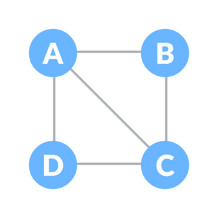
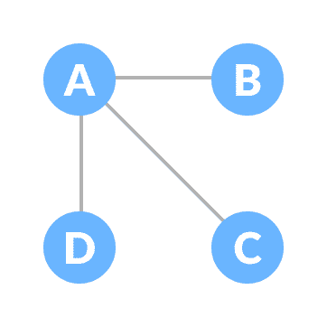
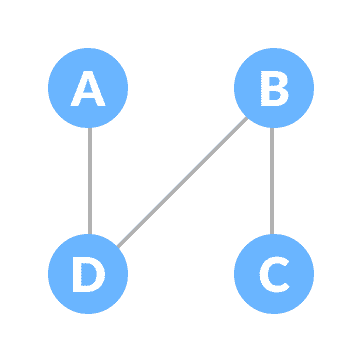
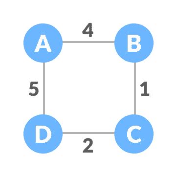

# 生成树和最小生成树

> 原文： [https://www.programiz.com/dsa/spanning-tree-and-minimum-spanning-tree](https://www.programiz.com/dsa/spanning-tree-and-minimum-spanning-tree)

#### 在本教程中，您将通过示例和图形学习有关生成树和最小生成树的信息。

在学习生成树之前，我们需要了解两个图：无向图和连接图。

**无向图**是其中边缘没有指向任何方向的图（即，边缘是双向的）。

Undirected Graph

**连接图**是其中始终存在从顶点到任何其他顶点的路径的图。

Connected Graph

* * *

## 生成树

生成树是无向图和连通图的子图，其中包括图的所有顶点，这些顶点的边数最少。 如果缺少顶点，则它不是生成树。

边缘可以分配权重，也可以不分配权重。

可以从完整图形创建的具有`n`顶点的生成树总数等于`n(n-2)`。

如果我们有`n = 4`，则最大可能的生成树数等于`44-2 = 16`。 因此，可以从具有 4 个顶点的完整图形中形成 16 个生成树。

* * *

## 生成树的示例

让我们通过以下示例了解生成树：

让原始图为：

Normal graph

可以从上图创建的一些可能的生成树是：

A spanning tree

A spanning tree

A spanning tree

A spanning tree

A spanning tree

A spanning tree

* * *

## 最小生成树

最小生成树是其中边缘的权重之和尽可能最小的生成树。

* * *

## 生成树的示例

让我们借助下面的示例了解上面的定义。

初始图形为：

Weighted graph

上图可能的生成树是：

")

Minimum spanning tree - 1

")

Minimum spanning tree - 2

")

Minimum spanning tree - 3

")

Minimum spanning tree - 4

上述生成树中的最小生成树为：

")

Minimum spanning tree

使用以下算法可找到图中的最小生成树：

1.  [Prim 的算法](/dsa/prim-algorithm)
2.  [Kruskal 算法](/dsa/kruskal-algorithm)

* * *

## 生成树应用

*   计算机网络路由协议
*   聚类分析
*   民用网络规划

* * *

## 最小生成树应用

*   在地图中查找路径
*   设计诸如电信网络，供水网络和电网的网络。