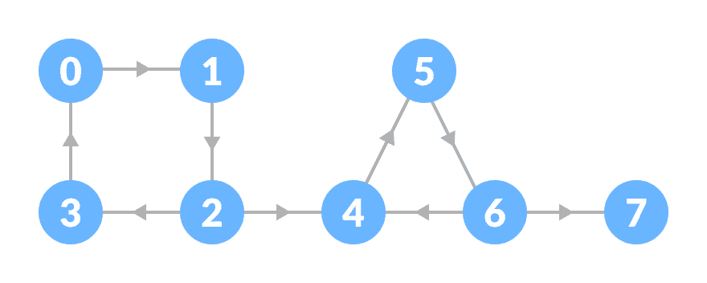
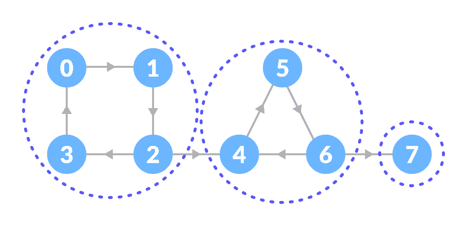
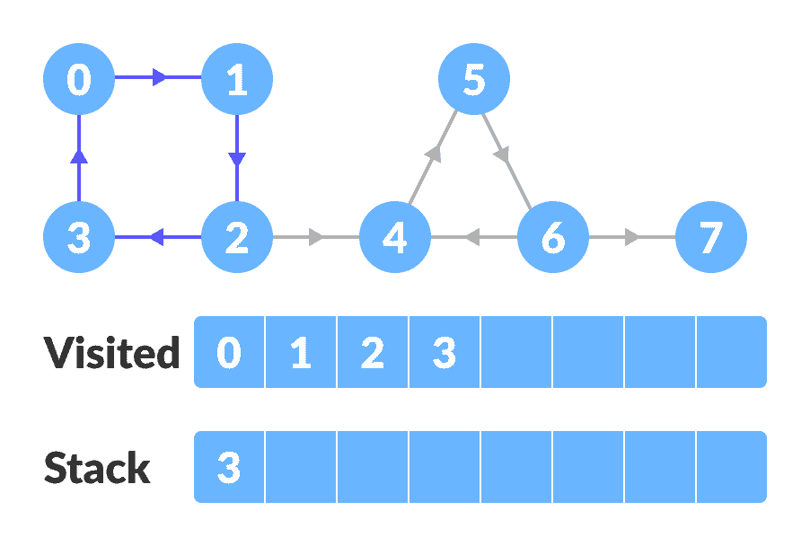
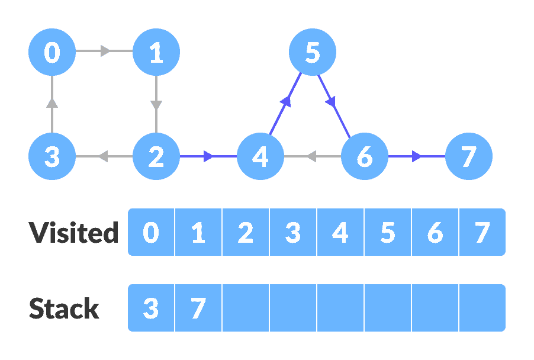
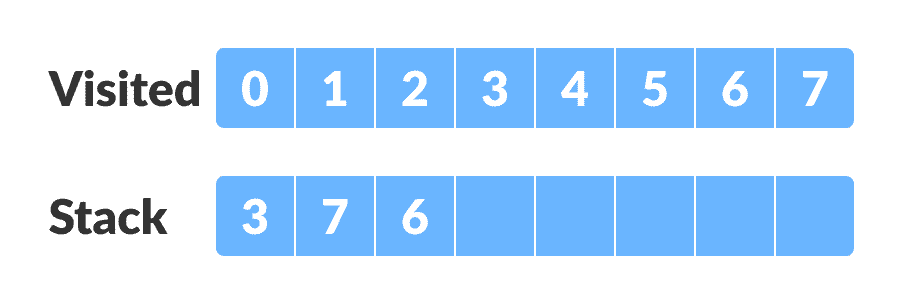
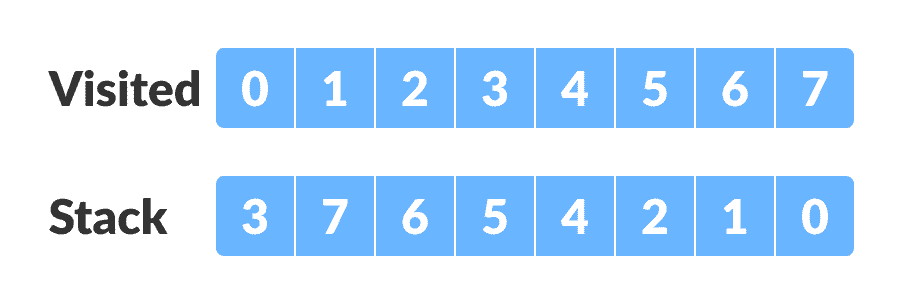
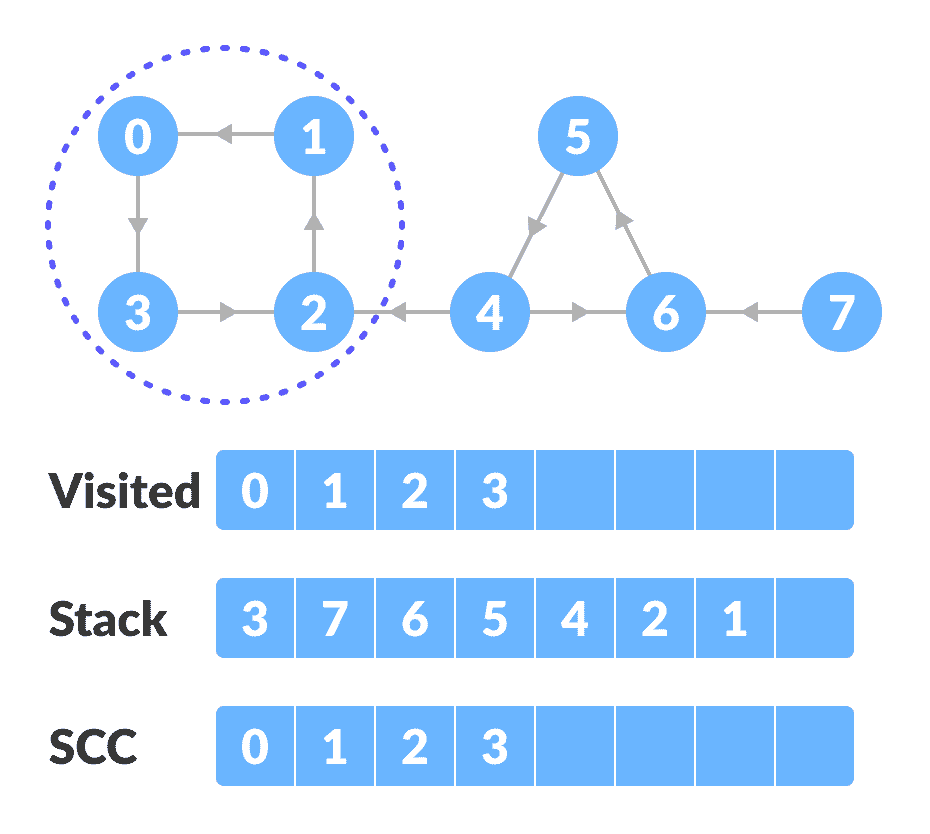
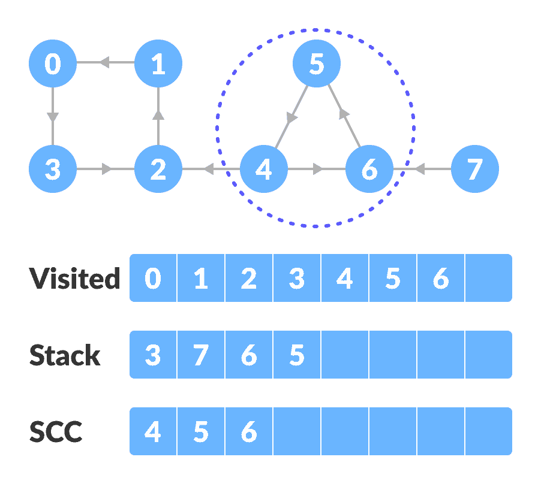
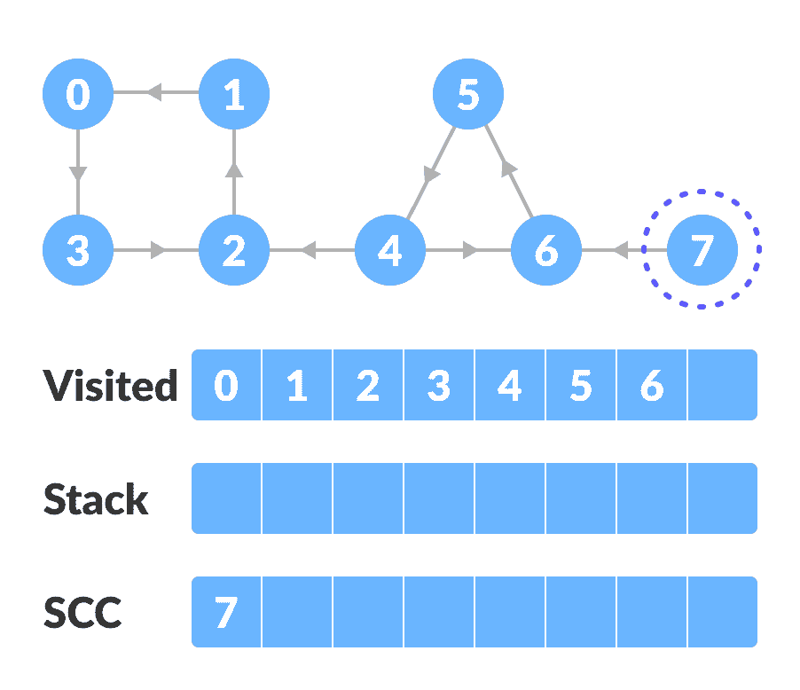
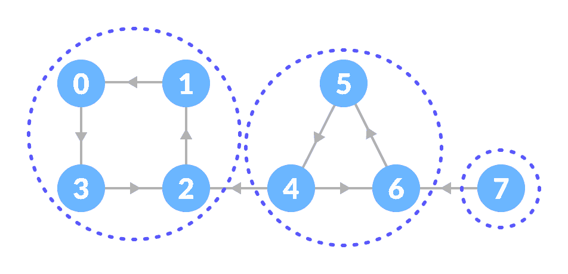

# 强连通的组件

> 原文： [https://www.programiz.com/dsa/strongly-connected-components](https://www.programiz.com/dsa/strongly-connected-components)

#### 在本教程中，您将学习如何形成强连通的组件。 此外，您还将在 C，C++ ，Java 和 Python 中找到 kosararju 算法的工作示例。

强连通的组件是有向图的一部分，其中从每个顶点到另一个顶点都有一条路径。 仅适用于[**有向图**](/dsa/graph)。

例如：

让我们来看看下图。



初始的图


上图的强连通的组件是：



强连通组件


您可以观察到，在第一个强连接的组件中，每个顶点都可以通过定向路径到达另一个顶点。

可以使用 **Kosaraju 算法**找到这些组件。

* * *

## Kosaraju 算法

Kosaraju 算法基于[两次实现的深度优先搜索算法](/dsa/graph-dfs)。

涉及三个步骤。

1.  在整个图上执行深度优先搜索。

    让我们从顶点 0 开始，访问其所有子顶点，并将访问的顶点标记为完成。 如果顶点通向已经访问过的顶点，则将该顶点推入栈。

    例如：从顶点 0 开始，转到顶点 1，顶点 2，然后到达顶点 3。 顶点 3 导致已经访问过的顶点 0，因此将源顶点（即顶点 3）压入栈。

    

    图上的 DFS

    

    转到上一个顶点（顶点 2），并访问其子顶点，即顶点 4，顶点 5，顶点 6 和顶点 7 顺序。 由于顶点 7 无处可去，因此将其推入栈。 

    

    图上的 DFS 转到上一个顶点（顶点 6），并访问其子顶点。 但是，它的所有子顶点都已访问，因此将其推入栈。

    

    堆叠

    

    类似地，创建最终堆叠。

    

    最终筹码

    

    

    

2.  反转原始图。

    

    反转图上的 DFS

3.  对反向图执行深度优先搜索。

    从栈的顶部顶点开始。 遍历其所有子顶点。 一旦到达已经访问过的顶点，就会形成一个强连通的组件。

    例如：从栈中弹出顶点 0。 从顶点 0 开始，遍历其子顶点（依次为顶点 0，顶点 1，顶点 2，顶点 3）并将它们标记为已访问。 顶点 3 的子级已经被访问过，因此这些访问过的顶点形成一个强连接的组件。

    

    从顶部开始，并遍历所有顶点

    转到栈并弹出顶部顶点（如果已访问）。 否则，请从栈中选择顶部顶点，然后遍历其子顶点，如上所示。

    

    如果已经访问过，则弹出顶部顶点

    

    强连通的组件

    

4.  因此，强连接的组件为：

    

    所有强连接的组件

    

* * *

## Python，Java，C++ 示例

[Python](#python-code)[Java](#java-code)[C++](#cpp-code)

```
# Kosaraju's algorithm to find strongly connected components in Python

from collections import defaultdict

class Graph:

    def __init__(self, vertex):
        self.V = vertex
        self.graph = defaultdict(list)

    # Add edge into the graph
    def add_edge(self, s, d):
        self.graph[s].append(d)

    # dfs
    def dfs(self, d, visited_vertex):
        visited_vertex[d] = True
        print(d, end='')
        for i in self.graph[d]:
            if not visited_vertex[i]:
                self.dfs(i, visited_vertex)

    def fill_order(self, d, visited_vertex, stack):
        visited_vertex[d] = True
        for i in self.graph[d]:
            if not visited_vertex[i]:
                self.fill_order(i, visited_vertex, stack)
        stack = stack.append(d)

    # transpose the matrix
    def transpose(self):
        g = Graph(self.V)

        for i in self.graph:
            for j in self.graph[i]:
                g.add_edge(j, i)
        return g

    # Print stongly connected components
    def print_scc(self):
        stack = []
        visited_vertex = [False] * (self.V)

        for i in range(self.V):
            if not visited_vertex[i]:
                self.fill_order(i, visited_vertex, stack)

        gr = self.transpose()

        visited_vertex = [False] * (self.V)

        while stack:
            i = stack.pop()
            if not visited_vertex[i]:
                gr.dfs(i, visited_vertex)
                print("")

g = Graph(8)
g.add_edge(0, 1)
g.add_edge(1, 2)
g.add_edge(2, 3)
g.add_edge(2, 4)
g.add_edge(3, 0)
g.add_edge(4, 5)
g.add_edge(5, 6)
g.add_edge(6, 4)
g.add_edge(6, 7)

print("Strongly Connected Components:")
g.print_scc()
```

```
// Kosaraju's algorithm to find strongly connected components in Java

import java.util.*;
import java.util.LinkedList;

class Graph {
	private int V;
	private LinkedList<Integer> adj[];

	// Create a graph
	Graph(int s) {
		V = s;
		adj = new LinkedList[s];
		for (int i = 0; i < s; ++i)
			adj[i] = new LinkedList();
	}

  // Add edge
	void addEdge(int s, int d) {
		adj[s].add(d);
	}

	// DFS
	void DFSUtil(int s, boolean visitedVertices[]) {
		visitedVertices[s] = true;
		System.out.print(s + " ");
		int n;

		Iterator<Integer> i = adj[s].iterator();
		while (i.hasNext()) {
			n = i.next();
			if (!visitedVertices[n])
				DFSUtil(n, visitedVertices);
		}
	}

	// Transpose the graph
	Graph Transpose() {
		Graph g = new Graph(V);
		for (int s = 0; s < V; s++) {
			Iterator<Integer> i = adj[s].listIterator();
			while (i.hasNext())
				g.adj[i.next()].add(s);
		}
		return g;
	}

	void fillOrder(int s, boolean visitedVertices[], Stack stack) {
		visitedVertices[s] = true;

		Iterator<Integer> i = adj[s].iterator();
		while (i.hasNext()) {
			int n = i.next();
			if (!visitedVertices[n])
				fillOrder(n, visitedVertices, stack);
		}
		stack.push(new Integer(s));
	}

	// Print strongly connected component
	void printSCC() {
		Stack stack = new Stack();

		boolean visitedVertices[] = new boolean[V];
		for (int i = 0; i < V; i++)
			visitedVertices[i] = false;

		for (int i = 0; i < V; i++)
			if (visitedVertices[i] == false)
				fillOrder(i, visitedVertices, stack);

		Graph gr = Transpose();

		for (int i = 0; i < V; i++)
			visitedVertices[i] = false;

		while (stack.empty() == false) {
			int s = (int) stack.pop();

			if (visitedVertices[s] == false) {
				gr.DFSUtil(s, visitedVertices);
				System.out.println();
			}
		}
	}

	public static void main(String args[]) {
		Graph g = new Graph(8);
		g.addEdge(0, 1);
		g.addEdge(1, 2);
		g.addEdge(2, 3);
		g.addEdge(2, 4);
		g.addEdge(3, 0);
		g.addEdge(4, 5);
		g.addEdge(5, 6);
		g.addEdge(6, 4);
		g.addEdge(6, 7);

		System.out.println("Strongly Connected Components:");
		g.printSCC();
	}
}
```

```
// Kosaraju's algorithm to find strongly connected components in C++

#include <iostream>
#include <list>
#include <stack>

using namespace std;

class Graph {
  int V;
  list<int> *adj;
  void fillOrder(int s, bool visitedV[], stack<int> &Stack);
  void DFS(int s, bool visitedV[]);

   public:
  Graph(int V);
  void addEdge(int s, int d);
  void printSCC();
  Graph transpose();
};

Graph::Graph(int V) {
  this->V = V;
  adj = new list<int>[V];
}

// DFS
void Graph::DFS(int s, bool visitedV[]) {
  visitedV[s] = true;
  cout << s << " ";

  list<int>::iterator i;
  for (i = adj[s].begin(); i != adj[s].end(); ++i)
    if (!visitedV[*i])
      DFS(*i, visitedV);
}

// Transpose
Graph Graph::transpose() {
  Graph g(V);
  for (int s = 0; s < V; s++) {
    list<int>::iterator i;
    for (i = adj[s].begin(); i != adj[s].end(); ++i) {
      g.adj[*i].push_back(s);
    }
  }
  return g;
}

// Add edge into the graph
void Graph::addEdge(int s, int d) {
  adj[s].push_back(d);
}

void Graph::fillOrder(int s, bool visitedV[], stack<int> &Stack) {
  visitedV[s] = true;

  list<int>::iterator i;
  for (i = adj[s].begin(); i != adj[s].end(); ++i)
    if (!visitedV[*i])
      fillOrder(*i, visitedV, Stack);

  Stack.push(s);
}

// Print strongly connected component
void Graph::printSCC() {
  stack<int> Stack;

  bool *visitedV = new bool[V];
  for (int i = 0; i < V; i++)
    visitedV[i] = false;

  for (int i = 0; i < V; i++)
    if (visitedV[i] == false)
      fillOrder(i, visitedV, Stack);

  Graph gr = transpose();

  for (int i = 0; i < V; i++)
    visitedV[i] = false;

  while (Stack.empty() == false) {
    int s = Stack.top();
    Stack.pop();

    if (visitedV[s] == false) {
      gr.DFS(s, visitedV);
      cout << endl;
    }
  }
}

int main() {
  Graph g(8);
  g.addEdge(0, 1);
  g.addEdge(1, 2);
  g.addEdge(2, 3);
  g.addEdge(2, 4);
  g.addEdge(3, 0);
  g.addEdge(4, 5);
  g.addEdge(5, 6);
  g.addEdge(6, 4);
  g.addEdge(6, 7);

  cout << "Strongly Connected Components:\n";
  g.printSCC();
}
```

* * *

## Kosaraju 算法复杂度

Kosaraju 算法在线性时间即`O(V+E)`中运行。

* * *

## 强连通的组件应用

*   车辆路线选择应用
*   地图
*   形式验证中的模型检查