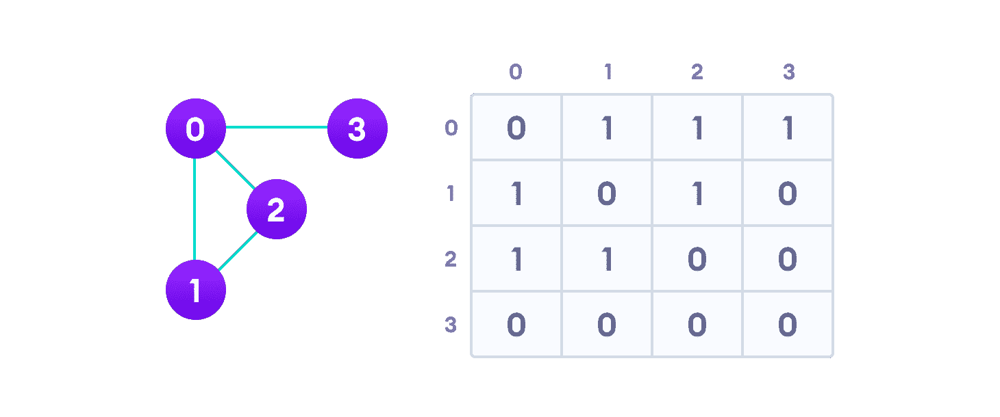

# 邻接矩阵

> 原文： [https://www.programiz.com/dsa/graph-adjacency-matrix](https://www.programiz.com/dsa/graph-adjacency-matrix)

#### 在本教程中，您将学习什么是邻接矩阵。 此外，您还将在 C，C++ ，Java 和 Python 中找到邻接矩阵的工作示例。

邻接矩阵是将图形 G = {V，E}表示为布尔矩阵的一种方式。

* * *

## 邻接矩阵表示

矩阵的大小为`VxV`，其中`V`是图形中的顶点数，而条目`Aij`的值取决于顶点 i 至顶点 j 的边为 1 或 0。

* * *

## 邻接矩阵示例

下图显示了一个图形及其等效的邻接矩阵。



Adjacency matrix from a graph


在无向图的情况下，由于每个边`(i,j)`，矩阵关于对角线对称，也有边`(j,i)`。

* * *

## 邻接矩阵的优点

基本操作（如添加边线，移除边线和检查从顶点 i 到顶点 j 的边线）是非常节省时间的恒定时间操作。

如果图是密集的并且边的数量很大，则邻接矩阵应该是首选。 即使图和邻接矩阵是稀疏的，我们也可以使用稀疏矩阵的数据结构来表示它。

但是，最大的优势来自矩阵的使用。 硬件的最新进展使我们能够在 GPU 上执行甚至昂贵的矩阵运算。

通过对相邻矩阵执行运算，我们可以深入了解图形的性质及其顶点之间的关系。

* * *

## 邻接矩阵的缺点

邻接矩阵的`VxV`空间要求使其成为存储猪。 野外绘制的图形通常没有太多的联系，这就是[邻接表](/dsa/graph-adjacency-list)是大多数任务的更好选择的主要原因。

虽然基本操作很容易，但是当使用邻接矩阵表示法时，`inEdges`和`outEdges`之类的操作很昂贵。

* * *

## Python，Java 和 C/C++ 示例

如果您知道如何创建二维数组，那么您还将知道如何创建邻接矩阵。

[Python](#python-code)[Java](#java-code)[C](#c-code)[C+](#cpp-code)

```
# Adjacency Matrix representation in Python

class Graph(object):

    # Initialize the matrix
    def __init__(self, size):
        self.adjMatrix = []
        for i in range(size):
            self.adjMatrix.append([0 for i in range(size)])
        self.size = size

    # Add edges
    def add_edge(self, v1, v2):
        if v1 == v2:
            print("Same vertex %d and %d" % (v1, v2))
        self.adjMatrix[v1][v2] = 1
        self.adjMatrix[v2][v1] = 1

    # Remove edges
    def remove_edge(self, v1, v2):
        if self.adjMatrix[v1][v2] == 0:
            print("No edge between %d and %d" % (v1, v2))
            return
        self.adjMatrix[v1][v2] = 0
        self.adjMatrix[v2][v1] = 0

    def __len__(self):
        return self.size

    # Print the matrix
    def print_matrix(self):
        for row in self.adjMatrix:
            for val in row:
                print('{:4}'.format(val)),
            print

def main():
    g = Graph(5)
    g.add_edge(0, 1)
    g.add_edge(0, 2)
    g.add_edge(1, 2)
    g.add_edge(2, 0)
    g.add_edge(2, 3)

    g.print_matrix()

if __name__ == '__main__':
    main()
```

```
// Adjacency Matrix representation in Java

public class Graph {
  private boolean adjMatrix[][];
  private int numVertices;

  // Initialize the matrix
  public Graph(int numVertices) {
    this.numVertices = numVertices;
    adjMatrix = new boolean[numVertices][numVertices];
  }

  // Add edges
  public void addEdge(int i, int j) {
    adjMatrix[i][j] = true;
    adjMatrix[j][i] = true;
  }

  // Remove edges
  public void removeEdge(int i, int j) {
    adjMatrix[i][j] = false;
    adjMatrix[j][i] = false;
  }

  // Print the matrix
  public String toString() {
    StringBuilder s = new StringBuilder();
    for (int i = 0; i < numVertices; i++) {
      s.append(i + ": ");
      for (boolean j : adjMatrix[i]) {
        s.append((j ? 1 : 0) + " ");
      }
      s.append("\n");
    }
    return s.toString();
  }

  public static void main(String args[]) {
    Graph g = new Graph(4);

    g.addEdge(0, 1);
    g.addEdge(0, 2);
    g.addEdge(1, 2);
    g.addEdge(2, 0);
    g.addEdge(2, 3);

    System.out.print(g.toString());
  }
}
```

```
// Adjacency Matrix representation in C

#include <stdio.h>
#define V 4

// Initialize the matrix to zero
void init(int arr[][V]) {
  int i, j;
  for (i = 0; i < V; i++)
    for (j = 0; j < V; j++)
      arr[i][j] = 0;
}

// Add edges
void addEdge(int arr[][V], int i, int j) {
  arr[i][j] = 1;
  arr[j][i] = 1;
}

// Print the matrix
void printAdjMatrix(int arr[][V]) {
  int i, j;

  for (i = 0; i < V; i++) {
    printf("%d: ", i);
    for (j = 0; j < V; j++) {
      printf("%d ", arr[i][j]);
    }
    printf("\n");
  }
}

int main() {
  int adjMatrix[V][V];

  init(adjMatrix);
  addEdge(adjMatrix, 0, 1);
  addEdge(adjMatrix, 0, 2);
  addEdge(adjMatrix, 1, 2);
  addEdge(adjMatrix, 2, 0);
  addEdge(adjMatrix, 2, 3);

  printAdjMatrix(adjMatrix);

  return 0;
}
```

```
// Adjacency Matrix representation in C++

#include <iostream>
using namespace std;

class Graph {
   private:
  bool** adjMatrix;
  int numVertices;

   public:
  // Initialize the matrix to zero
  Graph(int numVertices) {
    this->numVertices = numVertices;
    adjMatrix = new bool*[numVertices];
    for (int i = 0; i < numVertices; i++) {
      adjMatrix[i] = new bool[numVertices];
      for (int j = 0; j < numVertices; j++)
        adjMatrix[i][j] = false;
    }
  }

  // Add edges
  void addEdge(int i, int j) {
    adjMatrix[i][j] = true;
    adjMatrix[j][i] = true;
  }

  // Remove edges
  void removeEdge(int i, int j) {
    adjMatrix[i][j] = false;
    adjMatrix[j][i] = false;
  }

  // Print the martix
  void toString() {
    for (int i = 0; i < numVertices; i++) {
      cout << i << " : ";
      for (int j = 0; j < numVertices; j++)
        cout << adjMatrix[i][j] << " ";
      cout << "\n";
    }
  }

  ~Graph() {
    for (int i = 0; i < numVertices; i++)
      delete[] adjMatrix[i];
    delete[] adjMatrix;
  }
};

int main() {
  Graph g(4);

  g.addEdge(0, 1);
  g.addEdge(0, 2);
  g.addEdge(1, 2);
  g.addEdge(2, 0);
  g.addEdge(2, 3);

  g.toString();
}
```

* * *

## 邻接矩阵应用

1.  在网络中创建路由表
2.  导航任务