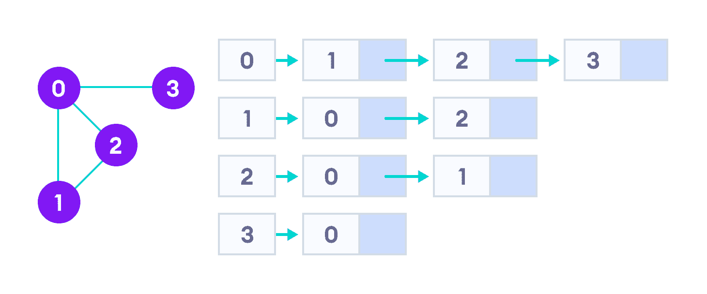

# 邻接表

> 原文： [https://www.programiz.com/dsa/graph-adjacency-list](https://www.programiz.com/dsa/graph-adjacency-list)

#### 在本教程中，您将学习什么是邻接表。 此外，您还将在 C，C++ ，Java 和 Python 中找到邻接表的工作示例。

邻接列表将图表示为链表的数组。

数组的索引表示一个顶点，而其链表中的每个元素表示与该顶点形成边的其他顶点。

* * *

## 邻接表表示

图及其等效的邻接表表示如下。



邻接表表示


邻接表在存储方面非常有效，因为我们只需要存储边的值即可。 对于具有数百万个顶点和边的稀疏图，这可能意味着节省了大量空间。

* * *

## 邻接表结构

最简单的邻接表需要一个节点数据结构来存储顶点，并需要一个图数据结构来组织节点。

我们接近图的基本定义-顶点和边的集合`{V, E}`。 为简单起见，我们使用未标记图而不是标记图，即顶点由其索引 0、1、2、3 标识。

让我们在这里深入研究数据结构。

```
struct node
{
    int vertex;
    struct node* next;
};

struct Graph
{
    int numVertices;
    struct node** adjLists;
};
```

不要让`struct node** adjLists`淹没您。

我们只是说要存储指向`struct node*`的指针。 这是因为我们不知道图形将具有多少个顶点，因此无法在编译时创建链表的数组。

* * *

## 邻接表 C++ 

它是相同的结构，但是通过使用 C++ 的内置列表 STL 数据结构，我们使该结构更整洁。 我们还能够抽象出实现的细节。

```
class Graph
{
    int numVertices;
    list<int> *adjLists;

public:
    Graph(int V);
    void addEdge(int src, int dest);
};
```

* * *

## 邻接表 Java

我们使用 Java 集合来存储链表数组。

```
class Graph
{
    private int numVertices;
    private LinkedList<integer> adjLists[];
}
```

`LinkedList`的类型由要存储在其中的数据确定。 对于带标签的图形，您可以存储字典而不是整数

* * *

## 邻接表 Python

Python 得到如此多的爱是有原因的。 一个简单的顶点及其边的字典就足以表示一个图。 您可以按需使顶点本身复杂。

```
graph = {'A': set(['B', 'C']),
         'B': set(['A', 'D', 'E']),
         'C': set(['A', 'F']),
         'D': set(['B']),
         'E': set(['B', 'F']),
         'F': set(['C', 'E'])}
```

* * *

## Python，Java 和 C/C++ 示例


```py
# Adjascency List representation in Python

class AdjNode:
    def __init__(self, value):
        self.vertex = value
        self.next = None

class Graph:
    def __init__(self, num):
        self.V = num
        self.graph = [None] * self.V

    # Add edges
    def add_edge(self, s, d):
        node = AdjNode(d)
        node.next = self.graph[s]
        self.graph[s] = node

        node = AdjNode(s)
        node.next = self.graph[d]
        self.graph[d] = node

    # Print the graph
    def print_agraph(self):
        for i in range(self.V):
            print("Vertex " + str(i) + ":", end="")
            temp = self.graph[i]
            while temp:
                print(" -> {}".format(temp.vertex), end="")
                temp = temp.next
            print(" \n")

if __name__ == "__main__":
    V = 5

    # Create graph and edges
    graph = Graph(V)
    graph.add_edge(0, 1)
    graph.add_edge(0, 2)
    graph.add_edge(0, 3)
    graph.add_edge(1, 2)

    graph.print_agraph()
```

```java
// Adjascency List representation in Java

import java.util.*;

class Graph {

  // Add edge
  static void addEdge(ArrayList<ArrayList<Integer>> am, int s, int d) {
    am.get(s).add(d);
    am.get(d).add(s);
  }

  public static void main(String[] args) {

    // Create the graph
    int V = 5;
    ArrayList<ArrayList<Integer>> am = new ArrayList<ArrayList<Integer>>(V);

    for (int i = 0; i < V; i++)
      am.add(new ArrayList<Integer>());

    // Add edges
    addEdge(am, 0, 1);
    addEdge(am, 0, 2);
    addEdge(am, 0, 3);
    addEdge(am, 1, 2);

    printGraph(am);
  }

  // Print the graph
  static void printGraph(ArrayList<ArrayList<Integer>> am) {
    for (int i = 0; i < am.size(); i++) {
      System.out.println("\nVertex " + i + ":");
      for (int j = 0; j < am.get(i).size(); j++) {
        System.out.print(" -> " + am.get(i).get(j));
      }
      System.out.println();
    }
  }
}
```

```c
// Adjascency List representation in C

#include <stdio.h>
#include <stdlib.h>

struct node {
  int vertex;
  struct node* next;
};
struct node* createNode(int);

struct Graph {
  int numVertices;
  struct node** adjLists;
};

// Create a node
struct node* createNode(int v) {
  struct node* newNode = malloc(sizeof(struct node));
  newNode->vertex = v;
  newNode->next = NULL;
  return newNode;
}

// Create a graph
struct Graph* createAGraph(int vertices) {
  struct Graph* graph = malloc(sizeof(struct Graph));
  graph->numVertices = vertices;

  graph->adjLists = malloc(vertices * sizeof(struct node*));

  int i;
  for (i = 0; i < vertices; i++)
    graph->adjLists[i] = NULL;

  return graph;
}

// Add edge
void addEdge(struct Graph* graph, int s, int d) {
  // Add edge from s to d
  struct node* newNode = createNode(d);
  newNode->next = graph->adjLists[s];
  graph->adjLists[s] = newNode;

  // Add edge from d to s
  newNode = createNode(s);
  newNode->next = graph->adjLists[d];
  graph->adjLists[d] = newNode;
}

// Print the graph
void printGraph(struct Graph* graph) {
  int v;
  for (v = 0; v < graph->numVertices; v++) {
    struct node* temp = graph->adjLists[v];
    printf("\n Vertex %d\n: ", v);
    while (temp) {
      printf("%d -> ", temp->vertex);
      temp = temp->next;
    }
    printf("\n");
  }
}

int main() {
  struct Graph* graph = createAGraph(4);
  addEdge(graph, 0, 1);
  addEdge(graph, 0, 2);
  addEdge(graph, 0, 3);
  addEdge(graph, 1, 2);

  printGraph(graph);

  return 0;
}
```

```cpp
// Adjascency List representation in C++

#include <bits/stdc++.h>
using namespace std;

// Add edge
void addEdge(vector<int> adj[], int s, int d) {
  adj[s].push_back(d);
  adj[d].push_back(s);
}

// Print the graph
void printGraph(vector<int> adj[], int V) {
  for (int d = 0; d < V; ++d) {
    cout << "\n Vertex "
       << d << ":";
    for (auto x : adj[d])
      cout << "-> " << x;
    printf("\n");
  }
}

int main() {
  int V = 5;

  // Create a graph
  vector<int> adj[V];

  // Add edges
  addEdge(adj, 0, 1);
  addEdge(adj, 0, 2);
  addEdge(adj, 0, 3);
  addEdge(adj, 1, 2);
  printGraph(adj, V);
}
```