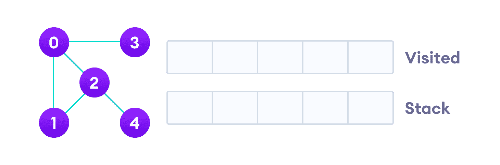
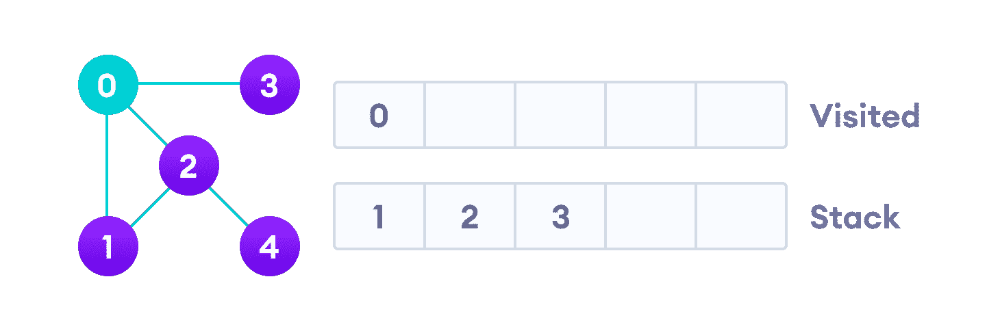
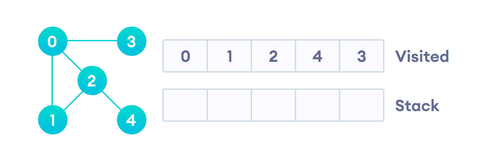

# DFS 算法

> 原文： [https://www.programiz.com/dsa/graph-dfs](https://www.programiz.com/dsa/graph-dfs)

#### 在本教程中，您将学习什么是 DFS 算法。 此外，您还将找到 C，C++ ，Java 和 Python 中 DFS 算法的工作示例。

遍历意味着访问[图](/dsa/graph)的所有节点。 深度优先遍历或深度优先搜索是一种用于搜索图形或树数据结构的所有顶点的递归算法。 在本文中，您将通过示例学习 DFS 算法，DFS 伪代码以及深度优先搜索算法的代码，并在 C++ ，C，Java 和 Python 程序中实现。

* * *

## DFS 算法

一个标准的 DFS 实现将图形的每个顶点分为以下两类之一：

1.  来过
2.  未造访

该算法的目的是将每个顶点标记为已访问，同时避免循环。

DFS 算法的工作原理如下：

1.  首先将图形的任意一个顶点放在堆栈的顶部。
2.  取得堆栈的顶部项目并将其添加到已访问列表。
3.  创建该顶点的相邻节点的列表。 将不在访问列表中的那些添加到堆栈的顶部。
4.  继续重复步骤 2 和 3，直到堆栈为空。

* * *

## DFS 示例

让我们来看一个深度优先搜索算法的示例。 我们使用具有 5 个顶点的无向图。



Undirected graph with 5 vertices


我们从顶点 0 开始，DFS 算法首先将其放置在 Visited 列表中，然后将其所有相邻的顶点放置在堆栈中。



Visit the element and put it in the visited list


接下来，我们访问堆栈顶部即 1 的元素并转到其相邻节点。 由于已经访问过 0，因此我们访问 2。


Visit the element at the top of stack


顶点 2 在 4 中有一个未访问的相邻顶点，因此我们将其添加到堆栈的顶部并对其进行访问。


Vertex 2 has an unvisited adjacent vertex in 4, so we add that to the top of the stack and visit it.


Vertex 2 has an unvisited adjacent vertex in 4, so we add that to the top of the stack and visit it.


在访问最后一个元素 3 之后，它没有任何未访问的相邻节点，因此我们完成了图的“深度优先遍历”。



After we visit the last element 3, it doesn't have any unvisited adjacent nodes, so we have completed the Depth First Traversal of the graph.


* * *

## DFS 伪代码（递归实现）

DFS 的伪代码如下所示。 在 init（）函数中，请注意，我们在每个节点上都运行 DFS 函数。 这是因为图形可能具有两个不同的断开部分，因此为了确保覆盖每个顶点，我们还可以在每个节点上运行 DFS 算法。

```
DFS(G, u)
    u.visited = true
    for each v ∈ G.Adj[u]
        if v.visited == false
            DFS(G,v)

init() {
    For each u ∈ G
        u.visited = false
     For each u ∈ G
       DFS(G, u)
}
```

* * *

## Python，Java 和 C / C++ 示例

下面显示了深度优先搜索算法的代码和示例。 代码已经简化，因此我们可以专注于算法而不是其他细节。

[Python](#python-code)[Java](#java-code)[C](#c-code)[C+](#cpp-code)

```
# DFS algorithm in Python

# DFS algorithm
def dfs(graph, start, visited=None):
    if visited is None:
        visited = set()
    visited.add(start)

    print(start)

    for next in graph[start] - visited:
        dfs(graph, next, visited)
    return visited

graph = {'0': set(['1', '2']),
         '1': set(['0', '3', '4']),
         '2': set(['0']),
         '3': set(['1']),
         '4': set(['2', '3'])}

dfs(graph, '0')
```

```
// DFS algorithm in Java

import java.util.*;

class Graph {
  private LinkedList<Integer> adjLists[];
  private boolean visited[];

  // Graph creation
  Graph(int vertices) {
    adjLists = new LinkedList[vertices];
    visited = new boolean[vertices];

    for (int i = 0; i < vertices; i++)
      adjLists[i] = new LinkedList<Integer>();
  }

  // Add edges
  void addEdge(int src, int dest) {
    adjLists[src].add(dest);
  }

  // DFS algorithm
  void DFS(int vertex) {
    visited[vertex] = true;
    System.out.print(vertex + " ");

    Iterator<Integer> ite = adjLists[vertex].listIterator();
    while (ite.hasNext()) {
      int adj = ite.next();
      if (!visited[adj])
        DFS(adj);
    }
  }

  public static void main(String args[]) {
    Graph g = new Graph(4);

    g.addEdge(0, 1);
    g.addEdge(0, 2);
    g.addEdge(1, 2);
    g.addEdge(2, 3);

    System.out.println("Following is Depth First Traversal");

    g.DFS(2);
  }
}
```

```
// DFS algorithm in C

#include <stdio.h>
#include <stdlib.h>

struct node {
  int vertex;
  struct node* next;
};

struct node* createNode(int v);

struct Graph {
  int numVertices;
  int* visited;

  // We need int** to store a two dimensional array.
  // Similary, we need struct node** to store an array of Linked lists
  struct node** adjLists;
};

// DFS algo
void DFS(struct Graph* graph, int vertex) {
  struct node* adjList = graph->adjLists[vertex];
  struct node* temp = adjList;

  graph->visited[vertex] = 1;
  printf("Visited %d \n", vertex);

  while (temp != NULL) {
    int connectedVertex = temp->vertex;

    if (graph->visited[connectedVertex] == 0) {
      DFS(graph, connectedVertex);
    }
    temp = temp->next;
  }
}

// Create a node
struct node* createNode(int v) {
  struct node* newNode = malloc(sizeof(struct node));
  newNode->vertex = v;
  newNode->next = NULL;
  return newNode;
}

// Create graph
struct Graph* createGraph(int vertices) {
  struct Graph* graph = malloc(sizeof(struct Graph));
  graph->numVertices = vertices;

  graph->adjLists = malloc(vertices * sizeof(struct node*));

  graph->visited = malloc(vertices * sizeof(int));

  int i;
  for (i = 0; i < vertices; i++) {
    graph->adjLists[i] = NULL;
    graph->visited[i] = 0;
  }
  return graph;
}

// Add edge
void addEdge(struct Graph* graph, int src, int dest) {
  // Add edge from src to dest
  struct node* newNode = createNode(dest);
  newNode->next = graph->adjLists[src];
  graph->adjLists[src] = newNode;

  // Add edge from dest to src
  newNode = createNode(src);
  newNode->next = graph->adjLists[dest];
  graph->adjLists[dest] = newNode;
}

// Print the graph
void printGraph(struct Graph* graph) {
  int v;
  for (v = 0; v < graph->numVertices; v++) {
    struct node* temp = graph->adjLists[v];
    printf("\n Adjacency list of vertex %d\n ", v);
    while (temp) {
      printf("%d -> ", temp->vertex);
      temp = temp->next;
    }
    printf("\n");
  }
}

int main() {
  struct Graph* graph = createGraph(4);
  addEdge(graph, 0, 1);
  addEdge(graph, 0, 2);
  addEdge(graph, 1, 2);
  addEdge(graph, 2, 3);

  printGraph(graph);

  DFS(graph, 2);

  return 0;
}
```

```
// DFS algorithm in C++

#include <iostream>
#include <list>
using namespace std;

class Graph {
  int numVertices;
  list<int> *adjLists;
  bool *visited;

   public:
  Graph(int V);
  void addEdge(int src, int dest);
  void DFS(int vertex);
};

// Initialize graph
Graph::Graph(int vertices) {
  numVertices = vertices;
  adjLists = new list<int>[vertices];
  visited = new bool[vertices];
}

// Add edges
void Graph::addEdge(int src, int dest) {
  adjLists[src].push_front(dest);
}

// DFS algorithm
void Graph::DFS(int vertex) {
  visited[vertex] = true;
  list<int> adjList = adjLists[vertex];

  cout << vertex << " ";

  list<int>::iterator i;
  for (i = adjList.begin(); i != adjList.end(); ++i)
    if (!visited[*i])
      DFS(*i);
}

int main() {
  Graph g(4);
  g.addEdge(0, 1);
  g.addEdge(0, 2);
  g.addEdge(1, 2);
  g.addEdge(2, 3);

  g.DFS(2);

  return 0;
}
```

* * *

## DFS 算法复杂度

DFS 算法的时间复杂度以 O（V + E）的形式表示，其中 V 是节点数，E 是边数。

该算法的空间复杂度为 O（V）。

* * *

## DFS 算法应用

1.  寻找路径
2.  测试图是否为二部图
3.  用于查找图的强连接组件
4.  用于检测图中的周期