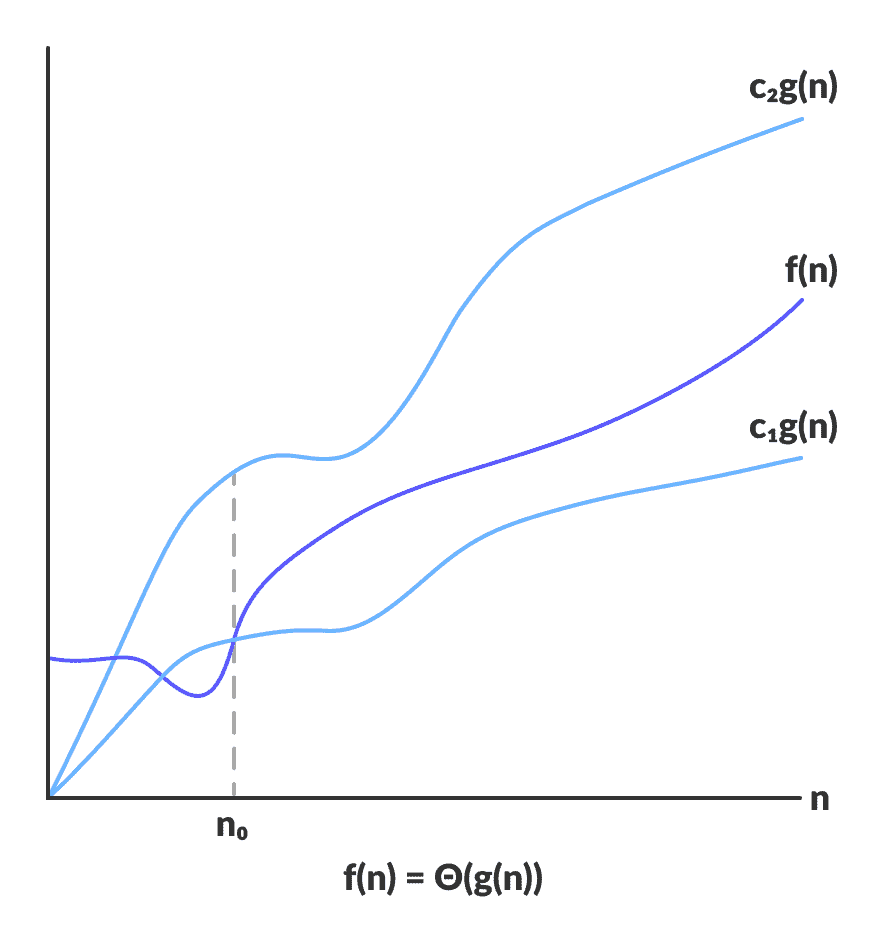
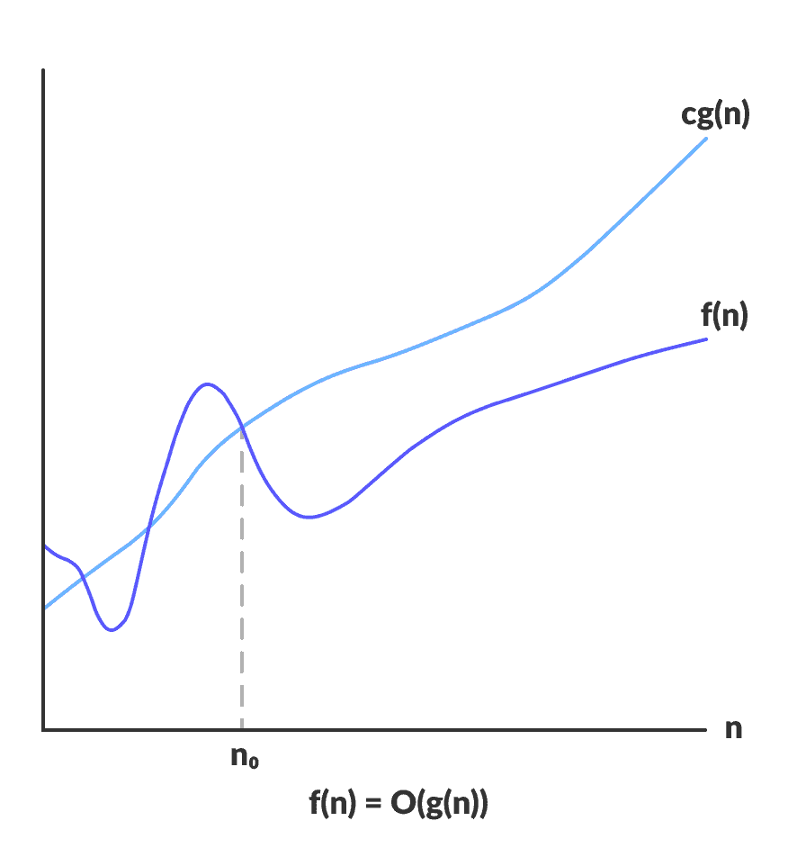
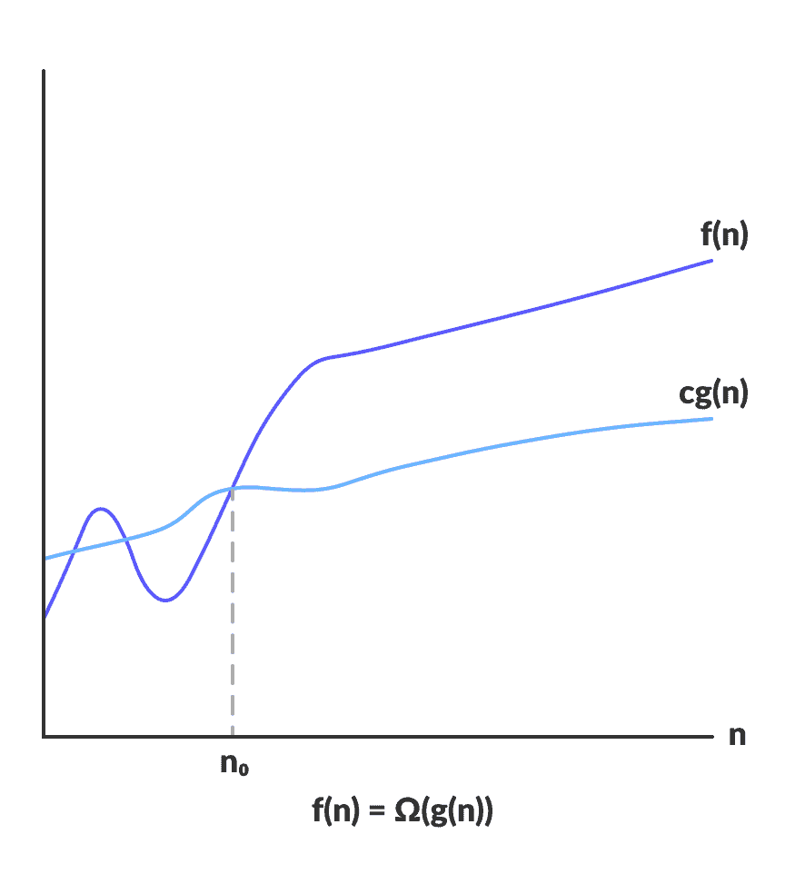

# 渐近分析

> 原文： [https://www.programiz.com/dsa/asymptotic-notations](https://www.programiz.com/dsa/asymptotic-notations)

#### 在本教程中，您将学习什么是渐近符号。 此外，您还将了解大 O 表示法，Theta 表示法和 Omega 表示法。

算法的效率取决于执行算法所需的时间，存储空间和其他资源。 借助渐近符号来测量效率。

对于不同类型的输入，算法可能不会具有相同的性能。 随着输入大小的增加，性能将会改变。

将算法性能随输入大小顺序的变化而进行的研究定义为渐近分析。

* * *

## 渐近符号

渐进符号是当输入趋于特定值或极限值时用于描述算法运行时间的数学符号。

例如：在冒泡排序中，当输入数组已经排序时，算法花费的时间是线性的，即最佳情况。

但是，当输入数组处于反向条件时，该算法将花费最大时间（二次）对元素进行排序，即最坏的情况。

当输入数组既未排序也不反向时，则需要平均时间。 这些持续时间使用渐近符号表示。

主要有三种渐近符号：Theta 符号，Omega 符号和大 O 符号。

* * *

## Theta 表示法（Θ 表示法）

Theta 表示法从上方和下方将函数括起来。 由于它代表算法运行时间的上限和下限，因此可用于分析算法的平均用例复杂度。



Theta 将函数限制在常数因子之内


对于函数`g(n)`，`Θ(g(n))`由以下关系式给出：

```
Θ(g(n)) = { f(n): there exist positive constants c1, c2 and n0
            such that 0 ≤ c1g(n) ≤ f(n) ≤ c2g(n) for all n ≥ n0 }
```

如果存在正常数`c1`和`c2`，使得可以将其夹在`c1g(n)`和`c2g(n)`之间，则对于足够大的`n`，可以将上述表达式描述为函数`f(n)`属于集合`Θ(g(n))`。

如果对于所有`n ≥ n0`，函数`f(n)`位于`c1g(n)`和`c2 > g(n)`之间，则`f(n)`渐近严格。

* * *

## 大 O 表示法（O 表示法）

大 O 表示法表示算法运行时间的上限。 因此，它给出了算法的最坏情况的复杂度。



大 O 给出函数的上限


```
O(g(n)) = { f(n): there exist positive constants c and n0
            such that 0 ≤ f(n) ≤ cg(n) for all n ≥ n0 }
```

对于存在足够大的`n`的情况，如果存在正常数`c`使得其位于`0`和`cg(n)`之间，则上述表达式可以被描述为函数`f(n)`属于集合`O(g(n))`。

对于`n`的任何值，算法的运行时间不会与`O(g(n))`提供的时间交叉。

由于它给出了算法的最坏情况下的运行时间，因此它被广泛用于分析算法，因为我们一直对最坏情况下的场景感兴趣。

* * *

## Ω 表示法（Ω表示法）

Ω 表示算法运行时间的下限。 因此，它提供了算法的最佳情况复杂度。



Ω 给出函数的下限


```
Ω(g(n)) = { f(n): there exist positive constants c and n0 
            such that 0 ≤ cg(n) ≤ f(n) for all n ≥ n0 }
```

如果存在足够大的`n`，如果存在正常数`c`使得它位于`cg(n)`之上，则上述表达式可以描述为函数`f(n)`属于集合`Ω(g(n))`。

对于`n`的任何值，算法所需的最短时间由 Omega `Ω(g(n))`给出。