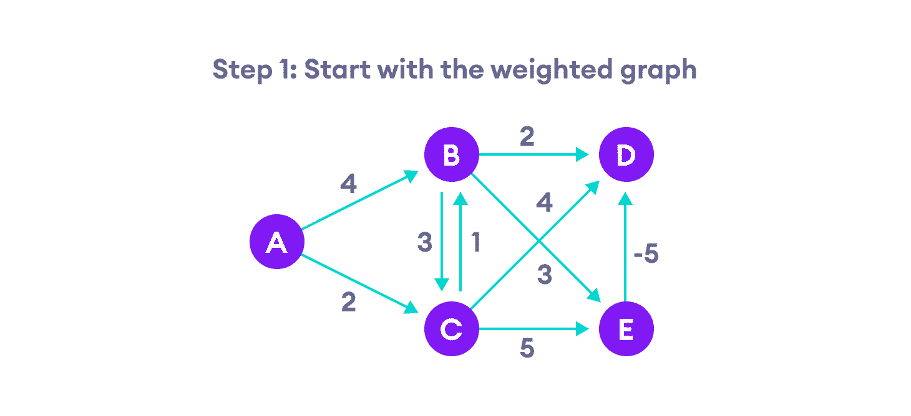
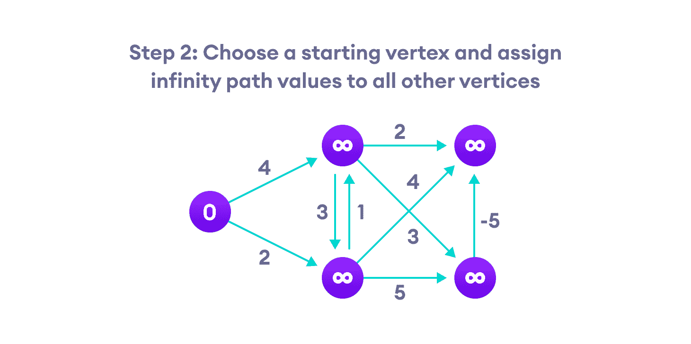
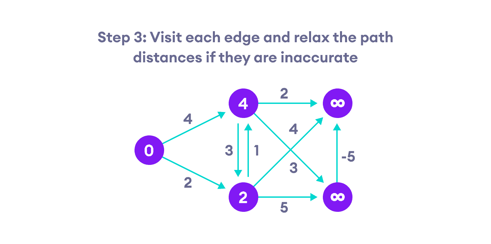
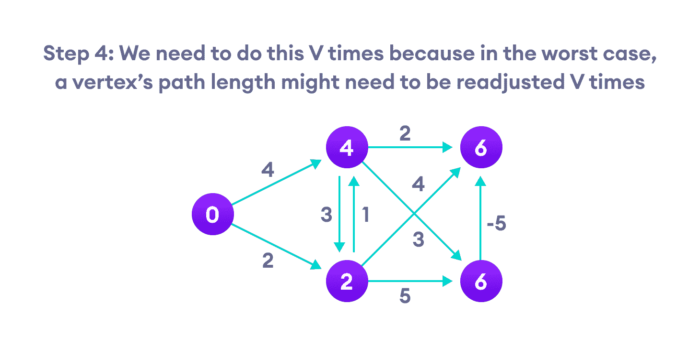
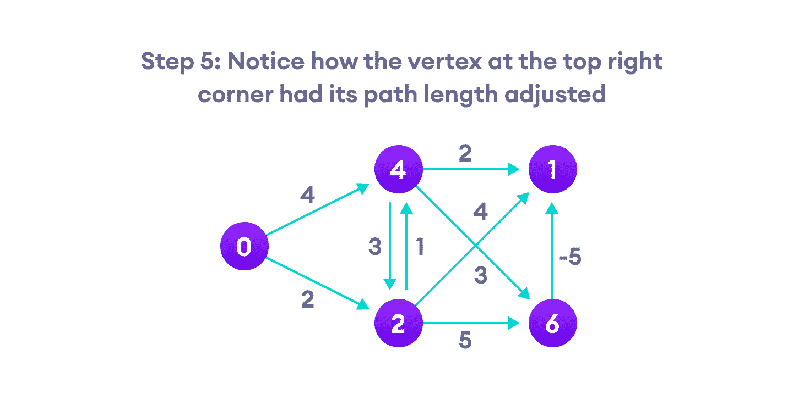
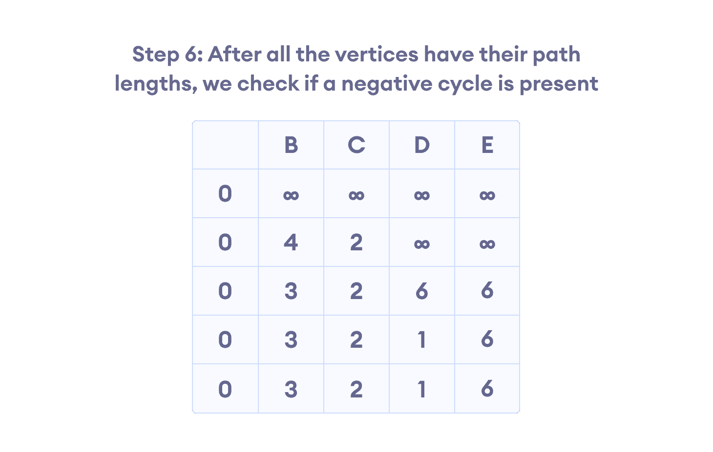
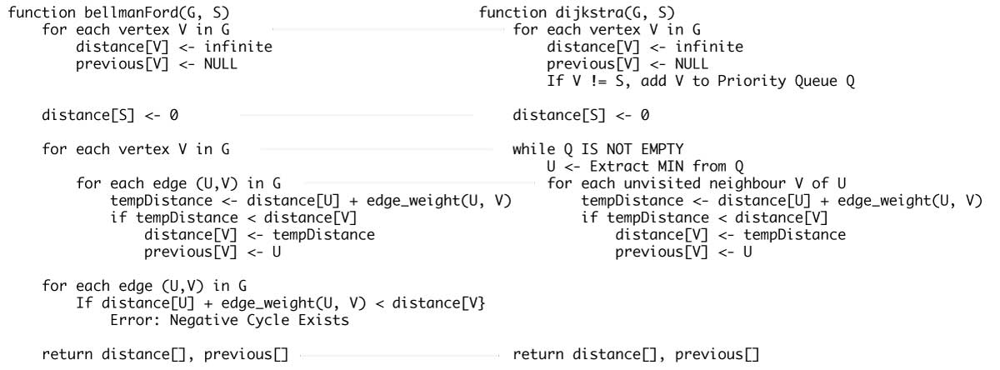

# Bellman Ford 算法

> 原文： [https://www.programiz.com/dsa/bellman-ford-algorithm](https://www.programiz.com/dsa/bellman-ford-algorithm)

#### Bellman Ford 算法可帮助我们找到从一个顶点到加权图的所有其他顶点的最短路径。

它类似于 [Dijkstra 算法](/dsa/dijkstra-algorithm)，但它可以用于边的权重为负的图形。

* * *

## 为什么人们在现实生活中会遇到负权重的边？

起初负负边似乎没有用，但它们可以解释很多现象，例如现金流，化学反应中释放/吸收的热量等。

例如，如果从一种化学品 A 到达另一种化学品 B 的方式不同，则每种方法都会具有涉及散热和吸收的副反应。

如果我们想找到需要最小能量的一组反应，那么我们将需要能够将负热量作为热量吸收，正热量作为热量吸收。

* * *

## 为什么我们需要小心负权重？

负权重边会产生负权重循环，即，一个循环将通过返回同一点来减少总路径距离。


负权循环可能会导致尝试找出最短路径时得出错误的结果


无法检测到此类循环的最短路径算法（例如 Dijkstra 算法）会给出错误的结果，因为它们会经历负的权重循环并缩短路径长度。

* * *

## Bellman Ford 算法如何工作

Bellman Ford 算法通过高估从起始顶点到所有其他顶点的路径长度来工作。 然后，通过查找比先前高估的路径更短的新路径来迭代地放宽那些估计。

通过对所有顶点重复执行此操作，我们可以保证结果得到优化。



Bellman Ford 算法的步骤 1




Bellman Ford 算法的步骤 2




Bellman Ford 算法的步骤 3




Bellman Ford 算法的步骤 4




Bellman Ford 算法的步骤 5




Bellman Ford 算法的步骤 6


* * *

## Bellman Ford 伪代码

我们需要保持每个顶点的路径距离。 我们可以将其存储在大小为`v`的数组中，其中`v`是顶点数。

我们还希望能够获得最短路径，不仅知道最短路径的长度。 为此，我们将每个顶点映射到最后更新其路径长度的顶点。

算法结束后，我们可以从目标顶点回溯到源顶点以找到路径。

```
function bellmanFord(G, S)
  for each vertex V in G
    distance[V] <- infinite
      previous[V] <- NULL
  distance[S] <- 0

  for each vertex V in G				
    for each edge (U,V) in G
      tempDistance <- distance[U] + edge_weight(U, V)
      if tempDistance < distance[V]
        distance[V] <- tempDistance
        previous[V] <- U

  for each edge (U,V) in G
    If distance[U] + edge_weight(U, V) < distance[V}
      Error: Negative Cycle Exists

  return distance[], previous[]
```

* * *

## Bellman Ford  vs Dijkstra

Bellman Ford 算法和 Dijkstra 算法在结构上非常相似。 虽然 Dijkstra 仅查找顶点的直接邻居，但 Bellman 会在每次迭代中遍历每个边。



Dijkstra vs Bellman Ford 算法


* * *

## Python，Java 和 C/C++ 示例


```py
# Bellman Ford Algorithm in Python

class Graph:

    def __init__(self, vertices):
        self.V = vertices   # Total number of vertices in the graph
        self.graph = []     # Array of edges

    # Add edges
    def add_edge(self, s, d, w):
        self.graph.append([s, d, w])

    # Print the solution
    def print_solution(self, dist):
        print("Vertex Distance from Source")
        for i in range(self.V):
            print("{0}\t\t{1}".format(i, dist[i]))

    def bellman_ford(self, src):

        # Step 1: fill the distance array and predecessor array
        dist = [float("Inf")] * self.V
        # Mark the source vertex
        dist[src] = 0

        # Step 2: relax edges |V| - 1 times
        for _ in range(self.V - 1):
            for s, d, w in self.graph:
                if dist[s] != float("Inf") and dist[s] + w < dist[d]:
                    dist[d] = dist[s] + w

        # Step 3: detect negative cycle
        # if value changes then we have a negative cycle in the graph
        # and we cannot find the shortest distances
        for s, d, w in self.graph:
            if dist[s] != float("Inf") and dist[s] + w < dist[d]:
                print("Graph contains negative weight cycle")
                return

        # No negative weight cycle found!
        # Print the distance and predecessor array
        self.print_solution(dist)

g = Graph(5)
g.add_edge(0, 1, 5)
g.add_edge(0, 2, 4)
g.add_edge(1, 3, 3)
g.add_edge(2, 1, 6)
g.add_edge(3, 2, 2)

g.bellman_ford(0)
```

```java
// Bellman Ford Algorithm in Java

class CreateGraph {

  // CreateGraph - it consists of edges
  class CreateEdge {
    int s, d, w;

    CreateEdge() {
      s = d = w = 0;
    }
  };

  int V, E;
  CreateEdge edge[];

  // Creates a graph with V vertices and E edges
  CreateGraph(int v, int e) {
    V = v;
    E = e;
    edge = new CreateEdge[e];
    for (int i = 0; i < e; ++i)
      edge[i] = new CreateEdge();
  }

  void BellmanFord(CreateGraph graph, int s) {
    int V = graph.V, E = graph.E;
    int dist[] = new int[V];

    // Step 1: fill the distance array and predecessor array
    for (int i = 0; i < V; ++i)
      dist[i] = Integer.MAX_VALUE;

    // Mark the source vertex
    dist[s] = 0;

    // Step 2: relax edges |V| - 1 times
    for (int i = 1; i < V; ++i) {
      for (int j = 0; j < E; ++j) {
        // Get the edge data
        int u = graph.edge[j].s;
        int v = graph.edge[j].d;
        int w = graph.edge[j].w;
        if (dist[u] != Integer.MAX_VALUE && dist[u] + w < dist[v])
          dist[v] = dist[u] + w;
      }
    }

    // Step 3: detect negative cycle
    // if value changes then we have a negative cycle in the graph
    // and we cannot find the shortest distances
    for (int j = 0; j < E; ++j) {
      int u = graph.edge[j].s;
      int v = graph.edge[j].d;
      int w = graph.edge[j].w;
      if (dist[u] != Integer.MAX_VALUE && dist[u] + w < dist[v]) {
        System.out.println("CreateGraph contains negative w cycle");
        return;
      }
    }

    // No negative w cycle found!
    // Print the distance and predecessor array
    printSolution(dist, V);
  }

  // Print the solution
  void printSolution(int dist[], int V) {
    System.out.println("Vertex Distance from Source");
    for (int i = 0; i < V; ++i)
      System.out.println(i + "\t\t" + dist[i]);
  }

  public static void main(String[] args) {
    int V = 5; // Total vertices
    int E = 8; // Total Edges

    CreateGraph graph = new CreateGraph(V, E);

    // edge 0 --> 1
    graph.edge[0].s = 0;
    graph.edge[0].d = 1;
    graph.edge[0].w = 5;

    // edge 0 --> 2
    graph.edge[1].s = 0;
    graph.edge[1].d = 2;
    graph.edge[1].w = 4;

    // edge 1 --> 3
    graph.edge[2].s = 1;
    graph.edge[2].d = 3;
    graph.edge[2].w = 3;

    // edge 2 --> 1
    graph.edge[3].s = 2;
    graph.edge[3].d = 1;
    graph.edge[3].w = 6;

    // edge 3 --> 2
    graph.edge[4].s = 3;
    graph.edge[4].d = 2;
    graph.edge[4].w = 2;

    graph.BellmanFord(graph, 0); // 0 is the source vertex
  }
}
```

```c
// Bellman Ford Algorithm in C

#include <stdio.h>
#include <stdlib.h>

#define INFINITY 99999

//struct for the edges of the graph
struct Edge {
  int u;  //start vertex of the edge
  int v;  //end vertex of the edge
  int w;  //weight of the edge (u,v)
};

//Graph - it consists of edges
struct Graph {
  int V;        //total number of vertices in the graph
  int E;        //total number of edges in the graph
  struct Edge *edge;  //array of edges
};

void bellmanford(struct Graph *g, int source);
void display(int arr[], int size);

int main(void) {
  //create graph
  struct Graph *g = (struct Graph *)malloc(sizeof(struct Graph));
  g->V = 4;  //total vertices
  g->E = 5;  //total edges

  //array of edges for graph
  g->edge = (struct Edge *)malloc(g->E * sizeof(struct Edge));

  //------- adding the edges of the graph
  /*
		edge(u, v)
		where 	u = start vertex of the edge (u,v)
				v = end vertex of the edge (u,v)

		w is the weight of the edge (u,v)
	*/

  //edge 0 --> 1
  g->edge[0].u = 0;
  g->edge[0].v = 1;
  g->edge[0].w = 5;

  //edge 0 --> 2
  g->edge[1].u = 0;
  g->edge[1].v = 2;
  g->edge[1].w = 4;

  //edge 1 --> 3
  g->edge[2].u = 1;
  g->edge[2].v = 3;
  g->edge[2].w = 3;

  //edge 2 --> 1
  g->edge[3].u = 2;
  g->edge[3].v = 1;
  g->edge[3].w = 6;

  //edge 3 --> 2
  g->edge[4].u = 3;
  g->edge[4].v = 2;
  g->edge[4].w = 2;

  bellmanford(g, 0);  //0 is the source vertex

  return 0;
}

void bellmanford(struct Graph *g, int source) {
  //variables
  int i, j, u, v, w;

  //total vertex in the graph g
  int tV = g->V;

  //total edge in the graph g
  int tE = g->E;

  //distance array
  //size equal to the number of vertices of the graph g
  int d[tV];

  //predecessor array
  //size equal to the number of vertices of the graph g
  int p[tV];

  //step 1: fill the distance array and predecessor array
  for (i = 0; i < tV; i++) {
    d[i] = INFINITY;
    p[i] = 0;
  }

  //mark the source vertex
  d[source] = 0;

  //step 2: relax edges |V| - 1 times
  for (i = 1; i <= tV - 1; i++) {
    for (j = 0; j < tE; j++) {
      //get the edge data
      u = g->edge[j].u;
      v = g->edge[j].v;
      w = g->edge[j].w;

      if (d[u] != INFINITY && d[v] > d[u] + w) {
        d[v] = d[u] + w;
        p[v] = u;
      }
    }
  }

  //step 3: detect negative cycle
  //if value changes then we have a negative cycle in the graph
  //and we cannot find the shortest distances
  for (i = 0; i < tE; i++) {
    u = g->edge[i].u;
    v = g->edge[i].v;
    w = g->edge[i].w;
    if (d[u] != INFINITY && d[v] > d[u] + w) {
      printf("Negative weight cycle detected!\n");
      return;
    }
  }

  //No negative weight cycle found!
  //print the distance and predecessor array
  printf("Distance array: ");
  display(d, tV);
  printf("Predecessor array: ");
  display(p, tV);
}

void display(int arr[], int size) {
  int i;
  for (i = 0; i < size; i++) {
    printf("%d ", arr[i]);
  }
  printf("\n");
}
```

```cpp
// Bellman Ford Algorithm in C++

#include <bits/stdc++.h>

// Struct for the edges of the graph
struct Edge {
  int u;  //start vertex of the edge
  int v;  //end vertex of the edge
  int w;  //w of the edge (u,v)
};

// Graph - it consists of edges
struct Graph {
  int V;        // Total number of vertices in the graph
  int E;        // Total number of edges in the graph
  struct Edge* edge;  // Array of edges
};

// Creates a graph with V vertices and E edges
struct Graph* createGraph(int V, int E) {
  struct Graph* graph = new Graph;
  graph->V = V;  // Total Vertices
  graph->E = E;  // Total edges

  // Array of edges for graph
  graph->edge = new Edge[E];
  return graph;
}

// Printing the solution
void printArr(int arr[], int size) {
  int i;
  for (i = 0; i < size; i++) {
    printf("%d ", arr[i]);
  }
  printf("\n");
}

void BellmanFord(struct Graph* graph, int u) {
  int V = graph->V;
  int E = graph->E;
  int dist[V];

  // Step 1: fill the distance array and predecessor array
  for (int i = 0; i < V; i++)
    dist[i] = INT_MAX;

  // Mark the source vertex
  dist[u] = 0;

  // Step 2: relax edges |V| - 1 times
  for (int i = 1; i <= V - 1; i++) {
    for (int j = 0; j < E; j++) {
      // Get the edge data
      int u = graph->edge[j].u;
      int v = graph->edge[j].v;
      int w = graph->edge[j].w;
      if (dist[u] != INT_MAX && dist[u] + w < dist[v])
        dist[v] = dist[u] + w;
    }
  }

  // Step 3: detect negative cycle
  // if value changes then we have a negative cycle in the graph
  // and we cannot find the shortest distances
  for (int i = 0; i < E; i++) {
    int u = graph->edge[i].u;
    int v = graph->edge[i].v;
    int w = graph->edge[i].w;
    if (dist[u] != INT_MAX && dist[u] + w < dist[v]) {
      printf("Graph contains negative w cycle");
      return;
    }
  }

  // No negative weight cycle found!
  // Print the distance and predecessor array
  printArr(dist, V);

  return;
}

int main() {
  // Create a graph
  int V = 5;  // Total vertices
  int E = 8;  // Total edges

  // Array of edges for graph
  struct Graph* graph = createGraph(V, E);

  //------- adding the edges of the graph
  /*
		edge(u, v)
		where 	u = start vertex of the edge (u,v)
				v = end vertex of the edge (u,v)

		w is the weight of the edge (u,v)
	*/

  //edge 0 --> 1
  graph->edge[0].u = 0;
  graph->edge[0].v = 1;
  graph->edge[0].w = 5;

  //edge 0 --> 2
  graph->edge[1].u = 0;
  graph->edge[1].v = 2;
  graph->edge[1].w = 4;

  //edge 1 --> 3
  graph->edge[2].u = 1;
  graph->edge[2].v = 3;
  graph->edge[2].w = 3;

  //edge 2 --> 1
  graph->edge[3].u = 2;
  graph->edge[3].v = 1;
  graph->edge[3].w = 6;

  //edge 3 --> 2
  graph->edge[4].u = 3;
  graph->edge[4].v = 2;
  graph->edge[4].w = 2;

  BellmanFord(graph, 0);  //0 is the source vertex

  return 0;
}
```

* * *

## Bellman Ford 的复杂度

### 时间复杂度

| | | |
| --- | --- | --- |
| 最佳情况复杂度 | `O(E)` |
| 平均情况复杂度 | `O(VE)` |
| 最坏情况复杂度 | `O(VE)` |

### 空间复杂度

并且，空间复杂度为`O(V)`。

* * *

## Bellman Ford 算法应用

1.  用于计算路由算法中的最短路径
2.  寻找最短路径