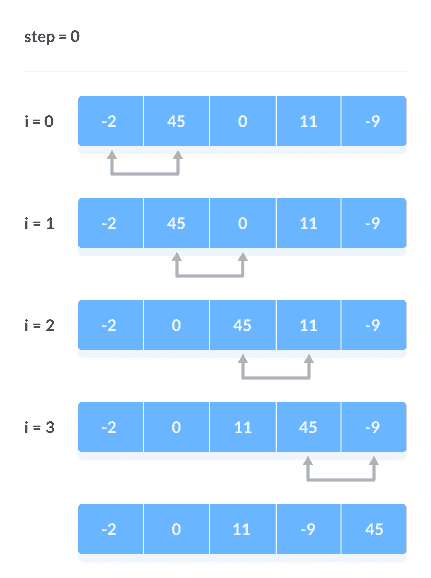
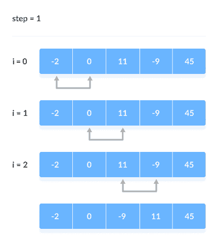
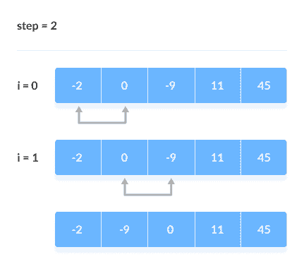
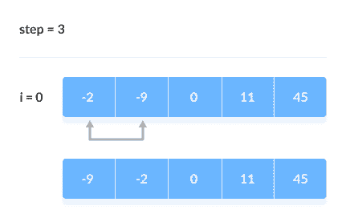

# 冒泡排序算法

> 原文： [https://www.programiz.com/dsa/bubble-sort](https://www.programiz.com/dsa/bubble-sort)

#### 在本教程中，您将学习冒泡排序的工作原理。 此外，您还将找到 C，C++ ，Java 和 Python 中冒泡排序的工作示例。

冒泡排序是一种算法，用于比较相邻元素，如果相邻元素之间的位置不符合预期顺序，则会交换它们的位置。 顺序可以是升序或降序。

* * *

## 冒泡排序如何工作？

1.  从第一个索引开始，比较第一个和第二个元素，如果第一个元素大于第二个元素，则将它们交换。

    现在，比较第二个和第三个元素。 如果它们不正常，请交换它们。

    上面的过程一直进行到最后一个元素。

    

    比较相邻元素

    

2.  其余迭代将继续相同的过程。 每次迭代后，未排序元素中的最大元素将放置在末尾。

    在每次迭代中，都会进行比较直到最后一个未排序的元素。

    当所有未排序的元素都放在其正确位置时，对数组进行排序。

    

    比较相邻的元素

    

    [

    

    比较相邻的元素

    

    

    比较相邻的元素 元素

    

* * *

## 冒泡排序算法

```
bubbleSort(array)
  for i <- 1 to indexOfLastUnsortedElement-1
    if leftElement > rightElement
      swap leftElement and rightElement
end bubbleSort

```

* * *

## Python，Java 和 C/C++ 示例

[Python](#python-code)[Java](#java-code)[C](#c-code)[C++](#cpp-code)

```
# Bubble sort in Python

def bubbleSort(array):

    # run loops two times: one for walking throught the array 
    # and the other for comparison
    for i in range(len(array)):
        for j in range(0, len(array) - i - 1):

            # To sort in descending order, change > to < in this line.
            if array[j] > array[j + 1]:

                # swap if greater is at the rear position
                (array[j], array[j + 1]) = (array[j + 1], array[j])

data = [-2, 45, 0, 11, -9]
bubbleSort(data)
print('Sorted Array in Asc ending Order:')
print(data)
```

```
// Bubble sort in Java

import java.util.Arrays;

class BubbleSort {
  void bubbleSort(int array[]) {
    int size = array.length;

    // run loops two times: one for walking throught the array
    // and the other for comparison
    for (int i = 0; i < size - 1; i++)
      for (int j = 0; j < size - i - 1; j++)

        // To sort in descending order, change > to < in this line.
        if (array[j] > array[j + 1]) {

          // swap if greater is at the rear position
          int temp = array[j];
          array[j] = array[j + 1];
          array[j + 1] = temp;
        }
  }

  // driver code
  public static void main(String args[]) {
    int[] data = { -2, 45, 0, 11, -9 };
    BubbleSort bs = new BubbleSort();
    bs.bubbleSort(data);
    System.out.println("Sorted Array in Ascending Order:");
    System.out.println(Arrays.toString(data));
  }
} 
```

```
// Bubble sort in C

#include <stdio.h>

void bubbleSort(int array[], int size) {

  // run loops two times: one for walking throught the array
  // and the other for comparison
  for (int step = 0; step < size - 1; ++step) {
    for (int i = 0; i < size - step - 1; ++i) {

      // To sort in descending order, change">" to "<".
      if (array[i] > array[i + 1]) {

        // swap if greater is at the rear position
        int temp = array[i];
        array[i] = array[i + 1];
        array[i + 1] = temp;
      }
    }
  }
}

// function to print the array
void printArray(int array[], int size) {
  for (int i = 0; i < size; ++i) {
    printf("%d  ", array[i]);
  }
  printf("\n");
}

// driver code
int main() {
  int data[] = {-2, 45, 0, 11, -9};
  int size = sizeof(data) / sizeof(data[0]);
  bubbleSort(data, size);
  printf("Sorted Array in Ascending Order:\n");
  printArray(data, size);
}
```

```
// Bubble sort in C++

#include <iostream>
using namespace std;

void bubbleSort(int array[], int size) {

  // run loops two times: one for walking throught the array
  // and the other for comparison
  for (int step = 0; step < size - 1; ++step) {
    for (int i = 0; i < size - step - 1; ++i) {

      // To sort in descending order, change > to < in this line.
      if (array[i] > array[i + 1]) {

        // swap if greater is at the rear position
        int temp = array[i];
        array[i] = array[i + 1];
        array[i + 1] = temp;
      }
    }
  }
}

// function to print the array
void printArray(int array[], int size) {
  for (int i = 0; i < size; ++i) {
    cout << "  " << array[i];
  }
  cout << "\n";
}

// driver code
int main() {
  int data[] = {-2, 45, 0, 11, -9};
  int size = sizeof(data) / sizeof(data[0]);
  bubbleSort(data, size);
  cout << "Sorted Array in Ascending Order:\n";
  printArray(data, size);
}
```

* * *

## 优化冒泡排序

在上面的代码中，即使数组已经排序，也进行了所有可能的比较。 它增加了执行时间。

通过引入`swapped`额外变量可以优化代码。 每次迭代之后，如果没有交换发生，则无需执行其他循环。

在这种情况下，将变量`swapped`设置为`false`。 因此，我们可以防止进一步的迭代。

优化冒泡排序的算法是

```
bubbleSort(array)
  swapped <- false
  for i <- 1 to indexOfLastUnsortedElement-1
    if leftElement > rightElement
      swap leftElement and rightElement
      swapped <- true
end bubbleSort

```

* * *

### 优化的冒泡排序示例


```
# Optimized bubble sort in python

def bubbleSort(array):

    # Run loops two times: one for walking throught the array
    # and the other for comparison
    for i in range(len(array)):

        # swapped keeps track of swapping
        swapped = True
        for j in range(0, len(array) - i - 1):

            # To sort in descending order, change > to < in this line.
            if array[j] > array[j + 1]:

                # Swap if greater is at the rear position
                (array[j], array[j + 1]) = (array[j + 1], array[j])
                swapped = False

                # If there is not swapping in the last swap, then the array is already sorted.
                if swapped:
                    break

data = [-2, 45, 0, 11, -9]
bubbleSort(data)
print('Sorted Array in Ascending Order:')
print(data) 
```

```
// Optimized bubble sort in Java

import java.util.Arrays;

class BubbleSort {
  void bubbleSort(int array[]) {
    int size = array.length;

    // Run loops two times: one for walking throught the array
    // and the other for comparison
    for (int i = 0; i < size - 1; i++) {

      // swapped keeps track of swapping
      boolean swapped = true;
      for (int j = 0; j < size - i - 1; j++) {

        // To sort in descending order, change > to < in this line.
        if (array[j] > array[j + 1]) {

          // Swap if greater is at the rear position
          int temp = array[j];
          array[j] = array[j + 1];
          array[j + 1] = temp;

          swapped = false;
        }
      }

      // If there is not swapping in the last swap, then the array is already sorted.
      if (swapped == true)
        break;
    }
  }

  // Driver code
  public static void main(String args[]) {
    int[] data = { -2, 45, 0, 11, -9 };
    BubbleSort bs = new BubbleSort();
    bs.bubbleSort(data);
    System.out.println("Sorted Array in Ascending Order:");
    System.out.println(Arrays.toString(data));
  }
} 
```

```
// Optimized bubble sort in C

#include <stdio.h>

void bubbleSort(int arrayay[], int size) {
  for (int step = 0; step < size - 1; ++step) {

    // Swapped keeps track of swapping
    int swapped = 0;

    // Run loops two times: one for walking throught the array
    // and the other for comparison
    for (int i = 0; i < size - step - 1; ++i) {

      // To sort in descending order, change > to < in this line.
      if (arrayay[i] > arrayay[i + 1]) {

        // Swap if greater is at the rear position
        int temp = arrayay[i];
        arrayay[i] = arrayay[i + 1];
        arrayay[i + 1] = temp;
        swapped = 1;
      }
    }

    // If there is not swapping in the last swap, then the array is already sorted.
    if (swapped == 0)
      break;
  }
}

// Function to print an array
void printarrayay(int arrayay[], int size) {
  for (int i = 0; i < size; ++i) {
    printf("%d  ", arrayay[i]);
  }
  printf("\n");
}

// Driver code
int main() {
  int data[] = {-2, 45, 0, 11, -9};
  int size = sizeof(data) / sizeof(data[0]);
  bubbleSort(data, size);
  printf("Sorted Array in Ascending Order:\n");
  printarrayay(data, size);
}
```

```
// Optimized bubble sort in C++

#include <iostream>
using namespace std;

void bubbleSort(int array[], int size) {
  for (int step = 0; step < size - 1; ++step) { 
```

```
 // Run loops two times: one for walking throught the array  // and the other for comparison
    int swapped = 0;
    for (int i = 0; i < size - step - 1; ++i) {
      // To sort in descending order, change > to < in this line.
      if (array[i] > array[i + 1]) {

        // Swap if greater is at the rear position
        int temp = array[i];
        array[i] = array[i + 1];
        array[i + 1] = temp;
        swapped = 1;
      }
    }

    // If there is not swapping in the last swap, then the array is already sorted.
    if (swapped == 0)
      break;
  }
}

// Function to print an array
void printArray(int array[], int size) {
  for (int i = 0; i < size; ++i) {
    cout << "  " << array[i];
  }
  cout << "\n";
}

// Driver code
int main() {
  int data[] = {-2, 45, 0, 11, -9};
  int size = sizeof(data) / sizeof(data[0]);
  bubbleSort(data, size);
  cout << "Sorted Array in Ascending Order:\n";
  printArray(data, size);
}
```

* * *

## 复杂度

冒泡排序是最简单的排序算法之一。 该算法实现了两个循环。

| 周期 | 比较次数 |
| --- | --- |
| 第一 | （`n-1`） |
| 第二 | （`n-2`） |
| 第三 | （`n-3`） |
| ....... | ...... |
| 最后 | 1 |

比较次数：`(n-1) + (n-2) + (n-3) + ..... + 1 = n(n-1) / 2`几乎等于`n^2`

**复杂度**： `O(n^2)`

同样，我们可以通过简单地观察循环数来分析复杂度。 有 2 个循环，因此复杂度为`n*n = n^2`

**时间复杂度**：

*   **最坏情况的复杂度**： `O(n^2)`
    如果我们要以升序排序，而数组是以降序排序，那么会发生最坏情况。

*   **最佳情况复杂度**： `O(n)`
    如果数组已经排序，则无需排序。

*   **平均情况复杂度**： `O(n^2)`
    当数组的元素处于混乱顺序（既不升也不降）时，会发生这种情况。

**空间复杂度**：
空间复杂度为`O(1)`，因为交换使用了额外的变量`temp`。

在优化算法中，变量`swapped`会增加空间复杂度，从而使其成为`O(2)`。

* * *

## 冒泡排序应用

在以下情况下使用冒泡排序：

1.  代码的复杂程度无关紧要。
2.  短代码是首选的。