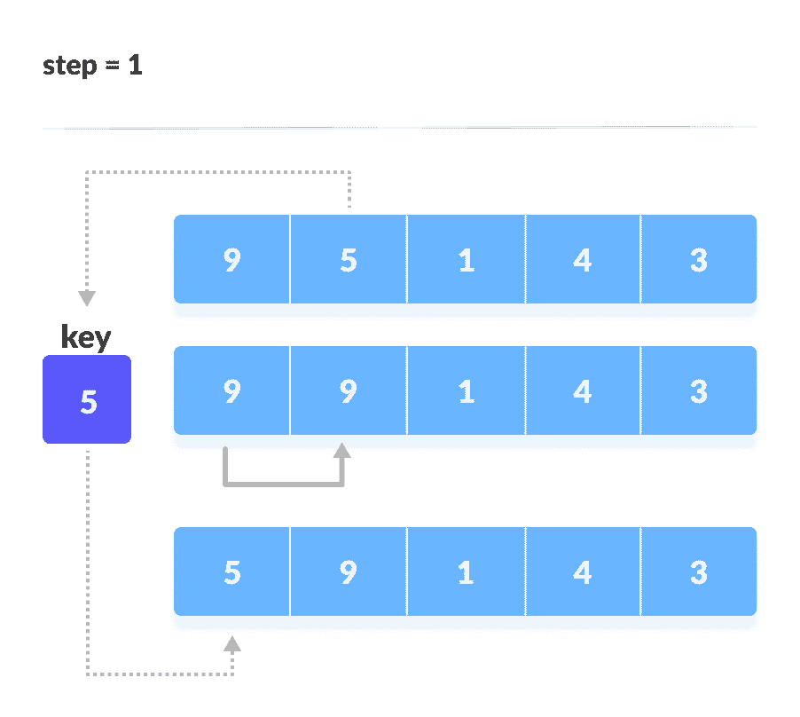
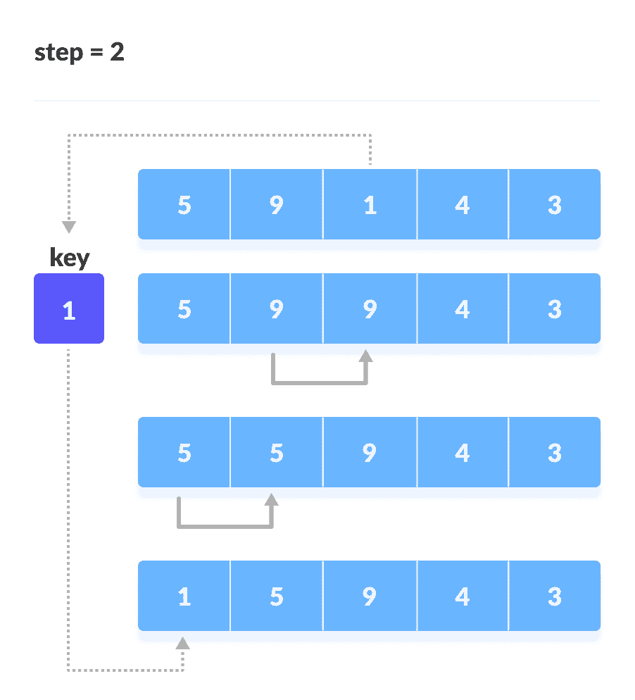
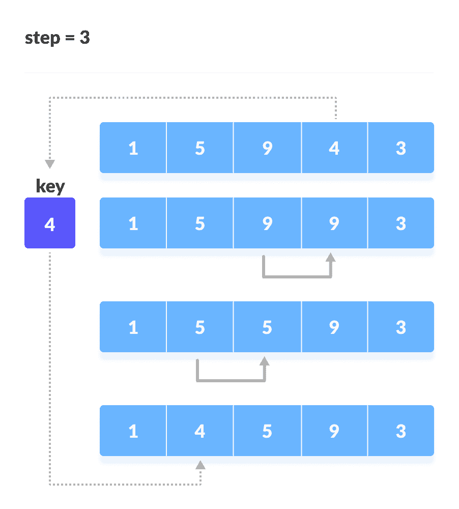
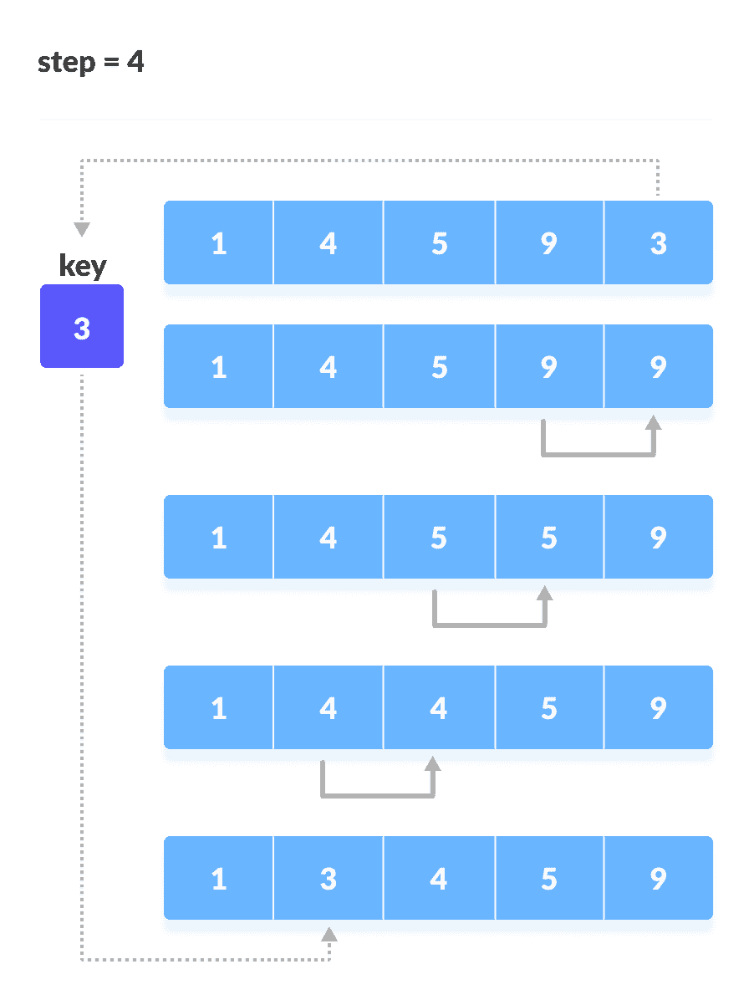

# 插入排序算法

> 原文： [https://www.programiz.com/dsa/insertion-sort](https://www.programiz.com/dsa/insertion-sort)

#### 在本教程中，您将学习插入排序的工作原理。 此外，您还将找到使用 C，C++ ，Java 和 Python 进行插入排序的有效示例。

插入排序的工作方式与我们在纸牌游戏中对手牌进行排序的方式类似。

我们假设第一张卡片已经被排序，那么我们选择一个未排序的卡片。 如果未排序的卡片大于手中的卡片，则将其放置在右侧，否则放置在左侧。 同样，其他未排序的卡片也会被拿到正确的位置。

插入排序使用类似的方法。

插入排序是一种排序算法，它在每次迭代中将未排序的元素放置在其合适的位置。

* * *

## 插入排序如何工作？

假设我们需要对以下数组进行排序。


初始数组


1.  假定数组中的第一个元素已排序。 取第二个元素并将其分别存储在`key`中。

    将`key`与第一个元素进行比较。 如果第一个元素大于`key`，则将`key`放在第一个元素的前面。

    

    如果第一个元素大于`key`，则将`key`放在第一个元素的前面。

    

2.  现在，对前两个元素进行排序。

    取第三个元素并将其与左侧的元素进行比较。 将其放置在比其小的元素后面。 如果没有比它小的元素，则将其放在数组的开头。

    

    将 1 放在开头

    

3.  同样，将每个未排序的元素放在正确的位置。

    

    将 4 放在 1 后面

    

    [

    

    将 3 放在 1 后面，并对数组进行排序

    

* * *

## 插入排序算法

```
insertionSort(array)
  mark first element as sorted
  for each unsorted element X
    'extract' the element X
    for j <- lastSortedIndex down to 0
      if current element j > X
        move sorted element to the right by 1
    break loop and insert X here
end insertionSort
```

* * *

## Python，Java 和 C/C++ 示例


```py
# Insertion sort in Python

def insertionSort(array):

    for step in range(1, len(array)):
        key = array[step]
        j = step - 1

        # Compare key with each element on the left of it until an element smaller than it is found
        # For descending order, change key<array[j] to key>array[j].        
        while j >= 0 and key < array[j]:
            array[j + 1] = array[j]
            j = j - 1

        # Place key at after the element just smaller than it.
        array[j + 1] = key

data = [9, 5, 1, 4, 3]
insertionSort(data)
print('Sorted Array in Ascending Order:')
print(data)
```

```java
 // Insertion sort in Java

import java.util.Arrays;

class InsertionSort {

  void insertionSort(int array[]) {
    int size = array.length;

    for (int step = 1; step < size; step++) {
      int key = array[step];
      int j = step - 1;

      // Compare key with each element on the left of it until an element smaller than
      // it is found.
      // For descending order, change key<array[j] to key>array[j].
      while (j >= 0 && key < array[j]) {
        array[j + 1] = array[j];
        --j;
      }

      // Place key at after the element just smaller than it.
      array[j + 1] = key;
    }
  }

  // Driver code
  public static void main(String args[]) {
    int[] data = { 9, 5, 1, 4, 3 };
    InsertionSort is = new InsertionSort();
    is.insertionSort(data);
    System.out.println("Sorted Array in Ascending Order: ");
    System.out.println(Arrays.toString(data));
  }
}
```

```c
// Insertion sort in C

#include <stdio.h>

// Function to print an array
void printArray(int array[], int size) {
  for (int i = 0; i < size; i++) {
    printf("%d ", array[i]);
  }
  printf("\n");
}

void insertionSort(int array[], int size) {
  for (int step = 1; step < size; step++) {
    int key = array[step];
    int j = step - 1;

    // Compare key with each element on the left of it until an element smaller than
    // it is found.
    // For descending order, change key<array[j] to key>array[j].
    while (key < array[j] && j >= 0) {
      array[j + 1] = array[j];
      --j;
    }
    array[j + 1] = key;
  }
}

// Driver code
int main() {
  int data[] = {9, 5, 1, 4, 3};
  int size = sizeof(data) / sizeof(data[0]);
  insertionSort(data, size);
  printf("Sorted array in ascending order:\n");
  printArray(data, size);
}
```

```cpp
// Insertion sort in C++

#include <iostream>
using namespace std;

// Function to print an array
void printArray(int array[], int size) {
  for (int i = 0; i < size; i++) {
    cout << array[i] << " ";
  }
  cout << endl;
}

void insertionSort(int array[], int size) {
  for (int step = 1; step < size; step++) {
    int key = array[step];
    int j = step - 1;

    // Compare key with each element on the left of it until an element smaller than
    // it is found.
    // For descending order, change key<array[j] to key>array[j].
    while (key < array[j] && j >= 0) {
      array[j + 1] = array[j];
      --j;
    }
    array[j + 1] = key;
  }
}

// Driver code
int main() {
  int data[] = {9, 5, 1, 4, 3};
  int size = sizeof(data) / sizeof(data[0]);
  insertionSort(data, size);
  cout << "Sorted array in ascending order:\n";
  printArray(data, size);
}
```

* * *

## 复杂度

**时间复杂度**

*   **最坏情况的复杂度**： `O(n^2)`
    假设一个数组是升序的，并且您想按降序对其进行排序。 在这种情况下，最坏情况下的复杂度就会发生。

    每个元素都必须与其他每个元素进行比较，因此，对于每第`n`个元素，进行`(n-1)`个比较。

    因此，比较总数= `n*(n-1) ~ n^2`
*   **最佳情况复杂度**： `O(n)`
    当数组已经排序时，外循环运行`n`次数，而内循环则根本不运行。 因此，只有`n`个比较。 因此，复杂度是线性的。
*   **平均情况复杂度**： `O(n^2)`
    当数组的元素处于混乱顺序（既不升也不降）时，会发生这种情况。

**空间复杂度**

空间复杂度为`O(1)`，因为使用了额外的变量`key`。

* * *

## 插入排序应用

在以下情况下使用插入排序：

*   数组包含少量元素
*   仅剩下一些要排序的元素