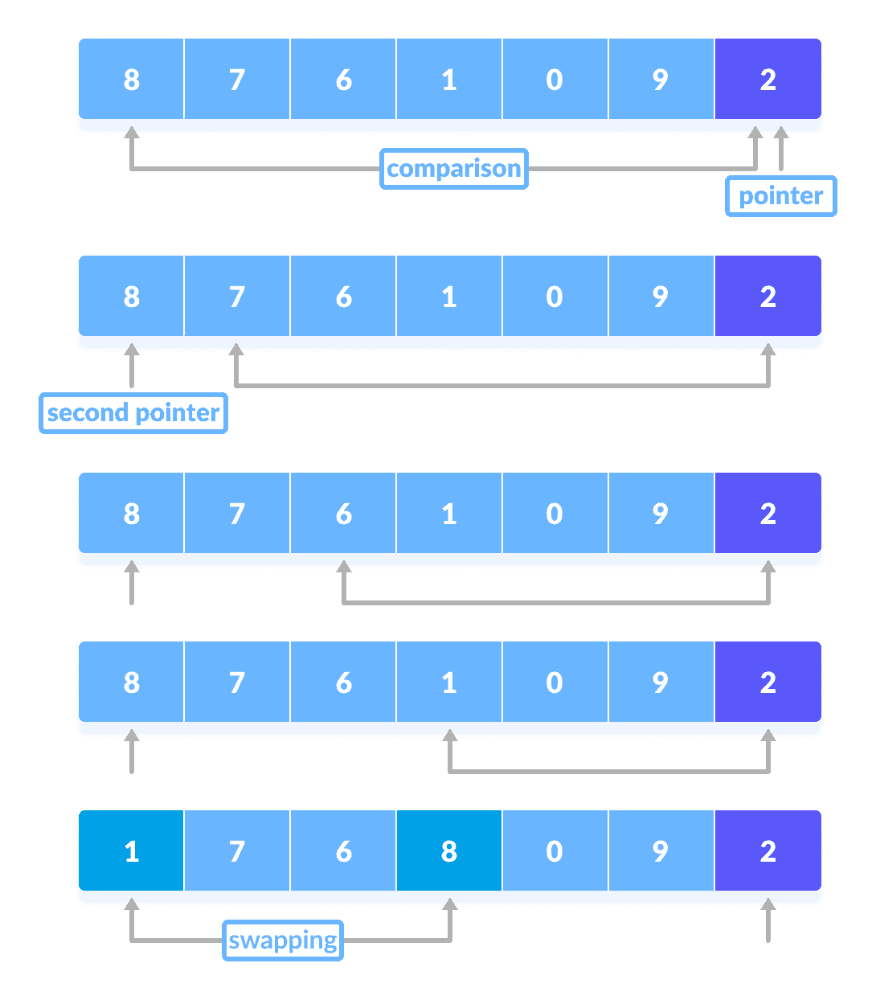
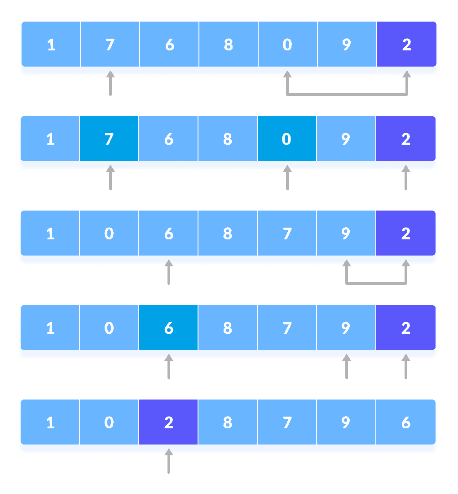
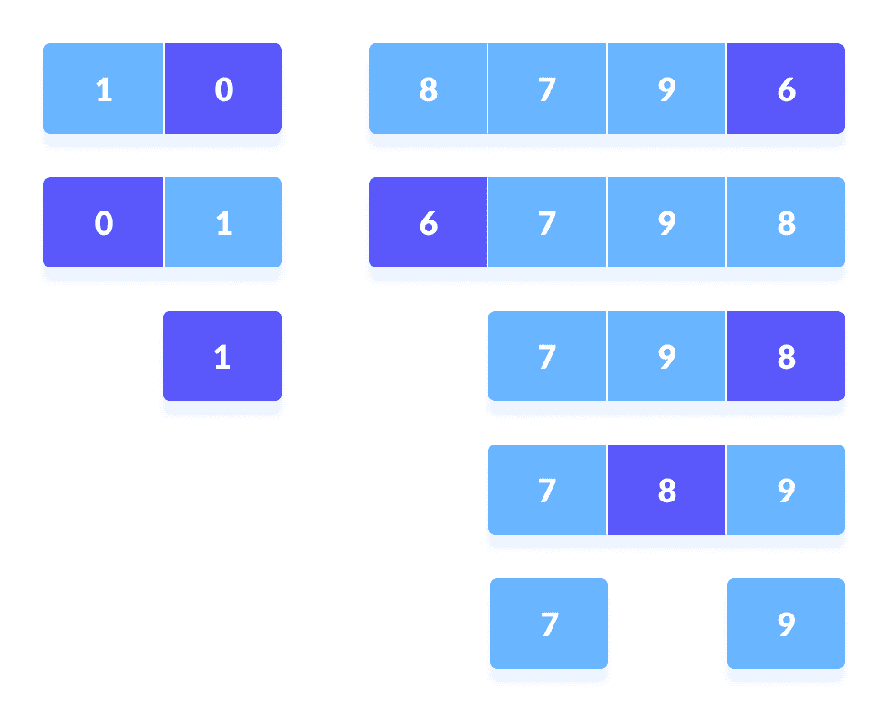
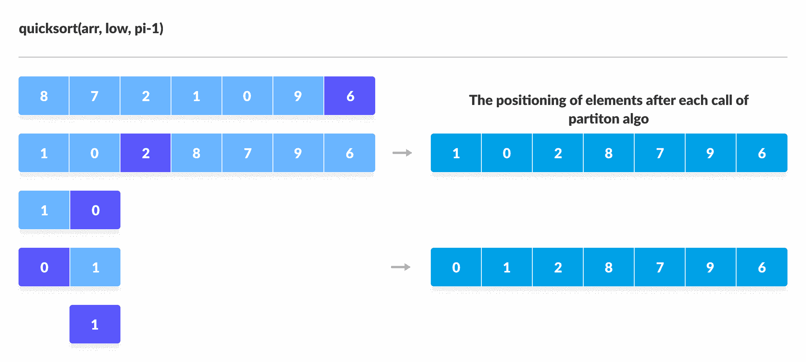
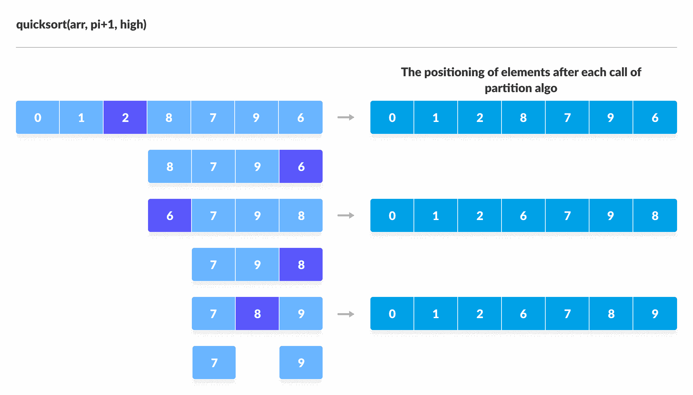

# 快速排序算法

> 原文： [https://www.programiz.com/dsa/quick-sort](https://www.programiz.com/dsa/quick-sort)

#### 在本教程中，您将学习快速排序的工作原理。 此外，您还将找到 C，C++  Python 和 Java 中快速排序的工作示例。

快速排序是一种基于分治方法的算法，其中将数组拆分为子数组，然后递归调用这些子数组以对元素进行排序。

* * *

## 快速排序如何工作？

1.  从数组中选择枢轴元素。 您可以从数组中选择任何元素作为枢轴元素。
    在这里，我们将数组的最右边（即最后一个元素）作为枢轴元素。

    

    选择枢轴元素

    

2.  小于枢轴元素的元素放在左侧，大于枢轴元素的元素放在右侧。

    

    将所有较小的元素放在枢轴元素

    

    的左侧，将较大的元素放在右侧。
    1.  指针固定在枢轴元件上。 将枢轴元素与从第一个索引开始的元素进行比较。 如果达到大于枢轴元素的元素，则为该元素设置第二个指针。
    2.  现在，将枢轴元素与其他元素（第三个指针）进行比较。 如果到达的元素小于枢轴元素，则将较小的元素替换为较早找到的较大的元素。

        

        枢轴元素与其他元素的比较

        

    3.  该过程一直进行到到达倒数第二个元素为止。
        最后，将枢轴元素与第二个指针交换。

        

        与第二个指针

        

        交换枢轴元素
3.  再次分别为左子部分和右子部分选择了枢轴元素。 在这些子部件中，枢轴元件放置在正确的位置。 然后，重复步骤 2。

    

    在每一半中选择枢轴元素，然后使用递归

    

    将其放置在正确的位置
4.  将子部分再次划分为较小的子部分，直到每个子部分由单个元素形成。
5.  至此，该数组已经排序。

* * *

**快速排序使用递归对子部分进行排序。**

在[分治法](/dsa/divide-and-conquer)的基础上，快速排序算法可以解释为：

*   **划分**
    将数组划分为以枢轴为分割点的子部分。 小于枢轴的元素放置在枢轴的左侧，大于枢轴的元素放置在右侧。
*   **解决**
    左子部分和右子部分再次通过选择枢轴元素进行划分。 这可以通过将子部分递归传递到算法中来实现。
*   **合并**
    此步骤在快速排序中不起作用。 该数组已在解决步骤的末尾排序。

您可以在以下插图的帮助下了解快速排序的工作方式。



使用递归对枢轴左侧的元素进行排序




使用递归对枢轴右侧的元素进行排序


* * *

## 快速排序算法

```
quickSort(array, leftmostIndex, rightmostIndex)
  if (leftmostIndex < rightmostIndex)
    pivotIndex <- partition(array,leftmostIndex, rightmostIndex)
    quickSort(array, leftmostIndex, pivotIndex)
    quickSort(array, pivotIndex + 1, rightmostIndex)

partition(array, leftmostIndex, rightmostIndex)
  set rightmostIndex as pivotIndex
  storeIndex <- leftmostIndex - 1
  for i <- leftmostIndex + 1 to rightmostIndex
  if element[i] < pivotElement
    swap element[i] and element[storeIndex]
    storeIndex++
  swap pivotElement and element[storeIndex+1]
return storeIndex + 1
```

* * *

## Python，Java 和 C/C++ 示例


```
# Quick sort in Python

# Function to partition the array on the basis of pivot element
def partition(array, low, high):

    # Select the pivot element
    pivot = array[high]
    i = low - 1

    # Put the elements smaller than pivot on the left and greater 
    #than pivot on the right of pivot
    for j in range(low, high):
        if array[j] <= pivot:
            i = i + 1
            (array[i], array[j]) = (array[j], array[i])

    (array[i + 1], array[high]) = (array[high], array[i + 1])

    return i + 1

def quickSort(array, low, high):
    if low < high:

        # Select pivot position and put all the elements smaller 
        # than pivot on left and greater than pivot on right
        pi = partition(array, low, high)

        # Sort the elements on the left of pivot
        quickSort(array, low, pi - 1)

        # Sort the elements on the right of pivot
        quickSort(array, pi + 1, high)

data = [8, 7, 2, 1, 0, 9, 6]
size = len(data)
quickSort(data, 0, size - 1)
print('Sorted Array in Ascending Order:')
print(data)
```

```
// Quick sort in Java

import java.util.Arrays;

class QuickSort {

  // Function to partition the array on the basis of pivot element
  int partition(int array[], int low, int high) {

    // Select the pivot element
    int pivot = array[high];
    int i = (low - 1);

    // Put the elements smaller than pivot on the left and 
    // greater than pivot on the right of pivot
    for (int j = low; j < high; j++) {
      if (array[j] <= pivot) {
        i++;
        int temp = array[i];
        array[i] = array[j];
        array[j] = temp;
      }
    }
    int temp = array[i + 1];
    array[i + 1] = array[high];
    array[high] = temp;
    return (i + 1);
  }

  void quickSort(int array[], int low, int high) {
    if (low < high) {

      // Select pivot position and put all the elements smaller 
      // than pivot on left and greater than pivot on right
      int pi = partition(array, low, high);

      // Sort the elements on the left of pivot
      quickSort(array, low, pi - 1);

      // Sort the elements on the right of pivot
      quickSort(array, pi + 1, high);
    }
  }

  // Driver code
  public static void main(String args[]) {
    int[] data = { 8, 7, 2, 1, 0, 9, 6 };
    int size = data.length;
    QuickSort qs = new QuickSort();
    qs.quickSort(data, 0, size - 1);
    System.out.println("Sorted Array in Ascending Order: ");
    System.out.println(Arrays.toString(data));
  }
}
```

```
// Quick sort in C

#include <stdio.h>

// Function to swap position of elements
void swap(int *a, int *b) {
  int t = *a;
  *a = *b;
  *b = t;
}

// Function to partition the array on the basis of pivot element
int partition(int array[], int low, int high) {

  // Select the pivot element
  int pivot = array[high];
  int i = (low - 1);

  // Put the elements smaller than pivot on the left 
  // and greater than pivot on the right of pivot
  for (int j = low; j < high; j++) {
    if (array[j] <= pivot) {
      i++;
      swap(&array[i], &array[j]);
    }
  }

  swap(&array[i + 1], &array[high]);
  return (i + 1);
}

void quickSort(int array[], int low, int high) {
  if (low < high) {

    // Select pivot position and put all the elements smaller 
    // than pivot on left and greater than pivot on right
    int pi = partition(array, low, high);

    // Sort the elements on the left of pivot
    quickSort(array, low, pi - 1);

    // Sort the elements on the right of pivot
    quickSort(array, pi + 1, high);
  }
}

// Function to print eklements of an array
void printArray(int array[], int size) {
  for (int i = 0; i < size; ++i) {
    printf("%d  ", array[i]);
  }
  printf("\n");
}

// Driver code
int main() {
  int data[] = {8, 7, 2, 1, 0, 9, 6};
  int n = sizeof(data) / sizeof(data[0]);
  quickSort(data, 0, n - 1);
  printf("Sorted array in ascending order: \n");
  printArray(data, n);
}
```

```
// Quick sort in C++

#include <iostream>
using namespace std;

// Function to swap position of elements
void swap(int *a, int *b) {
  int t = *a;
  *a = *b;
  *b = t;
}

// Function to print eklements of an array
void printArray(int array[], int size) {
  int i;
  for (i = 0; i < size; i++)
    cout << array[i] << " ";
  cout << endl;
}

// Function to partition the array on the basis of pivot element
int partition(int array[], int low, int high) {
  // Select the pivot element
  int pivot = array[high];
  int i = (low - 1);

  // Put the elements smaller than pivot on the left 
  // and greater than pivot on the right of pivot
  for (int j = low; j < high; j++) {
    if (array[j] <= pivot) {
      i++;
      swap(&array[i], &array[j]);
    }
  }
  printArray(array, 7);
  cout << "........\n";
  swap(&array[i + 1], &array[high]);
  return (i + 1);
}

void quickSort(int array[], int low, int high) {
  if (low < high) {
    // Select pivot position and put all the elements smaller 
    // than pivot on left and greater than pivot on right
    int pi = partition(array, low, high);

    // Sort the elements on the left of pivot
    quickSort(array, low, pi - 1);

    // Sort the elements on the right of pivot
    quickSort(array, pi + 1, high);
  }
}

// Driver code
int main() {
  int data[] = {8, 7, 6, 1, 0, 9, 2};
  int n = sizeof(data) / sizeof(data[0]);
  quickSort(data, 0, n - 1);
  cout << "Sorted array in ascending order: \n";
  printArray(data, n);
}
```

* * *

## 快速排序的复杂度

**时间复杂度**

*   **最坏情况的复杂度【大 O】** ：`O(n^2)`
    当拾取的枢轴元素为最大或最小元素时，会发生这种情况。
    这种情况导致枢轴元素位于已排序数组的最末端的情况。 一个子数组始终为空，而另一个子数组包含`n - 1`元素。 因此，仅在此子数组上调用快速排序。
    但是，快速排序算法对于分散的数据透视表具有更好的性能。

*   **最佳情况复杂度【大 Ω】** ：`O(n*log n)`
    当枢轴元素始终是中间元素或靠近中间元素时，会发生这种情况。
*   **平均病例复杂度【大 θ】** ：`O(n*log n)`
    当不出现上述条件时发生。

**空间复杂度**

快速排序的空间复杂度为`O(log n)`。

* * *

## 快速排序应用

快速排序在以下情况下实现

*   编程语言适合递归
*   时间复杂度很重要
*   空间复杂度很重要